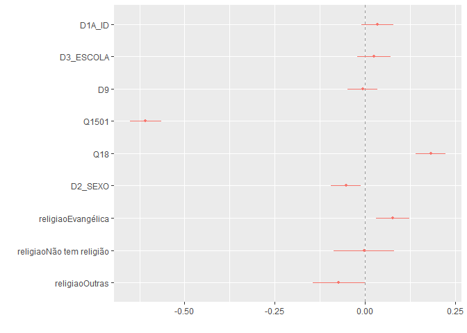
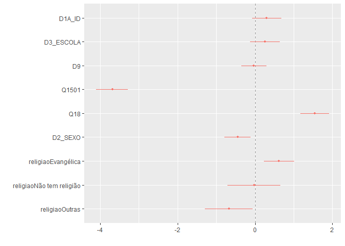
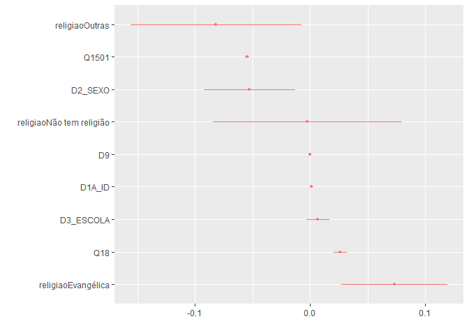

Exercicio 10
================
Renato Victor Lira Brito

``` r
setwd("C:\\Users\\Renato\\Downloads")
```

### Continuaremos com a utilização dos dados do ESEB2018. Carregue o banco da mesma forma que nos exercicios anteriores

``` r
library(tidyverse)
library(haven)

link <- "https://github.com/MartinsRodrigo/Analise-de-dados/blob/master/04622.sav?raw=true"

download.file(link, "04622.sav", mode = "wb")

banco <- read_spss("04622.sav") 

banco <- banco %>%
  mutate(D10 = as_factor(D10)) %>%
  filter(Q18 < 11,
         D9 < 9999998,
         Q1501 < 11,
         Q12P2_B < 3) %>%
  mutate(Q12P2_B = case_when(Q12P2_B == 1 ~ 0,  # Quem votou em Haddad = 0
                             Q12P2_B == 2 ~ 1)) # Quem votou em Bolsonaro = 1
```

``` r
library(pscl)
library(sjPlot)
library(margins)
library(dotwhisker)
library(dplyr)
```

### Crie a mesma variável de religião utilizada no exercício anterior

``` r
Outras <- levels(banco$D10)[-c(3,5,13)]

banco <- banco %>%
  mutate(religiao = case_when(D10 %in% Outras ~ "Outras",
                              D10 == "Católica" ~ "Católica",
                              D10 == "Evangélica" ~ "Evangélica",
                              D10 == "Não tem religião" ~ "Não tem religião"))
```

### Faça uma regressão linear utilizando as mesmas variáveis do exercício 9 - idade(D1A\_ID), educação (D3\_ESCOLA), renda (D9), nota atribuída ao PT (Q1501), auto-atribuição ideológica (Q18), sexo (D2\_SEXO) e religião (variável criada no passo anterior) - explicam o voto em Bolsonaro (Q12P2\_B).

``` r
Regressao_multivariada_01 <- lm(Q12P2_B ~ D1A_ID + D3_ESCOLA + D9 + Q1501 + Q18 + D2_SEXO + religiao, data = banco)
```

``` r
summary(Regressao_multivariada_01)
```

    ## 
    ## Call:
    ## lm(formula = Q12P2_B ~ D1A_ID + D3_ESCOLA + D9 + Q1501 + Q18 + 
    ##     D2_SEXO + religiao, data = banco)
    ## 
    ## Residuals:
    ##      Min       1Q   Median       3Q      Max 
    ## -1.05532 -0.19854  0.01565  0.16182  0.96682 
    ## 
    ## Coefficients:
    ##                            Estimate Std. Error t value Pr(>|t|)    
    ## (Intercept)               7.067e-01  6.469e-02  10.924  < 2e-16 ***
    ## D1A_ID                    1.140e-03  7.539e-04   1.512  0.13074    
    ## D3_ESCOLA                 5.547e-03  5.226e-03   1.061  0.28873    
    ## D9                       -9.837e-07  3.196e-06  -0.308  0.75832    
    ## Q1501                    -7.728e-02  2.799e-03 -27.610  < 2e-16 ***
    ## Q18                       2.651e-02  3.093e-03   8.570  < 2e-16 ***
    ## D2_SEXO                  -5.286e-02  2.089e-02  -2.530  0.01154 *  
    ## religiaoEvangélica        7.684e-02  2.363e-02   3.251  0.00118 ** 
    ## religiaoNão tem religião -2.746e-03  4.238e-02  -0.065  0.94835    
    ## religiaoOutras           -7.263e-02  3.678e-02  -1.975  0.04855 *  
    ## ---
    ## Signif. codes:  0 '***' 0.001 '**' 0.01 '*' 0.05 '.' 0.1 ' ' 1
    ## 
    ## Residual standard error: 0.3489 on 1138 degrees of freedom
    ## Multiple R-squared:  0.5028, Adjusted R-squared:  0.4989 
    ## F-statistic: 127.9 on 9 and 1138 DF,  p-value: < 2.2e-16

``` r
confint(Regressao_multivariada_01)
```

    ##                                  2.5 %        97.5 %
    ## (Intercept)               5.797291e-01  8.335766e-01
    ## D1A_ID                   -3.390684e-04  2.619271e-03
    ## D3_ESCOLA                -4.706619e-03  1.579994e-02
    ## D9                       -7.254959e-06  5.287609e-06
    ## Q1501                    -8.277435e-02 -7.179045e-02
    ## Q18                       2.044034e-02  3.257857e-02
    ## D2_SEXO                  -9.385894e-02 -1.186744e-02
    ## religiaoEvangélica        3.046538e-02  1.232064e-01
    ## religiaoNão tem religião -8.589165e-02  8.039968e-02
    ## religiaoOutras           -1.447902e-01 -4.633807e-04

``` r
dwplot(Regressao_multivariada_01, vline = geom_vline(xintercept = 0, colour = "grey60", linetype = 2))
```

<!-- --> \#\#\#
Interprete o resultado dos coeficientes

A partir da regressão (regressao\_multivariada\_01), podemos observar os
resíduos, com mínimo de -1,05532 e máximo de 0,96682. A mediana se
aproxima de 0 (valor que está entre a mediana e o primeiro quartil). O
RSE, ou seja, a distância média dos valores que foram observados para os
estimados, foi de 0,3489 com 1.138 graus de liberdade. O intercepto,
para o caso de as variáveis independentes serem “0”, ou seja, para o
valor primário dessas VI’s, a saber, a escolaridade mínima, idade
mínima, renda mínima, menor nota atribuída ao PT possível, gênero
masculino (padrão) e religião católica (padrão), foi de 7,067e-01, o que
quer dizer que, controlando por todo o resto, obteríamos um valor de
0,7067 com erro padrão de 6,469e-02 e Valor T de 10,924, além de p-valor
menor que 2e-16.

O valor β D1A\_ID, que representa a mudança em Y para cada mudança em
unidades de X, foi 1,140e-03, com erro padrão de 7,539e-04, Valor T de
1,512 e p-valor de 0,13074, considerado alto para análises que tratam de
p-valor ideal como 0,01 e 0,05. Nesse sentido, cada aumento de unidade
em X afetaria positivamente 0,00114 a variável Y. Como a variável
dependente é dummy, há algumas limitações na aplicação, já que ou se
assume um valor (0) ou outro (1). No entanto, como o p-valor é alto, os
resultados não são significantes estatisticamente.

O valor β D3\_ESCOLA, que representa a mudança em Y para cada mudança em
unidades de X, foi 5,547e-03, com erro padrão de 5,226e-03, Valor T de
1,061 e p-valor de 0,28873, considerado alto para análises que tratam de
p-valor ideal como 0,01 e 0,05. Nesse sentido, cada aumento de unidade
em X afetaria positivamente 0,005547 a variável Y. Como a variável
dependente é dummy, há algumas limitações na aplicação, já que ou se
assume um valor (0) ou outro (1). No entanto, como o p-valor é alto, os
resultados não são significantes estatisticamente.

O valor β D9, que representa a mudança em Y para cada mudança em
unidades de X, foi -9,837e-07, com erro padrão de 3,196e-06, Valor T de
-0,308 e p-valor de 0,75832, considerado alto para análises que tratam
de p-valor ideal como 0,01 e 0,05. Nesse sentido, cada aumento de
unidade em X afetaria negativamente 0,0000009837 a variável Y. Como a
variável dependente é dummy, há algumas limitações na aplicação, já que
ou se assume um valor (0) ou outro (1). No entanto, como o p-valor é
alto, os resultados não são significantes estatisticamente.

O valor β Q1501, que representa a mudança em Y para cada mudança em
unidades de X, foi -7,728e-02, com erro padrão de 2,799e-03, Valor T de
-27,610 e p-valor menor que 2e-16, considerado baixo para análises que
tratam de p-valor ideal como 0,01 e 0,05.Nesse sentido, cada aumento de
unidade em X afetaria negativamente 0,07728 a variável Y. Como a
variável dependente é dummy, há algumas limitações na aplicação, já que
ou se assume um valor (0) ou outro (1). Como o p-valor é baixo, os
resultados são significantes estatisticamente.

O valor β Q18, que representa a mudança em Y para cada mudança em
unidades de X, foi 2,651e-02, com erro padrão de 3,093e-03, Valor T de
8,570 e p-valor menor que 2e-16, considerado baixo para análises que
tratam de p-valor ideal como 0,01 e 0,05.Nesse sentido, cada aumento de
unidade em X afetaria positivamente 0,02651 a variável Y. Como a
variável dependente é dummy, há algumas limitações na aplicação, já que
ou se assume um valor (0) ou outro (1). Como o p-valor é baixo, os
resultados são significantes estatisticamente.

O valor β D2\_SEXO (Feminino), que representa a mudança em Y para cada
mudança em unidades de X, foi -5,286e-02, com erro padrão de 2,089e-02,
Valor T de -2,530 e p-valor de 0,01154, considerado baixo para análises
que tratam de p-valor ideal como 0,05. Nesse sentido, cada aumento de
unidade em X afetaria negativamente 0,05286 a variável Y. Como a
variável dependente é dummy, há algumas limitações na aplicação, já que
ou se assume um valor (0) ou outro (1). Como o p-valor é baixo, os
resultados são significantes estatisticamente.

O valor β religiao (Evangélica), que representa a mudança em Y para cada
mudança em unidades de X, foi 7,684e-02, com erro padrão de 2,363e-02,
Valor T de 3,251 e p-valor de 0,00118, considerado baixo para análises
que tratam de p-valor ideal como 0,01 e 0,05. Nesse sentido, cada
aumento de unidade em X afetaria positivamente 0,07684 a variável Y.
Como a variável dependente é dummy, há algumas limitações na aplicação,
já que ou se assume um valor (0) ou outro (1). Como o p-valor é baixo,
os resultados são significantes estatisticamente.

O valor β religiao (Não tem religião), que representa a mudança em Y
para cada mudança em unidades de X, foi -2,746e-03, com erro padrão de
4,238e-02, Valor T de -0,065 e p-valor de 0,94835, considerado alto para
análises que tratam de p-valor ideal como 0,01 e 0,05. Nesse sentido,
cada aumento de unidade em X afetaria negativamente 0,002746 a variável
Y. Como a variável dependente é dummy, há algumas limitações na
aplicação, já que ou se assume um valor (0) ou outro (1). No entanto,
como o p-valor é alto, os resultados não são significantes
estatisticamente.

O valor β religiao (Outras), que representa a mudança em Y para cada
mudança em unidades de X, foi -7,263e-02, com erro padrão de 3,678e-02,
Valor T de -1,975 e p-valor de 0,04855, considerado baixo para análises
que tratam de p-valor ideal como 0,05. Nesse sentido, cada aumento de
unidade em X afetaria negativamente 0,07263 a variável Y. Como a
variável dependente é dummy, há algumas limitações na aplicação, já que
ou se assume um valor (0) ou outro (1). Como o p-valor é baixo, os
resultados são significantes estatisticamente.

O R-squared, que representa a proporção da variável dependente que é
explicada pelo modelo, foi de 0,5028, ou 50,28%.

### O resultado difere dos encontrados anteriormente, quando a variavel dependente era a aprovação de Bolsonaro?

Sim,

Escolaridade (D3\_ESCOLA) era significante estatisticamente para a
aprovação de Bolsonaro, mas é insignificante estatistamente para a
variável dependente dummy de voto em Bolsonaro.

Religião (religiao-Evangélica) era insignificante estatisticamente para
a aprovação de Bolsonaro, mas é significante estatistamente para a
variável dependente dummy de voto em Bolsonaro.

Religião (religiao-Outras) era insignificante estatisticamente para a
aprovação de Bolsonaro, mas é significante estatistamente para a
variável dependente dummy de voto em Bolsonaro.

Além disso, a interação entre as variáveis D2\_SEXO e religiao não foi
testada, o que pode afetar de alguma forma o modelo. É notável a
diferença dos resultados de r-squared (de 30,28% para 50,28%), que pode
ser também explicado, além pela diferença das variaveis dependentes
analisadas, pela distribuição da variável dependente dummy. A partir
desses resultados, e também pela natureza da VD, é indicada a realização
de uma regressão logística.

### Faça uma regressão logistica com as mesmas variaveis

``` r
regressao_logistica_01 <- glm(Q12P2_B ~ D1A_ID + D3_ESCOLA + D9 + Q1501 + Q18 + D2_SEXO + religiao, data = banco, family = "binomial")
```

``` r
summary(regressao_logistica_01)
```

    ## 
    ## Call:
    ## glm(formula = Q12P2_B ~ D1A_ID + D3_ESCOLA + D9 + Q1501 + Q18 + 
    ##     D2_SEXO + religiao, family = "binomial", data = banco)
    ## 
    ## Deviance Residuals: 
    ##     Min       1Q   Median       3Q      Max  
    ## -2.7529  -0.5625   0.2518   0.4744   2.5830  
    ## 
    ## Coefficients:
    ##                            Estimate Std. Error z value Pr(>|z|)    
    ## (Intercept)               8.209e-01  5.298e-01   1.550  0.12124    
    ## D1A_ID                    1.001e-02  6.337e-03   1.580  0.11405    
    ## D3_ESCOLA                 5.634e-02  4.358e-02   1.293  0.19602    
    ## D9                       -4.635e-06  2.396e-05  -0.193  0.84660    
    ## Q1501                    -4.678e-01  2.666e-02 -17.545  < 2e-16 ***
    ## Q18                       2.242e-01  2.748e-02   8.159 3.37e-16 ***
    ## D2_SEXO                  -4.497e-01  1.739e-01  -2.586  0.00971 ** 
    ## religiaoEvangélica        6.217e-01  1.985e-01   3.132  0.00173 ** 
    ## religiaoNão tem religião -2.106e-02  3.478e-01  -0.061  0.95172    
    ## religiaoOutras           -6.736e-01  3.122e-01  -2.158  0.03096 *  
    ## ---
    ## Signif. codes:  0 '***' 0.001 '**' 0.01 '*' 0.05 '.' 0.1 ' ' 1
    ## 
    ## (Dispersion parameter for binomial family taken to be 1)
    ## 
    ##     Null deviance: 1557.84  on 1147  degrees of freedom
    ## Residual deviance:  862.45  on 1138  degrees of freedom
    ## AIC: 882.45
    ## 
    ## Number of Fisher Scoring iterations: 5

``` r
confint(regressao_logistica_01)
```

    ##                                  2.5 %        97.5 %
    ## (Intercept)              -2.142372e-01  1.8651175312
    ## D1A_ID                   -2.356414e-03  0.0225104510
    ## D3_ESCOLA                -2.904377e-02  0.1419781422
    ## D9                       -5.246385e-05  0.0000439274
    ## Q1501                    -5.216537e-01 -0.4170089828
    ## Q18                       1.712127e-01  0.2790743125
    ## D2_SEXO                  -7.919817e-01 -0.1094958073
    ## religiaoEvangélica        2.343309e-01  1.0132294124
    ## religiaoNão tem religião -7.028094e-01  0.6619336806
    ## religiaoOutras           -1.287535e+00 -0.0625502790

``` r
pR2(regressao_logistica_01)
```

    ## fitting null model for pseudo-r2

    ##          llh      llhNull           G2     McFadden         r2ML         r2CU 
    ## -431.2245843 -778.9190068  695.3888450    0.4463807    0.4543292    0.6118347

``` r
dwplot(regressao_logistica_01, vline = geom_vline(xintercept = 0, colour = "grey60", linetype = 2))
```

<!-- -->

A partir da regressão (regressao\_logistica\_01), podemos observar os
resíduos, com mínimo de -2,7529 e máximo de 2,5830. A mediana se
aproxima de 0 (valor que está entre a mediana e o primeiro quartil). O
intercepto, para o caso de as variáveis independentes serem “0”, ou
seja, para o valor primário dessas VI’s, a saber, a escolaridade mínima,
idade mínima, renda mínima, menor nota atribuída ao PT possível, menor
valor de ideologia, gênero masculino (padrão) e religião católica
(padrão), foi de 8,209e-01, o que quer dizer que, controlando por todo
o resto, obteríamos um valor de 0,8209 com erro padrão de 5,298e-01 e
Valor Z de 1,550, além de p-valor 0,12124.

O valor β D1A\_ID, que representa a mudança em Y para cada mudança em
unidades de X, foi 1,001e-02, com erro padrão de 6,337e-03, Valor Z de
1,580 e p-valor de 0,11405, considerado alto para análises que tratam de
p-valor ideal como 0,01 e 0,05. Nesse sentido, cada aumento de unidade
em X afetaria positivamente 0,01001 a variável Y. No entanto, como o
p-valor é alto, os resultados não são significantes estatisticamente.

O valor β D3\_ESCOLA, que representa a mudança em Y para cada mudança em
unidades de X, foi 5,634e-02, com erro padrão de 4,358e-02, Valor Z de
1,293 e p-valor de 0,19602, considerado alto para análises que tratam de
p-valor ideal como 0,01 e 0,05. Nesse sentido, cada aumento de unidade
em X afetaria positivamente 0,05634 a variável Y. No entanto, como o
p-valor é alto, os resultados não são significantes estatisticamente.

O valor β D9, que representa a mudança em Y para cada mudança em
unidades de X, foi -4,635e-06, com erro padrão de 2,396e-05, Valor Z de
-0,193 e p-valor de 0,84660, considerado alto para análises que tratam
de p-valor ideal como 0,01 e 0,05. Nesse sentido, cada aumento de
unidade em X afetaria negativamente 0,000004635 a variável Y. No
entanto, como o p-valor é alto, os resultados não são significantes
estatisticamente.

O valor β Q1501, que representa a mudança em Y para cada mudança em
unidades de X, foi -4,678e-01, com erro padrão de 2,666e-02, Valor Z de
-17,545 e p-valor menor que 2e-16, considerado baixo para análises que
tratam de p-valor ideal como 0,01 e 0,05.Nesse sentido, cada aumento de
unidade em X afetaria negativamente 0,4678 a variável Y. Como o p-valor
é baixo, os resultados são significantes estatisticamente.

O valor β Q18, que representa a mudança em Y para cada mudança em
unidades de X, foi 2,242e-01, com erro padrão de 2,748e-02, Valor Z de
8,159 e p-valor 3,37e-16, considerado baixo para análises que tratam de
p-valor ideal como 0,01 e 0,05.Nesse sentido, cada aumento de unidade em
X afetaria positivamente 0,2242 a variável Y. Como o p-valor é baixo, os
resultados são significantes estatisticamente.

O valor β D2\_SEXO (Feminino), que representa a mudança em Y para cada
mudança em unidades de X, foi -4,497e-01, com erro padrão de 1,739e-01,
Valor Z de -2,586 e p-valor de 0,00971, considerado baixo para análises
que tratam de p-valor ideal como 0,05. Nesse sentido, cada aumento de
unidade em X afetaria negativamente 0,4497 a variável Y. Como o p-valor
é baixo, os resultados são significantes estatisticamente.

O valor β religiao (Evangélica), que representa a mudança em Y para cada
mudança em unidades de X, foi 6,217e-01, com erro padrão de 1,985e-01,
Valor Z de 3,132 e p-valor de 0,00173, considerado baixo para análises
que tratam de p-valor ideal como 0,01 e 0,05. Nesse sentido, cada
aumento de unidade em X afetaria positivamente 0,6217 a variável Y. Como
o p-valor é baixo, os resultados são significantes estatisticamente.

O valor β religiao (Não tem religião), que representa a mudança em Y
para cada mudança em unidades de X, foi -2,106e-02, com erro padrão de
3,478e-01, Valor Z de -0,061 e p-valor de 0,95172, considerado alto para
análises que tratam de p-valor ideal como 0,01 e 0,05. Nesse sentido,
cada aumento de unidade em X afetaria negativamente 0,02106 a variável
Y. No entanto, como o p-valor é alto, os resultados não são
significantes estatisticamente.

O valor β religiao (Outras), que representa a mudança em Y para cada
mudança em unidades de X, foi -6,736e-01, com erro padrão de 3,122e-01,
Valor Z de -2,158 e p-valor de 0,03096, considerado baixo para análises
que tratam de p-valor ideal como 0,05. Nesse sentido, cada aumento de
unidade em X afetaria negativamente 0,6736 a variável Y. Como o p-valor
é baixo, os resultados são significantes estatisticamente.

O valor McFadden para o pseudo-R-squared, que emula a proporção que é
explicada pelo modelo, foi de 0,4463, ou 44,63%.

### Transforme os coeficientes estimados em probabilidade

``` r
library(margins)
```

``` r
margins(regressao_logistica_01)
```

    ##    D1A_ID D3_ESCOLA         D9    Q1501     Q18 D2_SEXO religiaoEvangélica
    ##  0.001171  0.006589 -5.421e-07 -0.05471 0.02622 -0.0526            0.07346
    ##  religiaoNão tem religião religiaoOutras
    ##                 -0.002521       -0.08172

``` r
summary(margins(regressao_logistica_01))
```

    ##                    factor     AME     SE        z      p   lower   upper
    ##                    D1A_ID  0.0012 0.0007   1.5849 0.1130 -0.0003  0.0026
    ##                   D2_SEXO -0.0526 0.0202  -2.6078 0.0091 -0.0921 -0.0131
    ##                 D3_ESCOLA  0.0066 0.0051   1.2949 0.1953 -0.0034  0.0166
    ##                        D9 -0.0000 0.0000  -0.1935 0.8466 -0.0000  0.0000
    ##                     Q1501 -0.0547 0.0009 -57.9079 0.0000 -0.0566 -0.0529
    ##                       Q18  0.0262 0.0030   8.8434 0.0000  0.0204  0.0320
    ##        religiaoEvangélica  0.0735 0.0235   3.1280 0.0018  0.0274  0.1195
    ##  religiaoNão tem religião -0.0025 0.0417  -0.0605 0.9517 -0.0842  0.0791
    ##            religiaoOutras -0.0817 0.0379  -2.1574 0.0310 -0.1560 -0.0075

``` r
efeito_log <- summary(margins(regressao_logistica_01)) %>%
  rename(term = factor,
  estimate = AME,
  std.error = SE,
  statistic = z,
  p.value = p) %>%
  arrange(estimate)

dwplot(efeito_log)
```

<!-- -->

Nota atribuída ao PT (Q1501):

Probabilidade média -\> -0,05471178

O aumento da unidade da nota atribuída ao PT incorre em 5,47% de chance
de não votar em Bolsonaro.

Auto-atribuição ideológica (Q18):

Probabilidade média -\> 0,02622273

O aumento da unidade (na direção da esquerda para direita) de
auto-atribuição ideológica incorre em 2,62% de chance de votar em
Bolsonaro.

Gênero (D2\_SEXO):

Probabilidade média -\> -0,05259582

A mudança de classificação (na direção de masculino para feminino) de
gênero incorre em 5,25% de chance de não votar em Bolsonaro.

Religião (religiaoEvangélica):

Probabilidade média -\> 0,07345965

A mudança de classificação (na direção de católica para evangélica) de
religiao incorre em 7,34% de chance de votar em Bolsonaro.

Religião (religiaoOutras):

Probabilidade média -\> -0,08171675

A mudança de classificação (na direção de católica para outras) de
religiao incorre em 8,17% de chance de não votar em Bolsonaro.

### Quais foram as diferenças no resultado entre usar a regressão linear e a logistica?

A regressão logística, como visto no exemplo desse exercício, pode
resolver as questões referentes aos pressupostos da linearidade e a
homocedasticidade, que são extremamente problemáticos quando vamos
utilizar regressões lineares para variáveis dependentes categóricas
dummy. Nesse sentido, durante a análise, as variáveis Escolaridade,
idade e renda continuaram não sendo significantes de uma análise para a
outra. Diferentemente, as variáveis gênero e nota atribuída ao PT
apresentaram dados mais seguros e confiáveis (coeficientes), o que
implica numa maior robustez do modelo logístico em relação ao modelo
linear, principalmente por resolver as questões em relação à
heterocedasticidade.

### Verifique a quantidade de classificações corretas da regressao logistica e avalie o resultado

``` r
library(InformationValue)
```

``` r
predicted_prob <- predict(regressao_logistica_01, type = "response")
```

``` r
1 - misClassError(banco$Q12P2_B, 
                  predicted_prob, 
                  threshold = 0.5)
```

    ## [1] 0.8301

``` r
opt_cutoff <- optimalCutoff(banco$Q12P2_B, 
                            predicted_prob)
```

``` r
1 - misClassError(banco$Q12P2_B, 
                  predicted_prob, 
                  threshold = 0.556687512770529)
```

    ## [1] 0.8362

``` r
confusionMatrix(banco$Q12P2_B, 
              predicted_prob, 
              threshold = opt_cutoff)
```

    ##     0   1
    ## 0 393 105
    ## 1  83 567

``` r
prop.table(confusionMatrix(banco$Q12P2_B, 
                predicted_prob, 
                threshold = opt_cutoff))
```

    ##            0          1
    ## 0 0.34233449 0.09146341
    ## 1 0.07229965 0.49390244

``` r
table(banco$Q12P2_B)
```

    ## 
    ##   0   1 
    ## 476 672

``` r
prop.table(table(banco$Q12P2_B))
```

    ## 
    ##         0         1 
    ## 0.4146341 0.5853659

``` r
0.8362/0.5853659
```

    ## [1] 1.428508

O modelo da regressão logística apresentou classificações corretas para
83,62% dos casos, um aumento de 142,85% em relação ao modelo ingênuo,
que é baseado na probabilidade pura de acerto. Nesse sentido, o nosso
modelo acertou 1,4285 mais vezes que o modelo ingênuo. Além disso,
quando observando os votos em Bolsonaro, o modelo previu corretamente
49,39% votos em Bolsonaro e erroneamente 9,14% votos em Bolsonaro. Já
observando os votos em Haddad, o modelo previu corretamente 34,23% votos
em Haddad e erroneamente 7,22% votos em Haddad.
