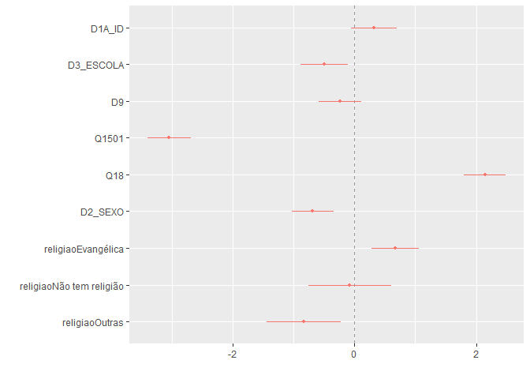
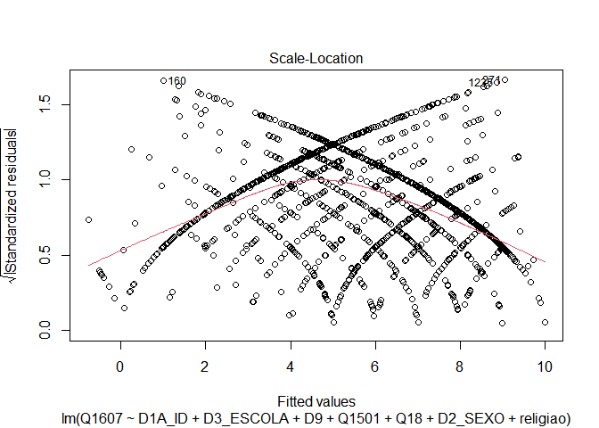
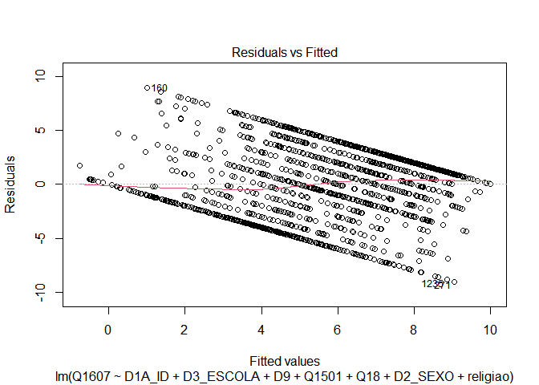
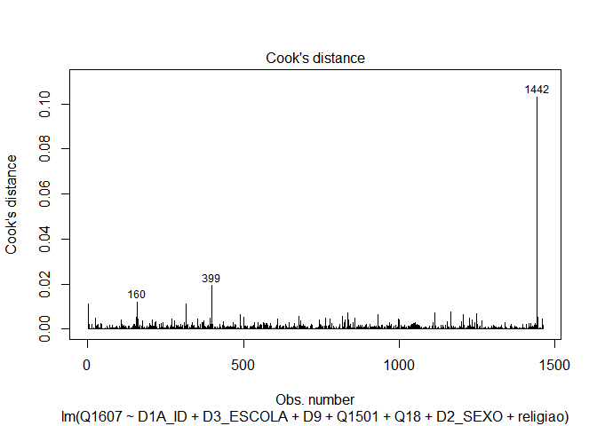
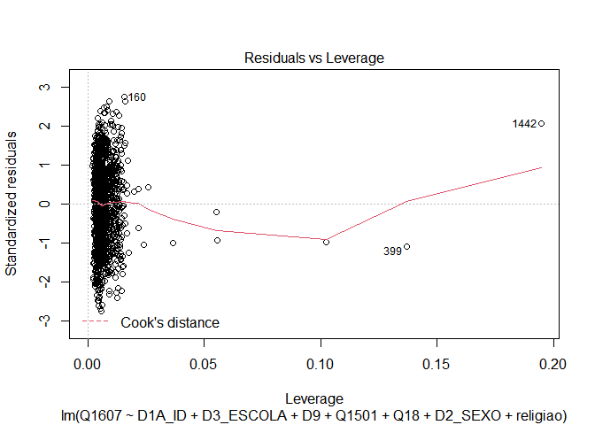

Exercicio 11
================
Renato Victor Lira Brito

``` r
setwd("C:\\Users\\Renato\\Downloads")
```

``` r
library(tidyverse)
library(haven)

link <- "https://github.com/MartinsRodrigo/Analise-de-dados/blob/master/04622.sav?raw=true"

download.file(link, "04622.sav", mode = "wb")

banco <- read_spss("04622.sav") 

banco <- banco %>%
  mutate(D10 = as_factor(D10)) %>%
  filter(Q1607 < 11, 
         Q18 < 11,
         D9 < 9999998,
         Q1501 < 11)


Outras <- levels(banco$D10)[-c(3,5,13)]

banco <- banco %>%
  mutate(religiao = case_when(D10 %in% Outras ~ "Outras",
                              D10 == "Católica" ~ "Católica",
                              D10 == "Evangélica" ~ "Evangélica",
                              D10 == "Não tem religião" ~ "Não tem religião"))
```

``` r
library(pscl)
library(sjPlot)
library(dotwhisker)
library(dplyr)
```

### Faça uma regressão linear avaliando em que medida as variáveis independentes utilizadas nos exercícios 7 e 8, idade(D1A\_ID), educação (D3\_ESCOLA), renda (D9), nota atribuída ao PT (Q1501), auto-atribuição ideológica (Q18), sexo (D2\_SEXO) e religião (variável criada no passo anterior) explicam a avaliação de Bolsonaro (Q1607)

``` r
Regressao_multivariada_01 <- lm(Q1607 ~ D1A_ID + D3_ESCOLA + D9 + Q1501 + Q18 + D2_SEXO + religiao, data = banco)
```

``` r
summary(Regressao_multivariada_01)
```

    ## 
    ## Call:
    ## lm(formula = Q1607 ~ D1A_ID + D3_ESCOLA + D9 + Q1501 + Q18 + 
    ##     D2_SEXO + religiao, data = banco)
    ## 
    ## Residuals:
    ##     Min      1Q  Median      3Q     Max 
    ## -9.0608 -2.5654  0.4179  2.3268  8.9954 
    ## 
    ## Coefficients:
    ##                            Estimate Std. Error t value Pr(>|t|)    
    ## (Intercept)               6.216e+00  5.365e-01  11.586  < 2e-16 ***
    ## D1A_ID                    1.040e-02  6.234e-03   1.669 0.095376 .  
    ## D3_ESCOLA                -1.116e-01  4.486e-02  -2.487 0.012982 *  
    ## D9                       -3.620e-05  2.764e-05  -1.309 0.190576    
    ## Q1501                    -3.946e-01  2.367e-02 -16.670  < 2e-16 ***
    ## Q18                       3.161e-01  2.603e-02  12.142  < 2e-16 ***
    ## D2_SEXO                  -6.874e-01  1.746e-01  -3.937 8.63e-05 ***
    ## religiaoEvangélica        6.685e-01  1.984e-01   3.370 0.000772 ***
    ## religiaoNão tem religião -7.565e-02  3.485e-01  -0.217 0.828177    
    ## religiaoOutras           -8.326e-01  3.081e-01  -2.702 0.006963 ** 
    ## ---
    ## Signif. codes:  0 '***' 0.001 '**' 0.01 '*' 0.05 '.' 0.1 ' ' 1
    ## 
    ## Residual standard error: 3.296 on 1452 degrees of freedom
    ## Multiple R-squared:  0.3018, Adjusted R-squared:  0.2975 
    ## F-statistic: 69.75 on 9 and 1452 DF,  p-value: < 2.2e-16

``` r
confint(Regressao_multivariada_01)
```

    ##                                  2.5 %        97.5 %
    ## (Intercept)               5.163593e+00  7.268474e+00
    ## D1A_ID                   -1.825450e-03  2.263208e-02
    ## D3_ESCOLA                -1.995985e-01 -2.358624e-02
    ## D9                       -9.042202e-05  1.802617e-05
    ## Q1501                    -4.410748e-01 -3.481971e-01
    ## Q18                       2.650155e-01  3.671471e-01
    ## D2_SEXO                  -1.029800e+00 -3.449144e-01
    ## religiaoEvangélica        2.793625e-01  1.057711e+00
    ## religiaoNão tem religião -7.592162e-01  6.079222e-01
    ## religiaoOutras           -1.436872e+00 -2.282460e-01

``` r
dwplot(Regressao_multivariada_01, vline = geom_vline(xintercept = 0, colour = "grey60", linetype = 2))
```

<!-- --> A
partir da regressão (regressao\_multivariada\_01), podemos observar os
resíduos, com mínimo de -9,0608 e máximo de 8,9954. A mediana se
aproxima de 0 (valor que está entre a mediana e o primeiro quartil). O
RSE, ou seja, a distância média dos valores que foram observados para os
estimados, foi de 3,296 com 1.452 graus de liberdade. O intercepto, para
o caso de as variáveis independentes serem “0”, ou seja, para o valor
primário dessas VI’s, a saber, a escolaridade mínima, idade mínima,
renda mínima, menor nota atribuída ao PT possível, gênero masculino
(padrão) e religião católica (padrão), foi de 6,216, o que quer dizer
que, controlando por todo o resto, obteríamos um valor de 6,216 na
avaliação de Bolsonaro, com erro padrão de 5,365e-01 e Valor T de
11,586, além de p-valor menor que 2e-16.

O valor β D1A\_ID, que representa a mudança em Y para cada mudança em
unidades de X, foi 1,040e-02, com erro padrão de 6,234e-03, Valor T de
1,669 e p-valor de 0,095376, considerado alto para análises que tratam
de p-valor ideal como 0,01 e 0,05. Nesse sentido, cada aumento de
unidade em X afetaria positivamente 0,0104 a variável Y. No entanto,
como o p-valor é alto, os resultados não são significantes
estatisticamente.

O valor β D3\_ESCOLA, que representa a mudança em Y para cada mudança em
unidades de X, foi -1,116e-01, com erro padrão de 4,486e-02, Valor T de
-2,487 e p-valor de 0,012982, considerado baixo para análises que tratam
de p-valor ideal como 0,05. Nesse sentido, cada aumento de unidade em X
afetaria negativamente 0,1116 a variável Y. Como o p-valor é baixo, os
resultados são significantes estatisticamente.

O valor β D9, que representa a mudança em Y para cada mudança em
unidades de X, foi -3,620e-05, com erro padrão de 2,764e-05, Valor T de
-1,309 e p-valor de 0,190576, considerado alto para análises que tratam
de p-valor ideal como 0,01 e 0,05. Nesse sentido, cada aumento de
unidade em X afetaria negativamente 0,0000362 a variável Y. No entanto,
como o p-valor é alto, os resultados não são significantes
estatisticamente.

O valor β Q1501, que representa a mudança em Y para cada mudança em
unidades de X, foi -3,946e-01, com erro padrão de 2,367e-02, Valor T de
-16,670 e p-valor menor que 2e-16, considerado baixo para análises que
tratam de p-valor ideal como 0,01 e 0,05.Nesse sentido, cada aumento de
unidade em X afetaria negativamente 0,3946 a variável Y. Como o p-valor
é baixo, os resultados são significantes estatisticamente.

O valor β Q18, que representa a mudança em Y para cada mudança em
unidades de X, foi 3,161e-01, com erro padrão de 2,603e-02, Valor T de
12,142 e p-valor menor que 2e-16, considerado baixo para análises que
tratam de p-valor ideal como 0,01 e 0,05. Nesse sentido, cada aumento de
unidade em X afetaria positivamente 0,3161 a variável Y. Como o p-valor
é baixo, os resultados são significantes estatisticamente.

O valor β D2\_SEXO (Feminino), que representa a mudança em Y para cada
mudança em unidades de X, foi -6,874e-01, com erro padrão de 1,746e-01,
Valor T de -3,937 e p-valor de 8,63e-05, considerado baixo para análises
que tratam de p-valor ideal como 0,01 e 0,05. Nesse sentido, cada
aumento de unidade em X afetaria negativamente 0,6874 a variável Y. Como
o p-valor é baixo, os resultados são significantes estatisticamente.

O valor β religiao (Evangélica), que representa a mudança em Y para cada
mudança em unidades de X, foi 6,685e-01, com erro padrão de 1,984e-01,
Valor T de 3,370 e p-valor de 0,000772, considerado baixo para análises
que tratam de p-valor ideal como 0,01 e 0,05. Nesse sentido, cada
aumento de unidade em X afetaria positivamente 0,6685 a variável Y. Como
o p-valor é baixo, os resultados são significantes estatisticamente.

O valor β religiao (Não tem religião), que representa a mudança em Y
para cada mudança em unidades de X, foi -7,565e-02, com erro padrão de
3,485e-01, Valor T de -0,217 e p-valor de 0,828177, considerado alto
para análises que tratam de p-valor ideal como 0,01 e 0,05. Nesse
sentido, cada aumento de unidade em X afetaria negativamente 0,07565 a
variável Y. No entanto, como o p-valor é alto, os resultados não são
significantes estatisticamente.

O valor β religiao (Outras), que representa a mudança em Y para cada
mudança em unidades de X, foi -8,326e-01, com erro padrão de 3,081e-01,
Valor T de -2,702 e p-valor de 0,006963, considerado baixo para análises
que tratam de p-valor ideal como 0,05. Nesse sentido, cada aumento de
unidade em X afetaria negativamente 0,8326 a variável Y. Como o p-valor
é baixo, os resultados são significantes estatisticamente.

O R-squared, que representa a proporção da variável dependente que é
explicada pelo modelo, foi de 0,3018, ou 30,18%.

### Faça o teste de homoscedasticidade do modelo e corrija as estimações dos coeficientes caso seja necessário.

``` r
plot(Regressao_multivariada_01, 3)
```

<!-- -->

``` r
plot(Regressao_multivariada_01, 1)
```

<!-- -->

``` r
library(lmtest)
```

``` r
bptest(Regressao_multivariada_01)
```

    ## 
    ##  studentized Breusch-Pagan test
    ## 
    ## data:  Regressao_multivariada_01
    ## BP = 65.763, df = 9, p-value = 1.025e-10

``` r
library(car)
```

``` r
ncvTest(Regressao_multivariada_01)
```

    ## Non-constant Variance Score Test 
    ## Variance formula: ~ fitted.values 
    ## Chisquare = 22.48512, Df = 1, p = 2.1178e-06

Como a hipótese nula aborda a homocedasticidade ou ausência de
heterocedasticidade, deve-se, para para satisfazer o pressuposto, não
rejeitar a hipótese nula. Para isso, é preciso obter p-valor altos nos
testes, o que não foi o caso dos testes realizados neste exercício, que
foram 1,025e-10 e 2,1178e-06, respectivamente. Dessa forma, é possível
rejeitar a hipótese nula, o que implica que o modelo não passou no teste
da homocedasticidade e deve ser ajustado.

``` r
library(sandwich)
```

``` r
coeftest(Regressao_multivariada_01, 
         vcov = vcovHC(Regressao_multivariada_01, type = "HC3"))
```

    ## 
    ## t test of coefficients:
    ## 
    ##                             Estimate  Std. Error  t value  Pr(>|t|)    
    ## (Intercept)               6.2160e+00  5.4715e-01  11.3607 < 2.2e-16 ***
    ## D1A_ID                    1.0403e-02  6.2657e-03   1.6603 0.0970600 .  
    ## D3_ESCOLA                -1.1159e-01  4.7247e-02  -2.3619 0.0183123 *  
    ## D9                       -3.6198e-05  3.6481e-05  -0.9922 0.3212463    
    ## Q1501                    -3.9464e-01  2.6381e-02 -14.9593 < 2.2e-16 ***
    ## Q18                       3.1608e-01  2.8534e-02  11.0772 < 2.2e-16 ***
    ## D2_SEXO                  -6.8736e-01  1.7967e-01  -3.8256 0.0001360 ***
    ## religiaoEvangélica        6.6854e-01  1.9676e-01   3.3978 0.0006978 ***
    ## religiaoNão tem religião -7.5647e-02  3.7488e-01  -0.2018 0.8401094    
    ## religiaoOutras           -8.3256e-01  3.0592e-01  -2.7215 0.0065759 ** 
    ## ---
    ## Signif. codes:  0 '***' 0.001 '**' 0.01 '*' 0.05 '.' 0.1 ' ' 1

### Avalie a multicolinearidade entre as variáveis

``` r
vif(Regressao_multivariada_01)
```

    ##               GVIF Df GVIF^(1/(2*Df))
    ## D1A_ID    1.219401  1        1.104265
    ## D3_ESCOLA 1.337368  1        1.156446
    ## D9        1.094849  1        1.046350
    ## Q1501     1.119818  1        1.058215
    ## Q18       1.049195  1        1.024302
    ## D2_SEXO   1.023001  1        1.011435
    ## religiao  1.093846  3        1.015062

Como o teste afirma que o valor mínimo (quando não há
multicolinearidade) é 1, e que valores acima de 4 ou 10 (para padrões
mais flexíveis) são problemáticos, podemos observar que o modelo de
regressão multivariada aqui testado satisfaz o pressuposto que preza
pelo mínimo de multicolinearidade, já que os números ficaram entre 1 e
1,33.

### Verifique a presença de outilier ou observações influentes no modelo

``` r
plot(Regressao_multivariada_01, 4)
```

<!-- -->

``` r
plot(Regressao_multivariada_01, 5)
```

<!-- -->

Após a análise dos gráficos, podemos observar que há presença de
outliers ou observações influentes no modelo, já que no segundo gráfico
os pontos ultrapassam a linha pontilhada em vermelho e no primeiro
gráfico há a descrição clara de que as observações 1442, 160 e 399 são
diferenciadas.

### Faça a regressao linear sem a observação mais influente e avalie a alteração do resultado

Regressão multivariada sem as observações mais influentes encontradas
nos gráficos anteriores:

``` r
BANCO_SEM_OUTLIERS <- banco %>%
  slice (-c (1442, 399, 160))
```

``` r
Regressao_multivariada_02_sem_outliers <- lm(Q1607 ~ D1A_ID + D3_ESCOLA + D9 + Q1501 + Q18 + D2_SEXO + religiao, data = BANCO_SEM_OUTLIERS)
```

``` r
summary(Regressao_multivariada_02_sem_outliers)
```

    ## 
    ## Call:
    ## lm(formula = Q1607 ~ D1A_ID + D3_ESCOLA + D9 + Q1501 + Q18 + 
    ##     D2_SEXO + religiao, data = BANCO_SEM_OUTLIERS)
    ## 
    ## Residuals:
    ##     Min      1Q  Median      3Q     Max 
    ## -9.0996 -2.5077  0.4035  2.2973  8.6938 
    ## 
    ## Coefficients:
    ##                            Estimate Std. Error t value Pr(>|t|)    
    ## (Intercept)               6.219e+00  5.350e-01  11.625  < 2e-16 ***
    ## D1A_ID                    1.107e-02  6.251e-03   1.771 0.076819 .  
    ## D3_ESCOLA                -1.014e-01  4.534e-02  -2.236 0.025517 *  
    ## D9                       -5.402e-05  3.347e-05  -1.614 0.106743    
    ## Q1501                    -3.988e-01  2.365e-02 -16.865  < 2e-16 ***
    ## Q18                       3.179e-01  2.600e-02  12.227  < 2e-16 ***
    ## D2_SEXO                  -7.128e-01  1.747e-01  -4.080 4.75e-05 ***
    ## religiaoEvangélica        6.813e-01  1.979e-01   3.443 0.000593 ***
    ## religiaoNão tem religião -1.583e-01  3.489e-01  -0.454 0.650163    
    ## religiaoOutras           -8.262e-01  3.072e-01  -2.690 0.007234 ** 
    ## ---
    ## Signif. codes:  0 '***' 0.001 '**' 0.01 '*' 0.05 '.' 0.1 ' ' 1
    ## 
    ## Residual standard error: 3.286 on 1449 degrees of freedom
    ## Multiple R-squared:  0.306,  Adjusted R-squared:  0.3017 
    ## F-statistic:    71 on 9 and 1449 DF,  p-value: < 2.2e-16

A exclusão dos outliers da análise não apresentou grandes mudanças nos
resultados: idade, renda e religiao(Não tem religião) continuaram não
sendo significantes estatisticamente para a análise. O r-squared, no
entanto, apresentou uma variação discreta de 30,18% para 30,60%. Para as
outras variáveis, a significância continuou a mesma, de maneira que este
modelo complementar, retirando outliers, aumenta a robustez da pesquisa
e confirma informações obtidas anteriormente.
