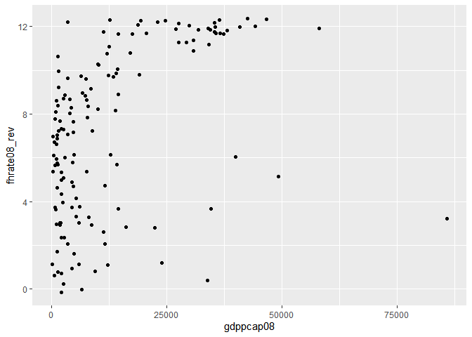

Exercício 5
================
Renato Victor Lira Brito
20/07/2020

## Carregue o banco de dados `world` que está no pacote `poliscidata`.

``` r
library(poliscidata)
library(tidyverse)
```

    ## -- Attaching packages -------------------------------------- tidyverse 1.3.0 --

    ## v ggplot2 3.3.2     v purrr   0.3.4
    ## v tibble  3.0.1     v dplyr   1.0.0
    ## v tidyr   1.1.0     v stringr 1.4.0
    ## v readr   1.3.1     v forcats 0.5.0

    ## -- Conflicts ----------------------------------------- tidyverse_conflicts() --
    ## x dplyr::filter() masks stats::filter()
    ## x dplyr::lag()    masks stats::lag()

``` r
library(scales)
```

    ## 
    ## Attaching package: 'scales'

    ## The following object is masked from 'package:purrr':
    ## 
    ##     discard

    ## The following object is masked from 'package:readr':
    ## 
    ##     col_factor

``` r
banco <-world %>%
  filter(!is.na(dem_score14),
         !is.na(democ11),
         !is.na(fhrate04_rev),
         !is.na(fhrate08_rev),
         !is.na(polity))
```

## Existem diversas medidas de democracia para os países: `dem_score14`, `democ11`, `fhrate04_rev`, `fhrate08_rev`, `polity`. Descreva-as graficamente e diga quais são as diferenças entre tais medidas.

``` r
?world 
```

    ## starting httpd help server ... done

### **Descrição das variáveis, de acordo com o banco de dados ‘world’:**

### **dem\_score14** -\> Democracy score, higher scores more democratic (Economist 2014).

### **democ11** -\> Democracy score, 2011 (UN).

### **fhrate04\_rev** -\> Freedom House rating of democracy (reversed).

### **fhrate08\_rev** -\> Freedom House 1-7 scale reversed, rescaled 0-12.

### **polity** -\> Higher scores more democratic (Polity).

### **Descrição gráfica das variáveis:**

### **1. dem\_score14:**

``` r
ggplot(banco, aes(dem_score14)) + 
  geom_histogram(aes(y=..density..),      
                 binwidth=0.5) +
  geom_density() 
```

<!-- -->

### **2. democ11:**

``` r
ggplot(banco, aes(democ11)) + 
  geom_histogram(aes(y=..density..),      
                 binwidth=0.5) +
  geom_density() 
```

<!-- -->

### **3. fhrate04\_rev:**

``` r
ggplot(banco, aes(fhrate04_rev, ..count../sum(..count..) )) +
  geom_bar(na.rm = T) +
  scale_y_continuous(labels = percent)
```

<!-- -->

### **4. fhrate08\_rev:**

``` r
ggplot(banco, aes(fhrate08_rev, ..count../sum(..count..) )) +
  geom_bar(na.rm = T) +
  scale_y_continuous(labels = percent)
```

<!-- -->

### **5. polity:**

``` r
ggplot(banco, aes(polity, ..count../sum(..count..) )) +
  geom_bar(na.rm = T) +
  scale_y_continuous(labels = percent)
```

<!-- -->

### **Comentários sobre as diferenças entre as medidas das variáveis `dem_score14`, `democ11`, `fhrate04_rev`, `fhrate08_rev` e `polity`:**

### Todas as variáveis buscam de alguma forma apresentar *scores* sobre democracia, nos quais os casos (países) pontuam de formas específicas. Enquanto a `dem_score14` é representada a partir de um *score* com valores contínuos apresentando duas casas decimais de detalhamento (Economist 2014), as variáveis `fhrate04_rev` e `fhrate08_rev` baseiam-se em escalas de 1 a 7 e 0 a 12 (Freedom House), respectivamente. A variável `democ11` (UN) consiste em um *score* sobre o quão democrático um país pode ser, tendo 2011 como ano de observação. A variável `polity`, no entanto, apresenta em seu *score* sobre democracia valores tanto negativos quanto positivos, variando de autocracias (com valor mínimo -10 e valor máximo -6) até democracias (com valor mínimo 6 e valor máximo 10). A variável `dem_score14` foi representada com um histograma com uma curva de densidade com o intuito de melhorar a observação da distribuição dos valores dessa variável contínua. As outras variáveis (`democ11`, `fhrate04_rev`, `fhrate08_rev` e `polity`) foram representadas com gráficos de barras onde podem ser observadas as porcentagens da distribuição dos casos, considerando que a maioria delas opera com escalas que podem ser traduzidas em categorias para o aprofundamento da observação. Além disso, enquanto a variável `dem_score14` apresentou maiores quantidades de casos no centro do gráfico, as outras variáveis apresentaram maiores quantidades de casos nos extremos. Ressalta-se que a variável `fhrate04_rev` apresentou um valor alto de casos entre 2 e 3 na sua escala de 1 a 7, mas que, quando a Freedom House redimensiona para uma escala de 0 a 12 (variável `fhrate08_rev`), esse valor se torna bem mais discreto. Por último, é importante frisar a pluralidade de escalas e formas de avaliação, bem como das possibilidades de representar graficamente cada uma dessas variáveis, o que torna ainda mais complexa a análise dos dados. A variável `polity`, por exemplo, opera com valores negativos, diferindo de todas as outras que, até então, só variavam em escalas e detalhamento de casas decimais sobre os seus dados. Dessa forma, cada tipo de variável, bem como cada tipo de escala e representação gráfica, pode ser determinado a partir da observação que o pesquisador pretende realizar.

## Avalie a relação entre todas as medidas de democracia e desigualdade, utilizando a variável `gini08`. Descreva graficamente esta variável, a relação entre as duas variáveis, meça a correlação entre elas e faça regressões lineares (interpretando em profundidade os resultados dos coeficientes e medidas de desempenho dos modelos). Enfatize as semelhanças e diferenças entre os resultados. Quais são suas conclusões?

``` r
?world 
```

### **gini08** -\> Gini coeff (UN 2008).

### **1. Descrição gráfica da variável `gini08`:**

``` r
ggplot(banco, aes(gini08)) + 
  geom_histogram(aes(y=..density..),      
                 binwidth=1) +
  geom_density() 
```

    ## Warning: Removed 27 rows containing non-finite values (stat_bin).

    ## Warning: Removed 27 rows containing non-finite values (stat_density).

<!-- --> \#\#\#
**2. Descrição gráfica da relação entre as variáveis `gini08` e
`dem_score14`:**

``` r
ggplot(banco, aes(gini08, dem_score14)) +
geom_jitter()
```

    ## Warning: Removed 27 rows containing missing values (geom_point).

<!-- -->

### **3. Descrição gráfica da relação entre as variáveis `gini08` e `democ11`:**

``` r
ggplot(banco, aes(gini08, democ11)) +
geom_jitter()
```

    ## Warning: Removed 27 rows containing missing values (geom_point).

<!-- -->

### **4. Descrição gráfica da relação entre as variáveis `gini08` e `fhrate04_rev`:**

``` r
ggplot(banco, aes(gini08, fhrate04_rev)) +
geom_jitter()
```

    ## Warning: Removed 27 rows containing missing values (geom_point).

<!-- -->

### **5. Descrição gráfica da relação entre as variáveis `gini08` e `fhrate08_rev`:**

``` r
ggplot(banco, aes(gini08, fhrate08_rev)) +
geom_jitter()
```

    ## Warning: Removed 27 rows containing missing values (geom_point).

<!-- -->

### **6. Descrição gráfica da relação entre as variáveis `gini08` e `polity`:**

``` r
ggplot(banco, aes(gini08, polity)) +
geom_jitter()
```

    ## Warning: Removed 27 rows containing missing values (geom_point).

<!-- -->

### \*\* 7. Correlação entre as variáveis `gini08` e `dem_score14`:\*\*

``` r
cor.test(banco$dem_score14, banco$gini08)
```

    ## 
    ##  Pearson's product-moment correlation
    ## 
    ## data:  banco$dem_score14 and banco$gini08
    ## t = -1.7824, df = 113, p-value = 0.07737
    ## alternative hypothesis: true correlation is not equal to 0
    ## 95 percent confidence interval:
    ##  -0.3382358  0.0182973
    ## sample estimates:
    ##        cor 
    ## -0.1653672

### \*\* 8. Correlação entre as variáveis `gini08` e `democ11`:\*\*

``` r
cor.test(banco$democ11, banco$gini08)
```

    ## 
    ##  Pearson's product-moment correlation
    ## 
    ## data:  banco$democ11 and banco$gini08
    ## t = -0.90439, df = 113, p-value = 0.3677
    ## alternative hypothesis: true correlation is not equal to 0
    ## 95 percent confidence interval:
    ##  -0.26378781  0.09988899
    ## sample estimates:
    ##         cor 
    ## -0.08477203

### \*\* 9. Correlação entre as variáveis `gini08` e `fhrate04_rev`:\*\*

``` r
cor.test(banco$fhrate04_rev, banco$gini08)
```

    ## 
    ##  Pearson's product-moment correlation
    ## 
    ## data:  banco$fhrate04_rev and banco$gini08
    ## t = -1.2625, df = 113, p-value = 0.2094
    ## alternative hypothesis: true correlation is not equal to 0
    ## 95 percent confidence interval:
    ##  -0.29468718  0.06660813
    ## sample estimates:
    ##        cor 
    ## -0.1179408

### \*\* 10. Correlação entre as variáveis `gini08` e `fhrate08_rev`:\*\*

``` r
cor.test(banco$fhrate08_rev, banco$gini08)
```

    ## 
    ##  Pearson's product-moment correlation
    ## 
    ## data:  banco$fhrate08_rev and banco$gini08
    ## t = -1.2591, df = 113, p-value = 0.2106
    ## alternative hypothesis: true correlation is not equal to 0
    ## 95 percent confidence interval:
    ##  -0.29439757  0.06692384
    ## sample estimates:
    ##        cor 
    ## -0.1176281

### \*\* 11. Correlação entre as variáveis `gini08` e `polity`:\*\*

``` r
cor.test(banco$polity, banco$gini08)
```

    ## 
    ##  Pearson's product-moment correlation
    ## 
    ## data:  banco$polity and banco$gini08
    ## t = -0.43417, df = 113, p-value = 0.665
    ## alternative hypothesis: true correlation is not equal to 0
    ## 95 percent confidence interval:
    ##  -0.2222590  0.1433725
    ## sample estimates:
    ##         cor 
    ## -0.04080936

### **12. Regressão linear, interpretando em profundidade os resultados dos coeficientes e medidas de desempenho do modelo, entre as variáveis `gini08` e `dem_score14`:**

``` r
Regressao_dem_gini08_01 <- lm(dem_score14 ~ gini08, data = banco)
summary(Regressao_dem_gini08_01)
```

    ## 
    ## Call:
    ## lm(formula = dem_score14 ~ gini08, data = banco)
    ## 
    ## Residuals:
    ##     Min      1Q  Median      3Q     Max 
    ## -4.1187 -1.6272  0.3562  1.6112  3.4717 
    ## 
    ## Coefficients:
    ##             Estimate Std. Error t value Pr(>|t|)    
    ## (Intercept)  7.33487    0.79633   9.211 2.05e-15 ***
    ## gini08      -0.03397    0.01906  -1.782   0.0774 .  
    ## ---
    ## Signif. codes:  0 '***' 0.001 '**' 0.01 '*' 0.05 '.' 0.1 ' ' 1
    ## 
    ## Residual standard error: 1.998 on 113 degrees of freedom
    ##   (27 observations deleted due to missingness)
    ## Multiple R-squared:  0.02735,    Adjusted R-squared:  0.01874 
    ## F-statistic: 3.177 on 1 and 113 DF,  p-value: 0.07737

### Interpretação dos resultados dos coeficientes e medidas de desempenho do modelo:

### A partir da regressão (Regressao\_dem\_gini08\_01), podemos observar os resíduos, com mínimo de -4,1187 e máximo de 3,4717. A mediana se aproxima de 0 (valor que está entre a mediana e o primeiro quartil). O RMSE, ou seja, a distância média dos valores que foram observados para os estimados, foi de 1,998. O intercepto, para o caso de a variável independente ser 0, foi de 7,33487, com erro padrão de 0,79633 e Valor T de 9,211, além de p-valor de 2,05e-15. O β, que representa a mudança em Y para cada mudança em unidades de X, foi -0,03397, com erro padrão de 0,01906, Valor T de -1,782 e p-valor de 0,0774, considerado alto para análises que tratam de p-valor ideal como 0,01 e 0,05. O R-squared, que representa a proporção da variável dependente que é explicada pelo modelo, foi de 0,02735, ou 2,735%.

### **13. Regressão linear, interpretando em profundidade os resultados dos coeficientes e medidas de desempenho do modelo, entre as variáveis `gini08` e `democ11`:**

``` r
Regressao_dem_gini08_02<- lm(democ11 ~ gini08, data = banco)
summary(Regressao_dem_gini08_02)
```

    ## 
    ## Call:
    ## lm(formula = democ11 ~ gini08, data = banco)
    ## 
    ## Residuals:
    ##    Min     1Q Median     3Q    Max 
    ## -6.796 -2.213  1.302  3.049  3.958 
    ## 
    ## Coefficients:
    ##             Estimate Std. Error t value Pr(>|t|)    
    ## (Intercept)  7.68568    1.38306   5.557 1.85e-07 ***
    ## gini08      -0.02994    0.03311  -0.904    0.368    
    ## ---
    ## Signif. codes:  0 '***' 0.001 '**' 0.01 '*' 0.05 '.' 0.1 ' ' 1
    ## 
    ## Residual standard error: 3.47 on 113 degrees of freedom
    ##   (27 observations deleted due to missingness)
    ## Multiple R-squared:  0.007186,   Adjusted R-squared:  -0.0016 
    ## F-statistic: 0.8179 on 1 and 113 DF,  p-value: 0.3677

### Interpretação dos resultados dos coeficientes e medidas de desempenho do modelo:

### A partir da regressão (Regressao\_dem\_gini08\_02), podemos observar os resíduos, com mínimo de -6,796 e máximo de 3,958. A mediana não se aproxima tanto de 0 (valor que está entre a mediana e o primeiro quartil). O RMSE, ou seja, a distância média dos valores que foram observados para os estimados, foi de 3,47. O intercepto, para o caso de a variável independente ser 0, foi de 7,68568, com erro padrão de 1,38306 e Valor T de 5,557, além de p-valor de 1,85e-07. O β, que representa a mudança em Y para cada mudança em unidades de X, foi -0,02994, com erro padrão de 0,03311, Valor T de -0,904 e p-valor de 0,368, considerado alto para análises que tratam de p-valor ideal como 0,01 e 0,05. O R-squared, que representa a proporção da variável dependente que é explicada pelo modelo, foi de 0,007186, ou 0,7186%.

### **14. Regressão linear, interpretando em profundidade os resultados dos coeficientes e medidas de desempenho do modelo, entre as variáveis `gini08` e `fhrate04_rev`:**

``` r
Regressao_dem_gini08_03<- lm(fhrate04_rev ~ gini08, data = banco)
summary(Regressao_dem_gini08_03)
```

    ## 
    ## Call:
    ## lm(formula = fhrate04_rev ~ gini08, data = banco)
    ## 
    ## Residuals:
    ##     Min      1Q  Median      3Q     Max 
    ## -3.8700 -1.3979  0.4045  1.6741  2.4324 
    ## 
    ## Coefficients:
    ##             Estimate Std. Error t value Pr(>|t|)    
    ## (Intercept)  5.74513    0.70975   8.095 7.32e-13 ***
    ## gini08      -0.02145    0.01699  -1.263    0.209    
    ## ---
    ## Signif. codes:  0 '***' 0.001 '**' 0.01 '*' 0.05 '.' 0.1 ' ' 1
    ## 
    ## Residual standard error: 1.781 on 113 degrees of freedom
    ##   (27 observations deleted due to missingness)
    ## Multiple R-squared:  0.01391,    Adjusted R-squared:  0.005184 
    ## F-statistic: 1.594 on 1 and 113 DF,  p-value: 0.2094

### Interpretação dos resultados dos coeficientes e medidas de desempenho do modelo:

### A partir da regressão (Regressao\_dem\_gini08\_03), podemos observar os resíduos, com mínimo de -3,8700 e máximo de 2,4324. A mediana se aproxima de 0 (valor que está entre a mediana e o primeiro quartil). O RMSE, ou seja, a distância média dos valores que foram observados para os estimados, foi de 1,781. O intercepto, para o caso de a variável independente ser 0, foi de 5,74513, com erro padrão de 0,70975 e Valor T de 8,095, além de p-valor de 7,32e-13. O β, que representa a mudança em Y para cada mudança em unidades de X, foi -0,02145, com erro padrão de 0,01699, Valor T de -1,263 e p-valor de 0,209, considerado alto para análises que tratam de p-valor ideal como 0,01 e 0,05. O R-squared, que representa a proporção da variável dependente que é explicada pelo modelo, foi de 0,01391, ou 1,391%.

### **15. Regressão linear, interpretando em profundidade os resultados dos coeficientes e medidas de desempenho do modelo, entre as variáveis `gini08` e `fhrate08_rev`:**

``` r
Regressao_dem_gini08_04<- lm(fhrate08_rev ~ gini08, data = banco)
summary(Regressao_dem_gini08_04)
```

    ## 
    ## Call:
    ## lm(formula = fhrate08_rev ~ gini08, data = banco)
    ## 
    ## Residuals:
    ##     Min      1Q  Median      3Q     Max 
    ## -7.9023 -2.6609  0.7259  3.4246  4.8712 
    ## 
    ## Coefficients:
    ##             Estimate Std. Error t value Pr(>|t|)    
    ## (Intercept)  9.47485    1.41785   6.683 9.28e-10 ***
    ## gini08      -0.04273    0.03394  -1.259    0.211    
    ## ---
    ## Signif. codes:  0 '***' 0.001 '**' 0.01 '*' 0.05 '.' 0.1 ' ' 1
    ## 
    ## Residual standard error: 3.558 on 113 degrees of freedom
    ##   (27 observations deleted due to missingness)
    ## Multiple R-squared:  0.01384,    Adjusted R-squared:  0.005109 
    ## F-statistic: 1.585 on 1 and 113 DF,  p-value: 0.2106

### Interpretação dos resultados dos coeficientes e medidas de desempenho do modelo:

### A partir da regressão (Regressao\_dem\_gini08\_04), podemos observar os resíduos, com mínimo de -7,9023 e máximo de 4,8712. A mediana se aproxima de 0 (valor que está entre a mediana e o primeiro quartil). O RMSE, ou seja, a distância média dos valores que foram observados para os estimados, foi de 3,558. O intercepto, para o caso de a variável independente ser 0, foi de 9,47485, com erro padrão de 1,41785 e Valor T de 6,683, além de p-valor de 9,28e-10. O β, que representa a mudança em Y para cada mudança em unidades de X, foi -0,04273, com erro padrão de 0,03394, Valor T de -1,259 e p-valor de 0,211, considerado alto para análises que tratam de p-valor ideal como 0,01 e 0,05. O R-squared, que representa a proporção da variável dependente que é explicada pelo modelo, foi de 0,01384, ou 1,384%.

### **16. Regressão linear, interpretando em profundidade os resultados dos coeficientes e medidas de desempenho do modelo, entre as variáveis `gini08` e `polity`:**

``` r
Regressao_dem_gini08_05<- lm(polity ~ gini08, data = banco)
summary(Regressao_dem_gini08_05)
```

    ## 
    ## Call:
    ## lm(formula = polity ~ gini08, data = banco)
    ## 
    ## Residuals:
    ##     Min      1Q  Median      3Q     Max 
    ## -14.374  -1.300   2.364   4.087   5.040 
    ## 
    ## Coefficients:
    ##             Estimate Std. Error t value Pr(>|t|)   
    ## (Intercept)  6.21813    2.20594   2.819  0.00569 **
    ## gini08      -0.02292    0.05280  -0.434  0.66499   
    ## ---
    ## Signif. codes:  0 '***' 0.001 '**' 0.01 '*' 0.05 '.' 0.1 ' ' 1
    ## 
    ## Residual standard error: 5.535 on 113 degrees of freedom
    ##   (27 observations deleted due to missingness)
    ## Multiple R-squared:  0.001665,   Adjusted R-squared:  -0.007169 
    ## F-statistic: 0.1885 on 1 and 113 DF,  p-value: 0.665

### Interpretação dos resultados dos coeficientes e medidas de desempenho do modelo:

### A partir da regressão (Regressao\_dem\_gini08\_05), podemos observar os resíduos, com mínimo de -14,374 e máximo de 5,040. A mediana não se aproxima tanto de 0 (valor que está entre a mediana e o primeiro quartil). O RMSE, ou seja, a distância média dos valores que foram observados para os estimados, foi de 5,535. O intercepto, para o caso de a variável independente ser 0, foi de 6,21813, com erro padrão de 2,20594 e Valor T de 2,819, além de p-valor de 0,00569. O β, que representa a mudança em Y para cada mudança em unidades de X, foi -0,02292, com erro padrão de 0,05280, Valor T de -0,434 e p-valor de 0,66499, considerado alto para análises que tratam de p-valor ideal como 0,01 e 0,05. O R-squared, que representa a proporção da variável dependente que é explicada pelo modelo, foi de 0,001665, ou 0,1665%.

### **17. Semelhanças e diferenças entre os resultados e conclusões:**

### No geral, os modelos de regressão a partir das variáveis de democracia associadas à variável `gini08` apresentaram p-valor alto, bem como um valor baixo para o R-squared, que variou entre 0,1665% e 2,735%. Alguns modelos demonstraram ser mais confiáveis do que outros, de acordo com a variável que foi usada, mas, via de regra, os resultados apontaram para um baixo poder explicativo, sem significância estatística, entre democracia e desigualdade.

## Avalie a relação entre todas as medidas de democracia e crescimento econômico, utilizando a variável `gdppcap08`. Descreva graficamente esta variável, a relação entre as duas variáveis, meça a correlação entre elas e faça regressões lineares (interpretando em profundidade os resultados dos coeficientes e medidas de desempenho dos modelos). Enfatize as semelhanças e diferenças entre os resultados. Quais são suas conclusões?

``` r
?world 
```

### **gdppcap08** -\> GDP per capita in 2008 (World Bank).

### **1. Descrição gráfica da variável `gdppcap08`:**

``` r
ggplot(banco, aes(gdppcap08))+
  geom_histogram()
```

    ## `stat_bin()` using `bins = 30`. Pick better value with `binwidth`.

<!-- -->

### **2. Descrição gráfica da relação entre as variáveis `gdppcap08` e `dem_score14`:**

``` r
ggplot(banco, aes(gdppcap08, dem_score14)) +
geom_jitter()
```

<!-- -->

### **3. Descrição gráfica da relação entre as variáveis `gdppcap08` e `democ11`:**

``` r
ggplot(banco, aes(gdppcap08, democ11)) +
geom_jitter()
```

<!-- -->

### **4. Descrição gráfica da relação entre as variáveis `gdppcap08` e `fhrate04_rev`:**

``` r
ggplot(banco, aes(gdppcap08, fhrate04_rev)) +
geom_jitter()
```

<!-- -->

### **5. Descrição gráfica da relação entre as variáveis `gdppcap08` e `fhrate08_rev`:**

``` r
ggplot(banco, aes(gdppcap08, fhrate08_rev)) +
geom_jitter()
```

<!-- -->

### **6. Descrição gráfica da relação entre as variáveis `gdppcap08` e `polity`:**

``` r
ggplot(banco, aes(gdppcap08, polity)) +
geom_jitter()
```

<!-- -->

### \*\* 7. Correlação entre as variáveis `gdppcap08` e `dem_score14`:\*\*

``` r
cor.test(banco$dem_score14, banco$gdppcap08)
```

    ## 
    ##  Pearson's product-moment correlation
    ## 
    ## data:  banco$dem_score14 and banco$gdppcap08
    ## t = 6.4009, df = 140, p-value = 2.172e-09
    ## alternative hypothesis: true correlation is not equal to 0
    ## 95 percent confidence interval:
    ##  0.3375433 0.5939851
    ## sample estimates:
    ##       cor 
    ## 0.4758141

### \*\* 8. Correlação entre as variáveis `gdppcap08` e `democ11`:\*\*

``` r
cor.test(banco$democ11, banco$gdppcap08)
```

    ## 
    ##  Pearson's product-moment correlation
    ## 
    ## data:  banco$democ11 and banco$gdppcap08
    ## t = 3.6037, df = 140, p-value = 0.000435
    ## alternative hypothesis: true correlation is not equal to 0
    ## 95 percent confidence interval:
    ##  0.1330147 0.4351981
    ## sample estimates:
    ##      cor 
    ## 0.291358

### \*\* 9. Correlação entre as variáveis `gdppcap08` e `fhrate04_rev`:\*\*

``` r
cor.test(banco$fhrate04_rev, banco$gdppcap08)
```

    ## 
    ##  Pearson's product-moment correlation
    ## 
    ## data:  banco$fhrate04_rev and banco$gdppcap08
    ## t = 5.4808, df = 140, p-value = 1.913e-07
    ## alternative hypothesis: true correlation is not equal to 0
    ## 95 percent confidence interval:
    ##  0.2745960 0.5471552
    ## sample estimates:
    ##       cor 
    ## 0.4203112

### \*\* 10. Correlação entre as variáveis `gdppcap08` e `fhrate08_rev`:\*\*

``` r
cor.test(banco$fhrate08_rev, banco$gdppcap08)
```

    ## 
    ##  Pearson's product-moment correlation
    ## 
    ## data:  banco$fhrate08_rev and banco$gdppcap08
    ## t = 5.5833, df = 140, p-value = 1.184e-07
    ## alternative hypothesis: true correlation is not equal to 0
    ## 95 percent confidence interval:
    ##  0.2818377 0.5526310
    ## sample estimates:
    ##       cor 
    ## 0.4267524

### \*\* 11. Correlação entre as variáveis `gdppcap08` e `polity`:\*\*

``` r
cor.test(banco$polity, banco$gdppcap08)
```

    ## 
    ##  Pearson's product-moment correlation
    ## 
    ## data:  banco$polity and banco$gdppcap08
    ## t = 2.0332, df = 140, p-value = 0.04392
    ## alternative hypothesis: true correlation is not equal to 0
    ## 95 percent confidence interval:
    ##  0.004758504 0.325013386
    ## sample estimates:
    ##      cor 
    ## 0.169353

### **12. Regressão linear, interpretando em profundidade os resultados dos coeficientes e medidas de desempenho do modelo, entre as variáveis `gdppcap08` e `dem_score14`:**

``` r
Regressao_dem_gdppcap08_01 <- lm(dem_score14 ~ gdppcap08, data = banco)
summary(Regressao_dem_gdppcap08_01)
```

    ## 
    ## Call:
    ## lm(formula = dem_score14 ~ gdppcap08, data = banco)
    ## 
    ## Residuals:
    ##     Min      1Q  Median      3Q     Max 
    ## -7.4247 -1.3955  0.7395  1.2891  2.9948 
    ## 
    ## Coefficients:
    ##              Estimate Std. Error t value Pr(>|t|)    
    ## (Intercept) 4.722e+00  2.110e-01  22.377  < 2e-16 ***
    ## gdppcap08   6.851e-05  1.070e-05   6.401 2.17e-09 ***
    ## ---
    ## Signif. codes:  0 '***' 0.001 '**' 0.01 '*' 0.05 '.' 0.1 ' ' 1
    ## 
    ## Residual standard error: 1.871 on 140 degrees of freedom
    ## Multiple R-squared:  0.2264, Adjusted R-squared:  0.2209 
    ## F-statistic: 40.97 on 1 and 140 DF,  p-value: 2.172e-09

### Interpretação dos resultados dos coeficientes e medidas de desempenho do modelo:

### A partir da regressão (Regressao\_dem\_gdppcap08\_01), podemos observar os resíduos, com mínimo de -7,4247 e máximo de 2,9948. A mediana se aproxima de 0 (valor que está entre a mediana e o primeiro quartil). O RMSE, ou seja, a distância média dos valores que foram observados para os estimados, foi de 1,871. O intercepto, para o caso de a variável independente ser 0, foi de 4,722, com erro padrão de 2,110e-01 e Valor T de 22,377, além de p-valor de 2e-16. O β, que representa a mudança em Y para cada mudança em unidades de X, foi 6,851e-05, com erro padrão de 1,070e-05, Valor T de 6,401 e p-valor de 2,17e-09, considerado baixo para análises que tratam de p-valor ideal como 0,01 e 0,05. O R-squared, que representa a proporção da variável dependente que é explicada pelo modelo, foi de 0.2264, ou 22,64%.

### **13. Regressão linear, interpretando em profundidade os resultados dos coeficientes e medidas de desempenho do modelo, entre as variáveis `gdppcap08` e `democ11`:**

``` r
Regressao_dem_gdppcap08_02 <- lm(democ11 ~ gdppcap08, data = banco)
summary(Regressao_dem_gdppcap08_02)
```

    ## 
    ## Call:
    ## lm(formula = democ11 ~ gdppcap08, data = banco)
    ## 
    ## Residuals:
    ##     Min      1Q  Median      3Q     Max 
    ## -11.258  -3.030   1.723   2.783   4.803 
    ## 
    ## Coefficients:
    ##              Estimate Std. Error t value Pr(>|t|)    
    ## (Intercept) 4.939e+00  4.026e-01  12.270  < 2e-16 ***
    ## gdppcap08   7.359e-05  2.042e-05   3.604 0.000435 ***
    ## ---
    ## Signif. codes:  0 '***' 0.001 '**' 0.01 '*' 0.05 '.' 0.1 ' ' 1
    ## 
    ## Residual standard error: 3.57 on 140 degrees of freedom
    ## Multiple R-squared:  0.08489,    Adjusted R-squared:  0.07835 
    ## F-statistic: 12.99 on 1 and 140 DF,  p-value: 0.000435

### Interpretação dos resultados dos coeficientes e medidas de desempenho do modelo:

### A partir da regressão (Regressao\_dem\_gdppcap08\_02), podemos observar os resíduos, com mínimo de -11,258 e máximo de 4,803. A mediana não se aproxima tanto de 0 (valor que está entre a mediana e o primeiro quartil). O RMSE, ou seja, a distância média dos valores que foram observados para os estimados, foi de 3,57. O intercepto, para o caso de a variável independente ser 0, foi de 4,939, com erro padrão de 4,026e-01 e Valor T de 12,270, além de p-valor de 2e-16. O β, que representa a mudança em Y para cada mudança em unidades de X, foi 7,359e-05, com erro padrão de 2,042e-05, Valor T de 3,604 e p-valor de 0,000435, considerado baixo para análises que tratam de p-valor ideal como 0,01 e 0,05. O R-squared, que representa a proporção da variável dependente que é explicada pelo modelo, foi de 0,08489, ou 8,489%.

### **14. Regressão linear, interpretando em profundidade os resultados dos coeficientes e medidas de desempenho do modelo, entre as variáveis `gdppcap08` e `fhrate04_rev`:**

``` r
Regressao_dem_gdppcap08_03 <- lm(fhrate04_rev ~ gdppcap08, data = banco)
summary(Regressao_dem_gdppcap08_03)
```

    ## 
    ## Call:
    ## lm(formula = fhrate04_rev ~ gdppcap08, data = banco)
    ## 
    ## Residuals:
    ##     Min      1Q  Median      3Q     Max 
    ## -6.0631 -1.4483  0.5801  1.2343  2.9363 
    ## 
    ## Coefficients:
    ##              Estimate Std. Error t value Pr(>|t|)    
    ## (Intercept) 3.872e+00  1.965e-01  19.707  < 2e-16 ***
    ## gdppcap08   5.463e-05  9.967e-06   5.481 1.91e-07 ***
    ## ---
    ## Signif. codes:  0 '***' 0.001 '**' 0.01 '*' 0.05 '.' 0.1 ' ' 1
    ## 
    ## Residual standard error: 1.743 on 140 degrees of freedom
    ## Multiple R-squared:  0.1767, Adjusted R-squared:  0.1708 
    ## F-statistic: 30.04 on 1 and 140 DF,  p-value: 1.913e-07

### Interpretação dos resultados dos coeficientes e medidas de desempenho do modelo:

### A partir da regressão (Regressao\_dem\_gdppcap08\_03), podemos observar os resíduos, com mínimo de -6,0631 e máximo de 2,9363. A mediana se aproxima de 0 (valor que está entre a mediana e o primeiro quartil). O RMSE, ou seja, a distância média dos valores que foram observados para os estimados, foi de 1,743. O intercepto, para o caso de a variável independente ser 0, foi de 3,872, com erro padrão de 1,965e-01 e Valor T de 19,707, além de p-valor de 2e-16. O β, que representa a mudança em Y para cada mudança em unidades de X, foi 5,463e-05, com erro padrão de 9,967e-06, Valor T de 5,481 e p-valor de 1,91e-07, considerado baixo para análises que tratam de p-valor ideal como 0,01 e 0,05. O R-squared, que representa a proporção da variável dependente que é explicada pelo modelo, foi de 0,1767, ou 17,67%.

### **15. Regressão linear, interpretando em profundidade os resultados dos coeficientes e medidas de desempenho do modelo, entre as variáveis `gdppcap08` e `fhrate08_rev`:**

``` r
Regressao_dem_gdppcap08_04 <- lm(fhrate08_rev ~ gdppcap08, data = banco)
summary(Regressao_dem_gdppcap08_04)
```

    ## 
    ## Call:
    ## lm(formula = fhrate08_rev ~ gdppcap08, data = banco)
    ## 
    ## Residuals:
    ##     Min      1Q  Median      3Q     Max 
    ## -12.142  -2.392   1.129   2.472   5.867 
    ## 
    ## Coefficients:
    ##              Estimate Std. Error t value Pr(>|t|)    
    ## (Intercept) 5.750e+00  3.862e-01  14.889  < 2e-16 ***
    ## gdppcap08   1.094e-04  1.959e-05   5.583 1.18e-07 ***
    ## ---
    ## Signif. codes:  0 '***' 0.001 '**' 0.01 '*' 0.05 '.' 0.1 ' ' 1
    ## 
    ## Residual standard error: 3.425 on 140 degrees of freedom
    ## Multiple R-squared:  0.1821, Adjusted R-squared:  0.1763 
    ## F-statistic: 31.17 on 1 and 140 DF,  p-value: 1.184e-07

### Interpretação dos resultados dos coeficientes e medidas de desempenho do modelo:

### A partir da regressão (Regressao\_dem\_gdppcap08\_04), podemos observar os resíduos, com mínimo de -12,142 e máximo de 5,867. A mediana não se aproxima tanto de 0 (valor que está entre a mediana e o primeiro quartil). O RMSE, ou seja, a distância média dos valores que foram observados para os estimados, foi de 3,425. O intercepto, para o caso de a variável independente ser 0, foi de 5,750, com erro padrão de 3,862e-01 e Valor T de 14,889, além de p-valor de 2e-16. O β, que representa a mudança em Y para cada mudança em unidades de X, foi 1,094e-04, com erro padrão de 1,959e-05, Valor T de 5,583 e p-valor de 1,18e-07, considerado baixo para análises que tratam de p-valor ideal como 0,01 e 0,05. O R-squared, que representa a proporção da variável dependente que é explicada pelo modelo, foi de 0,1821, ou 18,21%.

### **16. Regressão linear, interpretando em profundidade os resultados dos coeficientes e medidas de desempenho do modelo, entre as variáveis `gdppcap08` e `polity`:**

``` r
Regressao_dem_gdppcap08_05 <- lm(polity ~ gdppcap08, data = banco)
summary(Regressao_dem_gdppcap08_05)
```

    ## 
    ## Call:
    ## lm(formula = polity ~ gdppcap08, data = banco)
    ## 
    ## Residuals:
    ##     Min      1Q  Median      3Q     Max 
    ## -19.426  -4.207   2.847   4.332   6.378 
    ## 
    ## Coefficients:
    ##              Estimate Std. Error t value Pr(>|t|)    
    ## (Intercept) 3.375e+00  6.833e-01   4.940  2.2e-06 ***
    ## gdppcap08   7.047e-05  3.466e-05   2.033   0.0439 *  
    ## ---
    ## Signif. codes:  0 '***' 0.001 '**' 0.01 '*' 0.05 '.' 0.1 ' ' 1
    ## 
    ## Residual standard error: 6.059 on 140 degrees of freedom
    ## Multiple R-squared:  0.02868,    Adjusted R-squared:  0.02174 
    ## F-statistic: 4.134 on 1 and 140 DF,  p-value: 0.04392

### Interpretação dos resultados dos coeficientes e medidas de desempenho do modelo:

### A partir da regressão (Regressao\_dem\_gdppcap08\_05), podemos observar os resíduos, com mínimo de -19,426 e máximo de 6,378. A mediana não se aproxima tanto de 0 (valor que está entre a mediana e o primeiro quartil). O RMSE, ou seja, a distância média dos valores que foram observados para os estimados, foi de 6,059. O intercepto, para o caso de a variável independente ser 0, foi de 3,375, com erro padrão de 6,833e-01 e Valor T de 4,940, além de p-valor de 2,2e-06. O β, que representa a mudança em Y para cada mudança em unidades de X, foi 7,047e-05, com erro padrão de 3,466e-05, Valor T de 2,033 e p-valor de 0,0439, considerado baixo para análises que tratam de p-valor ideal como 0,05 e alto para análises que tratam de p-valor ideal como 0,01. O R-squared, que representa a proporção da variável dependente que é explicada pelo modelo, foi de 0,02868, ou 2,868%.

### **17. Semelhanças e diferenças entre os resultados e conclusões:**

### No geral, os modelos de regressão a partir das variáveis de democracia associadas à variável `gdppcap08` apresentaram p-valor baixo (ideal), bem como um valor alto para o R-squared, que variou entre 2,868% e 22,64%. Alguns modelos demonstraram ser mais confiáveis do que outros, de acordo com a variável que foi usada, mas, via de regra, os resultados apontaram para um alto poder explicativo, com significância estatística, entre democracia e crescimento econômico.

## Avalie a relação entre todas as medidas de democracia e produção de petróleo, utilizando a variável `oil`. Descreva graficamente esta variável, a relação entre as duas variáveis, meça a correlação entre elas e faça regressões lineares (interpretando em profundidade os resultados dos coeficientes e medidas de desempenho dos modelos). Enfatize as semelhanças e diferenças entre os resultados. Quais são suas conclusões?

``` r
?world 
```

### **oil** -\> Oil production, in barrels per day (CIA).

### **1. Descrição gráfica da variável `oil`:**

``` r
ggplot(banco, aes(oil))+
  geom_histogram()
```

    ## `stat_bin()` using `bins = 30`. Pick better value with `binwidth`.

<!-- -->

### **2. Descrição gráfica da relação entre as variáveis `oil` e `dem_score14`:**

``` r
ggplot(banco, aes(oil, dem_score14)) +
geom_jitter()
```

<!-- -->

### **3. Descrição gráfica da relação entre as variáveis `oil` e `democ11`:**

``` r
ggplot(banco, aes(oil, democ11)) +
geom_jitter()
```

<!-- -->

### **4. Descrição gráfica da relação entre as variáveis `oil` e `fhrate04_rev`:**

``` r
ggplot(banco, aes(oil, fhrate04_rev)) +
geom_jitter()
```

<!-- -->

### **5. Descrição gráfica da relação entre as variáveis `oil` e `fhrate08_rev`:**

``` r
ggplot(banco, aes(oil, fhrate08_rev)) +
geom_jitter()
```

<!-- -->

### **6. Descrição gráfica da relação entre as variáveis `oil` e `polity`:**

``` r
ggplot(banco, aes(oil, polity)) +
geom_jitter()
```

<!-- -->

### \*\* 7. Correlação entre as variáveis `oil` e `dem_score14`:\*\*

``` r
cor.test(banco$dem_score14, banco$oil)
```

    ## 
    ##  Pearson's product-moment correlation
    ## 
    ## data:  banco$dem_score14 and banco$oil
    ## t = -1.5514, df = 140, p-value = 0.1231
    ## alternative hypothesis: true correlation is not equal to 0
    ## 95 percent confidence interval:
    ##  -0.28855575  0.03547893
    ## sample estimates:
    ##        cor 
    ## -0.1300082

### \*\* 8. Correlação entre as variáveis `oil` e `democ11`:\*\*

``` r
cor.test(banco$democ11, banco$oil)
```

    ## 
    ##  Pearson's product-moment correlation
    ## 
    ## data:  banco$democ11 and banco$oil
    ## t = -1.6657, df = 140, p-value = 0.09801
    ## alternative hypothesis: true correlation is not equal to 0
    ## 95 percent confidence interval:
    ##  -0.29730363  0.02591896
    ## sample estimates:
    ##        cor 
    ## -0.1394035

### \*\* 9. Correlação entre as variáveis `oil` e `fhrate04_rev`:\*\*

``` r
cor.test(banco$fhrate04_rev, banco$oil)
```

    ## 
    ##  Pearson's product-moment correlation
    ## 
    ## data:  banco$fhrate04_rev and banco$oil
    ## t = -1.8372, df = 140, p-value = 0.0683
    ## alternative hypothesis: true correlation is not equal to 0
    ## 95 percent confidence interval:
    ##  -0.31031541  0.01158904
    ## sample estimates:
    ##        cor 
    ## -0.1534311

### \*\* 10. Correlação entre as variáveis `oil` e `fhrate08_rev`:\*\*

``` r
cor.test(banco$fhrate08_rev, banco$oil)
```

    ## 
    ##  Pearson's product-moment correlation
    ## 
    ## data:  banco$fhrate08_rev and banco$oil
    ## t = -1.7489, df = 140, p-value = 0.0825
    ## alternative hypothesis: true correlation is not equal to 0
    ## 95 percent confidence interval:
    ##  -0.30363298  0.01896498
    ## sample estimates:
    ##        cor 
    ## -0.1462191

### \*\* 11. Correlação entre as variáveis `oil` e `polity`:\*\*

``` r
cor.test(banco$polity, banco$oil)
```

    ## 
    ##  Pearson's product-moment correlation
    ## 
    ## data:  banco$polity and banco$oil
    ## t = -2.1468, df = 140, p-value = 0.03353
    ## alternative hypothesis: true correlation is not equal to 0
    ## 95 percent confidence interval:
    ##  -0.33344683 -0.01421637
    ## sample estimates:
    ##        cor 
    ## -0.1785256

### **12. Regressão linear, interpretando em profundidade os resultados dos coeficientes e medidas de desempenho do modelo, entre as variáveis `oil` e `dem_score14`:**

``` r
Regressao_dem_oil_01 <- lm(dem_score14 ~ oil, data = banco)
summary(Regressao_dem_oil_01)
```

    ## 
    ## Call:
    ## lm(formula = dem_score14 ~ oil, data = banco)
    ## 
    ## Residuals:
    ##     Min      1Q  Median      3Q     Max 
    ## -4.2018 -1.8699  0.0719  1.7570  4.6216 
    ## 
    ## Coefficients:
    ##               Estimate Std. Error t value Pr(>|t|)    
    ## (Intercept)  5.722e+00  1.880e-01  30.434   <2e-16 ***
    ## oil         -1.760e-07  1.134e-07  -1.551    0.123    
    ## ---
    ## Signif. codes:  0 '***' 0.001 '**' 0.01 '*' 0.05 '.' 0.1 ' ' 1
    ## 
    ## Residual standard error: 2.109 on 140 degrees of freedom
    ## Multiple R-squared:  0.0169, Adjusted R-squared:  0.00988 
    ## F-statistic: 2.407 on 1 and 140 DF,  p-value: 0.1231

### Interpretação dos resultados dos coeficientes e medidas de desempenho do modelo:

### A partir da regressão (Regressao\_dem\_oil\_01), podemos observar os resíduos, com mínimo de -4,2018 e máximo de 4,6216. A mediana se aproxima de 0 (valor que está entre a mediana e o primeiro quartil). O RMSE, ou seja, a distância média dos valores que foram observados para os estimados, foi de 2,109. O intercepto, para o caso de a variável independente ser 0, foi de 5,722, com erro padrão de 1,880e-01 e Valor T de 30,434, além de p-valor de 2e-16. O β, que representa a mudança em Y para cada mudança em unidades de X, foi -1,760e-07, com erro padrão de 1,134e-07, Valor T de -1,551 e p-valor de 0,123, considerado alto para análises que tratam de p-valor ideal como 0,01 e 0,05. O R-squared, que representa a proporção da variável dependente que é explicada pelo modelo, foi de 0.0169, ou 1,69%.

### **13. Regressão linear, interpretando em profundidade os resultados dos coeficientes e medidas de desempenho do modelo, entre as variáveis `oil` e `democ11`:**

``` r
Regressao_dem_oil_02 <- lm(democ11 ~ oil, data = banco)
summary(Regressao_dem_oil_02)
```

    ## 
    ## Call:
    ## lm(formula = democ11 ~ oil, data = banco)
    ## 
    ## Residuals:
    ##     Min      1Q  Median      3Q     Max 
    ## -6.0933 -3.3596  0.9069  2.9416  6.9047 
    ## 
    ## Coefficients:
    ##               Estimate Std. Error t value Pr(>|t|)    
    ## (Intercept)  6.093e+00  3.294e-01  18.500   <2e-16 ***
    ## oil         -3.310e-07  1.987e-07  -1.666    0.098 .  
    ## ---
    ## Signif. codes:  0 '***' 0.001 '**' 0.01 '*' 0.05 '.' 0.1 ' ' 1
    ## 
    ## Residual standard error: 3.695 on 140 degrees of freedom
    ## Multiple R-squared:  0.01943,    Adjusted R-squared:  0.01243 
    ## F-statistic: 2.775 on 1 and 140 DF,  p-value: 0.09801

### Interpretação dos resultados dos coeficientes e medidas de desempenho do modelo:

### A partir da regressão (Regressao\_dem\_oil\_02), podemos observar os resíduos, com mínimo de -6,0933 e máximo de 6,9047. A mediana não se aproxima tanto de 0 (valor que está entre a mediana e o primeiro quartil). O RMSE, ou seja, a distância média dos valores que foram observados para os estimados, foi de 3,695. O intercepto, para o caso de a variável independente ser 0, foi de 6,093, com erro padrão de 3,294e-01 e Valor T de 18,500, além de p-valor de 2e-16. O β, que representa a mudança em Y para cada mudança em unidades de X, foi -3,310e-07, com erro padrão de 1,987e-07, Valor T de -1,666 e p-valor de 0,098, considerado alto para análises que tratam de p-valor ideal como 0,01 e 0,05. O R-squared, que representa a proporção da variável dependente que é explicada pelo modelo, foi de 0,01943, ou 1,943%.

### **14. Regressão linear, interpretando em profundidade os resultados dos coeficientes e medidas de desempenho do modelo, entre as variáveis `oil` e `fhrate04_rev`:**

``` r
Regressao_dem_oil_03 <- lm(fhrate04_rev ~ oil, data = banco)
summary(Regressao_dem_oil_03)
```

    ## 
    ## Call:
    ## lm(formula = fhrate04_rev ~ oil, data = banco)
    ## 
    ## Residuals:
    ##     Min      1Q  Median      3Q     Max 
    ## -3.6872 -1.6962  0.3038  1.8049  4.0017 
    ## 
    ## Coefficients:
    ##               Estimate Std. Error t value Pr(>|t|)    
    ## (Intercept)  4.696e+00  1.691e-01  27.766   <2e-16 ***
    ## oil         -1.875e-07  1.021e-07  -1.837   0.0683 .  
    ## ---
    ## Signif. codes:  0 '***' 0.001 '**' 0.01 '*' 0.05 '.' 0.1 ' ' 1
    ## 
    ## Residual standard error: 1.898 on 140 degrees of freedom
    ## Multiple R-squared:  0.02354,    Adjusted R-squared:  0.01657 
    ## F-statistic: 3.375 on 1 and 140 DF,  p-value: 0.0683

### Interpretação dos resultados dos coeficientes e medidas de desempenho do modelo:

### A partir da regressão (Regressao\_dem\_oil\_03), podemos observar os resíduos, com mínimo de -3,6872 e máximo de 4,0017. A mediana se aproxima de 0 (valor que está entre a mediana e o primeiro quartil). O RMSE, ou seja, a distância média dos valores que foram observados para os estimados, foi de 1,898. O intercepto, para o caso de a variável independente ser 0, foi de 4,696, com erro padrão de 1,691e-01 e Valor T de 27,766, além de p-valor de 2e-16. O β, que representa a mudança em Y para cada mudança em unidades de X, foi -1,875e-07, com erro padrão de 1,021e-07, Valor T de -1,837 e p-valor de 0,0683, considerado alto para análises que tratam de p-valor ideal como 0,01 e 0,05. O R-squared, que representa a proporção da variável dependente que é explicada pelo modelo, foi de 0.02354, ou 2,354%.

### **15. Regressão linear, interpretando em profundidade os resultados dos coeficientes e medidas de desempenho do modelo, entre as variáveis `oil` e `fhrate08_rev`:**

``` r
Regressao_dem_oil_04 <- lm(fhrate08_rev ~ oil, data = banco)
summary(Regressao_dem_oil_04)
```

    ## 
    ## Call:
    ## lm(formula = fhrate08_rev ~ oil, data = banco)
    ## 
    ## Residuals:
    ##     Min      1Q  Median      3Q     Max 
    ## -7.3619 -3.3527 -0.2424  3.6131  7.8041 
    ## 
    ## Coefficients:
    ##               Estimate Std. Error t value Pr(>|t|)    
    ## (Intercept)  7.387e+00  3.339e-01  22.123   <2e-16 ***
    ## oil         -3.524e-07  2.015e-07  -1.749   0.0825 .  
    ## ---
    ## Signif. codes:  0 '***' 0.001 '**' 0.01 '*' 0.05 '.' 0.1 ' ' 1
    ## 
    ## Residual standard error: 3.746 on 140 degrees of freedom
    ## Multiple R-squared:  0.02138,    Adjusted R-squared:  0.01439 
    ## F-statistic: 3.059 on 1 and 140 DF,  p-value: 0.0825

### Interpretação dos resultados dos coeficientes e medidas de desempenho do modelo:

### A partir da regressão (Regressao\_dem\_oil\_04), podemos observar os resíduos, com mínimo de -7,3619 e máximo de 7,8041. A mediana se aproxima de 0 (valor que está entre a mediana e o terceiro quartil). O RMSE, ou seja, a distância média dos valores que foram observados para os estimados, foi de 3,746. O intercepto, para o caso de a variável independente ser 0, foi de 7,387, com erro padrão de 3,339e-01 e Valor T de 22,123, além de p-valor de 2e-16. O β, que representa a mudança em Y para cada mudança em unidades de X, foi -3,524e-07, com erro padrão de 2,015e-07, Valor T de -1,749 e p-valor de 0,0825, considerado alto para análises que tratam de p-valor ideal como 0,01 e 0,05. O R-squared, que representa a proporção da variável dependente que é explicada pelo modelo, foi de 0,02138, ou 2,138%.

### **16. Regressão linear, interpretando em profundidade os resultados dos coeficientes e medidas de desempenho do modelo, entre as variáveis `oil` e `polity`:**

``` r
Regressao_dem_oil_05<- lm(polity ~ oil, data = banco)
summary(Regressao_dem_oil_05)
```

    ## 
    ## Call:
    ## lm(formula = polity ~ oil, data = banco)
    ## 
    ## Residuals:
    ##     Min      1Q  Median      3Q     Max 
    ## -13.845  -5.172   2.307   4.801  11.632 
    ## 
    ## Coefficients:
    ##               Estimate Std. Error t value Pr(>|t|)    
    ## (Intercept)  4.693e+00  5.392e-01   8.704 7.98e-15 ***
    ## oil         -6.984e-07  3.253e-07  -2.147   0.0335 *  
    ## ---
    ## Signif. codes:  0 '***' 0.001 '**' 0.01 '*' 0.05 '.' 0.1 ' ' 1
    ## 
    ## Residual standard error: 6.049 on 140 degrees of freedom
    ## Multiple R-squared:  0.03187,    Adjusted R-squared:  0.02496 
    ## F-statistic: 4.609 on 1 and 140 DF,  p-value: 0.03353

### Interpretação dos resultados dos coeficientes e medidas de desempenho do modelo:

### A partir da regressão (Regressao\_dem\_oil\_05), podemos observar os resíduos, com mínimo de -13,845 e máximo de 11,632. A mediana não se aproxima tanto de 0 (valor que está entre a mediana e o primeiro quartil). O RMSE, ou seja, a distância média dos valores que foram observados para os estimados, foi de 6,049. O intercepto, para o caso de a variável independente ser 0, foi de 4,693, com erro padrão de 5,392e-01 e Valor T de 8,704, além de p-valor de 7,98e-15. O β, que representa a mudança em Y para cada mudança em unidades de X, foi -6,984e-07, com erro padrão de 3,253e-07, Valor T de -2,147 e p-valor de 0,0335, considerado baixo para análises que tratam de p-valor ideal como 0,05 e alto para análises que tratam de p-valor ideal como 0,01. O R-squared, que representa a proporção da variável dependente que é explicada pelo modelo, foi de 0,03187, ou 3,187%.

### **17. Semelhanças e diferenças entre os resultados e conclusões:**

### No geral, os modelos de regressão a partir das variáveis de democracia associadas à variável `oil` apresentaram p-valor alto, bem como um valor baixo para o R-squared, que variou entre 1,69% e 3,187%. Alguns modelos demonstraram ser mais confiáveis do que outros, de acordo com a variável que foi usada, mas, via de regra, os resultados apontaram para um baixo poder explicativo, sem significância estatística, entre democracia e produção de petróleo.

## Avalie a relação entre crescimento econômico e produção de petróleo. Descreva a relação entre as duas variáveis, meça a correlação entre elas e faça regressões lineares (interpretando em profundidade os resultados dos coeficientes e medidas de desempenho dos modelos). Enfatize as semelhanças e diferenças entre os resultados. Quais são suas conclusões?

``` r
?world 
```

### **oil** -\> Oil production, in barrels per day (CIA).

### **gdppcap08** -\> GDP per capita in 2008 (World Bank).

### **1. Descrição gráfica da relação entre as variáveis `Oil` e `gdppcap08`:**

``` r
ggplot(banco, aes(oil, gdppcap08)) +
geom_jitter()
```

<!-- -->

### **2. Correlação entre as variáveis `oil` e `gdppcap08`:**

``` r
cor.test(banco$oil, banco$gdppcap08)
```

    ## 
    ##  Pearson's product-moment correlation
    ## 
    ## data:  banco$oil and banco$gdppcap08
    ## t = 2.5819, df = 140, p-value = 0.01085
    ## alternative hypothesis: true correlation is not equal to 0
    ## 95 percent confidence interval:
    ##  0.05023204 0.36510050
    ## sample estimates:
    ##       cor 
    ## 0.2131952

### **3. Regressão linear, interpretando em profundidade os resultados dos coeficientes e medidas de desempenho do modelo, entre as variáveis `oil` e `gdppcap08`:**

``` r
Regressao_oil_gdppcap08_01 <- lm(oil ~ gdppcap08, data = banco)
summary(Regressao_oil_gdppcap08_01)
```

    ## 
    ## Call:
    ## lm(formula = oil ~ gdppcap08, data = banco)
    ## 
    ## Residuals:
    ##      Min       1Q   Median       3Q      Max 
    ## -1366340  -530815  -308311  -261407  9494315 
    ## 
    ## Coefficients:
    ##              Estimate Std. Error t value Pr(>|t|)  
    ## (Intercept) 2.597e+05  1.731e+05   1.500   0.1358  
    ## gdppcap08   2.268e+01  8.782e+00   2.582   0.0109 *
    ## ---
    ## Signif. codes:  0 '***' 0.001 '**' 0.01 '*' 0.05 '.' 0.1 ' ' 1
    ## 
    ## Residual standard error: 1535000 on 140 degrees of freedom
    ## Multiple R-squared:  0.04545,    Adjusted R-squared:  0.03863 
    ## F-statistic: 6.666 on 1 and 140 DF,  p-value: 0.01085

### Interpretação dos resultados dos coeficientes e medidas de desempenho do modelo:

### A partir da regressão (Regressao\_oil\_gdppcap08\_01), podemos observar os resíduos, com mínimo de -1366340 e máximo de 9494315. A mediana não se aproxima nem um pouco de 0 (valor que está entre o terceiro quartil e o máximo). O RMSE, ou seja, a distância média dos valores que foram observados para os estimados, foi de 1535000. O intercepto, para o caso de a variável independente ser 0, foi de 2,597e+05, com erro padrão de 1,731e+05 e Valor T de 1,500, além de p-valor de 0,1358. O β, que representa a mudança em Y para cada mudança em unidades de X, foi 2,268e+01, com erro padrão de 8,782e+00, Valor T de 2,582 e p-valor de 0,0109, considerado baixo para análises que tratam de p-valor ideal como 0,01 e 0,05. O R-squared, que representa a proporção da variável dependente que é explicada pelo modelo, foi de 0,04545, ou 4,545%.

### **4. Semelhanças e diferenças entre os resultados e conclusões:**

### O modelo de regressão a partir da variável `Oil` associada à variável `gdppcap08` apresentou p-valor baixo, bem como um valor baixo para o R-squared, que foi de 4,545%. O resultado apontou para um baixo poder explicativo, mas com alta significância estatística, entre crescimento econômico e produção de petróleo.

## A partir das suas conclusões sobre a relação entre democracia, economia e produção de petróleo, quais considerações são possíveis fazer sobre a relação CAUSAL entre estas variáveis? Lembre dos 4 “hurdles” do livro *Fundamentals of Political Science Research*:

### **Democracia e Economia:** Entre democracia e economia, foi identificado um alto poder explicativo, com significância estatística, observando todas as variáveis mencionadas em relação à democracia. Considerando o livro *Fundamentals of Political Science Research*, bem como toda a literatura consagrada na Ciência Política sobre a temática, podemos considerar que há um mecanismo causal crível entre X e Y e também podemos eliminar a possibilidade de Y causar X e a covariação. No entanto, ainda não controlamos por todas as variáveis colineares Z que poderiam tornar a associação entre X e Y espúria.

### **Democracia e Produção de Petróleo:** Entre democracia e produção de petróleo, foi identificado um baixo poder explicativo, sem significância estatística, observando todas as variáveis mencionadas em relação à democracia. De acordo com as questões do livro *Fundamentals of Political Science Research*, não há como esse modelo passar nos quatro quesitos estipulados.

### **Economia e Produção de petróleo:** Entre economia e produção de petróleo, foi identificado um baixo poder explicativo, mas com alta significância estatística. Observando o livro *Fundamentals of Political Science Research*, bem como as suas questões norteadoras, esse modelo pode passar no primeiro teste, mas é difícil passar no teste da possibilidade de Y causar X, bem como da covariação e dos possíveis controles por variáveis colineares Z que poderiam tornar a associação espúria.
