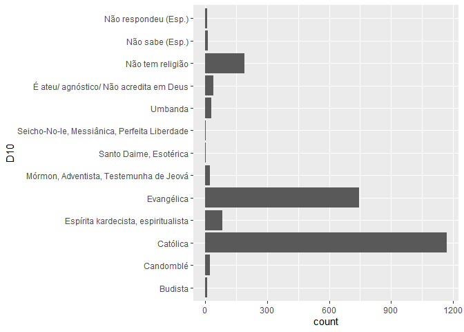
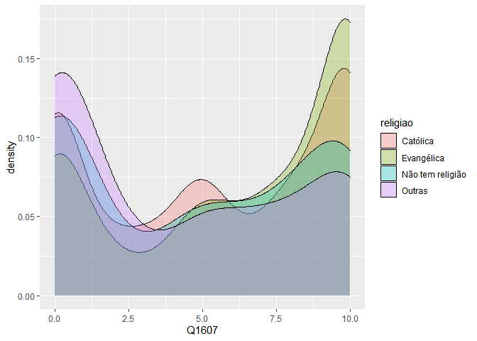

Exercício 8
================
Renato Victor Lira Brito

``` r
setwd("C:\\Users\\Renato\\Desktop\\Mestrado - 2020.1\\SEMESTRE I\\Análise de Dados\\EXERCÍCIOS R\\EXERCICIO 8")
```

### Continuaremos com a utilização dos dados do ESEB2018. Carregue o banco da mesma forma que nos exercicios anteriores

``` r
library(tidyverse)
library(haven)
library(scales)

link <- "https://github.com/MartinsRodrigo/Analise-de-dados/blob/master/04622.sav?raw=true"

download.file(link, "04622.sav", mode = "wb")

banco <- read_spss("04622.sav") 

banco <- banco %>%
  mutate(D2_SEXO = as_factor(D2_SEXO),
         D10 = as_factor(D10)) %>%
  filter(Q1607 < 11)

banco$Q1607 <- as.numeric(banco$Q1607)

glimpse(banco)
```

    ## Rows: 2,326
    ## Columns: 286
    ## $ A1_Nquest           <dbl> 1, 2, 3, 4, 5, 6, 7, 8, 9, 10, 11, 12, 13, 14, ...
    ## $ DIAENTR             <dbl> 15, 15, 15, 16, 16, 16, 16, 17, 17, 17, 17, 17,...
    ## $ MESENTR             <dbl+lbl> 11, 11, 11, 11, 11, 11, 11, 11, 11, 11, 11,...
    ## $ ANOENTR             <dbl> 2018, 2018, 2018, 2018, 2018, 2018, 2018, 2018,...
    ## $ D1A_ID              <dbl> 41, 23, 21, 39, 64, 45, 18, 29, 25, 31, 23, 45,...
    ## $ D1A_FAIXAID         <dbl+lbl> 4, 2, 2, 4, 6, 5, 2, 3, 3, 3, 2, 5, 6, 3, 6...
    ## $ D2_SEXO             <fct> Feminino, Masculino, Feminino, Masculino, Mascu...
    ## $ D3_ESCOLA           <dbl+lbl> 5, 5, 6, 3, 0, 0, 4, 8, 8, 6, 2, 2, 1, 2, 6...
    ## $ RAMOATIV            <dbl+lbl>  6,  4, 10,  3,  1,  7, 10,  5,  4,  7, 10,...
    ## $ RAMOCHEFEF          <dbl+lbl> 99, 99, 99, 99, 99, 99, 99, 99, 99, 99, 99,...
    ## $ OCUPA               <dbl+lbl> 2, 1, 4, 3, 3, 1, 4, 2, 1, 1, 4, 4, 4, 4, 3...
    ## $ UF                  <dbl+lbl> 12, 12, 12, 12, 12, 12, 12, 12, 12, 12, 12,...
    ## $ CID                 <dbl+lbl> 1, 1, 1, 1, 1, 1, 1, 1, 1, 1, 1, 1, 1, 1, 2...
    ## $ REG                 <dbl+lbl> 1, 1, 1, 1, 1, 1, 1, 1, 1, 1, 1, 1, 1, 1, 1...
    ## $ Q1                  <dbl+lbl> 4, 4, 4, 4, 1, 4, 4, 3, 4, 2, 3, 3, 3, 4, 3...
    ## $ Q2                  <dbl+lbl> 3, 3, 4, 3, 4, 3, 4, 3, 4, 2, 3, 3, 4, 4, 3...
    ## $ Q3                  <dbl+lbl> 2, 3, 3, 2, 1, 2, 4, 2, 4, 1, 5, 2, 3, 5, 1...
    ## $ Q401                <dbl+lbl> 3, 2, 5, 1, 4, 2, 2, 1, 2, 3, 4, 1, 2, 1, 1...
    ## $ Q402                <dbl+lbl> 1, 1, 3, 1, 1, 1, 1, 1, 1, 1, 1, 1, 1, 2, 1...
    ## $ Q403                <dbl+lbl> 5, 1, 5, 3, 5, 3, 5, 5, 1, 5, 4, 5, 2, 5, 5...
    ## $ Q404                <dbl+lbl> 1, 1, 1, 1, 1, 1, 2, 1, 1, 1, 4, 1, 3, 1, 1...
    ## $ Q405                <dbl+lbl> 3, 3, 3, 1, 1, 3, 4, 5, 1, 5, 2, 2, 5, 5, 1...
    ## $ Q406                <dbl+lbl> 1, 1, 3, 1, 4, 1, 2, 1, 2, 1, 1, 1, 2, 1, 4...
    ## $ Q407                <dbl+lbl> 1, 1, 1, 1, 1, 1, 1, 1, 1, 1, 1, 1, 1, 1, 1...
    ## $ Q501                <dbl+lbl> 3, 3, 3, 3, 4, 2, 4, 1, 2, 2, 2, 5, 3, 1, 1...
    ## $ Q502                <dbl+lbl> 1, 4, 2, 2, 2, 4, 3, 1, 1, 1, 5, 5, 2, 3, 5...
    ## $ Q503                <dbl+lbl> 2, 2, 1, 3, 1, 8, 3, 5, 2, 2, 2, 5, 3, 2, 5...
    ## $ Q504                <dbl+lbl> 3, 5, 1, 3, 3, 2, 5, 1, 4, 4, 4, 1, 3, 1, 1...
    ## $ Q505                <dbl+lbl> 3, 3, 3, 3, 4, 5, 4, 1, 5, 4, 5, 4, 3, 1, 1...
    ## $ Q601                <dbl+lbl> 1, 1, 1, 1, 1, 1, 4, 4, 2, 1, 3, 1, 2, 4, 1...
    ## $ Q602                <dbl+lbl> 1, 3, 1, 3, 3, 1, 2, 1, 1, 3, 1, 2, 4, 3, 1...
    ## $ Q603                <dbl+lbl> 1, 3, 1, 1, 1, 1, 3, 1, 1, 2, 2, 3, 3, 4, 1...
    ## $ Q604                <dbl+lbl> 1, 2, 2, 1, 1, 1, 1, 1, 2, 1, 1, 1, 4, 2, 1...
    ## $ Q7                  <dbl+lbl> 1, 1, 1, 1, 1, 1, 1, 1, 1, 1, 1, 1, 2, 3, 4...
    ## $ Q8                  <dbl+lbl> 1, 2, 3, 2, 1, 1, 3, 1, 1, 1, 1, 1, 3, 1, 1...
    ## $ Q9                  <dbl+lbl> 5, 5, 5, 5, 5, 5, 5, 5, 4, 5, 4, 5, 4, 5, 5...
    ## $ Q10A                <dbl+lbl> 5, 5, 5, 1, 1, 5, 5, 1, 5, 5, 5, 5, 5, 5, 5...
    ## $ Q10B                <dbl+lbl> 99, 99, 99, 17, 13, 99, 99, 17, 99, 99, 99,...
    ## $ Q11                 <dbl+lbl> 5, 3, 5, 5, 5, 5, 5, 5, 5, 4, 4, 4, 3, 5, 5...
    ## $ Q12P1_A             <dbl+lbl> 1, 1, 1, 1, 1, 1, 1, 1, 1, 7, 6, 1, 1, 1, 1...
    ## $ Q12P1_B             <dbl+lbl>  9,  9,  9,  9,  9,  9,  9,  9,  9, 99, 99,...
    ## $ Q12P2_A             <dbl+lbl> 1, 1, 1, 1, 1, 1, 1, 1, 1, 4, 6, 1, 1, 1, 1...
    ## $ Q12P2_B             <dbl+lbl>  2,  2,  2,  2,  2,  2,  2,  2,  2, 99, 99,...
    ## $ Q12G_1A             <dbl+lbl> 9950, 1203, 9998, 1203, 1203, 1203, 1203, 1...
    ## $ Q12G_2              <dbl+lbl> 9999, 9999, 9999, 9999, 9999, 9999, 9999, 9...
    ## $ Q12S1               <dbl+lbl> 1206, 1203, 9998, 1206, 1206, 1201, 1204, 1...
    ## $ Q12S2               <dbl+lbl> 9998, 1202, 9998, 1202, 1202, 1206, 1201, 1...
    ## $ Q12CD               <dbl+lbl> 2037, 9950, 9998, 9998, 9998, 2038, 9960,  ...
    ## $ Q12CD_recode        <dbl+lbl>   1,   4,   3,   3,   3,   1,   4,   1,   1...
    ## $ Q12AL               <dbl+lbl> 9998, 2084, 9998, 1174, 9998, 1092, 9960,  ...
    ## $ Q12AL_recode        <dbl+lbl>   3,   1,   3,   1,   3,   1,   4,   1,   1...
    ## $ Q13A                <dbl+lbl>  1,  5,  1,  1,  1,  1,  3,  1,  1,  1,  1,...
    ## $ Q13B                <dbl+lbl>  2, 99,  2,  2,  7, 98, 99,  2, 98,  1,  2,...
    ## $ Q13B_2              <dbl+lbl>  4,  5,  1,  1,  1,  1,  3,  1,  1,  1,  1,...
    ## $ Q13B2A              <dbl+lbl> 99, 99,  2,  2,  1,  2, 99,  2, 60,  1,  2,...
    ## $ Q13G1               <dbl+lbl> 9950, 9999, 1204, 1204, 1203, 1204, 9999, 1...
    ## $ Q13G2               <dbl+lbl> 9999, 9999, 1204, 1204, 1203, 1204, 9999, 1...
    ## $ Q13S                <dbl+lbl> 9950, 9999, 1203, 1201, 1203, 1202, 9999, 1...
    ## $ Q13CD               <dbl+lbl> 9950, 9999, 9998, 1175, 9998, 9998, 9999, 9...
    ## $ Q13CD_recode        <dbl+lbl>   4, 999,   3,   2,   3,   3, 999,   3,   1...
    ## $ Q13AL               <dbl+lbl> 9950, 9999, 9998, 9998,  770, 9998, 9999,  ...
    ## $ Q13AL_recode        <dbl+lbl>   4, 999,   3,   3,   3,   3, 999,   3,   3...
    ## $ Q14A                <dbl+lbl> 5, 5, 4, 5, 5, 5, 5, 5, 3, 5, 5, 2, 3, 5, 3...
    ## $ Q14B                <dbl+lbl> 5, 5, 5, 5, 5, 5, 4, 5, 4, 5, 5, 5, 1, 5, 5...
    ## $ Q1501               <dbl+lbl>  1,  0,  0,  0,  0, 10,  0, 96,  2,  0,  0,...
    ## $ Q1502               <dbl+lbl> 96,  5, 96,  0,  5,  5, 96, 96, 96,  4,  0,...
    ## $ Q1503               <dbl+lbl> 96, 96,  2, 96,  8, 96, 98, 96,  5,  2,  0,...
    ## $ Q1504               <dbl+lbl> 96, 96, 96,  0, 96, 96, 96, 96, 96,  2,  0,...
    ## $ Q1505               <dbl+lbl>  1,  0,  3,  0, 10, 10,  0, 96,  8,  5,  6,...
    ## $ Q1506               <dbl+lbl> 98, 96, 96,  0, 96,  5,  0, 96,  5,  8,  0,...
    ## $ Q1507               <dbl+lbl> 96, 96, 96,  0, 96, 96,  0, 96, 96,  6,  0,...
    ## $ Q1508               <dbl+lbl>  1,  0, 96,  0,  7, 96,  0, 96,  8,  8,  4,...
    ## $ Q1509               <dbl+lbl> 96,  0, 96,  0, 96, 96, 96, 96, 96, 96,  0,...
    ## $ Q1510               <dbl+lbl> 96, 96, 96, 96, 96, 96, 96, 96, 96, 96,  0,...
    ## $ Q1511               <dbl+lbl>  1, 96, 96,  0, 10, 96,  0, 96,  3, 96,  5,...
    ## $ Q1512               <dbl+lbl> 96,  9,  2, 10, 96,  5, 96, 10,  7,  8,  5,...
    ## $ Q1513               <dbl+lbl>  1, 96, 96,  0, 96, 96,  0, 96, 96,  1,  0,...
    ## $ Q1514               <dbl+lbl> 96, 96,  3,  0,  8, 96, 10, 96,  4,  0,  0,...
    ## $ Q1515               <dbl+lbl> 96, 96, 96,  0, 96, 96, 96, 96, 96,  0,  0,...
    ## $ Q1516               <dbl+lbl> 96, 96, 96, 96, 96, 96, 96, 96, 96,  8,  0,...
    ## $ Q1517               <dbl+lbl> 96, 96,  2,  0, 96, 96,  7, 96,  5, 96,  6,...
    ## $ Q1518               <dbl+lbl>  1, 96, 96,  0, 96,  5, 96, 96,  5,  5,  0,...
    ## $ Q1519               <dbl+lbl> 96, 96, 96, 96, 96, 96,  0, 96,  5,  2,  0,...
    ## $ Q1520               <dbl+lbl> 96, 96, 96, 96,  5,  5,  0, 96,  7,  5,  4,...
    ## $ Q1521               <dbl+lbl> 96, 96, 96,  0,  8, 96,  4, 96,  4,  8,  0,...
    ## $ Q1522               <dbl+lbl> 96, 96, 96,  0, 96, 96,  1, 96,  6,  5,  0,...
    ## $ Q1523               <dbl+lbl> 96, 96, 96, 96,  4, 96, 98, 96,  4,  2,  0,...
    ## $ Q1524               <dbl+lbl> 96, 96, 96,  0, 96, 96,  0, 96, 96,  1,  0,...
    ## $ Q1525               <dbl+lbl> 96, 96, 96,  0, 10, 96, 96, 96, 96, 96,  0,...
    ## $ Q1526               <dbl+lbl> 96, 96, 96, 96, 96, 96, 96, 96, 96,  2,  5,...
    ## $ Q1601               <dbl+lbl>  1,  0,  0,  0, 96,  5,  8,  0,  1,  8,  0,...
    ## $ Q1602               <dbl+lbl>  0,  0, 96, 96, 96, 96, 96,  0, 96,  0,  0,...
    ## $ Q1603               <dbl+lbl>  1,  0, 96,  0, 96, 96,  0,  0, 96,  0,  0,...
    ## $ Q1604               <dbl+lbl>  0,  3,  3,  0, 10,  5,  0,  5,  5,  8,  0,...
    ## $ Q1605               <dbl+lbl> 0, 0, 2, 0, 8, 5, 0, 0, 5, 0, 0, 0, 0, 0, 5...
    ## $ Q1606               <dbl+lbl>  1,  0,  0,  0, 96, 96, 98,  6,  7,  0,  7,...
    ## $ Q1607               <dbl> 10, 10, 3, 10, 10, 10, 10, 10, 8, 10, 10, 10, 1...
    ## $ Q1608               <dbl+lbl>  1,  0,  0,  0, 10, 96,  6,  0,  2,  5,  8,...
    ## $ Q1609               <dbl+lbl>  1,  0, 96, 96, 96, 96, 96,  0, 96,  0,  7,...
    ## $ Q1610               <dbl+lbl>  1,  0,  1,  0, 10,  5,  0,  0,  0,  0,  0,...
    ## $ Q1611               <dbl+lbl>  1,  0, 96,  0, 96, 96,  7,  0,  3,  0,  6,...
    ## $ Q1612               <dbl+lbl>  1,  0, 96,  0, 96, 96, 96,  0, 96,  2, 96,...
    ## $ Q1613               <dbl+lbl>  1,  3, 96,  6, 96, 96,  9, 10, 96,  0,  0,...
    ## $ Q1614               <dbl+lbl>  1,  0, 96,  0, 96, 96, 96,  0, 96, 96,  0,...
    ## $ Q1615               <dbl+lbl>  1, 96, 96, 96, 96, 96, 96,  3, 96, 96, 96,...
    ## $ Q1616               <dbl+lbl>  1,  0,  1,  0, 96, 96, 96,  0, 96, 96, 96,...
    ## $ Q1617               <dbl+lbl>  1,  0,  1,  0,  8, 96, 98,  0,  3,  8,  0,...
    ## $ Q1618               <dbl+lbl>  0,  0,  0,  0,  0,  5,  0,  0,  0,  0,  0,...
    ## $ Q1619               <dbl+lbl>  1,  0, 96,  0, 96, 96, 96,  0, 96, 96, 96,...
    ## $ Q1620               <dbl+lbl>  1,  0, 96,  0, 96, 96, 96,  0,  3,  0,  0,...
    ## $ Q1621               <dbl+lbl> 1, 0, 0, 0, 8, 0, 0, 0, 1, 0, 0, 0, 0, 0, 0...
    ## $ Q1701               <dbl+lbl>  0,  0,  0,  0,  0,  5,  0,  0,  2, 10,  1,...
    ## $ Q1702               <dbl+lbl>  0,  0, 96, 96,  5,  0, 96, 96,  8,  8, 96,...
    ## $ Q1703               <dbl+lbl>  1,  0,  0,  0,  5,  0,  4, 96, 10,  7,  3,...
    ## $ Q1704               <dbl+lbl>  0, 96, 96,  0, 96,  0, 96, 96,  5, 96,  6,...
    ## $ Q1705               <dbl+lbl>  0,  0, 10,  4,  5,  5,  2, 96,  8,  7,  7,...
    ## $ Q1706               <dbl+lbl>  2, 96, 96,  0, 96,  0, 96,  2,  4,  5,  6,...
    ## $ Q1707               <dbl+lbl>  2,  0, 96, 96, 96,  0, 96, 96,  3,  5, 96,...
    ## $ Q1708               <dbl+lbl>  2,  0, 96,  0,  4,  0,  3,  5,  1,  1,  5,...
    ## $ Q1709               <dbl+lbl>  3,  0, 96, 96, 96,  0, 96,  5,  2, 96,  6,...
    ## $ Q1710               <dbl+lbl>  0, 96, 96,  0,  5,  0, 96, 96,  6, 96, 96,...
    ## $ Q1711               <dbl+lbl>  2,  0, 96,  0, 10,  0, 96, 96,  6,  6,  7,...
    ## $ Q1712               <dbl+lbl>  4,  8,  0, 10,  5,  5, 96, 10,  3,  3,  5,...
    ## $ Q1713               <dbl+lbl>  2,  0, 96,  1, 96,  0, 96,  2,  5, 96, 96,...
    ## $ Q1714               <dbl+lbl>  2,  0,  0,  1,  5,  5,  8,  0, 10, 10,  3,...
    ## $ Q1715               <dbl+lbl> 96, 96, 96, 96, 96,  0, 96, 96,  3, 96, 96,...
    ## $ Q1716               <dbl+lbl>  2,  0, 96,  0,  4,  0, 96, 96,  4,  8, 96,...
    ## $ Q1717               <dbl+lbl>  2,  0,  0,  3,  4,  5,  4, 96,  6,  6,  6,...
    ## $ Q1718               <dbl+lbl>  2,  0, 96,  0,  4,  0, 96, 96,  3,  5, 96,...
    ## $ Q1719               <dbl+lbl>  2,  0, 96,  0, 96,  0, 96, 96,  7,  7, 96,...
    ## $ Q1720               <dbl+lbl>  2,  0, 10,  0,  5,  0,  9, 96,  8,  8,  4,...
    ## $ Q1721               <dbl+lbl>  2,  0, 96,  0,  0,  0,  5, 96,  2, 96,  4,...
    ## $ Q1722               <dbl+lbl>  2,  0, 96, 96,  0,  0, 96, 96,  1,  3, 96,...
    ## $ Q1723               <dbl+lbl>  2,  0, 96,  6,  8,  0,  7,  2,  7,  3, 96,...
    ## $ Q1724               <dbl+lbl>  0,  0,  0, 96, 96,  0, 96,  0,  5, 96, 96,...
    ## $ Q1725               <dbl+lbl>  2, 96, 96, 96, 96,  0, 96, 96,  7, 96, 96,...
    ## $ Q1726               <dbl+lbl>  1,  0, 96,  0, 96,  0, 96,  2,  4, 96,  4,...
    ## $ Q18                 <dbl+lbl> 10, 10, 10, 10, 10, 10,  7,  0, 10, 10, 10,...
    ## $ Q21                 <dbl+lbl> 5, 4, 5, 4, 5, 5, 5, 5, 4, 5, 2, 4, 4, 4, 5...
    ## $ Q22A                <dbl+lbl> 2, 2, 2, 2, 1, 2, 2, 2, 2, 2, 2, 2, 2, 2, 2...
    ## $ Q22B                <dbl+lbl>  2,  1,  2,  1, 99,  1,  2,  2,  2,  1,  2,...
    ## $ Q22C                <dbl+lbl> 99, 17, 99, 17, 17, 98, 99, 99, 99, 50, 99,...
    ## $ Q22D                <dbl+lbl> 99,  2, 99,  2,  2, 99, 99, 99, 99,  2, 99,...
    ## $ P1                  <dbl+lbl> 1, 1, 1, 1, 1, 2, 1, 1, 1, 1, 1, 1, 1, 1, 2...
    ## $ P1A                 <dbl+lbl>  13,  13,  13,  13,  13, 999,  13,  13,  13...
    ## $ D5_1                <dbl+lbl> 2, 2, 2, 2, 2, 2, 2, 1, 2, 1, 2, 2, 2, 2, 2...
    ## $ D5_2                <dbl+lbl> 2, 2, 2, 2, 2, 2, 2, 2, 2, 1, 2, 2, 2, 2, 2...
    ## $ P201                <dbl+lbl> 2, 2, 2, 2, 1, 2, 2, 2, 2, 2, 2, 2, 2, 2, 2...
    ## $ P202                <dbl+lbl> 2, 2, 2, 2, 1, 2, 2, 2, 2, 2, 2, 2, 2, 2, 2...
    ## $ P203                <dbl+lbl> 2, 2, 2, 2, 1, 2, 2, 2, 2, 2, 2, 2, 2, 2, 2...
    ## $ P204                <dbl+lbl> 2, 2, 2, 2, 2, 2, 2, 2, 2, 1, 2, 2, 2, 2, 2...
    ## $ P205                <dbl+lbl> 2, 2, 1, 2, 2, 2, 2, 2, 2, 2, 2, 2, 2, 2, 2...
    ## $ P206                <dbl+lbl> 1, 2, 1, 2, 1, 1, 1, 2, 2, 1, 1, 2, 2, 2, 2...
    ## $ P207                <dbl+lbl> 2, 2, 2, 2, 1, 2, 2, 2, 2, 2, 2, 1, 2, 2, 1...
    ## $ P208                <dbl+lbl> 2, 2, 2, 2, 2, 2, 2, 2, 2, 1, 2, 2, 2, 2, 2...
    ## $ P209                <dbl+lbl> 2, 2, 2, 2, 2, 2, 1, 2, 2, 2, 2, 2, 2, 2, 1...
    ## $ P210                <dbl+lbl> 2, 2, 2, 2, 2, 2, 2, 2, 2, 2, 2, 2, 2, 2, 2...
    ## $ P211                <dbl+lbl> 2, 2, 2, 2, 2, 2, 2, 2, 2, 2, 2, 2, 2, 2, 2...
    ## $ P212                <dbl+lbl> 2, 2, 2, 2, 2, 2, 2, 2, 2, 1, 2, 2, 2, 2, 2...
    ## $ P213                <dbl+lbl> 2, 2, 2, 2, 2, 2, 2, 2, 2, 2, 2, 2, 2, 2, 2...
    ## $ P214                <dbl+lbl> 2, 2, 2, 2, 1, 2, 2, 2, 2, 2, 2, 1, 2, 2, 2...
    ## $ P215                <dbl+lbl> 2, 2, 2, 2, 2, 2, 2, 2, 2, 2, 2, 2, 2, 2, 2...
    ## $ P216                <dbl+lbl> 2, 2, 2, 2, 2, 2, 2, 2, 2, 2, 2, 2, 2, 2, 2...
    ## $ P217                <dbl+lbl> 2, 2, 1, 2, 1, 2, 2, 2, 2, 2, 2, 1, 2, 2, 2...
    ## $ P301                <dbl+lbl> 5, 2, 1, 2, 2, 1, 3, 6, 2, 2, 2, 5, 2, 2, 6...
    ## $ P302                <dbl+lbl> 1, 2, 1, 2, 2, 2, 1, 1, 2, 2, 2, 4, 2, 1, 1...
    ## $ P303                <dbl+lbl> 1, 2, 2, 2, 2, 1, 1, 2, 1, 2, 1, 2, 2, 2, 6...
    ## $ P304                <dbl+lbl> 6, 2, 6, 6, 6, 6, 6, 6, 2, 6, 2, 5, 3, 6, 6...
    ## $ P305                <dbl+lbl> 6, 1, 6, 6, 2, 6, 6, 6, 1, 6, 2, 4, 2, 6, 6...
    ## $ P306                <dbl+lbl> 5, 2, 2, 6, 2, 2, 3, 6, 5, 2, 1, 4, 2, 5, 2...
    ## $ P307                <dbl+lbl> 5, 6, 2, 6, 5, 6, 2, 6, 6, 5, 5, 6, 5, 6, 6...
    ## $ P308                <dbl+lbl> 6, 5, 5, 6, 6, 6, 2, 6, 6, 6, 5, 6, 5, 6, 6...
    ## $ P309                <dbl+lbl> 1, 2, 2, 2, 2, 1, 1, 1, 2, 6, 2, 3, 2, 2, 6...
    ## $ P310                <dbl+lbl> 6, 2, 6, 6, 2, 6, 4, 6, 5, 6, 5, 2, 3, 2, 6...
    ## $ P311                <dbl+lbl> 5, 6, 6, 6, 2, 1, 2, 6, 6, 6, 6, 6, 3, 6, 6...
    ## $ P312                <dbl+lbl> 1, 2, 2, 6, 2, 1, 1, 1, 5, 2, 2, 2, 2, 1, 6...
    ## $ P401                <dbl+lbl> 3, 1, 1, 4, 1, 1, 3, 4, 3, 3, 2, 4, 3, 3, 3...
    ## $ P402                <dbl+lbl> 1, 3, 1, 4, 1, 3, 1, 1, 3, 3, 2, 3, 2, 1, 3...
    ## $ P403                <dbl+lbl> 1, 1, 4, 1, 1, 1, 3, 1, 2, 4, 1, 2, 2, 1, 3...
    ## $ P404                <dbl+lbl> 3, 1, 3, 4, 3, 4, 4, 4, 3, 4, 2, 4, 4, 3, 3...
    ## $ P405                <dbl+lbl> 4, 3, 3, 4, 1, 4, 2, 3, 3, 4, 2, 3, 2, 3, 3...
    ## $ P406                <dbl+lbl> 3, 3, 3, 4, 1, 1, 4, 4, 3, 4, 2, 3, 2, 3, 3...
    ## $ P407                <dbl+lbl> 4, 3, 4, 4, 3, 4, 4, 4, 4, 4, 3, 4, 4, 3, 3...
    ## $ P408                <dbl+lbl> 4, 3, 4, 4, 3, 4, 4, 4, 4, 4, 2, 4, 4, 3, 3...
    ## $ P409                <dbl+lbl> 1, 1, 3, 1, 1, 1, 1, 1, 2, 4, 2, 2, 3, 1, 3...
    ## $ P410                <dbl+lbl> 3, 3, 3, 4, 1, 4, 2, 4, 3, 4, 2, 2, 3, 3, 3...
    ## $ P411                <dbl+lbl> 3, 4, 4, 4, 1, 4, 3, 4, 4, 4, 4, 4, 3, 3, 3...
    ## $ P412                <dbl+lbl> 1, 3, 3, 4, 1, 4, 2, 1, 4, 3, 2, 3, 2, 3, 3...
    ## $ P5                  <dbl+lbl> 2, 2, 2, 2, 1, 1, 2, 2, 2, 2, 1, 2, 2, 2, 2...
    ## $ P601                <dbl+lbl> 0, 0, 0, 0, 0, 0, 9, 0, 1, 0, 4, 0, 0, 5, 0...
    ## $ P602                <dbl+lbl> 3, 0, 0, 0, 0, 0, 5, 0, 0, 0, 3, 4, 0, 5, 0...
    ## $ P603                <dbl+lbl> 0, 0, 0, 0, 0, 5, 1, 0, 4, 0, 4, 1, 0, 5, 0...
    ## $ P604                <dbl+lbl>  0,  0,  0,  0,  0, 10,  7,  0,  5,  0,  3,...
    ## $ P605                <dbl+lbl>  2,  0,  0,  0,  0, 10,  2,  0,  2,  0,  5,...
    ## $ P606                <dbl+lbl>  0,  0,  0,  0, 10,  0,  1,  0,  2,  0,  2,...
    ## $ P607                <dbl+lbl>  1,  3,  2,  0, 10, 10,  5,  0,  3,  8,  5,...
    ## $ P608                <dbl+lbl>  1,  3,  1,  0, 10, 10,  2,  0,  3,  8,  5,...
    ## $ P609                <dbl+lbl>  1,  5,  5,  0,  0,  5,  0,  0,  0,  5,  8,...
    ## $ P610                <dbl+lbl>  0, 10,  0,  0,  0,  0,  0,  0,  4,  0,  3,...
    ## $ P611                <dbl+lbl>  0,  0,  0,  0, 98,  0,  4,  0,  5,  0,  6,...
    ## $ P612                <dbl+lbl>  3,  0,  0,  0, 99,  0,  9,  0,  2,  5,  5,...
    ## $ P613                <dbl+lbl>  2,  0,  0,  0, 10, 10,  9,  0,  0,  0,  8,...
    ## $ P614                <dbl+lbl> 2, 0, 0, 0, 0, 5, 6, 0, 0, 0, 6, 2, 0, 5, 0...
    ## $ P615                <dbl+lbl>  0,  0,  0,  0,  0, 10,  2,  0,  0,  0,  5,...
    ## $ P616                <dbl+lbl> 3, 0, 5, 0, 0, 0, 3, 0, 2, 0, 8, 0, 0, 5, 0...
    ## $ P7_aberta_agregada  <dbl+lbl>  70, 998,  50,  72, 998, 998, 998,  72, 998...
    ## $ P8                  <dbl+lbl> 8, 2, 2, 1, 2, 1, 8, 1, 3, 1, 1, 2, 8, 8, 8...
    ## $ P9                  <dbl+lbl> 2, 1, 2, 1, 8, 2, 8, 2, 1, 1, 1, 2, 8, 8, 8...
    ## $ P1001               <dbl+lbl> 1, 1, 2, 1, 5, 1, 2, 1, 1, 1, 5, 1, 2, 1, 1...
    ## $ P1002               <dbl+lbl> 1, 2, 4, 1, 1, 1, 1, 1, 1, 2, 5, 1, 2, 1, 1...
    ## $ P1003               <dbl+lbl> 1, 4, 1, 2, 3, 1, 3, 1, 2, 2, 1, 4, 4, 2, 2...
    ## $ P1004               <dbl+lbl> 1, 1, 4, 5, 1, 1, 3, 1, 1, 1, 1, 1, 5, 2, 1...
    ## $ P1101               <dbl+lbl> 1, 1, 2, 1, 1, 1, 2, 1, 2, 4, 1, 1, 2, 5, 1...
    ## $ P1102               <dbl+lbl> 1, 1, 1, 1, 1, 1, 1, 1, 2, 1, 5, 1, 2, 1, 1...
    ## $ P1103               <dbl+lbl> 1, 1, 4, 1, 5, 1, 3, 1, 4, 2, 4, 1, 3, 8, 1...
    ## $ P1104               <dbl+lbl> 1, 1, 5, 1, 1, 1, 4, 5, 1, 1, 2, 1, 2, 5, 1...
    ## $ P1105               <dbl+lbl> 1, 1, 5, 1, 5, 1, 4, 5, 1, 1, 5, 1, 4, 5, 5...
    ## $ P12                 <dbl+lbl> 1, 1, 1, 1, 1, 1, 1, 1, 1, 1, 1, 1, 1, 1, 1...
    ## $ P13_aberta_agregada <dbl+lbl>  20,  11,  10,  10,  10,  10,  25,  20, 998...
    ## $ P14A                <dbl+lbl>  2, 99,  1, 99,  3, 99,  2, 99,  2, 99,  2,...
    ## $ P14B                <dbl+lbl> 99,  2, 99,  1, 99,  2, 99,  4, 99,  2, 99,...
    ## $ P15                 <dbl+lbl> 2, 1, 1, 2, 8, 2, 8, 2, 2, 2, 1, 2, 8, 1, 2...
    ## $ P1601               <dbl+lbl> 10, 10,  7,  9, 10, 10,  5,  7,  5,  5, 10,...
    ## $ P1602               <dbl+lbl>  2,  1,  3,  1, 10,  5,  2,  1,  2,  2,  8,...
    ## $ P1603               <dbl+lbl> 10,  1,  4,  1, 10,  5,  3,  1,  2,  6,  9,...
    ## $ P1604               <dbl+lbl> 10,  1,  2,  1, 10, 10,  3,  1,  5,  3,  8,...
    ## $ P1605               <dbl+lbl>  2, 10,  3,  1, 10,  5,  1,  1,  3,  3, 10,...
    ## $ P1606               <dbl+lbl>  2, 10,  5,  1, 10,  5,  3,  1,  5,  4,  9,...
    ## $ P1607               <dbl+lbl>  2, 10,  6,  1, 10, 10,  2,  1,  2,  4,  9,...
    ## $ P1608               <dbl+lbl>  2,  1,  2,  1, 10, 10,  1,  1,  1,  6,  7,...
    ## $ P1609               <dbl+lbl> 10, 10,  4,  1, 10,  5,  8,  1,  2,  6,  8,...
    ## $ P1610               <dbl+lbl> 10, 10,  5,  1, 10, 10,  1,  1,  3,  5,  9,...
    ## $ P1611               <dbl+lbl> 10,  1,  6,  1, 10,  5,  5,  1,  6,  6,  5,...
    ## $ P1701               <dbl+lbl> 5, 5, 5, 5, 3, 4, 3, 5, 5, 1, 1, 5, 5, 5, 5...
    ## $ P1702               <dbl+lbl> 1, 1, 1, 1, 3, 3, 1, 1, 1, 1, 1, 1, 1, 5, 1...
    ## $ P1703               <dbl+lbl> 1, 5, 1, 5, 3, 4, 5, 5, 5, 5, 2, 5, 5, 5, 4...
    ## $ P1704               <dbl+lbl> 5, 1, 5, 1, 3, 1, 5, 5, 1, 1, 4, 1, 2, 2, 1...
    ## $ P1705               <dbl+lbl> 1, 2, 1, 1, 3, 1, 8, 5, 2, 3, 2, 5, 4, 5, 5...
    ## $ P1706               <dbl+lbl> 1, 1, 2, 1, 1, 1, 8, 1, 1, 1, 1, 1, 1, 1, 5...
    ## $ P1707               <dbl+lbl> 5, 2, 4, 5, 3, 2, 8, 2, 2, 4, 4, 5, 4, 1, 1...
    ## $ P1708               <dbl+lbl> 1, 4, 1, 1, 3, 2, 8, 1, 2, 4, 4, 3, 2, 5, 5...
    ## $ P1709               <dbl+lbl> 5, 5, 4, 5, 3, 2, 5, 5, 4, 4, 5, 4, 3, 5, 5...
    ## $ P1710               <dbl+lbl> 5, 2, 4, 5, 1, 4, 8, 5, 2, 5, 2, 1, 5, 1, 5...
    ## $ P1711               <dbl+lbl> 1, 1, 1, 1, 3, 4, 5, 5, 1, 1, 2, 1, 2, 1, 5...
    ## $ P1712               <dbl+lbl> 1, 4, 1, 1, 3, 2, 8, 1, 2, 1, 2, 1, 2, 2, 5...
    ## $ P1713               <dbl+lbl> 5, 2, 2, 5, 3, 2, 3, 1, 1, 1, 5, 1, 5, 2, 1...
    ## $ P18                 <dbl+lbl> 5, 2, 2, 5, 8, 4, 1, 5, 2, 5, 1, 5, 8, 1, 5...
    ## $ P19                 <dbl+lbl> 1, 1, 1, 1, 1, 1, 1, 1, 1, 3, 1, 1, 5, 5, 3...
    ## $ P20                 <dbl+lbl> 1, 1, 1, 1, 1, 1, 1, 1, 2, 1, 1, 1, 2, 1, 1...
    ## $ P2101               <dbl+lbl> 5, 1, 5, 5, 1, 2, 5, 5, 4, 5, 5, 5, 2, 5, 5...
    ## $ P2102               <dbl+lbl> 5, 4, 5, 5, 3, 5, 5, 5, 5, 5, 5, 5, 1, 5, 1...
    ## $ P2103               <dbl+lbl> 5, 5, 5, 5, 3, 2, 1, 5, 5, 5, 5, 5, 4, 5, 5...
    ## $ P2104               <dbl+lbl> 5, 2, 5, 5, 1, 2, 5, 5, 5, 5, 5, 5, 5, 5, 5...
    ## $ P2105               <dbl+lbl> 5, 5, 5, 5, 1, 2, 1, 5, 1, 5, 5, 5, 4, 5, 5...
    ## $ P2106               <dbl+lbl> 1, 1, 2, 1, 5, 2, 8, 1, 2, 1, 4, 1, 2, 1, 1...
    ## $ P22                 <dbl+lbl> 4, 4, 4, 4, 1, 4, 4, 4, 4, 4, 4, 4, 4, 4, 3...
    ## $ P24                 <dbl+lbl> 1, 2, 2, 1, 1, 2, 2, 2, 2, 2, 1, 2, 2, 2, 2...
    ## $ P25                 <dbl+lbl> 10,  1,  4,  1,  5,  2,  5,  8,  2,  1,  2,...
    ## $ P26                 <dbl+lbl> 999,   1,   1,   3,   3,   7,   4,   3,   1...
    ## $ P27                 <dbl+lbl>  2, 12,  2,  2,  2,  4, 98,  8,  4,  7,  1,...
    ## $ P28                 <dbl+lbl> 2, 2, 1, 2, 1, 2, 8, 2, 2, 2, 2, 1, 2, 1, 2...
    ## $ P28A                <dbl+lbl> 3, 2, 4, 4, 2, 4, 3, 4, 4, 4, 4, 5, 4, 4, 3...
    ## $ P28B                <dbl+lbl> 999, 999,   2, 999,   4, 999, 999, 999, 999...
    ## $ P29                 <dbl+lbl> 2, 2, 1, 1, 2, 2, 2, 2, 1, 2, 1, 2, 2, 2, 2...
    ## $ P30                 <dbl+lbl> 2, 1, 1, 2, 1, 1, 2, 2, 2, 1, 1, 1, 1, 2, 2...
    ## $ D4                  <dbl+lbl> 1, 2, 3, 2, 3, 2, 3, 2, 2, 3, 3, 3, 3, 2, 3...
    ## $ D7                  <dbl+lbl>  3, 10, 11,  3, 16,  1, 98,  3,  3,  1, 16,...
    ## $ D8                  <dbl+lbl>    5, 9999, 9999,    5, 9999,    2, 9999,  ...
    ## $ D8A                 <dbl+lbl>   3, 999, 999,   3, 999,   3, 999,   3,   3...
    ## $ D6                  <dbl+lbl>   1, 999, 999,   1, 999,   2, 999,   1,   1...
    ## $ D9                  <dbl+lbl>    5000,   12000,   40000,    1500,     954...
    ## $ D9A                 <dbl+lbl> 999, 999, 999, 999, 999, 999,  98, 999, 999...
    ## $ D9B_FAIXA_RENDAF    <dbl+lbl>  4,  5,  7,  2,  1,  1, 98,  3,  3,  3,  2,...
    ## $ D11                 <dbl+lbl> 3, 4, 2, 4, 3, 3, 2, 5, 5, 2, 2, 6, 4, 2, 5...
    ## $ D10                 <fct> "Evangélica", "Católica", "Católica", "Católica...
    ## $ D10A                <dbl+lbl>  100, 9999, 9999, 9999,    1, 9999,    8,  ...
    ## $ D12                 <dbl+lbl> 1, 2, 8, 5, 5, 9, 8, 7, 8, 8, 8, 7, 8, 8, 8...
    ## $ D12A                <dbl+lbl> 2, 2, 2, 2, 8, 1, 2, 5, 2, 2, 2, 1, 2, 2, 2...
    ## $ D14                 <dbl+lbl> 1, 1, 1, 1, 1, 1, 1, 1, 1, 1, 1, 1, 1, 1, 1...
    ## $ D15                 <dbl+lbl> 2, 2, 2, 2, 2, 2, 1, 2, 2, 2, 2, 2, 2, 2, 2...
    ## $ D16                 <dbl+lbl> 7, 1, 8, 1, 1, 3, 1, 1, 1, 3, 1, 1, 7, 1, 1...
    ## $ D20                 <dbl+lbl> 3, 3, 2, 5, 3, 3, 2, 4, 4, 3, 8, 1, 4, 2, 4...
    ## $ DIAANIVER           <dbl> 5, 3, 11, 3, 17, 5, 4, 18, 25, 3, 15, 24, 7, 14...
    ## $ MESANIVER           <dbl+lbl> 12,  3, 12, 11,  3,  2, 11,  4, 10, 12,  2,...
    ## $ ANOANIVER           <dbl> 1977, 1995, 1997, 1979, 1954, 1973, 2000, 1989,...
    ## $ A3                  <dbl+lbl> 1, 1, 1, 1, 1, 1, 1, 1, 1, 1, 1, 1, 1, 1, 1...

``` r
str(banco)
```

    ## tibble [2,326 x 286] (S3: tbl_df/tbl/data.frame)
    ##  $ A1_Nquest          : num [1:2326] 1 2 3 4 5 6 7 8 9 10 ...
    ##   ..- attr(*, "label")= chr "Número questionário"
    ##   ..- attr(*, "format.spss")= chr "F4.0"
    ##   ..- attr(*, "display_width")= int 9
    ##  $ DIAENTR            : num [1:2326] 15 15 15 16 16 16 16 17 17 17 ...
    ##   ..- attr(*, "label")= chr "DATA ENTREVISTA - DIA"
    ##   ..- attr(*, "format.spss")= chr "F8.0"
    ##   ..- attr(*, "display_width")= int 3
    ##  $ MESENTR            : dbl+lbl [1:2326] 11, 11, 11, 11, 11, 11, 11, 11, 11, 11, 11, 11, 11, 1...
    ##    ..@ label        : chr "DATA ENTREVISTA - MES"
    ##    ..@ format.spss  : chr "F8.0"
    ##    ..@ display_width: int 3
    ##    ..@ labels       : Named num 11
    ##    .. ..- attr(*, "names")= chr "Novembro"
    ##  $ ANOENTR            : num [1:2326] 2018 2018 2018 2018 2018 ...
    ##   ..- attr(*, "label")= chr "DATA ENTREVISTA - ANO"
    ##   ..- attr(*, "format.spss")= chr "F8.0"
    ##   ..- attr(*, "display_width")= int 3
    ##  $ D1A_ID             : num [1:2326] 41 23 21 39 64 45 18 29 25 31 ...
    ##   ..- attr(*, "label")= chr "D1A) IDADE"
    ##   ..- attr(*, "format.spss")= chr "F8.0"
    ##   ..- attr(*, "display_width")= int 5
    ##  $ D1A_FAIXAID        : dbl+lbl [1:2326] 4, 2, 2, 4, 6, 5, 2, 3, 3, 3, 2, 5, 6, 3, 6, 2, 3, 3,...
    ##    ..@ label      : chr "D1A) FAIXA IDADE"
    ##    ..@ format.spss: chr "F8.0"
    ##    ..@ labels     : Named num [1:7] 1 2 3 4 5 6 7
    ##    .. ..- attr(*, "names")= chr [1:7] "16 E 17" "18 A 24" "25 A 34" "35 A 44" ...
    ##  $ D2_SEXO            : Factor w/ 2 levels "Masculino","Feminino": 2 1 2 1 1 2 2 1 2 1 ...
    ##   ..- attr(*, "label")= chr "D2) SEXO"
    ##  $ D3_ESCOLA          : dbl+lbl [1:2326] 5, 5, 6, 3, 0, 0, 4, 8, 8, 6, 2, 2, 1, 2, 6, 2, 6, 4,...
    ##    ..@ label        : chr "D3) ESCOLARIDADE"
    ##    ..@ format.spss  : chr "F8.0"
    ##    ..@ display_width: int 13
    ##    ..@ labels       : Named num [1:10] 0 1 2 3 4 5 6 7 8 9
    ##    .. ..- attr(*, "names")= chr [1:10] "Analfabeto/ Nunca frequentou escola" "Primário incompleto (até 3ª série ou 4º ano do ensino f" "Primário completo (4ª.série  ou 5º ano do ensino fundame" "Ginásio incompleto (até 7ª série ou 8º ano do ensino fu" ...
    ##  $ RAMOATIV           : dbl+lbl [1:2326]  6,  4, 10,  3,  1,  7, 10,  5,  4,  7, 10, 10, 10, 1...
    ##    ..@ label        : chr "RAMO DE ATIVIDADE"
    ##    ..@ format.spss  : chr "F8.0"
    ##    ..@ display_width: int 13
    ##    ..@ labels       : Named num [1:11] 1 2 3 4 5 6 7 8 9 10 ...
    ##    .. ..- attr(*, "names")= chr [1:11] "Agricultura" "Ind. Transformação" "Construção/ Outras" "Comércio" ...
    ##  $ RAMOCHEFEF         : dbl+lbl [1:2326] 99, 99, 99, 99, 99, 99, 99, 99, 99, 99, 99, 99, 99, 9...
    ##    ..@ label        : chr "RAMO DE ATIVIDADE CHEFE DE FAMILIA"
    ##    ..@ format.spss  : chr "F8.0"
    ##    ..@ display_width: int 13
    ##    ..@ labels       : Named num [1:12] 1 2 3 4 5 6 7 8 9 10 ...
    ##    .. ..- attr(*, "names")= chr [1:12] "Agricultura" "Ind. Transformação" "Construção/ Outras" "Comércio" ...
    ##  $ OCUPA              : dbl+lbl [1:2326] 2, 1, 4, 3, 3, 1, 4, 2, 1, 1, 4, 4, 4, 4, 3, 3, 4, 2,...
    ##    ..@ label        : chr "OCUPAÇÃO"
    ##    ..@ format.spss  : chr "F8.0"
    ##    ..@ display_width: int 13
    ##    ..@ labels       : Named num [1:4] 1 2 3 4
    ##    .. ..- attr(*, "names")= chr [1:4] "Empregado" "Patrão" "Conta própria" "Não aplicável"
    ##  $ UF                 : dbl+lbl [1:2326] 12, 12, 12, 12, 12, 12, 12, 12, 12, 12, 12, 12, 12, 1...
    ##    ..@ label        : chr "ESTADO"
    ##    ..@ format.spss  : chr "F8.0"
    ##    ..@ display_width: int 11
    ##    ..@ labels       : Named num [1:27] 11 12 13 14 15 16 17 21 22 23 ...
    ##    .. ..- attr(*, "names")= chr [1:27] "Rondônia" "Acre" "Amazonas" "Roraima" ...
    ##  $ CID                : dbl+lbl [1:2326] 1, 1, 1, 1, 1, 1, 1, 1, 1, 1, 1, 1, 1, 1, 2, 2, 2, 2,...
    ##    ..@ label        : chr "CIDADE"
    ##    ..@ format.spss  : chr "F8.0"
    ##    ..@ display_width: int 13
    ##    ..@ labels       : Named num [1:172] 1 2 3 4 5 6 7 8 9 10 ...
    ##    .. ..- attr(*, "names")= chr [1:172] "Rio Branco" "Manaus" "Parintins" "Macapá" ...
    ##  $ REG                : dbl+lbl [1:2326] 1, 1, 1, 1, 1, 1, 1, 1, 1, 1, 1, 1, 1, 1, 1, 1, 1, 1,...
    ##    ..@ label        : chr "REGIÃO"
    ##    ..@ format.spss  : chr "F8.0"
    ##    ..@ display_width: int 9
    ##    ..@ labels       : Named num [1:5] 1 2 3 4 5
    ##    .. ..- attr(*, "names")= chr [1:5] "Norte" "Nordeste" "Sudeste" "Sul" ...
    ##  $ Q1                 : dbl+lbl [1:2326] 4, 4, 4, 4, 1, 4, 4, 3, 4, 2, 3, 3, 3, 4, 3, 2, 3, 3,...
    ##    ..@ label        : chr "Q1. Quanto o(a) sr(a) se interessa por política? O(a) sr(a) diria que é:"
    ##    ..@ format.spss  : chr "F8.0"
    ##    ..@ display_width: int 13
    ##    ..@ labels       : Named num [1:7] 1 2 3 4 7 8 9
    ##    .. ..- attr(*, "names")= chr [1:7] "Muito interessado(a)" "Interessado(a)" "Pouco interessado(a)" "Nada interessado(a)" ...
    ##  $ Q2                 : dbl+lbl [1:2326] 3, 3, 4, 3, 4, 3, 4, 3, 4, 2, 3, 3, 4, 4, 3, 2, 3, 1,...
    ##    ..@ label        : chr "Q2. E com qual intensidade o(a) sr(a) acompanha política na TV, no rádio, nos jornais ou na internet: Muita int"| __truncated__
    ##    ..@ format.spss  : chr "F8.0"
    ##    ..@ display_width: int 13
    ##    ..@ labels       : Named num [1:7] 1 2 3 4 7 8 9
    ##    .. ..- attr(*, "names")= chr [1:7] "Muita intensidade" "Alguma intensidade" "Pouca intensidade" "Não acompanho" ...
    ##  $ Q3                 : dbl+lbl [1:2326] 2, 3, 3, 2, 1, 2, 4, 2, 4, 1, 5, 2, 3, 5, 1, 3, 3, 2,...
    ##    ..@ label        : chr "Q3. O quanto o(a) sr(a) concorda com a seguinte afirmação: “Você entende sobre os problemas políticos mais impo"| __truncated__
    ##    ..@ format.spss  : chr "F8.0"
    ##    ..@ display_width: int 13
    ##    ..@ labels       : Named num [1:8] 1 2 3 4 5 7 8 9
    ##    .. ..- attr(*, "names")= chr [1:8] "Concorda totalmente" "Concorda em parte" "Nem concorda nem discorda" "Discorda em parte" ...
    ##  $ Q401               : dbl+lbl [1:2326] 3, 2, 5, 1, 4, 2, 2, 1, 2, 3, 4, 1, 2, 1, 1, 1, 1, 2,...
    ##    ..@ label        : chr "Q4A. Destas frases, gostaria que o(a) sr(a) dissesse se concorda ou discorda: O que as pessoas chamam de compro"| __truncated__
    ##    ..@ format.spss  : chr "F8.0"
    ##    ..@ display_width: int 13
    ##    ..@ labels       : Named num [1:7] 1 2 3 4 5 7 8
    ##    .. ..- attr(*, "names")= chr [1:7] "Concorda muito" "Concorda um pouco" "Nem concorda nem discorda" "Discorda um pouco" ...
    ##  $ Q402               : dbl+lbl [1:2326] 1, 1, 3, 1, 1, 1, 1, 1, 1, 1, 1, 1, 1, 2, 1, 1, 4, 1,...
    ##    ..@ label        : chr "Q4B. Destas frases, gostaria que o(a) sr(a) dissesse se concorda ou discorda: A maior parte dos políticos não s"| __truncated__
    ##    ..@ format.spss  : chr "F8.0"
    ##    ..@ display_width: int 13
    ##    ..@ labels       : Named num [1:7] 1 2 3 4 5 7 8
    ##    .. ..- attr(*, "names")= chr [1:7] "Concorda muito" "Concorda um pouco" "Nem concorda nem discorda" "Discorda um pouco" ...
    ##  $ Q403               : dbl+lbl [1:2326] 5, 1, 5, 3, 5, 3, 5, 5, 1, 5, 4, 5, 2, 5, 5, 5, 5, 5,...
    ##    ..@ label        : chr "Q4C. Destas frases, gostaria que o(a) sr(a) dissesse se concorda ou discorda: A maior parte dos políticos é confiável."
    ##    ..@ format.spss  : chr "F8.0"
    ##    ..@ display_width: int 13
    ##    ..@ labels       : Named num [1:7] 1 2 3 4 5 7 8
    ##    .. ..- attr(*, "names")= chr [1:7] "Concorda muito" "Concorda um pouco" "Nem concorda nem discorda" "Discorda um pouco" ...
    ##  $ Q404               : dbl+lbl [1:2326] 1, 1, 1, 1, 1, 1, 2, 1, 1, 1, 4, 1, 3, 1, 1, 1, 1, 2,...
    ##    ..@ label        : chr "Q4D. Destas frases, gostaria que o(a) sr(a) dissesse se concorda ou discorda: Os políticos são o principal problema do Brasil"
    ##    ..@ format.spss  : chr "F8.0"
    ##    ..@ display_width: int 13
    ##    ..@ labels       : Named num [1:7] 1 2 3 4 5 7 8
    ##    .. ..- attr(*, "names")= chr [1:7] "Concorda muito" "Concorda um pouco" "Nem concorda nem discorda" "Discorda um pouco" ...
    ##  $ Q405               : dbl+lbl [1:2326] 3, 3, 3, 1, 1, 3, 4, 5, 1, 5, 2, 2, 5, 5, 1, 5, 4, 2,...
    ##    ..@ label        : chr "Q4E. Destas frases, gostaria que o(a) sr(a) dissesse se concorda ou discorda: Ter um líder forte no governo é b"| __truncated__
    ##    ..@ format.spss  : chr "F8.0"
    ##    ..@ display_width: int 13
    ##    ..@ labels       : Named num [1:7] 1 2 3 4 5 7 8
    ##    .. ..- attr(*, "names")= chr [1:7] "Concorda muito" "Concorda um pouco" "Nem concorda nem discorda" "Discorda um pouco" ...
    ##  $ Q406               : dbl+lbl [1:2326] 1, 1, 3, 1, 4, 1, 2, 1, 2, 1, 1, 1, 2, 1, 4, 1, 1, 1,...
    ##    ..@ label        : chr "Q4F. Destas frases, gostaria que o(a) sr(a) dissesse se concorda ou discorda: O povo, e não os políticos, dever"| __truncated__
    ##    ..@ format.spss  : chr "F8.0"
    ##    ..@ display_width: int 13
    ##    ..@ labels       : Named num [1:7] 1 2 3 4 5 7 8
    ##    .. ..- attr(*, "names")= chr [1:7] "Concorda muito" "Concorda um pouco" "Nem concorda nem discorda" "Discorda um pouco" ...
    ##  $ Q407               : dbl+lbl [1:2326] 1, 1, 1, 1, 1, 1, 1, 1, 1, 1, 1, 1, 1, 1, 1, 1, 1, 2,...
    ##    ..@ label        : chr "Q4G. Destas frases, gostaria que o(a) sr(a) dissesse se concorda ou discorda: A maior parte dos políticos se pr"| __truncated__
    ##    ..@ format.spss  : chr "F8.0"
    ##    ..@ display_width: int 13
    ##    ..@ labels       : Named num [1:7] 1 2 3 4 5 7 8
    ##    .. ..- attr(*, "names")= chr [1:7] "Concorda muito" "Concorda um pouco" "Nem concorda nem discorda" "Discorda um pouco" ...
    ##  $ Q501               : dbl+lbl [1:2326] 3, 3, 3, 3, 4, 2, 4, 1, 2, 2, 2, 5, 3, 1, 1, 3, 2, 1,...
    ##    ..@ label        : chr "Q5A. Pensando sobre as minorias no Brasil, vou ler algumas frases e gostaria que o(a) sr(a) dissesse se concord"| __truncated__
    ##    ..@ format.spss  : chr "F8.0"
    ##    ..@ display_width: int 13
    ##    ..@ labels       : Named num [1:7] 1 2 3 4 5 7 8
    ##    .. ..- attr(*, "names")= chr [1:7] "Concorda muito" "Concorda um pouco" "Nem concorda nem discorda" "Discorda um pouco" ...
    ##  $ Q502               : dbl+lbl [1:2326] 1, 4, 2, 2, 2, 4, 3, 1, 1, 1, 5, 5, 2, 3, 5, 3, 2, 4,...
    ##    ..@ label        : chr "Q5B. Pensando sobre as minorias no Brasil, vou ler algumas frases e gostaria que o(a) sr(a) dissesse se concord"| __truncated__
    ##    ..@ format.spss  : chr "F8.0"
    ##    ..@ display_width: int 13
    ##    ..@ labels       : Named num [1:7] 1 2 3 4 5 7 8
    ##    .. ..- attr(*, "names")= chr [1:7] "Concorda muito" "Concorda um pouco" "Nem concorda nem discorda" "Discorda um pouco" ...
    ##  $ Q503               : dbl+lbl [1:2326] 2, 2, 1, 3, 1, 8, 3, 5, 2, 2, 2, 5, 3, 2, 5, 5, 5, 5,...
    ##    ..@ label        : chr "Q5C. Pensando sobre as minorias no Brasil, vou ler algumas frases e gostaria que o(a) sr(a) dissesse se concord"| __truncated__
    ##    ..@ format.spss  : chr "F8.0"
    ##    ..@ display_width: int 13
    ##    ..@ labels       : Named num [1:7] 1 2 3 4 5 7 8
    ##    .. ..- attr(*, "names")= chr [1:7] "Concorda muito" "Concorda um pouco" "Nem concorda nem discorda" "Discorda um pouco" ...
    ##  $ Q504               : dbl+lbl [1:2326] 3, 5, 1, 3, 3, 2, 5, 1, 4, 4, 4, 1, 3, 1, 1, 1, 1, 1,...
    ##    ..@ label        : chr "Q5D. Pensando sobre as minorias no Brasil, vou ler algumas frases e gostaria que o(a) sr(a) dissesse se concord"| __truncated__
    ##    ..@ format.spss  : chr "F8.0"
    ##    ..@ display_width: int 13
    ##    ..@ labels       : Named num [1:7] 1 2 3 4 5 7 8
    ##    .. ..- attr(*, "names")= chr [1:7] "Concorda muito" "Concorda um pouco" "Nem concorda nem discorda" "Discorda um pouco" ...
    ##  $ Q505               : dbl+lbl [1:2326] 3, 3, 3, 3, 4, 5, 4, 1, 5, 4, 5, 4, 3, 1, 1, 2, 1, 2,...
    ##    ..@ label        : chr "Q5E. Pensando sobre as minorias no Brasil, vou ler algumas frases e gostaria que o(a) sr(a) dissesse se concord"| __truncated__
    ##    ..@ format.spss  : chr "F8.0"
    ##    ..@ display_width: int 13
    ##    ..@ labels       : Named num [1:7] 1 2 3 4 5 7 8
    ##    .. ..- attr(*, "names")= chr [1:7] "Concorda muito" "Concorda um pouco" "Nem concorda nem discorda" "Discorda um pouco" ...
    ##  $ Q601               : dbl+lbl [1:2326] 1, 1, 1, 1, 1, 1, 4, 4, 2, 1, 3, 1, 2, 4, 1, 1, 1, 1,...
    ##    ..@ label        : chr "Q6A. O quanto você acha que é importante ter nascido no Brasil para ser considerado verdadeiramente brasileiro?"
    ##    ..@ format.spss  : chr "F8.0"
    ##    ..@ display_width: int 13
    ##    ..@ labels       : Named num [1:7] 1 2 3 4 7 8 99
    ##    .. ..- attr(*, "names")= chr [1:7] "Muito importante" "Mais ou menos importante" "Pouco importante" "Nada importante" ...
    ##  $ Q602               : dbl+lbl [1:2326] 1, 3, 1, 3, 3, 1, 2, 1, 1, 3, 1, 2, 4, 3, 1, 2, 3, 2,...
    ##    ..@ label        : chr "Q6B. O quanto você acha que é importante ter antepassados brasileiros para ser considerado verdadeiramente brasileiro?"
    ##    ..@ format.spss  : chr "F8.0"
    ##    ..@ display_width: int 13
    ##    ..@ labels       : Named num [1:7] 1 2 3 4 7 8 99
    ##    .. ..- attr(*, "names")= chr [1:7] "Muito importante" "Mais ou menos importante" "Pouco importante" "Nada importante" ...
    ##  $ Q603               : dbl+lbl [1:2326] 1, 3, 1, 1, 1, 1, 3, 1, 1, 2, 2, 3, 3, 4, 1, 1, 1, 1,...
    ##    ..@ label        : chr "Q6C. O quanto você acha que é importante ser capaz de falar a língua portuguesa para ser considerado verdadeira"| __truncated__
    ##    ..@ format.spss  : chr "F8.0"
    ##    ..@ display_width: int 13
    ##    ..@ labels       : Named num [1:7] 1 2 3 4 7 8 99
    ##    .. ..- attr(*, "names")= chr [1:7] "Muito importante" "Mais ou menos importante" "Pouco importante" "Nada importante" ...
    ##  $ Q604               : dbl+lbl [1:2326] 1, 2, 2, 1, 1, 1, 1, 1, 2, 1, 1, 1, 4, 2, 1, 1, 1, 1,...
    ##    ..@ label        : chr "Q6D. O quanto você acha que é importante seguir os costumes e tradições do Brasil para ser considerado verdadei"| __truncated__
    ##    ..@ format.spss  : chr "F8.0"
    ##    ..@ display_width: int 13
    ##    ..@ labels       : Named num [1:7] 1 2 3 4 7 8 99
    ##    .. ..- attr(*, "names")= chr [1:7] "Muito importante" "Mais ou menos importante" "Pouco importante" "Nada importante" ...
    ##  $ Q7                 : dbl+lbl [1:2326] 1, 1, 1, 1, 1, 1, 1, 1, 1, 1, 1, 1, 2, 3, 4, 1, 1, 1,...
    ##    ..@ label        : chr "Q7.  O quanto você acha que a corrupção está generalizada no Brasil, como por exemplo, as propinas entre políticos?"
    ##    ..@ format.spss  : chr "F8.0"
    ##    ..@ display_width: int 13
    ##    ..@ labels       : Named num [1:7] 1 2 3 4 7 8 9
    ##    .. ..- attr(*, "names")= chr [1:7] "Muito generalizada" "Bem generalizada" "Pouco generalizada" "Dificilmente acontece" ...
    ##  $ Q8                 : dbl+lbl [1:2326] 1, 2, 3, 2, 1, 1, 3, 1, 1, 1, 1, 1, 3, 1, 1, 1, 1, 1,...
    ##    ..@ label        : chr "Q8. O quanto o(a) sr(a) concorda com a seguinte afirmação “O governo deveria tomar medidas para reduzir as dife"| __truncated__
    ##    ..@ format.spss  : chr "F8.0"
    ##    ..@ display_width: int 13
    ##    ..@ labels       : Named num [1:8] 1 2 3 4 5 7 8 9
    ##    .. ..- attr(*, "names")= chr [1:8] "Concorda totalmente" "Concorda em parte" "Nem concorda nem discorda" "Discorda em parte" ...
    ##  $ Q9                 : dbl+lbl [1:2326] 5, 5, 5, 5, 5, 5, 5, 5, 4, 5, 4, 5, 4, 5, 5, 5, 5, 5,...
    ##    ..@ label        : chr "Q9. Na sua opinião, de uma maneira geral o Governo do Presidente Michel Temer nos últimos 2 anos foi ótimo, bom"| __truncated__
    ##    ..@ format.spss  : chr "F8.0"
    ##    ..@ display_width: int 13
    ##    ..@ labels       : Named num [1:8] 1 2 3 4 5 7 8 9
    ##    .. ..- attr(*, "names")= chr [1:8] "Ótimo" "Bom" "Regular (Esp.)" "Ruim" ...
    ##  $ Q10A               : dbl+lbl [1:2326] 5, 5, 5, 1, 1, 5, 5, 1, 5, 5, 5, 5, 5, 5, 5, 5, 5, 1,...
    ##    ..@ label      : chr "Q10A. Existe algum partido político que representa a maneira como o(a) sr(a) pensa? (Espontânea)"
    ##    ..@ format.spss: chr "F8.0"
    ##    ..@ labels     : Named num [1:5] 1 5 7 8 9
    ##    .. ..- attr(*, "names")= chr [1:5] "Sim" "Não" "Não respondeu" "Não sabe" ...
    ##  $ Q10B               : dbl+lbl [1:2326] 99, 99, 99, 17, 13, 99, 99, 17, 99, 99, 99, 99, 99, 9...
    ##    ..@ label      : chr "Q10B. Qual partido melhor representa a maneira como o(a) sr(a) pensa? (Espontânea)"
    ##    ..@ format.spss: chr "F8.0"
    ##    ..@ labels     : Named num [1:38] 10 11 12 13 14 15 16 17 18 19 ...
    ##    .. ..- attr(*, "names")= chr [1:38] "PRB" "PP" "PDT" "PT" ...
    ##  $ Q11                : dbl+lbl [1:2326] 5, 3, 5, 5, 5, 5, 5, 5, 5, 4, 4, 4, 3, 5, 5, 3, 3, 2,...
    ##    ..@ label      : chr "Q11. O(A) sr(a) considera que a situação econômica atual do país está muito melhor, um pouco melhor, está igual"| __truncated__
    ##    ..@ format.spss: chr "F8.0"
    ##    ..@ labels     : Named num [1:8] 1 2 3 4 5 7 8 9
    ##    .. ..- attr(*, "names")= chr [1:8] "Muito melhor" "Um pouco melhor" "Igual" "Um pouco pior" ...
    ##  $ Q12P1_A            : dbl+lbl [1:2326] 1, 1, 1, 1, 1, 1, 1, 1, 1, 7, 6, 1, 1, 1, 1, 1, 1, 1,...
    ##    ..@ label      : chr "Q12P1.A. O(a) sr(a) votou no primeiro turno nesta eleição? (Espontânea)"
    ##    ..@ format.spss: chr "F8.0"
    ##    ..@ labels     : Named num [1:9] 1 2 3 4 5 6 7 98 99
    ##    .. ..- attr(*, "names")= chr [1:9] "Sim, votou" "Não, é maior de 70 anos" "Não, tem/ tinha 16 ou 17 anos" "Não, mas justificou o voto no primeiro turno" ...
    ##  $ Q12P1_B            : dbl+lbl [1:2326]  9,  9,  9,  9,  9,  9,  9,  9,  9, 99, 99,  9, 60,  ...
    ##    ..@ label        : chr "Q12P1.B. Em quem o(a) sr(a) votou para presidente no primeiro turno?"
    ##    ..@ format.spss  : chr "F8.0"
    ##    ..@ display_width: int 13
    ##    ..@ labels       : Named num [1:18] 1 2 3 4 5 6 7 8 9 10 ...
    ##    .. ..- attr(*, "names")= chr [1:18] "Alvaro Dias" "Cabo Daciolo" "Ciro Gomes" "Eymael" ...
    ##  $ Q12P2_A            : dbl+lbl [1:2326] 1, 1, 1, 1, 1, 1, 1, 1, 1, 4, 6, 1, 1, 1, 1, 1, 1, 1,...
    ##    ..@ label      : chr "Q12P2.A. O(A) sr(a) votou no segundo turno desta eleição? (Espontânea)"
    ##    ..@ format.spss: chr "F8.0"
    ##    ..@ labels     : Named num [1:9] 1 2 3 4 5 6 7 98 99
    ##    .. ..- attr(*, "names")= chr [1:9] "Sim, votou" "Não, é maior de 70 anos" "Não, tem/ tinha 16 ou 17 anos" "Não, mas justificou o voto no segundo turno" ...
    ##  $ Q12P2_B            : dbl+lbl [1:2326]  2,  2,  2,  2,  2,  2,  2,  2,  2, 99, 99,  2,  2,  ...
    ##    ..@ label        : chr "Q12P2.B. Em quem o(a) sr(a) votou para presidente no segundo turno?"
    ##    ..@ format.spss  : chr "F8.0"
    ##    ..@ display_width: int 13
    ##    ..@ labels       : Named num [1:7] 1 2 50 60 97 98 99
    ##    .. ..- attr(*, "names")= chr [1:7] "Fernando Haddad (PT)" "Jair Bolsonaro (PSL)" "Anulou o voto (Esp.)" "Votou em branco (Esp.)" ...
    ##  $ Q12G_1A            : dbl+lbl [1:2326] 9950, 1203, 9998, 1203, 1203, 1203, 1203, 1201, 1203,...
    ##    ..@ label        : chr "Q12G_1A. Em quem o(a) sr(a) votou para governador no primeiro turno nessa eleição?"
    ##    ..@ format.spss  : chr "F8.0"
    ##    ..@ display_width: int 13
    ##    ..@ labels       : Named num [1:204] 1101 1102 1103 1104 1105 ...
    ##    .. ..- attr(*, "names")= chr [1:204] "Acir Gurgacz" "Comendador Valclei Queiroz" "Coronel Charlon" "Expedito Junior" ...
    ##  $ Q12G_2             : dbl+lbl [1:2326] 9999, 9999, 9999, 9999, 9999, 9999, 9999, 9999, 9999,...
    ##    ..@ label        : chr "Q12G.2. E no segundo turno, em quem o(a) sr(a) votou para governador nessa eleição?"
    ##    ..@ format.spss  : chr "F8.0"
    ##    ..@ display_width: int 13
    ##    ..@ labels       : Named num [1:204] 1101 1102 1103 1104 1105 ...
    ##    .. ..- attr(*, "names")= chr [1:204] "Acir Gurgacz" "Comendador Valclei Queiroz" "Coronel Charlon" "Expedito Junior" ...
    ##  $ Q12S1              : dbl+lbl [1:2326] 1206, 1203, 9998, 1206, 1206, 1201, 1204, 1203, 1206,...
    ##    ..@ label        : chr "Q12S1. Neste ano, foram eleitos dois senadores por estado. Em quem o(a) sr(a) votou para a primeira vaga de Sen"| __truncated__
    ##    ..@ format.spss  : chr "F8.0"
    ##    ..@ display_width: int 13
    ##    ..@ labels       : Named num [1:345] 1101 1102 1103 1104 1106 ...
    ##    .. ..- attr(*, "names")= chr [1:345] "Aluízio Vidal" "Bosco da Federal" "Carlos Magno" "Confucio Moura" ...
    ##  $ Q12S2              : dbl+lbl [1:2326] 9998, 1202, 9998, 1202, 1202, 1206, 1201, 1204, 1203,...
    ##    ..@ label        : chr "Q12S2. E em quem o(a) sr(a) votou para a segunda vaga de Senador nessa eleição?"
    ##    ..@ format.spss  : chr "F8.0"
    ##    ..@ display_width: int 13
    ##    ..@ labels       : Named num [1:345] 1101 1102 1103 1104 1106 ...
    ##    .. ..- attr(*, "names")= chr [1:345] "Aluízio Vidal" "Bosco da Federal" "Carlos Magno" "Confucio Moura" ...
    ##  $ Q12CD              : dbl+lbl [1:2326] 2037, 9950, 9998, 9998, 9998, 2038, 9960,  762,  763,...
    ##    ..@ label        : chr "E em quem o(a) sr(a) votou para Deputado Federal? [Espontânea]"
    ##    ..@ format.spss  : chr "F8.0"
    ##    ..@ display_width: int 31
    ##    ..@ labels       : Named num [1:480] 13 15 17 30 45 50 113 128 134 135 ...
    ##    .. ..- attr(*, "names")= chr [1:480] "PT LEGENDA" "PMDB - MDB LEGENDA" "PSL LEGENDA" "PARTIDO NOVO LEGENDA" ...
    ##  $ Q12CD_recode       : dbl+lbl [1:2326]   1,   4,   3,   3,   3,   1,   4,   1,   1, 999, 999...
    ##    ..@ label        : chr "Q12CD_recode_2018 Dep Federal > Em quem votou? (Espontânea)"
    ##    ..@ format.spss  : chr "F8.0"
    ##    ..@ display_width: int 31
    ##    ..@ labels       : Named num [1:6] 1 2 3 4 777 999
    ##    .. ..- attr(*, "names")= chr [1:6] "Lembrou - (partido, nome e cargo CORRETOS)" "Lembrou (cargo TROCADO)" "Não sabe / Não lembra" "Nulo / Branco" ...
    ##  $ Q12AL              : dbl+lbl [1:2326] 9998, 2084, 9998, 1174, 9998, 1092, 9960,  767,  768,...
    ##    ..@ label        : chr "E em quem o(a) sr(a) votou para Deputado Estadual? [Espontânea]"
    ##    ..@ format.spss  : chr "F8.0"
    ##    ..@ display_width: int 7
    ##    ..@ labels       : Named num [1:515] 13 15 17 30 40 45 50 113 116 123 ...
    ##    .. ..- attr(*, "names")= chr [1:515] "PT  LEGENDA" "PMDB - MDB  LEGENDA" "PSL  LEGENDA" "PARTIDO NOVO  LEGENDA" ...
    ##  $ Q12AL_recode       : dbl+lbl [1:2326]   3,   1,   3,   1,   3,   1,   4,   1,   1, 999, 999...
    ##    ..@ label        : chr "Q12AL_recode_2018 Dep Estadual > Em quem votou? (Espontânea)"
    ##    ..@ format.spss  : chr "F8.0"
    ##    ..@ display_width: int 12
    ##    ..@ labels       : Named num [1:6] 1 2 3 4 777 999
    ##    .. ..- attr(*, "names")= chr [1:6] "Lembrou - (partido, nome e cargo CORRETOS)" "Lembrou (cargo TROCADO)" "Não sabe / Não lembra" "Nulo / Branco" ...
    ##  $ Q13A               : dbl+lbl [1:2326]  1,  5,  1,  1,  1,  1,  3,  1,  1,  1,  1,  1,  1,  ...
    ##    ..@ label        : chr "Q13A. O(A) sr(a) votou no primeiro turno na eleição de 2014?"
    ##    ..@ format.spss  : chr "F8.0"
    ##    ..@ display_width: int 10
    ##    ..@ labels       : Named num [1:9] 1 2 3 4 5 6 7 98 99
    ##    .. ..- attr(*, "names")= chr [1:9] "Sim, votou" "Não, é maior de 70 anos" "Não, tem/ tinha 16 ou 17 anos" "Não, mas justificou o voto no primeiro turno" ...
    ##  $ Q13B               : dbl+lbl [1:2326]  2, 99,  2,  2,  7, 98, 99,  2, 98,  1,  2,  2, 98, 9...
    ##    ..@ label        : chr "Q13B. Em quem o(a) sr(a) votou para presidente no primeiro turno da eleição de 2014?"
    ##    ..@ format.spss  : chr "F8.0"
    ##    ..@ display_width: int 10
    ##    ..@ labels       : Named num [1:16] 1 2 3 4 5 6 7 8 9 10 ...
    ##    .. ..- attr(*, "names")= chr [1:16] "Aécio Neves" "Dilma" "Eymael" "Eduardo Jorge" ...
    ##  $ Q13B_2             : dbl+lbl [1:2326]  4,  5,  1,  1,  1,  1,  3,  1,  1,  1,  1,  1,  1,  ...
    ##    ..@ label        : chr "Q13B_2. O(A) sr(a) votou no segundo turno na eleição para presidente de 2014?"
    ##    ..@ format.spss  : chr "F8.0"
    ##    ..@ display_width: int 10
    ##    ..@ labels       : Named num [1:9] 1 2 3 4 5 6 7 98 99
    ##    .. ..- attr(*, "names")= chr [1:9] "Sim, votou" "Não, é maior de 70 anos" "Não, tem/ tinha 16 ou 17 anos" "Não, mas justificou o voto no segundo turno" ...
    ##  $ Q13B2A             : dbl+lbl [1:2326] 99, 99,  2,  2,  1,  2, 99,  2, 60,  1,  2,  2, 98,  ...
    ##    ..@ label        : chr "Q13B2A. E no segundo turno das eleições de 2014, em quem o(a) sr(a) votou para presidente:"
    ##    ..@ format.spss  : chr "F8.0"
    ##    ..@ display_width: int 10
    ##    ..@ labels       : Named num [1:7] 1 2 50 60 97 98 99
    ##    .. ..- attr(*, "names")= chr [1:7] "Aécio Neves (PSBD)" "Dilma (PT)" "Anulou o voto (Esp.)" "Votou em branco (Esp.)" ...
    ##  $ Q13G1              : dbl+lbl [1:2326] 9950, 9999, 1204, 1204, 1203, 1204, 9999, 1204, 1203,...
    ##    ..@ label        : chr "Q13G1. E para governador, em quem o(a) sr(a) votou no primeiro turno em 2014?"
    ##    ..@ format.spss  : chr "F8.0"
    ##    ..@ display_width: int 13
    ##    ..@ labels       : Named num [1:173] 1101 1102 1103 1104 1105 ...
    ##    .. ..- attr(*, "names")= chr [1:173] "Confucio Moura" "Expedito Júnior" "Jaqueline Cassol" "Padre Ton" ...
    ##  $ Q13G2              : dbl+lbl [1:2326] 9999, 9999, 1204, 1204, 1203, 1204, 9999, 1204, 1203,...
    ##    ..@ label        : chr "Q13G2. E no segundo turno de 2014, em quem o(a) sr(a) votou para governador?"
    ##    ..@ format.spss  : chr "F8.0"
    ##    ..@ display_width: int 13
    ##    ..@ labels       : Named num [1:173] 1101 1102 1103 1104 1105 ...
    ##    .. ..- attr(*, "names")= chr [1:173] "Confucio Moura" "Expedito Júnior" "Jaqueline Cassol" "Padre Ton" ...
    ##  $ Q13S               : dbl+lbl [1:2326] 9950, 9999, 1203, 1201, 1203, 1202, 9999, 1203, 1201,...
    ##    ..@ label        : chr "Q13S. E para senador, em quem o(a) sr(a) votou em 2014?"
    ##    ..@ format.spss  : chr "F8.0"
    ##    ..@ display_width: int 35
    ##    ..@ labels       : Named num [1:101] 1101 1102 1103 1104 1201 ...
    ##    .. ..- attr(*, "names")= chr [1:101] "Acir Gurgacz - RO - PDT" "Aluizio Vidal - RO - PSOL" "Ivone Cassol - RO - PP" "Moreira Mendes - RO - PSD" ...
    ##  $ Q13CD              : dbl+lbl [1:2326] 9950, 9999, 9998, 1175, 9998, 9998, 9999, 9998,  770,...
    ##    ..@ label        : chr "Q13CD E em quem o(a) sr(a) votou para Deputado Federal em 2014? (Espontânea)"
    ##    ..@ format.spss  : chr "F8.0"
    ##    ..@ display_width: int 37
    ##    ..@ labels       : Named num [1:203] 13 15 50 115 159 167 202 214 225 226 ...
    ##    .. ..- attr(*, "names")= chr [1:203] "PT" "PMDB-MDB" "PSOL" "Zé Geraldo - PA - PT" ...
    ##  $ Q13CD_recode       : dbl+lbl [1:2326]   4, 999,   3,   2,   3,   3, 999,   3,   1,   3,   3...
    ##    ..@ label        : chr "Q13CD_recode_2014 Dep Federal  > Em quem votou? (Espontânea)"
    ##    ..@ format.spss  : chr "F8.0"
    ##    ..@ display_width: int 32
    ##    ..@ labels       : Named num [1:6] 1 2 3 4 777 999
    ##    .. ..- attr(*, "names")= chr [1:6] "Lembrou - (partido, nome e cargo CORRETOS)" "Lembrou (cargo TROCADO)" "Não sabe/Não lembra (Esp)" "Anulou/Em branco (Esp)" ...
    ##  $ Q13AL              : dbl+lbl [1:2326] 9950, 9999, 9998, 9998,  770, 9998, 9999,  838, 9998,...
    ##    ..@ label        : chr "Q13AL. E em quem o(a) sr(a) votou para Deputado Estadual em 2014? (Espontânea)"
    ##    ..@ format.spss  : chr "F8.0"
    ##    ..@ display_width: int 6
    ##    ..@ labels       : Named num [1:245] 13 15 40 50 113 127 193 218 225 226 ...
    ##    .. ..- attr(*, "names")= chr [1:245] "PT" "PMDB - MDB" "PSB - NÃO REGISTRADO TSE" "PSOL" ...
    ##  $ Q13AL_recode       : dbl+lbl [1:2326]   4, 999,   3,   3,   3,   3, 999,   3,   3,   3,   3...
    ##    ..@ label        : chr "Q13AL_recode_2014 Dep Estadual > Em quem votou? (Espontânea)"
    ##    ..@ format.spss  : chr "F8.0"
    ##    ..@ display_width: int 6
    ##    ..@ labels       : Named num [1:6] 1 2 3 4 777 999
    ##    .. ..- attr(*, "names")= chr [1:6] "Lembrou - (partido, nome e cargo CORRETOS)" "Lembrou (cargo TROCADO)" "Não sabe/Não lembra (Esp)" "Anulou/Em branco (Esp)" ...
    ##  $ Q14A               : dbl+lbl [1:2326] 5, 5, 4, 5, 5, 5, 5, 5, 3, 5, 5, 2, 3, 5, 3, 3, 5, 3,...
    ##    ..@ label        : chr "Q14A. Gostaria que o(a) sr(a) desse uma nota de 1 a 5, sendo que 1 significa que “não faz nenhuma diferença que"| __truncated__
    ##    ..@ format.spss  : chr "F8.0"
    ##    ..@ display_width: int 13
    ##    ..@ labels       : Named num [1:8] 1 2 3 4 5 7 8 9
    ##    .. ..- attr(*, "names")= chr [1:8] "(1) Não faz nenhuma diferença quem governa o Brasil" "(2)" "(3)" "(4)" ...
    ##  $ Q14B               : dbl+lbl [1:2326] 5, 5, 5, 5, 5, 5, 4, 5, 4, 5, 5, 5, 1, 5, 5, 3, 5, 5,...
    ##    ..@ label        : chr "Q14B. Gostaria que o(a) sr(a) desse uma nota de 1 a 5, sendo que  1 significa que o nosso voto “não influencia "| __truncated__
    ##    ..@ format.spss  : chr "F8.0"
    ##    ..@ display_width: int 13
    ##    ..@ labels       : Named num [1:8] 1 2 3 4 5 7 8 9
    ##    .. ..- attr(*, "names")= chr [1:8] "(1) Nosso voto não influencia nada no que acontece no Brasi" "(2)" "(3)" "(4)" ...
    ##  $ Q1501              : dbl+lbl [1:2326]  1,  0,  0,  0,  0, 10,  0, 96,  2,  0,  0,  0,  0,  ...
    ##    ..@ label        : chr "Q15.1. Usando uma nota de 0 a 10 para indicar o quanto o(a) sr(a) gosta do partido, sendo que zero significa qu"| __truncated__
    ##    ..@ format.spss  : chr "F8.0"
    ##    ..@ display_width: int 13
    ##    ..@ labels       : Named num [1:15] 0 1 2 3 4 5 6 7 8 9 ...
    ##    .. ..- attr(*, "names")= chr [1:15] "(00) Não gosta de jeito nenhum" "(01)" "(02)" "(03)" ...
    ##  $ Q1502              : dbl+lbl [1:2326] 96,  5, 96,  0,  5,  5, 96, 96, 96,  4,  0,  0, 96, 9...
    ##    ..@ label        : chr "Q15.2. Usando uma nota de 0 a 10 para indicar o quanto o(a) sr(a) gosta do partido, sendo que zero significa qu"| __truncated__
    ##    ..@ format.spss  : chr "F8.0"
    ##    ..@ display_width: int 13
    ##    ..@ labels       : Named num [1:15] 0 1 2 3 4 5 6 7 8 9 ...
    ##    .. ..- attr(*, "names")= chr [1:15] "(00) Não gosta de jeito nenhum" "(01)" "(02)" "(03)" ...
    ##  $ Q1503              : dbl+lbl [1:2326] 96, 96,  2, 96,  8, 96, 98, 96,  5,  2,  0, 96, 96, 9...
    ##    ..@ label        : chr "Q15.3. Usando uma nota de 0 a 10 para indicar o quanto o(a) sr(a) gosta do partido, sendo que zero significa qu"| __truncated__
    ##    ..@ format.spss  : chr "F8.0"
    ##    ..@ display_width: int 13
    ##    ..@ labels       : Named num [1:15] 0 1 2 3 4 5 6 7 8 9 ...
    ##    .. ..- attr(*, "names")= chr [1:15] "(00) Não gosta de jeito nenhum" "(01)" "(02)" "(03)" ...
    ##  $ Q1504              : dbl+lbl [1:2326] 96, 96, 96,  0, 96, 96, 96, 96, 96,  2,  0,  5, 96, 9...
    ##    ..@ label        : chr "Q15.4. Usando uma nota de 0 a 10 para indicar o quanto o(a) sr(a) gosta do partido, sendo que zero significa qu"| __truncated__
    ##    ..@ format.spss  : chr "F8.0"
    ##    ..@ display_width: int 13
    ##    ..@ labels       : Named num [1:15] 0 1 2 3 4 5 6 7 8 9 ...
    ##    .. ..- attr(*, "names")= chr [1:15] "(00) Não gosta de jeito nenhum" "(01)" "(02)" "(03)" ...
    ##  $ Q1505              : dbl+lbl [1:2326]  1,  0,  3,  0, 10, 10,  0, 96,  8,  5,  6,  0, 96,  ...
    ##    ..@ label        : chr "Q15.5. Usando uma nota de 0 a 10 para indicar o quanto o(a) sr(a) gosta do partido, sendo que zero significa qu"| __truncated__
    ##    ..@ format.spss  : chr "F8.0"
    ##    ..@ display_width: int 13
    ##    ..@ labels       : Named num [1:15] 0 1 2 3 4 5 6 7 8 9 ...
    ##    .. ..- attr(*, "names")= chr [1:15] "(00) Não gosta de jeito nenhum" "(01)" "(02)" "(03)" ...
    ##  $ Q1506              : dbl+lbl [1:2326] 98, 96, 96,  0, 96,  5,  0, 96,  5,  8,  0,  4, 96, 9...
    ##    ..@ label        : chr "Q15.6. Usando uma nota de 0 a 10 para indicar o quanto o(a) sr(a) gosta do partido, sendo que zero significa qu"| __truncated__
    ##    ..@ format.spss  : chr "F8.0"
    ##    ..@ display_width: int 13
    ##    ..@ labels       : Named num [1:15] 0 1 2 3 4 5 6 7 8 9 ...
    ##    .. ..- attr(*, "names")= chr [1:15] "(00) Não gosta de jeito nenhum" "(01)" "(02)" "(03)" ...
    ##  $ Q1507              : dbl+lbl [1:2326] 96, 96, 96,  0, 96, 96,  0, 96, 96,  6,  0, 96, 96, 9...
    ##    ..@ label        : chr "Q15.7. Usando uma nota de 0 a 10 para indicar o quanto o(a) sr(a) gosta do partido, sendo que zero significa qu"| __truncated__
    ##    ..@ format.spss  : chr "F8.0"
    ##    ..@ display_width: int 13
    ##    ..@ labels       : Named num [1:15] 0 1 2 3 4 5 6 7 8 9 ...
    ##    .. ..- attr(*, "names")= chr [1:15] "(00) Não gosta de jeito nenhum" "(01)" "(02)" "(03)" ...
    ##  $ Q1508              : dbl+lbl [1:2326]  1,  0, 96,  0,  7, 96,  0, 96,  8,  8,  4,  4, 96,  ...
    ##    ..@ label        : chr "Q15.8. Usando uma nota de 0 a 10 para indicar o quanto o(a) sr(a) gosta do partido, sendo que zero significa qu"| __truncated__
    ##    ..@ format.spss  : chr "F8.0"
    ##    ..@ display_width: int 13
    ##    ..@ labels       : Named num [1:15] 0 1 2 3 4 5 6 7 8 9 ...
    ##    .. ..- attr(*, "names")= chr [1:15] "(00) Não gosta de jeito nenhum" "(01)" "(02)" "(03)" ...
    ##  $ Q1509              : dbl+lbl [1:2326] 96,  0, 96,  0, 96, 96, 96, 96, 96, 96,  0, 96, 96, 9...
    ##    ..@ label        : chr "Q15.9. Usando uma nota de 0 a 10 para indicar o quanto o(a) sr(a) gosta do partido, sendo que zero significa qu"| __truncated__
    ##    ..@ format.spss  : chr "F8.0"
    ##    ..@ display_width: int 13
    ##    ..@ labels       : Named num [1:15] 0 1 2 3 4 5 6 7 8 9 ...
    ##    .. ..- attr(*, "names")= chr [1:15] "(00) Não gosta de jeito nenhum" "(01)" "(02)" "(03)" ...
    ##  $ Q1510              : dbl+lbl [1:2326] 96, 96, 96, 96, 96, 96, 96, 96, 96, 96,  0, 96, 96, 9...
    ##    ..@ label        : chr "Q15.10. Usando uma nota de 0 a 10 para indicar o quanto o(a) sr(a) gosta do partido, sendo que zero significa q"| __truncated__
    ##    ..@ format.spss  : chr "F8.0"
    ##    ..@ display_width: int 13
    ##    ..@ labels       : Named num [1:15] 0 1 2 3 4 5 6 7 8 9 ...
    ##    .. ..- attr(*, "names")= chr [1:15] "(00) Não gosta de jeito nenhum" "(01)" "(02)" "(03)" ...
    ##  $ Q1511              : dbl+lbl [1:2326]  1, 96, 96,  0, 10, 96,  0, 96,  3, 96,  5, 96, 96, 9...
    ##    ..@ label        : chr "Q15.11. Usando uma nota de 0 a 10 para indicar o quanto o(a) sr(a) gosta do partido, sendo que zero significa q"| __truncated__
    ##    ..@ format.spss  : chr "F8.0"
    ##    ..@ display_width: int 13
    ##    ..@ labels       : Named num [1:15] 0 1 2 3 4 5 6 7 8 9 ...
    ##    .. ..- attr(*, "names")= chr [1:15] "(00) Não gosta de jeito nenhum" "(01)" "(02)" "(03)" ...
    ##  $ Q1512              : dbl+lbl [1:2326] 96,  9,  2, 10, 96,  5, 96, 10,  7,  8,  5,  9, 96, 9...
    ##    ..@ label        : chr "Q15.12. Usando uma nota de 0 a 10 para indicar o quanto o(a) sr(a) gosta do partido, sendo que zero significa q"| __truncated__
    ##    ..@ format.spss  : chr "F8.0"
    ##    ..@ display_width: int 13
    ##    ..@ labels       : Named num [1:15] 0 1 2 3 4 5 6 7 8 9 ...
    ##    .. ..- attr(*, "names")= chr [1:15] "(00) Não gosta de jeito nenhum" "(01)" "(02)" "(03)" ...
    ##  $ Q1513              : dbl+lbl [1:2326]  1, 96, 96,  0, 96, 96,  0, 96, 96,  1,  0, 96, 96, 9...
    ##    ..@ label        : chr "Q15.13. Usando uma nota de 0 a 10 para indicar o quanto o(a) sr(a) gosta do partido, sendo que zero significa q"| __truncated__
    ##    ..@ format.spss  : chr "F8.0"
    ##    ..@ display_width: int 13
    ##    ..@ labels       : Named num [1:15] 0 1 2 3 4 5 6 7 8 9 ...
    ##    .. ..- attr(*, "names")= chr [1:15] "(00) Não gosta de jeito nenhum" "(01)" "(02)" "(03)" ...
    ##  $ Q1514              : dbl+lbl [1:2326] 96, 96,  3,  0,  8, 96, 10, 96,  4,  0,  0,  4, 96,  ...
    ##    ..@ label        : chr "Q15.14. Usando uma nota de 0 a 10 para indicar o quanto o(a) sr(a) gosta do partido, sendo que zero significa q"| __truncated__
    ##    ..@ format.spss  : chr "F8.0"
    ##    ..@ display_width: int 13
    ##    ..@ labels       : Named num [1:15] 0 1 2 3 4 5 6 7 8 9 ...
    ##    .. ..- attr(*, "names")= chr [1:15] "(00) Não gosta de jeito nenhum" "(01)" "(02)" "(03)" ...
    ##  $ Q1515              : dbl+lbl [1:2326] 96, 96, 96,  0, 96, 96, 96, 96, 96,  0,  0,  0, 96, 9...
    ##    ..@ label        : chr "Q15.15. Usando uma nota de 0 a 10 para indicar o quanto o(a) sr(a) gosta do partido, sendo que zero significa q"| __truncated__
    ##    ..@ format.spss  : chr "F8.0"
    ##    ..@ display_width: int 13
    ##    ..@ labels       : Named num [1:15] 0 1 2 3 4 5 6 7 8 9 ...
    ##    .. ..- attr(*, "names")= chr [1:15] "(00) Não gosta de jeito nenhum" "(01)" "(02)" "(03)" ...
    ##  $ Q1516              : dbl+lbl [1:2326] 96, 96, 96, 96, 96, 96, 96, 96, 96,  8,  0, 96, 96, 9...
    ##    ..@ label        : chr "Q15.16. Usando uma nota de 0 a 10 para indicar o quanto o(a) sr(a) gosta do partido, sendo que zero significa q"| __truncated__
    ##    ..@ format.spss  : chr "F8.0"
    ##    ..@ display_width: int 13
    ##    ..@ labels       : Named num [1:15] 0 1 2 3 4 5 6 7 8 9 ...
    ##    .. ..- attr(*, "names")= chr [1:15] "(00) Não gosta de jeito nenhum" "(01)" "(02)" "(03)" ...
    ##  $ Q1517              : dbl+lbl [1:2326] 96, 96,  2,  0, 96, 96,  7, 96,  5, 96,  6, 96, 96, 9...
    ##    ..@ label        : chr "Q15.17. Usando uma nota de 0 a 10 para indicar o quanto o(a) sr(a) gosta do partido, sendo que zero significa q"| __truncated__
    ##    ..@ format.spss  : chr "F8.0"
    ##    ..@ display_width: int 13
    ##    ..@ labels       : Named num [1:15] 0 1 2 3 4 5 6 7 8 9 ...
    ##    .. ..- attr(*, "names")= chr [1:15] "(00) Não gosta de jeito nenhum" "(01)" "(02)" "(03)" ...
    ##  $ Q1518              : dbl+lbl [1:2326]  1, 96, 96,  0, 96,  5, 96, 96,  5,  5,  0,  5, 96, 9...
    ##    ..@ label        : chr "Q15.18. Usando uma nota de 0 a 10 para indicar o quanto o(a) sr(a) gosta do partido, sendo que zero significa q"| __truncated__
    ##    ..@ format.spss  : chr "F8.0"
    ##    ..@ display_width: int 13
    ##    ..@ labels       : Named num [1:15] 0 1 2 3 4 5 6 7 8 9 ...
    ##    .. ..- attr(*, "names")= chr [1:15] "(00) Não gosta de jeito nenhum" "(01)" "(02)" "(03)" ...
    ##  $ Q1519              : dbl+lbl [1:2326] 96, 96, 96, 96, 96, 96,  0, 96,  5,  2,  0, 96, 96, 9...
    ##    ..@ label        : chr "Q15.19. Usando uma nota de 0 a 10 para indicar o quanto o(a) sr(a) gosta do partido, sendo que zero significa q"| __truncated__
    ##    ..@ format.spss  : chr "F8.0"
    ##    ..@ display_width: int 13
    ##    ..@ labels       : Named num [1:15] 0 1 2 3 4 5 6 7 8 9 ...
    ##    .. ..- attr(*, "names")= chr [1:15] "(00) Não gosta de jeito nenhum" "(01)" "(02)" "(03)" ...
    ##  $ Q1520              : dbl+lbl [1:2326] 96, 96, 96, 96,  5,  5,  0, 96,  7,  5,  4, 96, 96,  ...
    ##    ..@ label        : chr "Q15.20. Usando uma nota de 0 a 10 para indicar o quanto o(a) sr(a) gosta do partido, sendo que zero significa q"| __truncated__
    ##    ..@ format.spss  : chr "F8.0"
    ##    ..@ display_width: int 13
    ##    ..@ labels       : Named num [1:15] 0 1 2 3 4 5 6 7 8 9 ...
    ##    .. ..- attr(*, "names")= chr [1:15] "(00) Não gosta de jeito nenhum" "(01)" "(02)" "(03)" ...
    ##  $ Q1521              : dbl+lbl [1:2326] 96, 96, 96,  0,  8, 96,  4, 96,  4,  8,  0, 96, 96, 9...
    ##    ..@ label        : chr "Q15.21. Usando uma nota de 0 a 10 para indicar o quanto o(a) sr(a) gosta do partido, sendo que zero significa q"| __truncated__
    ##    ..@ format.spss  : chr "F8.0"
    ##    ..@ display_width: int 13
    ##    ..@ labels       : Named num [1:15] 0 1 2 3 4 5 6 7 8 9 ...
    ##    .. ..- attr(*, "names")= chr [1:15] "(00) Não gosta de jeito nenhum" "(01)" "(02)" "(03)" ...
    ##  $ Q1522              : dbl+lbl [1:2326] 96, 96, 96,  0, 96, 96,  1, 96,  6,  5,  0, 96, 96, 9...
    ##    ..@ label        : chr "Q15.22. Usando uma nota de 0 a 10 para indicar o quanto o(a) sr(a) gosta do partido, sendo que zero significa q"| __truncated__
    ##    ..@ format.spss  : chr "F8.0"
    ##    ..@ display_width: int 13
    ##    ..@ labels       : Named num [1:15] 0 1 2 3 4 5 6 7 8 9 ...
    ##    .. ..- attr(*, "names")= chr [1:15] "(00) Não gosta de jeito nenhum" "(01)" "(02)" "(03)" ...
    ##  $ Q1523              : dbl+lbl [1:2326] 96, 96, 96, 96,  4, 96, 98, 96,  4,  2,  0,  0, 96, 9...
    ##    ..@ label        : chr "Q15.23. Usando uma nota de 0 a 10 para indicar o quanto o(a) sr(a) gosta do partido, sendo que zero significa q"| __truncated__
    ##    ..@ format.spss  : chr "F8.0"
    ##    ..@ display_width: int 13
    ##    ..@ labels       : Named num [1:15] 0 1 2 3 4 5 6 7 8 9 ...
    ##    .. ..- attr(*, "names")= chr [1:15] "(00) Não gosta de jeito nenhum" "(01)" "(02)" "(03)" ...
    ##  $ Q1524              : dbl+lbl [1:2326] 96, 96, 96,  0, 96, 96,  0, 96, 96,  1,  0, 96, 96, 9...
    ##    ..@ label        : chr "Q15.24. Usando uma nota de 0 a 10 para indicar o quanto o(a) sr(a) gosta do partido, sendo que zero significa q"| __truncated__
    ##    ..@ format.spss  : chr "F8.0"
    ##    ..@ display_width: int 13
    ##    ..@ labels       : Named num [1:15] 0 1 2 3 4 5 6 7 8 9 ...
    ##    .. ..- attr(*, "names")= chr [1:15] "(00) Não gosta de jeito nenhum" "(01)" "(02)" "(03)" ...
    ##  $ Q1525              : dbl+lbl [1:2326] 96, 96, 96,  0, 10, 96, 96, 96, 96, 96,  0, 96, 96, 9...
    ##    ..@ label        : chr "Q15.25. Usando uma nota de 0 a 10 para indicar o quanto o(a) sr(a) gosta do partido, sendo que zero significa q"| __truncated__
    ##    ..@ format.spss  : chr "F8.0"
    ##    ..@ display_width: int 13
    ##    ..@ labels       : Named num [1:15] 0 1 2 3 4 5 6 7 8 9 ...
    ##    .. ..- attr(*, "names")= chr [1:15] "(00) Não gosta de jeito nenhum" "(01)" "(02)" "(03)" ...
    ##  $ Q1526              : dbl+lbl [1:2326] 96, 96, 96, 96, 96, 96, 96, 96, 96,  2,  5, 96, 96,  ...
    ##    ..@ label        : chr "Q15.26. Usando uma nota de 0 a 10 para indicar o quanto o(a) sr(a) gosta do partido, sendo que zero significa q"| __truncated__
    ##    ..@ format.spss  : chr "F8.0"
    ##    ..@ display_width: int 13
    ##    ..@ labels       : Named num [1:15] 0 1 2 3 4 5 6 7 8 9 ...
    ##    .. ..- attr(*, "names")= chr [1:15] "(00) Não gosta de jeito nenhum" "(01)" "(02)" "(03)" ...
    ##  $ Q1601              : dbl+lbl [1:2326]  1,  0,  0,  0, 96,  5,  8,  0,  1,  8,  0,  0,  5,  ...
    ##    ..@ label        : chr "Q16.1. Agora usando as mesmas notas, gostaria que o(a) sr(a) dissesse o quanto gosta de alguns políticos que vo"| __truncated__
    ##    ..@ format.spss  : chr "F8.0"
    ##    ..@ display_width: int 13
    ##    ..@ labels       : Named num [1:15] 0 1 2 3 4 5 6 7 8 9 ...
    ##    .. ..- attr(*, "names")= chr [1:15] "(00) Não gosta de jeito nenhum" "(01)" "(02)" "(03)" ...
    ##  $ Q1602              : dbl+lbl [1:2326]  0,  0, 96, 96, 96, 96, 96,  0, 96,  0,  0,  0, 96, 9...
    ##    ..@ label        : chr "Q16.2. Agora usando as mesmas notas, gostaria que o(a) sr(a) dissesse o quanto gosta de alguns políticos que vo"| __truncated__
    ##    ..@ format.spss  : chr "F8.0"
    ##    ..@ display_width: int 13
    ##    ..@ labels       : Named num [1:15] 0 1 2 3 4 5 6 7 8 9 ...
    ##    .. ..- attr(*, "names")= chr [1:15] "(00) Não gosta de jeito nenhum" "(01)" "(02)" "(03)" ...
    ##  $ Q1603              : dbl+lbl [1:2326]  1,  0, 96,  0, 96, 96,  0,  0, 96,  0,  0,  0, 96, 9...
    ##    ..@ label        : chr "Q16.3. Agora usando as mesmas notas, gostaria que o(a) sr(a) dissesse o quanto gosta de alguns políticos que vo"| __truncated__
    ##    ..@ format.spss  : chr "F8.0"
    ##    ..@ display_width: int 13
    ##    ..@ labels       : Named num [1:15] 0 1 2 3 4 5 6 7 8 9 ...
    ##    .. ..- attr(*, "names")= chr [1:15] "(00) Não gosta de jeito nenhum" "(01)" "(02)" "(03)" ...
    ##  $ Q1604              : dbl+lbl [1:2326]  0,  3,  3,  0, 10,  5,  0,  5,  5,  8,  0,  0,  3,  ...
    ##    ..@ label        : chr "Q16.4. Agora usando as mesmas notas, gostaria que o(a) sr(a) dissesse o quanto gosta de alguns políticos que vo"| __truncated__
    ##    ..@ format.spss  : chr "F8.0"
    ##    ..@ display_width: int 13
    ##    ..@ labels       : Named num [1:15] 0 1 2 3 4 5 6 7 8 9 ...
    ##    .. ..- attr(*, "names")= chr [1:15] "(00) Não gosta de jeito nenhum" "(01)" "(02)" "(03)" ...
    ##  $ Q1605              : dbl+lbl [1:2326]  0,  0,  2,  0,  8,  5,  0,  0,  5,  0,  0,  0,  0,  ...
    ##    ..@ label        : chr "Q16.5. Agora usando as mesmas notas, gostaria que o(a) sr(a) dissesse o quanto gosta de alguns políticos que vo"| __truncated__
    ##    ..@ format.spss  : chr "F8.0"
    ##    ..@ display_width: int 13
    ##    ..@ labels       : Named num [1:15] 0 1 2 3 4 5 6 7 8 9 ...
    ##    .. ..- attr(*, "names")= chr [1:15] "(00) Não gosta de jeito nenhum" "(01)" "(02)" "(03)" ...
    ##  $ Q1606              : dbl+lbl [1:2326]  1,  0,  0,  0, 96, 96, 98,  6,  7,  0,  7,  3, 96,  ...
    ##    ..@ label        : chr "Q16.6. Agora usando as mesmas notas, gostaria que o(a) sr(a) dissesse o quanto gosta de alguns políticos que vo"| __truncated__
    ##    ..@ format.spss  : chr "F8.0"
    ##    ..@ display_width: int 13
    ##    ..@ labels       : Named num [1:15] 0 1 2 3 4 5 6 7 8 9 ...
    ##    .. ..- attr(*, "names")= chr [1:15] "(00) Não gosta de jeito nenhum" "(01)" "(02)" "(03)" ...
    ##  $ Q1607              : num [1:2326] 10 10 3 10 10 10 10 10 8 10 ...
    ##  $ Q1608              : dbl+lbl [1:2326]  1,  0,  0,  0, 10, 96,  6,  0,  2,  5,  8,  0,  5,  ...
    ##    ..@ label        : chr "Q16.8. Agora usando as mesmas notas, gostaria que o(a) sr(a) dissesse o quanto gosta de alguns políticos que vo"| __truncated__
    ##    ..@ format.spss  : chr "F8.0"
    ##    ..@ display_width: int 13
    ##    ..@ labels       : Named num [1:15] 0 1 2 3 4 5 6 7 8 9 ...
    ##    .. ..- attr(*, "names")= chr [1:15] "(00) Não gosta de jeito nenhum" "(01)" "(02)" "(03)" ...
    ##  $ Q1609              : dbl+lbl [1:2326]  1,  0, 96, 96, 96, 96, 96,  0, 96,  0,  7,  4, 96, 9...
    ##    ..@ label        : chr "Q16.9. Agora usando as mesmas notas, gostaria que o(a) sr(a) dissesse o quanto gosta de alguns políticos que vo"| __truncated__
    ##    ..@ format.spss  : chr "F8.0"
    ##    ..@ display_width: int 13
    ##    ..@ labels       : Named num [1:15] 0 1 2 3 4 5 6 7 8 9 ...
    ##    .. ..- attr(*, "names")= chr [1:15] "(00) Não gosta de jeito nenhum" "(01)" "(02)" "(03)" ...
    ##   [list output truncated]

``` r
head(banco)
```

    ## # A tibble: 6 x 286
    ##   A1_Nquest DIAENTR  MESENTR ANOENTR D1A_ID D1A_FAIXAID D2_SEXO D3_ESCOLA
    ##       <dbl>   <dbl> <dbl+lb>   <dbl>  <dbl>   <dbl+lbl> <fct>   <dbl+lbl>
    ## 1         1      15 11 [Nov~    2018     41 4 [35 A 44] Femini~ 5 [Coleg~
    ## 2         2      15 11 [Nov~    2018     23 2 [18 A 24] Mascul~ 5 [Coleg~
    ## 3         3      15 11 [Nov~    2018     21 2 [18 A 24] Femini~ 6 [Coleg~
    ## 4         4      16 11 [Nov~    2018     39 4 [35 A 44] Mascul~ 3 [Ginás~
    ## 5         5      16 11 [Nov~    2018     64 6 [55 A 64] Mascul~ 0 [Analf~
    ## 6         6      16 11 [Nov~    2018     45 5 [45 A 54] Femini~ 0 [Analf~
    ## # ... with 278 more variables: RAMOATIV <dbl+lbl>, RAMOCHEFEF <dbl+lbl>,
    ## #   OCUPA <dbl+lbl>, UF <dbl+lbl>, CID <dbl+lbl>, REG <dbl+lbl>, Q1 <dbl+lbl>,
    ## #   Q2 <dbl+lbl>, Q3 <dbl+lbl>, Q401 <dbl+lbl>, Q402 <dbl+lbl>, Q403 <dbl+lbl>,
    ## #   Q404 <dbl+lbl>, Q405 <dbl+lbl>, Q406 <dbl+lbl>, Q407 <dbl+lbl>,
    ## #   Q501 <dbl+lbl>, Q502 <dbl+lbl>, Q503 <dbl+lbl>, Q504 <dbl+lbl>,
    ## #   Q505 <dbl+lbl>, Q601 <dbl+lbl>, Q602 <dbl+lbl>, Q603 <dbl+lbl>,
    ## #   Q604 <dbl+lbl>, Q7 <dbl+lbl>, Q8 <dbl+lbl>, Q9 <dbl+lbl>, Q10A <dbl+lbl>,
    ## #   Q10B <dbl+lbl>, Q11 <dbl+lbl>, Q12P1_A <dbl+lbl>, Q12P1_B <dbl+lbl>,
    ## #   Q12P2_A <dbl+lbl>, Q12P2_B <dbl+lbl>, Q12G_1A <dbl+lbl>, Q12G_2 <dbl+lbl>,
    ## #   Q12S1 <dbl+lbl>, Q12S2 <dbl+lbl>, Q12CD <dbl+lbl>, Q12CD_recode <dbl+lbl>,
    ## #   Q12AL <dbl+lbl>, Q12AL_recode <dbl+lbl>, Q13A <dbl+lbl>, Q13B <dbl+lbl>,
    ## #   Q13B_2 <dbl+lbl>, Q13B2A <dbl+lbl>, Q13G1 <dbl+lbl>, Q13G2 <dbl+lbl>,
    ## #   Q13S <dbl+lbl>, Q13CD <dbl+lbl>, Q13CD_recode <dbl+lbl>, Q13AL <dbl+lbl>,
    ## #   Q13AL_recode <dbl+lbl>, Q14A <dbl+lbl>, Q14B <dbl+lbl>, Q1501 <dbl+lbl>,
    ## #   Q1502 <dbl+lbl>, Q1503 <dbl+lbl>, Q1504 <dbl+lbl>, Q1505 <dbl+lbl>,
    ## #   Q1506 <dbl+lbl>, Q1507 <dbl+lbl>, Q1508 <dbl+lbl>, Q1509 <dbl+lbl>,
    ## #   Q1510 <dbl+lbl>, Q1511 <dbl+lbl>, Q1512 <dbl+lbl>, Q1513 <dbl+lbl>,
    ## #   Q1514 <dbl+lbl>, Q1515 <dbl+lbl>, Q1516 <dbl+lbl>, Q1517 <dbl+lbl>,
    ## #   Q1518 <dbl+lbl>, Q1519 <dbl+lbl>, Q1520 <dbl+lbl>, Q1521 <dbl+lbl>,
    ## #   Q1522 <dbl+lbl>, Q1523 <dbl+lbl>, Q1524 <dbl+lbl>, Q1525 <dbl+lbl>,
    ## #   Q1526 <dbl+lbl>, Q1601 <dbl+lbl>, Q1602 <dbl+lbl>, Q1603 <dbl+lbl>,
    ## #   Q1604 <dbl+lbl>, Q1605 <dbl+lbl>, Q1606 <dbl+lbl>, Q1607 <dbl>,
    ## #   Q1608 <dbl+lbl>, Q1609 <dbl+lbl>, Q1610 <dbl+lbl>, Q1611 <dbl+lbl>,
    ## #   Q1612 <dbl+lbl>, Q1613 <dbl+lbl>, Q1614 <dbl+lbl>, Q1615 <dbl+lbl>,
    ## #   Q1616 <dbl+lbl>, Q1617 <dbl+lbl>, Q1618 <dbl+lbl>, ...

``` r
tail(banco)
```

    ## # A tibble: 6 x 286
    ##   A1_Nquest DIAENTR  MESENTR ANOENTR D1A_ID D1A_FAIXAID D2_SEXO D3_ESCOLA
    ##       <dbl>   <dbl> <dbl+lb>   <dbl>  <dbl>   <dbl+lbl> <fct>   <dbl+lbl>
    ## 1      2501      11 11 [Nov~    2018     53 5 [45 A 54] Mascul~ 2 [Primá~
    ## 2      2502      11 11 [Nov~    2018     65 7 [65 E MA~ Mascul~ 0 [Analf~
    ## 3      2503      10 11 [Nov~    2018     18 2 [18 A 24] Mascul~ 4 [Ginás~
    ## 4      2504      10 11 [Nov~    2018     40 4 [35 A 44] Mascul~ 2 [Primá~
    ## 5      2505      10 11 [Nov~    2018     21 2 [18 A 24] Mascul~ 7 [Ensin~
    ## 6      2506      10 11 [Nov~    2018     38 4 [35 A 44] Femini~ 6 [Coleg~
    ## # ... with 278 more variables: RAMOATIV <dbl+lbl>, RAMOCHEFEF <dbl+lbl>,
    ## #   OCUPA <dbl+lbl>, UF <dbl+lbl>, CID <dbl+lbl>, REG <dbl+lbl>, Q1 <dbl+lbl>,
    ## #   Q2 <dbl+lbl>, Q3 <dbl+lbl>, Q401 <dbl+lbl>, Q402 <dbl+lbl>, Q403 <dbl+lbl>,
    ## #   Q404 <dbl+lbl>, Q405 <dbl+lbl>, Q406 <dbl+lbl>, Q407 <dbl+lbl>,
    ## #   Q501 <dbl+lbl>, Q502 <dbl+lbl>, Q503 <dbl+lbl>, Q504 <dbl+lbl>,
    ## #   Q505 <dbl+lbl>, Q601 <dbl+lbl>, Q602 <dbl+lbl>, Q603 <dbl+lbl>,
    ## #   Q604 <dbl+lbl>, Q7 <dbl+lbl>, Q8 <dbl+lbl>, Q9 <dbl+lbl>, Q10A <dbl+lbl>,
    ## #   Q10B <dbl+lbl>, Q11 <dbl+lbl>, Q12P1_A <dbl+lbl>, Q12P1_B <dbl+lbl>,
    ## #   Q12P2_A <dbl+lbl>, Q12P2_B <dbl+lbl>, Q12G_1A <dbl+lbl>, Q12G_2 <dbl+lbl>,
    ## #   Q12S1 <dbl+lbl>, Q12S2 <dbl+lbl>, Q12CD <dbl+lbl>, Q12CD_recode <dbl+lbl>,
    ## #   Q12AL <dbl+lbl>, Q12AL_recode <dbl+lbl>, Q13A <dbl+lbl>, Q13B <dbl+lbl>,
    ## #   Q13B_2 <dbl+lbl>, Q13B2A <dbl+lbl>, Q13G1 <dbl+lbl>, Q13G2 <dbl+lbl>,
    ## #   Q13S <dbl+lbl>, Q13CD <dbl+lbl>, Q13CD_recode <dbl+lbl>, Q13AL <dbl+lbl>,
    ## #   Q13AL_recode <dbl+lbl>, Q14A <dbl+lbl>, Q14B <dbl+lbl>, Q1501 <dbl+lbl>,
    ## #   Q1502 <dbl+lbl>, Q1503 <dbl+lbl>, Q1504 <dbl+lbl>, Q1505 <dbl+lbl>,
    ## #   Q1506 <dbl+lbl>, Q1507 <dbl+lbl>, Q1508 <dbl+lbl>, Q1509 <dbl+lbl>,
    ## #   Q1510 <dbl+lbl>, Q1511 <dbl+lbl>, Q1512 <dbl+lbl>, Q1513 <dbl+lbl>,
    ## #   Q1514 <dbl+lbl>, Q1515 <dbl+lbl>, Q1516 <dbl+lbl>, Q1517 <dbl+lbl>,
    ## #   Q1518 <dbl+lbl>, Q1519 <dbl+lbl>, Q1520 <dbl+lbl>, Q1521 <dbl+lbl>,
    ## #   Q1522 <dbl+lbl>, Q1523 <dbl+lbl>, Q1524 <dbl+lbl>, Q1525 <dbl+lbl>,
    ## #   Q1526 <dbl+lbl>, Q1601 <dbl+lbl>, Q1602 <dbl+lbl>, Q1603 <dbl+lbl>,
    ## #   Q1604 <dbl+lbl>, Q1605 <dbl+lbl>, Q1606 <dbl+lbl>, Q1607 <dbl>,
    ## #   Q1608 <dbl+lbl>, Q1609 <dbl+lbl>, Q1610 <dbl+lbl>, Q1611 <dbl+lbl>,
    ## #   Q1612 <dbl+lbl>, Q1613 <dbl+lbl>, Q1614 <dbl+lbl>, Q1615 <dbl+lbl>,
    ## #   Q1616 <dbl+lbl>, Q1617 <dbl+lbl>, Q1618 <dbl+lbl>, ...

``` r
summary(banco)
```

    ##    A1_Nquest         DIAENTR         MESENTR      ANOENTR         D1A_ID    
    ##  Min.   :   1.0   Min.   :10.00   Min.   :11   Min.   :2018   Min.   :16.0  
    ##  1st Qu.: 630.2   1st Qu.:13.00   1st Qu.:11   1st Qu.:2018   1st Qu.:28.0  
    ##  Median :1247.5   Median :15.00   Median :11   Median :2018   Median :40.0  
    ##  Mean   :1255.7   Mean   :15.57   Mean   :11   Mean   :2018   Mean   :41.1  
    ##  3rd Qu.:1894.8   3rd Qu.:18.00   3rd Qu.:11   3rd Qu.:2018   3rd Qu.:53.0  
    ##  Max.   :2506.0   Max.   :24.00   Max.   :11   Max.   :2018   Max.   :92.0  
    ##                                                                             
    ##   D1A_FAIXAID         D2_SEXO       D3_ESCOLA        RAMOATIV     
    ##  Min.   :1.000   Masculino:1120   Min.   :0.000   Min.   : 1.000  
    ##  1st Qu.:3.000   Feminino :1206   1st Qu.:3.000   1st Qu.: 4.000  
    ##  Median :4.000                    Median :6.000   Median : 7.000  
    ##  Mean   :4.125                    Mean   :4.893   Mean   : 6.881  
    ##  3rd Qu.:5.000                    3rd Qu.:6.000   3rd Qu.:10.000  
    ##  Max.   :7.000                    Max.   :9.000   Max.   :11.000  
    ##                                                                   
    ##    RAMOCHEFEF        OCUPA             UF             CID        
    ##  Min.   : 1.00   Min.   :1.000   Min.   :11.00   Min.   :  1.00  
    ##  1st Qu.:99.00   1st Qu.:1.000   1st Qu.:27.00   1st Qu.: 43.00  
    ##  Median :99.00   Median :3.000   Median :33.00   Median : 85.00  
    ##  Mean   :91.63   Mean   :2.702   Mean   :32.72   Mean   : 86.05  
    ##  3rd Qu.:99.00   3rd Qu.:4.000   3rd Qu.:35.00   3rd Qu.:128.00  
    ##  Max.   :99.00   Max.   :4.000   Max.   :53.00   Max.   :172.00  
    ##                                                                  
    ##       REG              Q1              Q2              Q3       
    ##  Min.   :1.000   Min.   :1.000   Min.   :1.000   Min.   :1.000  
    ##  1st Qu.:2.000   1st Qu.:2.000   1st Qu.:2.000   1st Qu.:2.000  
    ##  Median :3.000   Median :3.000   Median :3.000   Median :3.000  
    ##  Mean   :2.902   Mean   :2.877   Mean   :2.777   Mean   :3.018  
    ##  3rd Qu.:3.000   3rd Qu.:4.000   3rd Qu.:4.000   3rd Qu.:4.000  
    ##  Max.   :5.000   Max.   :8.000   Max.   :8.000   Max.   :8.000  
    ##                                                                 
    ##       Q401            Q402            Q403            Q404           Q405      
    ##  Min.   :1.000   Min.   :1.000   Min.   :1.000   Min.   :1.00   Min.   :1.000  
    ##  1st Qu.:1.000   1st Qu.:1.000   1st Qu.:4.000   1st Qu.:1.00   1st Qu.:2.000  
    ##  Median :2.000   Median :1.000   Median :5.000   Median :1.00   Median :4.000  
    ##  Mean   :2.473   Mean   :1.809   Mean   :4.274   Mean   :2.07   Mean   :3.301  
    ##  3rd Qu.:4.000   3rd Qu.:2.000   3rd Qu.:5.000   3rd Qu.:3.00   3rd Qu.:5.000  
    ##  Max.   :8.000   Max.   :8.000   Max.   :8.000   Max.   :8.00   Max.   :8.000  
    ##                                                                                
    ##       Q406            Q407            Q501            Q502           Q503      
    ##  Min.   :1.000   Min.   :1.000   Min.   :1.000   Min.   :1.00   Min.   :1.000  
    ##  1st Qu.:1.000   1st Qu.:1.000   1st Qu.:1.000   1st Qu.:2.00   1st Qu.:1.000  
    ##  Median :1.000   Median :1.000   Median :2.000   Median :4.00   Median :2.000  
    ##  Mean   :1.998   Mean   :1.798   Mean   :2.765   Mean   :3.42   Mean   :3.053  
    ##  3rd Qu.:2.000   3rd Qu.:2.000   3rd Qu.:4.000   3rd Qu.:5.00   3rd Qu.:5.000  
    ##  Max.   :8.000   Max.   :8.000   Max.   :8.000   Max.   :8.00   Max.   :8.000  
    ##                                                                                
    ##       Q504            Q505            Q601            Q602      
    ##  Min.   :1.000   Min.   :1.000   Min.   :1.000   Min.   :1.000  
    ##  1st Qu.:2.000   1st Qu.:2.000   1st Qu.:1.000   1st Qu.:1.000  
    ##  Median :4.000   Median :4.000   Median :1.000   Median :2.000  
    ##  Mean   :3.764   Mean   :3.568   Mean   :1.699   Mean   :2.215  
    ##  3rd Qu.:5.000   3rd Qu.:5.000   3rd Qu.:2.000   3rd Qu.:3.000  
    ##  Max.   :8.000   Max.   :8.000   Max.   :8.000   Max.   :8.000  
    ##                                                                 
    ##       Q603            Q604             Q7              Q8       
    ##  Min.   :1.000   Min.   :1.000   Min.   :1.000   Min.   :1.000  
    ##  1st Qu.:1.000   1st Qu.:1.000   1st Qu.:1.000   1st Qu.:1.000  
    ##  Median :1.000   Median :1.000   Median :1.000   Median :1.000  
    ##  Mean   :1.602   Mean   :1.931   Mean   :1.402   Mean   :1.816  
    ##  3rd Qu.:2.000   3rd Qu.:3.000   3rd Qu.:1.000   3rd Qu.:2.000  
    ##  Max.   :8.000   Max.   :8.000   Max.   :9.000   Max.   :8.000  
    ##                                                                 
    ##        Q9             Q10A            Q10B           Q11           Q12P1_A     
    ##  Min.   :1.000   Min.   :1.000   Min.   :10.0   Min.   :1.000   Min.   : 1.00  
    ##  1st Qu.:4.000   1st Qu.:1.000   1st Qu.:98.0   1st Qu.:3.000   1st Qu.: 1.00  
    ##  Median :5.000   Median :5.000   Median :99.0   Median :4.000   Median : 1.00  
    ##  Mean   :4.379   Mean   :3.952   Mean   :80.1   Mean   :3.994   Mean   : 2.06  
    ##  3rd Qu.:5.000   3rd Qu.:5.000   3rd Qu.:99.0   3rd Qu.:5.000   3rd Qu.: 1.00  
    ##  Max.   :8.000   Max.   :8.000   Max.   :99.0   Max.   :8.000   Max.   :99.00  
    ##                                                                                
    ##     Q12P1_B         Q12P2_A        Q12P2_B         Q12G_1A         Q12G_2    
    ##  Min.   : 1.00   Min.   : 1.0   Min.   : 1.00   Min.   :1104   Min.   :1104  
    ##  1st Qu.: 5.00   1st Qu.: 1.0   1st Qu.: 1.00   1st Qu.:3102   1st Qu.:3502  
    ##  Median : 9.00   Median : 1.0   Median : 2.00   Median :4101   Median :9999  
    ##  Mean   :30.15   Mean   : 2.5   Mean   :26.81   Mean   :5759   Mean   :7185  
    ##  3rd Qu.:50.00   3rd Qu.: 1.0   3rd Qu.:50.00   3rd Qu.:9997   3rd Qu.:9999  
    ##  Max.   :99.00   Max.   :99.0   Max.   :99.00   Max.   :9999   Max.   :9999  
    ##                                                                              
    ##      Q12S1          Q12S2          Q12CD       Q12CD_recode     Q12AL     
    ##  Min.   :1101   Min.   :1101   Min.   :  13   Min.   :  1   Min.   :  13  
    ##  1st Qu.:3202   1st Qu.:3509   1st Qu.:2037   1st Qu.:  3   1st Qu.:1422  
    ##  Median :9950   Median :9960   Median :9998   Median :  3   Median :9998  
    ##  Mean   :6585   Mean   :7427   Mean   :7563   Mean   :210   Mean   :7544  
    ##  3rd Qu.:9998   3rd Qu.:9998   3rd Qu.:9998   3rd Qu.:  4   3rd Qu.:9998  
    ##  Max.   :9999   Max.   :9999   Max.   :9999   Max.   :999   Max.   :9999  
    ##                                                                           
    ##   Q12AL_recode        Q13A             Q13B           Q13B_2      
    ##  Min.   :  1.0   Min.   : 1.000   Min.   : 1.00   Min.   : 1.000  
    ##  1st Qu.:  3.0   1st Qu.: 1.000   1st Qu.: 2.00   1st Qu.: 1.000  
    ##  Median :  3.0   Median : 1.000   Median : 2.00   Median : 1.000  
    ##  Mean   :212.5   Mean   : 5.189   Mean   :40.83   Mean   : 7.237  
    ##  3rd Qu.:  4.0   3rd Qu.: 3.000   3rd Qu.:99.00   3rd Qu.: 3.000  
    ##  Max.   :999.0   Max.   :99.000   Max.   :99.00   Max.   :99.000  
    ##                                                                   
    ##      Q13B2A          Q13G1          Q13G2           Q13S          Q13CD     
    ##  Min.   : 1.00   Min.   :1101   Min.   :1101   Min.   :1101   Min.   :  13  
    ##  1st Qu.: 2.00   1st Qu.:3204   1st Qu.:9999   1st Qu.:3507   1st Qu.:9998  
    ##  Median : 2.00   Median :9950   Median :9999   Median :9998   Median :9998  
    ##  Mean   :39.57   Mean   :6688   Mean   :8710   Mean   :7788   Mean   :9024  
    ##  3rd Qu.:99.00   3rd Qu.:9999   3rd Qu.:9999   3rd Qu.:9999   3rd Qu.:9999  
    ##  Max.   :99.00   Max.   :9999   Max.   :9999   Max.   :9999   Max.   :9999  
    ##                                                                             
    ##   Q13CD_recode       Q13AL       Q13AL_recode      Q14A            Q14B     
    ##  Min.   :  1.0   Min.   :  13   Min.   :  1   Min.   :1.000   Min.   :1.00  
    ##  1st Qu.:  3.0   1st Qu.:9998   1st Qu.:  3   1st Qu.:4.000   1st Qu.:4.00  
    ##  Median :  3.0   Median :9998   Median :  3   Median :5.000   Median :5.00  
    ##  Mean   :277.7   Mean   :8876   Mean   :282   Mean   :4.299   Mean   :4.38  
    ##  3rd Qu.:999.0   3rd Qu.:9999   3rd Qu.:999   3rd Qu.:5.000   3rd Qu.:5.00  
    ##  Max.   :999.0   Max.   :9999   Max.   :999   Max.   :8.000   Max.   :8.00  
    ##                                                                             
    ##      Q1501            Q1502           Q1503           Q1504      
    ##  Min.   : 0.000   Min.   : 0.00   Min.   : 0.00   Min.   : 0.00  
    ##  1st Qu.: 0.000   1st Qu.: 1.00   1st Qu.: 2.00   1st Qu.: 3.00  
    ##  Median : 3.000   Median : 6.00   Median : 5.00   Median :96.00  
    ##  Mean   : 8.387   Mean   :40.42   Mean   :36.75   Mean   :59.96  
    ##  3rd Qu.: 8.000   3rd Qu.:96.00   3rd Qu.:96.00   3rd Qu.:96.00  
    ##  Max.   :98.000   Max.   :98.00   Max.   :98.00   Max.   :98.00  
    ##                                                                  
    ##      Q1505           Q1506          Q1507           Q1508           Q1509      
    ##  Min.   : 0.00   Min.   : 0.0   Min.   : 0.00   Min.   : 0.00   Min.   : 0.00  
    ##  1st Qu.: 1.00   1st Qu.: 2.0   1st Qu.: 2.00   1st Qu.: 1.00   1st Qu.: 3.00  
    ##  Median : 5.00   Median :96.0   Median :96.00   Median : 5.00   Median :96.00  
    ##  Mean   :23.64   Mean   :54.8   Mean   :52.82   Mean   :33.02   Mean   :59.18  
    ##  3rd Qu.:10.00   3rd Qu.:96.0   3rd Qu.:96.00   3rd Qu.:96.00   3rd Qu.:96.00  
    ##  Max.   :98.00   Max.   :98.0   Max.   :98.00   Max.   :98.00   Max.   :98.00  
    ##                                                                                
    ##      Q1510           Q1511           Q1512           Q1513      
    ##  Min.   : 0.00   Min.   : 0.00   Min.   : 0.00   Min.   : 0.00  
    ##  1st Qu.: 5.00   1st Qu.: 4.00   1st Qu.: 2.00   1st Qu.: 2.00  
    ##  Median :96.00   Median :96.00   Median : 7.00   Median :96.00  
    ##  Mean   :69.64   Mean   :56.09   Mean   :35.79   Mean   :56.52  
    ##  3rd Qu.:96.00   3rd Qu.:96.00   3rd Qu.:96.00   3rd Qu.:96.00  
    ##  Max.   :98.00   Max.   :98.00   Max.   :98.00   Max.   :98.00  
    ##                                                                 
    ##      Q1514           Q1515           Q1516           Q1517          Q1518      
    ##  Min.   : 0.00   Min.   : 0.00   Min.   : 0.00   Min.   : 0.0   Min.   : 0.00  
    ##  1st Qu.: 1.00   1st Qu.: 2.00   1st Qu.: 2.00   1st Qu.: 2.0   1st Qu.: 2.00  
    ##  Median : 5.00   Median :96.00   Median :96.00   Median : 5.0   Median :96.00  
    ##  Mean   :32.74   Mean   :56.98   Mean   :50.45   Mean   :37.6   Mean   :50.81  
    ##  3rd Qu.:96.00   3rd Qu.:96.00   3rd Qu.:96.00   3rd Qu.:96.0   3rd Qu.:96.00  
    ##  Max.   :98.00   Max.   :98.00   Max.   :98.00   Max.   :98.0   Max.   :98.00  
    ##                                                                                
    ##      Q1519           Q1520           Q1521           Q1522      
    ##  Min.   : 0.00   Min.   : 0.00   Min.   : 0.00   Min.   : 0.00  
    ##  1st Qu.: 2.00   1st Qu.: 2.00   1st Qu.: 3.00   1st Qu.: 2.00  
    ##  Median :96.00   Median : 6.00   Median :96.00   Median :96.00  
    ##  Mean   :55.27   Mean   :43.65   Mean   :56.44   Mean   :49.78  
    ##  3rd Qu.:96.00   3rd Qu.:96.00   3rd Qu.:96.00   3rd Qu.:96.00  
    ##  Max.   :98.00   Max.   :98.00   Max.   :98.00   Max.   :98.00  
    ##                                                                 
    ##      Q1523           Q1524           Q1525           Q1526      
    ##  Min.   : 0.00   Min.   : 0.00   Min.   : 0.00   Min.   : 0.00  
    ##  1st Qu.: 2.00   1st Qu.: 3.00   1st Qu.: 2.00   1st Qu.: 4.00  
    ##  Median : 5.00   Median :96.00   Median :96.00   Median :96.00  
    ##  Mean   :38.15   Mean   :63.61   Mean   :58.63   Mean   :66.45  
    ##  3rd Qu.:96.00   3rd Qu.:96.00   3rd Qu.:96.00   3rd Qu.:96.00  
    ##  Max.   :98.00   Max.   :98.00   Max.   :98.00   Max.   :98.00  
    ##                                                                 
    ##      Q1601           Q1602           Q1603           Q1604      
    ##  Min.   : 0.00   Min.   : 0.00   Min.   : 0.00   Min.   : 0.00  
    ##  1st Qu.: 1.00   1st Qu.: 0.00   1st Qu.: 0.00   1st Qu.: 0.00  
    ##  Median : 5.00   Median : 7.00   Median : 8.00   Median : 3.00  
    ##  Mean   :13.79   Mean   :43.47   Mean   :45.77   Mean   :10.53  
    ##  3rd Qu.: 8.00   3rd Qu.:96.00   3rd Qu.:96.00   3rd Qu.: 6.00  
    ##  Max.   :98.00   Max.   :98.00   Max.   :98.00   Max.   :98.00  
    ##                                                                 
    ##      Q1605            Q1606           Q1607            Q1608      
    ##  Min.   : 0.000   Min.   : 0.00   Min.   : 0.000   Min.   : 0.00  
    ##  1st Qu.: 0.000   1st Qu.: 1.00   1st Qu.: 1.000   1st Qu.: 0.00  
    ##  Median : 4.000   Median : 5.00   Median : 6.000   Median : 4.00  
    ##  Mean   : 9.497   Mean   :30.59   Mean   : 5.523   Mean   :13.59  
    ##  3rd Qu.: 8.000   3rd Qu.:96.00   3rd Qu.:10.000   3rd Qu.: 7.00  
    ##  Max.   :98.000   Max.   :98.00   Max.   :10.000   Max.   :98.00  
    ##                                                                   
    ##      Q1609           Q1610            Q1611           Q1612      
    ##  Min.   : 0.00   Min.   : 0.000   Min.   : 0.00   Min.   : 0.00  
    ##  1st Qu.: 1.00   1st Qu.: 0.000   1st Qu.: 1.00   1st Qu.: 2.00  
    ##  Median : 7.00   Median : 4.500   Median : 5.00   Median :96.00  
    ##  Mean   :42.15   Mean   : 5.531   Mean   :36.59   Mean   :53.01  
    ##  3rd Qu.:96.00   3rd Qu.:10.000   3rd Qu.:96.00   3rd Qu.:96.00  
    ##  Max.   :98.00   Max.   :98.000   Max.   :98.00   Max.   :98.00  
    ##                                                                  
    ##      Q1613           Q1614        Q1615           Q1616           Q1617      
    ##  Min.   : 0.00   Min.   : 0   Min.   : 0.00   Min.   : 0.00   Min.   : 0.00  
    ##  1st Qu.: 2.00   1st Qu.: 0   1st Qu.: 1.00   1st Qu.: 2.00   1st Qu.: 0.00  
    ##  Median : 6.00   Median : 7   Median : 5.00   Median :96.00   Median : 1.00  
    ##  Mean   :36.39   Mean   :47   Mean   :45.22   Mean   :61.82   Mean   :11.38  
    ##  3rd Qu.:96.00   3rd Qu.:96   3rd Qu.:96.00   3rd Qu.:96.00   3rd Qu.: 5.00  
    ##  Max.   :98.00   Max.   :98   Max.   :98.00   Max.   :98.00   Max.   :98.00  
    ##                                                                              
    ##      Q1618            Q1619           Q1620           Q1621       
    ##  Min.   : 0.000   Min.   : 0.00   Min.   : 0.00   Min.   : 0.000  
    ##  1st Qu.: 0.000   1st Qu.: 0.00   1st Qu.: 0.00   1st Qu.: 0.000  
    ##  Median : 1.000   Median :96.00   Median : 2.00   Median : 0.000  
    ##  Mean   : 4.697   Mean   :52.12   Mean   :31.59   Mean   : 4.039  
    ##  3rd Qu.: 5.000   3rd Qu.:96.00   3rd Qu.:96.00   3rd Qu.: 2.000  
    ##  Max.   :98.000   Max.   :98.00   Max.   :98.00   Max.   :98.000  
    ##                                                                   
    ##      Q1701          Q1702           Q1703           Q1704          Q1705      
    ##  Min.   : 0.0   Min.   : 0.00   Min.   : 0.00   Min.   : 0.0   Min.   : 0.00  
    ##  1st Qu.: 0.0   1st Qu.: 5.00   1st Qu.: 3.00   1st Qu.: 5.0   1st Qu.: 4.00  
    ##  Median : 4.0   Median :10.00   Median :10.00   Median :96.0   Median : 9.00  
    ##  Mean   :24.6   Mean   :49.96   Mean   :46.74   Mean   :63.8   Mean   :39.73  
    ##  3rd Qu.:10.0   3rd Qu.:96.00   3rd Qu.:96.00   3rd Qu.:96.0   3rd Qu.:96.00  
    ##  Max.   :98.0   Max.   :98.00   Max.   :98.00   Max.   :98.0   Max.   :98.00  
    ##                                                                               
    ##      Q1706           Q1707           Q1708           Q1709      
    ##  Min.   : 0.00   Min.   : 0.00   Min.   : 0.00   Min.   : 0.00  
    ##  1st Qu.: 4.00   1st Qu.: 5.00   1st Qu.: 1.00   1st Qu.: 6.00  
    ##  Median :96.00   Median :96.00   Median : 8.00   Median :96.00  
    ##  Mean   :60.34   Mean   :60.08   Mean   :44.65   Mean   :62.55  
    ##  3rd Qu.:96.00   3rd Qu.:96.00   3rd Qu.:96.00   3rd Qu.:96.00  
    ##  Max.   :98.00   Max.   :98.00   Max.   :98.00   Max.   :98.00  
    ##                                                                 
    ##      Q1710           Q1711           Q1712           Q1713      
    ##  Min.   : 0.00   Min.   : 0.00   Min.   : 0.00   Min.   : 0.00  
    ##  1st Qu.:10.00   1st Qu.: 5.00   1st Qu.: 5.00   1st Qu.: 5.00  
    ##  Median :96.00   Median :96.00   Median :10.00   Median :96.00  
    ##  Mean   :71.85   Mean   :59.59   Mean   :45.94   Mean   :60.88  
    ##  3rd Qu.:96.00   3rd Qu.:96.00   3rd Qu.:96.00   3rd Qu.:96.00  
    ##  Max.   :98.00   Max.   :98.00   Max.   :98.00   Max.   :98.00  
    ##                                                                 
    ##      Q1714           Q1715           Q1716           Q1717      
    ##  Min.   : 0.00   Min.   : 0.00   Min.   : 0.00   Min.   : 0.00  
    ##  1st Qu.: 2.00   1st Qu.: 3.00   1st Qu.: 4.00   1st Qu.: 4.00  
    ##  Median : 8.00   Median :96.00   Median :95.00   Median :10.00  
    ##  Mean   :44.13   Mean   :59.77   Mean   :56.43   Mean   :47.22  
    ##  3rd Qu.:96.00   3rd Qu.:96.00   3rd Qu.:96.00   3rd Qu.:96.00  
    ##  Max.   :98.00   Max.   :98.00   Max.   :98.00   Max.   :98.00  
    ##                                                                 
    ##      Q1718           Q1719           Q1720           Q1721      
    ##  Min.   : 0.00   Min.   : 0.00   Min.   : 0.00   Min.   : 0.00  
    ##  1st Qu.: 4.00   1st Qu.: 5.00   1st Qu.: 4.00   1st Qu.: 5.00  
    ##  Median :95.00   Median :96.00   Median :95.00   Median :96.00  
    ##  Mean   :56.54   Mean   :60.25   Mean   :51.72   Mean   :60.87  
    ##  3rd Qu.:96.00   3rd Qu.:96.00   3rd Qu.:96.00   3rd Qu.:96.00  
    ##  Max.   :98.00   Max.   :98.00   Max.   :98.00   Max.   :98.00  
    ##                                                                 
    ##      Q1722           Q1723          Q1724           Q1725           Q1726      
    ##  Min.   : 0.00   Min.   : 0.0   Min.   : 0.00   Min.   : 0.00   Min.   : 0.00  
    ##  1st Qu.: 4.00   1st Qu.: 4.0   1st Qu.: 5.00   1st Qu.: 5.00   1st Qu.: 6.00  
    ##  Median :95.00   Median :10.0   Median :96.00   Median :96.00   Median :96.00  
    ##  Mean   :55.63   Mean   :47.7   Mean   :66.09   Mean   :63.14   Mean   :68.24  
    ##  3rd Qu.:96.00   3rd Qu.:96.0   3rd Qu.:96.00   3rd Qu.:96.00   3rd Qu.:96.00  
    ##  Max.   :98.00   Max.   :98.0   Max.   :98.00   Max.   :98.00   Max.   :98.00  
    ##                                                                                
    ##       Q18             Q21            Q22A            Q22B            Q22C      
    ##  Min.   : 0.00   Min.   :1.00   Min.   :1.000   Min.   : 1.00   Min.   :10.00  
    ##  1st Qu.: 5.00   1st Qu.:4.00   1st Qu.:2.000   1st Qu.: 2.00   1st Qu.:50.00  
    ##  Median : 9.00   Median :4.00   Median :2.000   Median : 2.00   Median :99.00  
    ##  Mean   :24.37   Mean   :4.12   Mean   :1.872   Mean   :17.67   Mean   :78.51  
    ##  3rd Qu.:10.00   3rd Qu.:5.00   3rd Qu.:2.000   3rd Qu.: 2.00   3rd Qu.:99.00  
    ##  Max.   :98.00   Max.   :8.00   Max.   :8.000   Max.   :99.00   Max.   :99.00  
    ##                                                                                
    ##       Q22D            P1            P1A             D5_1            D5_2      
    ##  Min.   : 1.0   Min.   :1.00   Min.   : 10.0   Min.   :1.000   Min.   :1.000  
    ##  1st Qu.: 8.0   1st Qu.:1.00   1st Qu.: 13.0   1st Qu.:2.000   1st Qu.:2.000  
    ##  Median :99.0   Median :2.00   Median :999.0   Median :2.000   Median :2.000  
    ##  Mean   :73.8   Mean   :1.71   Mean   :534.1   Mean   :1.932   Mean   :1.961  
    ##  3rd Qu.:99.0   3rd Qu.:2.00   3rd Qu.:999.0   3rd Qu.:2.000   3rd Qu.:2.000  
    ##  Max.   :99.0   Max.   :9.00   Max.   :999.0   Max.   :9.000   Max.   :9.000  
    ##                                                                               
    ##       P201            P202            P203            P204      
    ##  Min.   :1.000   Min.   :1.000   Min.   :1.000   Min.   :1.000  
    ##  1st Qu.:2.000   1st Qu.:2.000   1st Qu.:2.000   1st Qu.:2.000  
    ##  Median :2.000   Median :2.000   Median :2.000   Median :2.000  
    ##  Mean   :1.895   Mean   :1.963   Mean   :1.948   Mean   :1.929  
    ##  3rd Qu.:2.000   3rd Qu.:2.000   3rd Qu.:2.000   3rd Qu.:2.000  
    ##  Max.   :9.000   Max.   :9.000   Max.   :9.000   Max.   :9.000  
    ##                                                                 
    ##       P205            P206            P207           P208           P209      
    ##  Min.   :1.000   Min.   :1.000   Min.   :1.00   Min.   :1.00   Min.   :1.000  
    ##  1st Qu.:2.000   1st Qu.:1.000   1st Qu.:2.00   1st Qu.:2.00   1st Qu.:2.000  
    ##  Median :2.000   Median :2.000   Median :2.00   Median :2.00   Median :2.000  
    ##  Mean   :1.957   Mean   :1.574   Mean   :1.93   Mean   :1.93   Mean   :1.931  
    ##  3rd Qu.:2.000   3rd Qu.:2.000   3rd Qu.:2.00   3rd Qu.:2.00   3rd Qu.:2.000  
    ##  Max.   :9.000   Max.   :9.000   Max.   :9.00   Max.   :9.00   Max.   :9.000  
    ##                                                                               
    ##       P210            P211            P212            P213           P214      
    ##  Min.   :1.000   Min.   :1.000   Min.   :1.000   Min.   :1.00   Min.   :1.000  
    ##  1st Qu.:2.000   1st Qu.:2.000   1st Qu.:2.000   1st Qu.:2.00   1st Qu.:2.000  
    ##  Median :2.000   Median :2.000   Median :2.000   Median :2.00   Median :2.000  
    ##  Mean   :1.929   Mean   :1.917   Mean   :1.966   Mean   :1.97   Mean   :1.962  
    ##  3rd Qu.:2.000   3rd Qu.:2.000   3rd Qu.:2.000   3rd Qu.:2.00   3rd Qu.:2.000  
    ##  Max.   :9.000   Max.   :9.000   Max.   :9.000   Max.   :9.00   Max.   :9.000  
    ##                                                                                
    ##       P215            P216            P217            P301            P302     
    ##  Min.   :1.000   Min.   :1.000   Min.   :1.000   Min.   :1.000   Min.   :1.00  
    ##  1st Qu.:2.000   1st Qu.:2.000   1st Qu.:2.000   1st Qu.:2.000   1st Qu.:2.00  
    ##  Median :2.000   Median :2.000   Median :2.000   Median :2.000   Median :2.00  
    ##  Mean   :1.951   Mean   :1.968   Mean   :1.881   Mean   :2.586   Mean   :2.73  
    ##  3rd Qu.:2.000   3rd Qu.:2.000   3rd Qu.:2.000   3rd Qu.:3.000   3rd Qu.:3.00  
    ##  Max.   :9.000   Max.   :9.000   Max.   :9.000   Max.   :9.000   Max.   :9.00  
    ##                                                                                
    ##       P303            P304           P305            P306            P307      
    ##  Min.   :1.000   Min.   :1.00   Min.   :1.000   Min.   :1.000   Min.   :1.000  
    ##  1st Qu.:1.000   1st Qu.:2.00   1st Qu.:2.000   1st Qu.:2.000   1st Qu.:4.000  
    ##  Median :2.000   Median :4.00   Median :3.000   Median :3.000   Median :5.000  
    ##  Mean   :2.475   Mean   :3.98   Mean   :3.715   Mean   :3.592   Mean   :4.834  
    ##  3rd Qu.:3.000   3rd Qu.:6.00   3rd Qu.:5.000   3rd Qu.:5.000   3rd Qu.:6.000  
    ##  Max.   :9.000   Max.   :9.00   Max.   :9.000   Max.   :9.000   Max.   :9.000  
    ##                                                                                
    ##       P308            P309            P310            P311      
    ##  Min.   :1.000   Min.   :1.000   Min.   :1.000   Min.   :1.000  
    ##  1st Qu.:4.000   1st Qu.:2.000   1st Qu.:2.000   1st Qu.:2.000  
    ##  Median :5.000   Median :2.000   Median :3.000   Median :5.000  
    ##  Mean   :4.857   Mean   :2.979   Mean   :3.496   Mean   :4.242  
    ##  3rd Qu.:6.000   3rd Qu.:4.000   3rd Qu.:5.000   3rd Qu.:6.000  
    ##  Max.   :9.000   Max.   :9.000   Max.   :9.000   Max.   :9.000  
    ##                                                                 
    ##       P312            P401            P402            P403      
    ##  Min.   :1.000   Min.   :1.000   Min.   :1.000   Min.   :1.000  
    ##  1st Qu.:2.000   1st Qu.:1.000   1st Qu.:1.000   1st Qu.:1.000  
    ##  Median :2.000   Median :2.000   Median :2.000   Median :2.000  
    ##  Mean   :2.983   Mean   :2.395   Mean   :2.522   Mean   :2.124  
    ##  3rd Qu.:4.000   3rd Qu.:3.000   3rd Qu.:3.000   3rd Qu.:3.000  
    ##  Max.   :9.000   Max.   :9.000   Max.   :9.000   Max.   :9.000  
    ##                                                                 
    ##       P404            P405            P406            P407            P408     
    ##  Min.   :1.000   Min.   :1.000   Min.   :1.000   Min.   :1.000   Min.   :1.00  
    ##  1st Qu.:2.000   1st Qu.:2.000   1st Qu.:2.000   1st Qu.:3.000   1st Qu.:3.00  
    ##  Median :3.000   Median :3.000   Median :3.000   Median :4.000   Median :3.00  
    ##  Mean   :3.033   Mean   :2.772   Mean   :2.918   Mean   :3.479   Mean   :3.45  
    ##  3rd Qu.:4.000   3rd Qu.:3.000   3rd Qu.:3.000   3rd Qu.:4.000   3rd Qu.:4.00  
    ##  Max.   :9.000   Max.   :9.000   Max.   :9.000   Max.   :9.000   Max.   :9.00  
    ##                                                                                
    ##       P409            P410            P411            P412      
    ##  Min.   :1.000   Min.   :1.000   Min.   :1.000   Min.   :1.000  
    ##  1st Qu.:1.000   1st Qu.:2.000   1st Qu.:3.000   1st Qu.:2.000  
    ##  Median :2.000   Median :3.000   Median :3.000   Median :3.000  
    ##  Mean   :2.395   Mean   :2.703   Mean   :3.212   Mean   :2.707  
    ##  3rd Qu.:3.000   3rd Qu.:3.000   3rd Qu.:4.000   3rd Qu.:3.000  
    ##  Max.   :9.000   Max.   :9.000   Max.   :9.000   Max.   :9.000  
    ##                                                                 
    ##        P5             P601             P602             P603       
    ##  Min.   :1.000   Min.   : 0.000   Min.   : 0.000   Min.   : 0.000  
    ##  1st Qu.:1.000   1st Qu.: 0.000   1st Qu.: 0.000   1st Qu.: 0.000  
    ##  Median :2.000   Median : 0.000   Median : 2.000   Median : 1.000  
    ##  Mean   :2.027   Mean   : 2.812   Mean   : 2.975   Mean   : 3.617  
    ##  3rd Qu.:2.000   3rd Qu.: 4.000   3rd Qu.: 4.750   3rd Qu.: 4.000  
    ##  Max.   :9.000   Max.   :99.000   Max.   :99.000   Max.   :99.000  
    ##                                                                    
    ##       P604             P605             P606             P607       
    ##  Min.   : 0.000   Min.   : 0.000   Min.   : 0.000   Min.   : 0.000  
    ##  1st Qu.: 0.000   1st Qu.: 0.000   1st Qu.: 0.000   1st Qu.: 2.000  
    ##  Median : 3.000   Median : 4.000   Median : 2.000   Median : 5.000  
    ##  Mean   : 4.092   Mean   : 6.018   Mean   : 4.405   Mean   : 6.788  
    ##  3rd Qu.: 5.000   3rd Qu.: 5.000   3rd Qu.: 5.000   3rd Qu.: 7.000  
    ##  Max.   :99.000   Max.   :99.000   Max.   :99.000   Max.   :99.000  
    ##                                                                     
    ##       P608             P609             P610             P611       
    ##  Min.   : 0.000   Min.   : 0.000   Min.   : 0.000   Min.   : 0.000  
    ##  1st Qu.: 2.000   1st Qu.: 1.000   1st Qu.: 0.000   1st Qu.: 0.000  
    ##  Median : 5.000   Median : 4.000   Median : 0.000   Median : 3.000  
    ##  Mean   : 6.676   Mean   : 7.032   Mean   : 3.034   Mean   : 5.779  
    ##  3rd Qu.: 7.000   3rd Qu.: 6.000   3rd Qu.: 3.000   3rd Qu.: 5.000  
    ##  Max.   :99.000   Max.   :99.000   Max.   :99.000   Max.   :99.000  
    ##                                                                     
    ##       P612             P613             P614             P615      
    ##  Min.   : 0.000   Min.   : 0.000   Min.   : 0.000   Min.   : 0.00  
    ##  1st Qu.: 0.000   1st Qu.: 0.000   1st Qu.: 0.000   1st Qu.: 0.00  
    ##  Median : 3.000   Median : 3.000   Median : 3.000   Median : 2.00  
    ##  Mean   : 6.813   Mean   : 5.246   Mean   : 4.372   Mean   : 3.68  
    ##  3rd Qu.: 5.000   3rd Qu.: 5.000   3rd Qu.: 5.000   3rd Qu.: 5.00  
    ##  Max.   :99.000   Max.   :99.000   Max.   :99.000   Max.   :99.00  
    ##                                                                    
    ##       P616        P7_aberta_agregada       P8             P9       
    ##  Min.   : 0.000   Min.   :  5        Min.   :1.00   Min.   :1.000  
    ##  1st Qu.: 0.000   1st Qu.: 22        1st Qu.:1.00   1st Qu.:1.000  
    ##  Median : 2.000   Median : 75        Median :1.00   Median :1.500  
    ##  Mean   : 5.097   Mean   :467        Mean   :1.92   Mean   :2.278  
    ##  3rd Qu.: 5.000   3rd Qu.:998        3rd Qu.:2.00   3rd Qu.:2.000  
    ##  Max.   :99.000   Max.   :999        Max.   :9.00   Max.   :9.000  
    ##                                                                    
    ##      P1001           P1002           P1003           P1004      
    ##  Min.   :1.000   Min.   :1.000   Min.   :1.000   Min.   :1.000  
    ##  1st Qu.:1.000   1st Qu.:1.000   1st Qu.:1.000   1st Qu.:1.000  
    ##  Median :1.000   Median :2.000   Median :1.000   Median :2.000  
    ##  Mean   :2.052   Mean   :3.056   Mean   :2.136   Mean   :2.592  
    ##  3rd Qu.:2.000   3rd Qu.:5.000   3rd Qu.:2.000   3rd Qu.:4.000  
    ##  Max.   :9.000   Max.   :9.000   Max.   :9.000   Max.   :9.000  
    ##                                                                 
    ##      P1101           P1102           P1103           P1104      
    ##  Min.   :1.000   Min.   :1.000   Min.   :1.000   Min.   :1.000  
    ##  1st Qu.:1.000   1st Qu.:1.000   1st Qu.:1.000   1st Qu.:1.000  
    ##  Median :1.000   Median :1.000   Median :2.000   Median :2.000  
    ##  Mean   :1.932   Mean   :2.475   Mean   :2.526   Mean   :2.769  
    ##  3rd Qu.:2.000   3rd Qu.:4.000   3rd Qu.:4.000   3rd Qu.:5.000  
    ##  Max.   :9.000   Max.   :9.000   Max.   :9.000   Max.   :9.000  
    ##                                                                 
    ##      P1105            P12        P13_aberta_agregada      P14A      
    ##  Min.   :1.000   Min.   :1.000   Min.   :  5.0       Min.   : 1.00  
    ##  1st Qu.:1.000   1st Qu.:1.000   1st Qu.: 10.0       1st Qu.: 2.00  
    ##  Median :4.000   Median :1.000   Median : 15.0       Median :99.00  
    ##  Mean   :3.499   Mean   :1.202   Mean   :197.5       Mean   :50.79  
    ##  3rd Qu.:5.000   3rd Qu.:1.000   3rd Qu.: 50.0       3rd Qu.:99.00  
    ##  Max.   :9.000   Max.   :9.000   Max.   :999.0       Max.   :99.00  
    ##                                                                     
    ##       P14B           P15            P1601           P1602           P1603      
    ##  Min.   : 1.0   Min.   :1.000   Min.   : 1.00   Min.   : 1.00   Min.   : 1.00  
    ##  1st Qu.: 1.0   1st Qu.:2.000   1st Qu.: 5.00   1st Qu.: 3.00   1st Qu.: 3.00  
    ##  Median : 9.0   Median :2.000   Median : 7.00   Median : 5.00   Median : 5.00  
    ##  Mean   :50.3   Mean   :2.033   Mean   :10.56   Mean   :10.98   Mean   :10.79  
    ##  3rd Qu.:99.0   3rd Qu.:2.000   3rd Qu.:10.00   3rd Qu.: 8.00   3rd Qu.: 8.00  
    ##  Max.   :99.0   Max.   :9.000   Max.   :99.00   Max.   :99.00   Max.   :99.00  
    ##                                                                                
    ##      P1604           P1605           P1606           P1607          P1608      
    ##  Min.   : 1.00   Min.   : 1.00   Min.   : 1.00   Min.   : 1.0   Min.   : 1.00  
    ##  1st Qu.: 3.00   1st Qu.: 2.00   1st Qu.: 2.00   1st Qu.: 2.0   1st Qu.: 2.00  
    ##  Median : 5.00   Median : 5.00   Median : 5.00   Median : 5.0   Median : 5.00  
    ##  Mean   :11.24   Mean   :15.21   Mean   :16.94   Mean   :16.2   Mean   :15.75  
    ##  3rd Qu.: 8.00   3rd Qu.: 8.00   3rd Qu.: 8.00   3rd Qu.: 8.0   3rd Qu.: 8.00  
    ##  Max.   :99.00   Max.   :99.00   Max.   :99.00   Max.   :99.0   Max.   :99.00  
    ##                                                                                
    ##      P1609           P1610           P1611           P1701      
    ##  Min.   : 1.00   Min.   : 1.00   Min.   : 1.00   Min.   :1.000  
    ##  1st Qu.: 2.00   1st Qu.: 3.00   1st Qu.: 3.00   1st Qu.:5.000  
    ##  Median : 5.00   Median : 5.00   Median : 5.00   Median :5.000  
    ##  Mean   :11.17   Mean   :13.72   Mean   :12.23   Mean   :4.667  
    ##  3rd Qu.: 8.00   3rd Qu.: 8.00   3rd Qu.: 9.00   3rd Qu.:5.000  
    ##  Max.   :99.00   Max.   :99.00   Max.   :99.00   Max.   :9.000  
    ##                                                                 
    ##      P1702           P1703           P1704           P1705          P1706      
    ##  Min.   :1.000   Min.   :1.000   Min.   :1.000   Min.   :1.00   Min.   :1.000  
    ##  1st Qu.:1.000   1st Qu.:2.000   1st Qu.:1.000   1st Qu.:1.00   1st Qu.:1.000  
    ##  Median :1.000   Median :5.000   Median :2.000   Median :2.00   Median :1.000  
    ##  Mean   :2.294   Mean   :3.868   Mean   :2.883   Mean   :3.12   Mean   :2.685  
    ##  3rd Qu.:4.000   3rd Qu.:5.000   3rd Qu.:5.000   3rd Qu.:5.00   3rd Qu.:4.000  
    ##  Max.   :9.000   Max.   :9.000   Max.   :9.000   Max.   :9.00   Max.   :9.000  
    ##                                                                                
    ##      P1707           P1708           P1709           P1710      
    ##  Min.   :1.000   Min.   :1.000   Min.   :1.000   Min.   :1.000  
    ##  1st Qu.:1.000   1st Qu.:1.000   1st Qu.:4.000   1st Qu.:2.000  
    ##  Median :4.000   Median :4.000   Median :5.000   Median :4.000  
    ##  Mean   :3.894   Mean   :3.391   Mean   :4.252   Mean   :3.777  
    ##  3rd Qu.:5.000   3rd Qu.:5.000   3rd Qu.:5.000   3rd Qu.:5.000  
    ##  Max.   :9.000   Max.   :9.000   Max.   :9.000   Max.   :9.000  
    ##                                                                 
    ##      P1711           P1712           P1713            P18       
    ##  Min.   :1.000   Min.   :1.000   Min.   :1.000   Min.   :1.000  
    ##  1st Qu.:1.000   1st Qu.:1.000   1st Qu.:1.000   1st Qu.:2.000  
    ##  Median :2.000   Median :2.000   Median :2.000   Median :4.000  
    ##  Mean   :2.543   Mean   :2.779   Mean   :2.756   Mean   :4.093  
    ##  3rd Qu.:4.000   3rd Qu.:4.000   3rd Qu.:5.000   3rd Qu.:5.000  
    ##  Max.   :9.000   Max.   :9.000   Max.   :9.000   Max.   :9.000  
    ##                                                                 
    ##       P19             P20            P2101           P2102           P2103     
    ##  Min.   :1.000   Min.   :1.000   Min.   :1.000   Min.   :1.000   Min.   :1.00  
    ##  1st Qu.:1.000   1st Qu.:1.000   1st Qu.:3.000   1st Qu.:4.000   1st Qu.:4.00  
    ##  Median :3.000   Median :1.000   Median :5.000   Median :5.000   Median :5.00  
    ##  Mean   :2.937   Mean   :1.718   Mean   :4.077   Mean   :4.244   Mean   :4.11  
    ##  3rd Qu.:4.000   3rd Qu.:2.000   3rd Qu.:5.000   3rd Qu.:5.000   3rd Qu.:5.00  
    ##  Max.   :9.000   Max.   :9.000   Max.   :9.000   Max.   :9.000   Max.   :9.00  
    ##                                                                                
    ##      P2104           P2105           P2106            P22       
    ##  Min.   :1.000   Min.   :1.000   Min.   :1.000   Min.   :1.000  
    ##  1st Qu.:5.000   1st Qu.:3.000   1st Qu.:1.000   1st Qu.:1.000  
    ##  Median :5.000   Median :5.000   Median :2.000   Median :4.000  
    ##  Mean   :4.636   Mean   :4.067   Mean   :2.831   Mean   :2.882  
    ##  3rd Qu.:5.000   3rd Qu.:5.000   3rd Qu.:5.000   3rd Qu.:4.000  
    ##  Max.   :9.000   Max.   :9.000   Max.   :9.000   Max.   :9.000  
    ##                                                                 
    ##       P24             P25              P26              P27          P28       
    ##  Min.   :1.000   Min.   : 1.000   Min.   :  1.00   Min.   : 1   Min.   :1.000  
    ##  1st Qu.:1.000   1st Qu.: 2.000   1st Qu.:  1.00   1st Qu.: 3   1st Qu.:1.000  
    ##  Median :2.000   Median : 2.000   Median :  4.00   Median : 7   Median :2.000  
    ##  Mean   :1.638   Mean   : 4.808   Mean   : 89.12   Mean   :21   Mean   :1.828  
    ##  3rd Qu.:2.000   3rd Qu.: 5.000   3rd Qu.:  7.00   3rd Qu.:12   3rd Qu.:2.000  
    ##  Max.   :9.000   Max.   :99.000   Max.   :999.00   Max.   :99   Max.   :9.000  
    ##                                                                                
    ##       P28A             P28B            P29             P30       
    ##  Min.   : 1.000   Min.   :  1.0   Min.   :1.000   Min.   :1.000  
    ##  1st Qu.: 3.000   1st Qu.:  6.0   1st Qu.:1.000   1st Qu.:1.000  
    ##  Median : 4.000   Median :999.0   Median :2.000   Median :2.000  
    ##  Mean   : 6.262   Mean   :729.8   Mean   :1.708   Mean   :1.649  
    ##  3rd Qu.: 5.000   3rd Qu.:999.0   3rd Qu.:2.000   3rd Qu.:2.000  
    ##  Max.   :99.000   Max.   :999.0   Max.   :8.000   Max.   :9.000  
    ##                                                                  
    ##        D4               D7               D8            D8A       
    ##  Min.   : 1.000   Min.   : 1.000   Min.   :   1   Min.   :  1.0  
    ##  1st Qu.: 1.000   1st Qu.: 2.000   1st Qu.:   2   1st Qu.:  3.0  
    ##  Median : 3.000   Median : 3.000   Median :   5   Median :  3.0  
    ##  Mean   : 2.455   Mean   : 7.156   Mean   :4040   Mean   :405.7  
    ##  3rd Qu.: 3.000   3rd Qu.:12.000   3rd Qu.:9999   3rd Qu.:999.0  
    ##  Max.   :99.000   Max.   :99.000   Max.   :9999   Max.   :999.0  
    ##                                                                  
    ##        D6              D9               D9A      D9B_FAIXA_RENDAF
    ##  Min.   :  1.0   Min.   :     90   Min.   :  1   Min.   : 1.00   
    ##  1st Qu.:  1.0   1st Qu.:   1200   1st Qu.:999   1st Qu.: 2.00   
    ##  Median :  3.0   Median :   2500   Median :999   Median : 3.00   
    ##  Mean   :405.9   Mean   :2198935   Mean   :789   Mean   :11.41   
    ##  3rd Qu.:999.0   3rd Qu.:   8000   3rd Qu.:999   3rd Qu.: 3.00   
    ##  Max.   :999.0   Max.   :9999999   Max.   :999   Max.   :99.00   
    ##                                                                  
    ##       D11                                              D10            D10A     
    ##  Min.   : 1.000   Católica                               :1170   Min.   :   1  
    ##  1st Qu.: 2.000   Evangélica                             : 744   1st Qu.:  19  
    ##  Median : 3.000   Não tem religião                       : 188   Median :9999  
    ##  Mean   : 3.641   Espírita kardecista, espiritualista    :  83   Mean   :6823  
    ##  3rd Qu.: 5.000   É ateu/ agnóstico/ Não acredita em Deus:  39   3rd Qu.:9999  
    ##  Max.   :99.000   Umbanda                                :  29   Max.   :9999  
    ##                   (Other)                                :  73                 
    ##       D12              D12A           D14               D15        
    ##  Min.   : 1.000   Min.   :1.00   Min.   :  1.000   Min.   : 1.000  
    ##  1st Qu.: 2.000   1st Qu.:2.00   1st Qu.:  1.000   1st Qu.: 2.000  
    ##  Median : 5.000   Median :2.00   Median :  1.000   Median : 2.000  
    ##  Mean   : 6.402   Mean   :2.43   Mean   :  2.341   Mean   : 2.167  
    ##  3rd Qu.: 8.000   3rd Qu.:3.00   3rd Qu.:  1.000   3rd Qu.: 2.000  
    ##  Max.   :99.000   Max.   :9.00   Max.   :998.000   Max.   :98.000  
    ##                                                                    
    ##       D16              D20           DIAANIVER       MESANIVER     
    ##  Min.   : 1.000   Min.   : 1.000   Min.   : 1.00   Min.   : 1.000  
    ##  1st Qu.: 1.000   1st Qu.: 2.000   1st Qu.: 8.00   1st Qu.: 4.000  
    ##  Median : 1.000   Median : 3.000   Median :15.50   Median : 6.000  
    ##  Mean   : 1.313   Mean   : 3.617   Mean   :15.52   Mean   : 6.502  
    ##  3rd Qu.: 1.000   3rd Qu.: 4.000   3rd Qu.:23.00   3rd Qu.: 9.000  
    ##  Max.   :98.000   Max.   :38.000   Max.   :31.00   Max.   :12.000  
    ##                                                                    
    ##    ANOANIVER          A3       
    ##  Min.   :1926   Min.   :1.000  
    ##  1st Qu.:1965   1st Qu.:1.000  
    ##  Median :1978   Median :2.000  
    ##  Mean   :1977   Mean   :1.587  
    ##  3rd Qu.:1990   3rd Qu.:2.000  
    ##  Max.   :2002   Max.   :2.000  
    ## 

### Começaremos a utilizar no modelo de regressão variáveis qualitativas/categóricas. A primeira delas é sexo (D2\_SEXO). Represente esta variável graficamente.

``` r
ggplot(banco, aes(D2_SEXO, ..count../sum(..count..) )) +
  geom_bar(na.rm = T) +
  scale_y_continuous(labels = percent)
```

<!-- -->

### Represente graficamente a associação entre sexo e nota atribuida a Bolsonaro (Q1607)

``` r
ggplot(banco, aes(Q1607, fill = D2_SEXO)) +
  geom_density(alpha = 0.3)
```

<!-- -->

``` r
ggplot(banco, aes(D2_SEXO, Q1607)) +
  geom_violin(draw_quantiles = c(0.25, 0.5, 0.75)) 
```

<!-- -->

``` r
ggplot(banco, aes(D2_SEXO, Q1607)) +
geom_boxplot()
```

<!-- -->

### Teste a associação entre sexo e aprovação de Bolsonaro. Qual é sua conclusão?

``` r
t.test(Q1607 ~ D2_SEXO, data = banco)
```

    ## 
    ##  Welch Two Sample t-test
    ## 
    ## data:  Q1607 by D2_SEXO
    ## t = 5.88, df = 2324, p-value = 4.693e-09
    ## alternative hypothesis: true difference in means is not equal to 0
    ## 95 percent confidence interval:
    ##  0.6392909 1.2790608
    ## sample estimates:
    ## mean in group Masculino  mean in group Feminino 
    ##                6.020536                5.061360

A partir da realização do teste-t, que apresentou p-valor baixo para
análises que têm como ideal 0,01 e 0,05. O valor de t foi 5,88. A
partir da constatação de que, no intervalo de confiança a 95%, não há a
presença do valor zero (0), podemos inferir que há diferença com
significância estatística. A diferença, por sua vez, pode ser
representada pelos valores de média 6,020536 (masculino) e 5,061360
(feminino). Em média, o grupo dos homens atribui maiores notas a Jair
Bolsonaro.

### Faça uma regressão bivariada com estas duas variáveis, verificando em que medida sexo explica a nota atribuida a Bolsonaro. Interprete o resultado da regressão (o \(\beta\), o \(\alpha\), p-valores e medidas de desempenho do modelo)

``` r
Regressao_01_Q1607_D2_SEXO <- lm(Q1607 ~ D2_SEXO, data = banco)

summary(Regressao_01_Q1607_D2_SEXO)
```

    ## 
    ## Call:
    ## lm(formula = Q1607 ~ D2_SEXO, data = banco)
    ## 
    ## Residuals:
    ##     Min      1Q  Median      3Q     Max 
    ## -6.0205 -4.0614 -0.0205  3.9795  4.9386 
    ## 
    ## Coefficients:
    ##                 Estimate Std. Error t value Pr(>|t|)    
    ## (Intercept)       6.0205     0.1178  51.112  < 2e-16 ***
    ## D2_SEXOFeminino  -0.9592     0.1636  -5.863 5.18e-09 ***
    ## ---
    ## Signif. codes:  0 '***' 0.001 '**' 0.01 '*' 0.05 '.' 0.1 ' ' 1
    ## 
    ## Residual standard error: 3.942 on 2324 degrees of freedom
    ## Multiple R-squared:  0.01458,    Adjusted R-squared:  0.01415 
    ## F-statistic: 34.38 on 1 and 2324 DF,  p-value: 5.178e-09

A partir da regressão (Regressao\_01\_Q1607\_D2\_SEXO), podemos observar
os resíduos, com mínimo de -6,0205 e máximo de 4,9386. A mediana se
aproxima de 0 (valor que está entre a mediana e o terceiro quartil). O
RSE, ou seja, a distância média dos valores que foram observados para os
estimados, foi de 3,942. O intercepto, para o caso de as variáveis
independentes serem 0, foi de 6,0205, com erro padrão de 0,1178 e Valor
T de 51,112, além de p-valor menor que 2e-16. O valor β, que representa
a mudança em Y para cada mudança em unidades de X, foi -0,9592 para a
categoria de sexo feminino, com erro padrão de 0,1636, Valor T de -5,863
e p-valor 5,18e-09, considerado baixo para análises que tratam de
p-valor ideal como 0,01 e 0,05. O R-squared, que representa a proporção
da variável dependente que é explicada pelo modelo, foi de 0,01458, ou
1,458%.

### Outra variável categórica bastante presente no debate sobre voto na última eleição é religião (D10). Represente esta variável graficamente.

``` r
ggplot(banco, aes(D10, ..count../sum(..count..) )) +
  geom_bar(na.rm = T) +
  scale_y_continuous(labels = percent)
```

<!-- -->

``` r
ggplot(banco, aes(fct_infreq(D10))) +
  geom_bar()
```

<!-- -->

### Crie no banco de dados uma variável de religião modificada chamada `religiao` com as categorias “Evangélica”, “Católica”, “Não tem religião”, e agregue todas as outras na categoria “Outras”.

``` r
Outras <- levels(banco$D10)[-c(3,5,13)]

banco <- banco %>%
  mutate(religiao = case_when(D10 %in% Outras ~ "Outras",
                              D10 == "Católica" ~ "Católica",
                              D10 == "Evangélica" ~ "Evangélica",
                              D10 == "Não tem religião" ~ "Não tem religião"))


ggplot(banco, aes(religiao, ..count../sum(..count..) )) +
  geom_bar() +
  scale_y_continuous(labels = percent)
```

<!-- -->

### Represente graficamente a associação entre religiao e nota atribuida a Bolsonaro

``` r
ggplot(banco, aes(Q1607, fill = religiao)) +
  geom_density(alpha = 0.3)
```

<!-- -->

``` r
ggplot(banco, aes(religiao, Q1607)) +
  geom_violin(draw_quantiles = c(0.25, 0.5, 0.75)) 
```

<!-- -->

``` r
ggplot(banco, aes(religiao, Q1607)) +
geom_boxplot()
```

<!-- -->

### Para fazer o teste estatistico da associação entre as variáveis, não podemos usar o teste-t pois neste caso a variável categórica possui diversos níveis. O adequado é utilizar o teste de ANOVA ou o teste de Kruskal. Abaixo ilustramos como fazer esse teste. O Kruskal-test indica se há diferença entre alguma das categorias da variável e a variável contínua, mas não especifica como as diferentes categorias se diferenciam. Isso pode ser obtido com o teste de Wilcox, que compara os agrupamentos par a par. Como você interpreta esse resultado?

``` r
kruskal.test(Q1607 ~ religiao, data = banco)
```

    ## 
    ##  Kruskal-Wallis rank sum test
    ## 
    ## data:  Q1607 by religiao
    ## Kruskal-Wallis chi-squared = 61.013, df = 3, p-value = 3.571e-13

A partir do teste de Kruskal, que apresentou p-valor de 3,571e-13,
podemos concluir que há diferença estatisticamente significante entre
alguma das categorias e a variável contínua.

``` r
pairwise.wilcox.test(banco$Q1607, banco$religiao,
                     p.adjust.method = "BH")
```

    ## 
    ##  Pairwise comparisons using Wilcoxon rank sum test with continuity correction 
    ## 
    ## data:  banco$Q1607 and banco$religiao 
    ## 
    ##                  Católica Evangélica Não tem religião
    ## Evangélica       7.4e-06  -          -               
    ## Não tem religião 0.043    8.3e-06    -               
    ## Outras           1.2e-05  4.4e-11    0.126           
    ## 
    ## P value adjustment method: BH

A partir do teste de Wilcoxon, podemos verificar a comparação par a par
para observar mais detalhadamente quais categorias apresentam relação. O
par Evangélica/Católia apresentou valor 7,4e-06 na relação. O par
Evangélica/Evangélica, bem como o par Evangélica/Não tem religião, não
apresentou valor algum. O par Não tem religião/Católica, apresentou
valor 0,043 na relação. Já o par Não tem religião/Evangélica apresentou
valor 8,3e-06 na relação, enquanto o par Não tem religião/não tem
religião não apresentou valor algum. O par Outras/Católica apresentou
valor 1,2e-05 na relação. Já o par Outras/Evangélica apresentou valor
4,4e-11 na relação e o par Outras/Não tem religião apresentou o valor
0,126 na relação.

### Faça uma regressão linear para verificar em que medida religião explica a avaliação de Bolsonaro. Interprete o resultado da regressão (cada um dos \(\beta\)s, o \(\alpha\), p-valores e medidas de desempenho do modelo)

``` r
Regressao_02_Q1607_religiao <- lm(Q1607 ~ religiao, data = banco)

summary(Regressao_02_Q1607_religiao)
```

    ## 
    ## Call:
    ## lm(formula = Q1607 ~ religiao, data = banco)
    ## 
    ## Residuals:
    ##    Min     1Q Median     3Q    Max 
    ## -6.259 -4.107  0.559  3.741  5.893 
    ## 
    ## Coefficients:
    ##                          Estimate Std. Error t value Pr(>|t|)    
    ## (Intercept)                5.4410     0.1146  47.470  < 2e-16 ***
    ## religiaoEvangélica         0.8184     0.1838   4.452 8.93e-06 ***
    ## religiaoNão tem religião  -0.6325     0.3081  -2.053   0.0402 *  
    ## religiaoOutras            -1.3339     0.2859  -4.665 3.26e-06 ***
    ## ---
    ## Signif. codes:  0 '***' 0.001 '**' 0.01 '*' 0.05 '.' 0.1 ' ' 1
    ## 
    ## Residual standard error: 3.921 on 2322 degrees of freedom
    ## Multiple R-squared:  0.0261, Adjusted R-squared:  0.02484 
    ## F-statistic: 20.74 on 3 and 2322 DF,  p-value: 2.936e-13

A partir da regressão (Regressao\_02\_Q1607\_religiao), podemos observar
os resíduos, com mínimo de -6,259 e máximo de 5,893. A mediana não se
aproxima tanto de 0 (valor que está entre a mediana e o primeiro
quartil). O RSE, ou seja, a distância média dos valores que foram
observados para os estimados, foi de 3,921. O intercepto, para o caso de
as variáveis independentes serem 0, foi de 5,4410, com erro padrão de
0,1146 e Valor T de 47,470, além de p-valor menor que 2e-16. O valor β,
que representa a mudança em Y para cada mudança em unidades de X, foi
0,8184 para a categoria “religião evangélica”, com erro padrão de
0,1838, Valor T de 4,452 e p-valor 8,93e-06, considerado baixo para
análises que tratam de p-valor ideal como 0,01 e 0,05. O valor β, que
representa a mudança em Y para cada mudança em unidades de X, foi
-0,6325 para a categoria “não tem religião”, com erro padrão de 0,3081,
Valor T de -2,053 e p-valor 0,0402, considerado baixo para análises que
tratam de p-valor ideal como 0,05, mas alto para análises que tratam de
p-valor ideal como 0,01. O valor β, que representa a mudança em Y para
cada mudança em unidades de X, foi -1,3339 para a categoria “outras”,
com erro padrão de 0,2859, Valor T de -4,665 e p-valor 3,26e-06,
considerado baixo para análises que tratam de p-valor ideal como 0,01 e
0,05. O R-squared, que representa a proporção da variável dependente que
é explicada pelo modelo, foi de 0,0261, ou 2,61%.

### Faça uma regressao linear avaliando ao mesmo tempo em que medida religiao e sexo explicam a avaliacao de Bolsonaro. Interprete o resultado de cada um dos coeficientes a partir da representação gráfica destes.

``` r
regressao_multivariada_01_Q1607_religiao_D2_SEXO <- lm(Q1607 ~ religiao + D2_SEXO, data = banco)

summary(regressao_multivariada_01_Q1607_religiao_D2_SEXO)
```

    ## 
    ## Call:
    ## lm(formula = Q1607 ~ religiao + D2_SEXO, data = banco)
    ## 
    ## Residuals:
    ##     Min      1Q  Median      3Q     Max 
    ## -6.8130 -3.9448  0.1915  3.7365  6.3682 
    ## 
    ## Coefficients:
    ##                          Estimate Std. Error t value Pr(>|t|)    
    ## (Intercept)                5.9493     0.1401  42.477  < 2e-16 ***
    ## religiaoEvangélica         0.8637     0.1825   4.732 2.36e-06 ***
    ## religiaoNão tem religião  -0.6813     0.3057  -2.229   0.0259 *  
    ## religiaoOutras            -1.3130     0.2837  -4.629 3.88e-06 ***
    ## D2_SEXOFeminino           -1.0045     0.1616  -6.215 6.07e-10 ***
    ## ---
    ## Signif. codes:  0 '***' 0.001 '**' 0.01 '*' 0.05 '.' 0.1 ' ' 1
    ## 
    ## Residual standard error: 3.889 on 2321 degrees of freedom
    ## Multiple R-squared:  0.04204,    Adjusted R-squared:  0.04039 
    ## F-statistic: 25.46 on 4 and 2321 DF,  p-value: < 2.2e-16

A partir da regressão
(regressao\_multivariada\_01\_Q1607\_religiao\_D2\_SEXO), podemos
observar os resíduos, com mínimo de -6,8130 e máximo de 6,3682. A
mediana se aproxima de 0 (valor que está entre a mediana e o primeiro
quartil). O RSE, ou seja, a distância média dos valores que foram
observados para os estimados, foi de 3,889. O intercepto, para o caso de
as variáveis independentes serem 0, foi de 5,9493, com erro padrão de
0,1401 e Valor T de 42,477, além de p-valor menor que 2e-16.

O valor β, que representa a mudança em Y para cada mudança em unidades
de X, foi 0,8637 para a categoria de religião intitulada “religião
evangélica”, com erro padrão de 0,1825, Valor T de 4,732 e p-valor
2,36e-06, considerado baixo para análises que tratam de p-valor ideal
como 0,01 e 0,05.

O valor β, que representa a mudança em Y para cada mudança em unidades
de X, foi -0,6813 para a categoria de religião intitulada “não tem
religião”, com erro padrão de 0,3057, Valor T de -2,229 e p-valor
0,0259, considerado baixo para análises que tratam de p-valor ideal como
0,05, mas alto para análises que tratam de p-valor ideal como 0,01.

O valor β, que representa a mudança em Y para cada mudança em unidades
de X, foi -1,3130 para a categoria de religião intitulada “outras”, com
erro padrão de 0,2837, Valor T de -4,629 e p-valor 3,88e-06, considerado
baixo para análises que tratam de p-valor ideal como 0,01 e 0,05.

O valor β, que representa a mudança em Y para cada mudança em unidades
de X, foi -1,0045 para a categoria de sexo intitulada “feminino”, com
erro padrão de 0,1616, Valor T de -6,215 e p-valor 6,07e-10, considerado
baixo para análises que tratam de p-valor ideal como 0,01 e 0,05.

O R-squared, que representa a proporção da variável dependente que é
explicada pelo modelo, foi de 0,04204, ou 4,204%.

INTERPRETAÇÃO DO RESULTADO A PARTIR DA REPRESENTAÇÃO GRÁFICA DOS
COEFICIENTES, COM O INTUITO DE ANALISAR A SATISFAÇÃO (POR PARTE DO
MODELO) DOS PRESSUPOSTOS

``` r
plot(regressao_multivariada_01_Q1607_religiao_D2_SEXO, 1)
```

<!-- -->

A princípio, observando a representação gráfica que versa sobre a
linearidade, mesmo que a informação aponte uma proximidade do ideal,
podemos inferir que o pressuposto da linearidade não foi totalmente
satisfeito, já que, com um olhar mais atento, é ressaltado um
distanciamento, um encurvamento na linha, que deveria ser horizontal em
relação ao ponto 0 do eixo Y.

``` r
plot(regressao_multivariada_01_Q1607_religiao_D2_SEXO, 3)
```

<!-- -->

``` r
library(lmtest)

bptest(regressao_multivariada_01_Q1607_religiao_D2_SEXO)
```

    ## 
    ##  studentized Breusch-Pagan test
    ## 
    ## data:  regressao_multivariada_01_Q1607_religiao_D2_SEXO
    ## BP = 31.155, df = 4, p-value = 2.846e-06

``` r
library(car)

ncvTest(regressao_multivariada_01_Q1607_religiao_D2_SEXO) 
```

    ## Non-constant Variance Score Test 
    ## Variance formula: ~ fitted.values 
    ## Chisquare = 6.488516, Df = 1, p = 0.010857

Em relação à representação e aos testes que versam sobre
homocedasticidade, podemos, ainda, inferir que esse pressuposto também
não é devidamente satisfeito, já que o modelo apresenta distribuição
irregular (diferente do ideal uniforme) dos pontos em relação à linha, o
que também é confirmado pelos resultados encontrados nos testes
realizados, que possuem p-valor baixo, de forma que a hipótese nula, de
que há homocedasticidade, foi rejeitada.

``` r
acf(regressao_multivariada_01_Q1607_religiao_D2_SEXO$residuals)
```

<!-- -->

``` r
durbinWatsonTest(regressao_multivariada_01_Q1607_religiao_D2_SEXO)
```

    ##  lag Autocorrelation D-W Statistic p-value
    ##    1      0.09575991      1.807019       0
    ##  Alternative hypothesis: rho != 0

No que tange à observação sobre o pressuposto de autocorrelação entre os
casos e resíduos, a representação gráfica nos leva a inferir que esse
pressuposto não é devidamente satisfeito (algumas colunas estão fora dos
limites em azul, sem considerar a primeira, que é a que sempre está
acima). No entanto, buscando maior detalhamento, é necessário realizar
testes formais. O teste formal em questão (durbinWatsonTest), com
p-valor baixo tomando 0,01 como ideal, apontou para a possibilidade de
rejeição da hipótese nula, de maneira que se confirma que o pressuposto
não foi satisfeito.

``` r
plot(regressao_multivariada_01_Q1607_religiao_D2_SEXO, 2)
```

<!-- -->

``` r
library(MASS)
sresid <- studres(regressao_multivariada_01_Q1607_religiao_D2_SEXO) 
```

``` r
shapiro.test(sresid)
```

    ## 
    ##  Shapiro-Wilk normality test
    ## 
    ## data:  sresid
    ## W = 0.9118, p-value < 2.2e-16

Analisando a representação gráfica e o teste formal sobre a normalidade
dos resíduos, podemos notar que a distribuição apresenta
irregularidades, o que é confirmado pelo teste formal, que apresenta um
p-valor baixo, de maneira a indicar a rejeição da hipótese nula (da
normalidade dos resíduos).

PRESSUPOSTOS NÃO SATISFEITOS: LINEARIDADE, HOMOCEDASTICIDADE,
AUTOCORRELAÇÃO E NORMALIDADE DOS CASOS.
