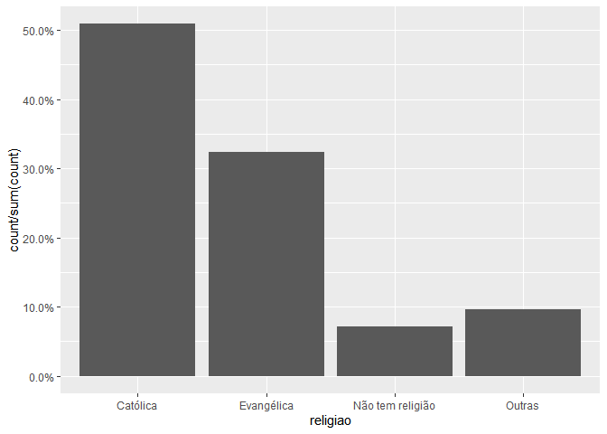
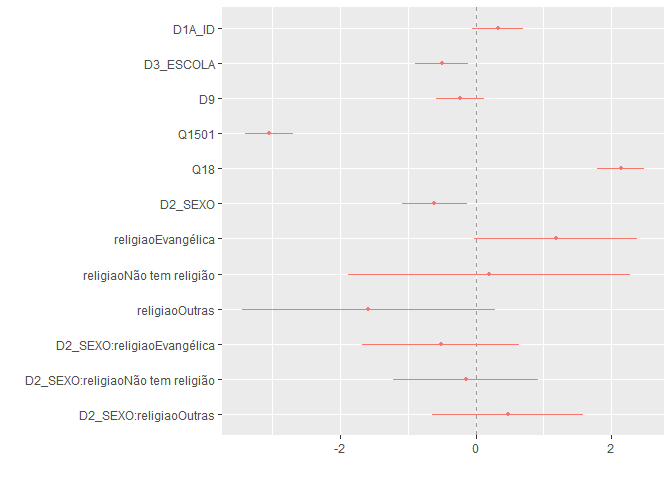
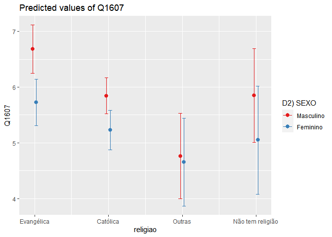

Exercício 9
================
Renato Victor Lira Brito

``` r
setwd("C:\\Users\\Renato\\Desktop\\Mestrado - 2020.1\\SEMESTRE I\\Análise de Dados\\EXERCÍCIOS R\\EXERCICIO 9")
```

### Continuaremos com a utilização dos dados do ESEB2018. Carregue o banco da mesma forma que nos exercicios anteriores

``` r
library(tidyverse)
library(haven)
library(scales)

link <- "https://github.com/MartinsRodrigo/Analise-de-dados/blob/master/04622.sav?raw=true"

download.file(link, "04622.sav", mode = "wb")

banco <- read_spss("04622.sav") 

banco <- banco %>%
  mutate(D10 = as_factor(D10)) %>%
  filter(Q1607 < 11, 
         Q18 < 11,
         D9 < 9999998,
         Q1501 < 11)

banco$Q1607 <- as.numeric(banco$Q1607)

glimpse(banco)
```

    ## Rows: 1,462
    ## Columns: 286
    ## $ A1_Nquest           <dbl> 1, 2, 3, 4, 5, 6, 9, 10, 11, 12, 13, 14, 15, 16...
    ## $ DIAENTR             <dbl> 15, 15, 15, 16, 16, 16, 17, 17, 17, 17, 18, 18,...
    ## $ MESENTR             <dbl+lbl> 11, 11, 11, 11, 11, 11, 11, 11, 11, 11, 11,...
    ## $ ANOENTR             <dbl> 2018, 2018, 2018, 2018, 2018, 2018, 2018, 2018,...
    ## $ D1A_ID              <dbl> 41, 23, 21, 39, 64, 45, 25, 31, 23, 45, 55, 25,...
    ## $ D1A_FAIXAID         <dbl+lbl> 4, 2, 2, 4, 6, 5, 3, 3, 2, 5, 6, 3, 6, 2, 3...
    ## $ D2_SEXO             <dbl+lbl> 2, 1, 2, 1, 1, 2, 2, 1, 1, 1, 2, 2, 1, 2, 1...
    ## $ D3_ESCOLA           <dbl+lbl> 5, 5, 6, 3, 0, 0, 8, 6, 2, 2, 1, 2, 6, 2, 4...
    ## $ RAMOATIV            <dbl+lbl>  6,  4, 10,  3,  1,  7,  4,  7, 10, 10, 10,...
    ## $ RAMOCHEFEF          <dbl+lbl> 99, 99, 99, 99, 99, 99, 99, 99, 99, 99, 99,...
    ## $ OCUPA               <dbl+lbl> 2, 1, 4, 3, 3, 1, 1, 1, 4, 4, 4, 4, 3, 3, 2...
    ## $ UF                  <dbl+lbl> 12, 12, 12, 12, 12, 12, 12, 12, 12, 12, 12,...
    ## $ CID                 <dbl+lbl> 1, 1, 1, 1, 1, 1, 1, 1, 1, 1, 1, 1, 2, 2, 2...
    ## $ REG                 <dbl+lbl> 1, 1, 1, 1, 1, 1, 1, 1, 1, 1, 1, 1, 1, 1, 1...
    ## $ Q1                  <dbl+lbl> 4, 4, 4, 4, 1, 4, 4, 2, 3, 3, 3, 4, 3, 2, 3...
    ## $ Q2                  <dbl+lbl> 3, 3, 4, 3, 4, 3, 4, 2, 3, 3, 4, 4, 3, 2, 1...
    ## $ Q3                  <dbl+lbl> 2, 3, 3, 2, 1, 2, 4, 1, 5, 2, 3, 5, 1, 3, 2...
    ## $ Q401                <dbl+lbl> 3, 2, 5, 1, 4, 2, 2, 3, 4, 1, 2, 1, 1, 1, 2...
    ## $ Q402                <dbl+lbl> 1, 1, 3, 1, 1, 1, 1, 1, 1, 1, 1, 2, 1, 1, 1...
    ## $ Q403                <dbl+lbl> 5, 1, 5, 3, 5, 3, 1, 5, 4, 5, 2, 5, 5, 5, 5...
    ## $ Q404                <dbl+lbl> 1, 1, 1, 1, 1, 1, 1, 1, 4, 1, 3, 1, 1, 1, 2...
    ## $ Q405                <dbl+lbl> 3, 3, 3, 1, 1, 3, 1, 5, 2, 2, 5, 5, 1, 5, 2...
    ## $ Q406                <dbl+lbl> 1, 1, 3, 1, 4, 1, 2, 1, 1, 1, 2, 1, 4, 1, 1...
    ## $ Q407                <dbl+lbl> 1, 1, 1, 1, 1, 1, 1, 1, 1, 1, 1, 1, 1, 1, 2...
    ## $ Q501                <dbl+lbl> 3, 3, 3, 3, 4, 2, 2, 2, 2, 5, 3, 1, 1, 3, 1...
    ## $ Q502                <dbl+lbl> 1, 4, 2, 2, 2, 4, 1, 1, 5, 5, 2, 3, 5, 3, 4...
    ## $ Q503                <dbl+lbl> 2, 2, 1, 3, 1, 8, 2, 2, 2, 5, 3, 2, 5, 5, 5...
    ## $ Q504                <dbl+lbl> 3, 5, 1, 3, 3, 2, 4, 4, 4, 1, 3, 1, 1, 1, 1...
    ## $ Q505                <dbl+lbl> 3, 3, 3, 3, 4, 5, 5, 4, 5, 4, 3, 1, 1, 2, 2...
    ## $ Q601                <dbl+lbl> 1, 1, 1, 1, 1, 1, 2, 1, 3, 1, 2, 4, 1, 1, 1...
    ## $ Q602                <dbl+lbl> 1, 3, 1, 3, 3, 1, 1, 3, 1, 2, 4, 3, 1, 2, 2...
    ## $ Q603                <dbl+lbl> 1, 3, 1, 1, 1, 1, 1, 2, 2, 3, 3, 4, 1, 1, 1...
    ## $ Q604                <dbl+lbl> 1, 2, 2, 1, 1, 1, 2, 1, 1, 1, 4, 2, 1, 1, 1...
    ## $ Q7                  <dbl+lbl> 1, 1, 1, 1, 1, 1, 1, 1, 1, 1, 2, 3, 4, 1, 1...
    ## $ Q8                  <dbl+lbl> 1, 2, 3, 2, 1, 1, 1, 1, 1, 1, 3, 1, 1, 1, 1...
    ## $ Q9                  <dbl+lbl> 5, 5, 5, 5, 5, 5, 4, 5, 4, 5, 4, 5, 5, 5, 5...
    ## $ Q10A                <dbl+lbl> 5, 5, 5, 1, 1, 5, 5, 5, 5, 5, 5, 5, 5, 5, 1...
    ## $ Q10B                <dbl+lbl> 99, 99, 99, 17, 13, 99, 99, 99, 99, 99, 99,...
    ## $ Q11                 <dbl+lbl> 5, 3, 5, 5, 5, 5, 5, 4, 4, 4, 3, 5, 5, 3, 2...
    ## $ Q12P1_A             <dbl+lbl> 1, 1, 1, 1, 1, 1, 1, 7, 6, 1, 1, 1, 1, 1, 1...
    ## $ Q12P1_B             <dbl+lbl>  9,  9,  9,  9,  9,  9,  9, 99, 99,  9, 60,...
    ## $ Q12P2_A             <dbl+lbl> 1, 1, 1, 1, 1, 1, 1, 4, 6, 1, 1, 1, 1, 1, 1...
    ## $ Q12P2_B             <dbl+lbl>  2,  2,  2,  2,  2,  2,  2, 99, 99,  2,  2,...
    ## $ Q12G_1A             <dbl+lbl> 9950, 1203, 9998, 1203, 1203, 1203, 1203, 9...
    ## $ Q12G_2              <dbl+lbl> 9999, 9999, 9999, 9999, 9999, 9999, 9999, 9...
    ## $ Q12S1               <dbl+lbl> 1206, 1203, 9998, 1206, 1206, 1201, 1206, 9...
    ## $ Q12S2               <dbl+lbl> 9998, 1202, 9998, 1202, 1202, 1206, 1203, 9...
    ## $ Q12CD               <dbl+lbl> 2037, 9950, 9998, 9998, 9998, 2038,  763, 9...
    ## $ Q12CD_recode        <dbl+lbl>   1,   4,   3,   3,   3,   1,   1, 999, 999...
    ## $ Q12AL               <dbl+lbl> 9998, 2084, 9998, 1174, 9998, 1092,  768, 9...
    ## $ Q12AL_recode        <dbl+lbl>   3,   1,   3,   1,   3,   1,   1, 999, 999...
    ## $ Q13A                <dbl+lbl> 1, 5, 1, 1, 1, 1, 1, 1, 1, 1, 1, 1, 1, 3, 1...
    ## $ Q13B                <dbl+lbl>  2, 99,  2,  2,  7, 98, 98,  1,  2,  2, 98,...
    ## $ Q13B_2              <dbl+lbl>  4,  5,  1,  1,  1,  1,  1,  1,  1,  1,  1,...
    ## $ Q13B2A              <dbl+lbl> 99, 99,  2,  2,  1,  2, 60,  1,  2,  2, 98,...
    ## $ Q13G1               <dbl+lbl> 9950, 9999, 1204, 1204, 1203, 1204, 1203, 1...
    ## $ Q13G2               <dbl+lbl> 9999, 9999, 1204, 1204, 1203, 1204, 1203, 1...
    ## $ Q13S                <dbl+lbl> 9950, 9999, 1203, 1201, 1203, 1202, 1201, 1...
    ## $ Q13CD               <dbl+lbl> 9950, 9999, 9998, 1175, 9998, 9998,  770, 9...
    ## $ Q13CD_recode        <dbl+lbl>   4, 999,   3,   2,   3,   3,   1,   3,   3...
    ## $ Q13AL               <dbl+lbl> 9950, 9999, 9998, 9998,  770, 9998, 9998, 9...
    ## $ Q13AL_recode        <dbl+lbl>   4, 999,   3,   3,   3,   3,   3,   3,   3...
    ## $ Q14A                <dbl+lbl> 5, 5, 4, 5, 5, 5, 3, 5, 5, 2, 3, 5, 3, 3, 3...
    ## $ Q14B                <dbl+lbl> 5, 5, 5, 5, 5, 5, 4, 5, 5, 5, 1, 5, 5, 3, 5...
    ## $ Q1501               <dbl+lbl>  1,  0,  0,  0,  0, 10,  2,  0,  0,  0,  0,...
    ## $ Q1502               <dbl+lbl> 96,  5, 96,  0,  5,  5, 96,  4,  0,  0, 96,...
    ## $ Q1503               <dbl+lbl> 96, 96,  2, 96,  8, 96,  5,  2,  0, 96, 96,...
    ## $ Q1504               <dbl+lbl> 96, 96, 96,  0, 96, 96, 96,  2,  0,  5, 96,...
    ## $ Q1505               <dbl+lbl>  1,  0,  3,  0, 10, 10,  8,  5,  6,  0, 96,...
    ## $ Q1506               <dbl+lbl> 98, 96, 96,  0, 96,  5,  5,  8,  0,  4, 96,...
    ## $ Q1507               <dbl+lbl> 96, 96, 96,  0, 96, 96, 96,  6,  0, 96, 96,...
    ## $ Q1508               <dbl+lbl>  1,  0, 96,  0,  7, 96,  8,  8,  4,  4, 96,...
    ## $ Q1509               <dbl+lbl> 96,  0, 96,  0, 96, 96, 96, 96,  0, 96, 96,...
    ## $ Q1510               <dbl+lbl> 96, 96, 96, 96, 96, 96, 96, 96,  0, 96, 96,...
    ## $ Q1511               <dbl+lbl>  1, 96, 96,  0, 10, 96,  3, 96,  5, 96, 96,...
    ## $ Q1512               <dbl+lbl> 96,  9,  2, 10, 96,  5,  7,  8,  5,  9, 96,...
    ## $ Q1513               <dbl+lbl>  1, 96, 96,  0, 96, 96, 96,  1,  0, 96, 96,...
    ## $ Q1514               <dbl+lbl> 96, 96,  3,  0,  8, 96,  4,  0,  0,  4, 96,...
    ## $ Q1515               <dbl+lbl> 96, 96, 96,  0, 96, 96, 96,  0,  0,  0, 96,...
    ## $ Q1516               <dbl+lbl> 96, 96, 96, 96, 96, 96, 96,  8,  0, 96, 96,...
    ## $ Q1517               <dbl+lbl> 96, 96,  2,  0, 96, 96,  5, 96,  6, 96, 96,...
    ## $ Q1518               <dbl+lbl>  1, 96, 96,  0, 96,  5,  5,  5,  0,  5, 96,...
    ## $ Q1519               <dbl+lbl> 96, 96, 96, 96, 96, 96,  5,  2,  0, 96, 96,...
    ## $ Q1520               <dbl+lbl> 96, 96, 96, 96,  5,  5,  7,  5,  4, 96, 96,...
    ## $ Q1521               <dbl+lbl> 96, 96, 96,  0,  8, 96,  4,  8,  0, 96, 96,...
    ## $ Q1522               <dbl+lbl> 96, 96, 96,  0, 96, 96,  6,  5,  0, 96, 96,...
    ## $ Q1523               <dbl+lbl> 96, 96, 96, 96,  4, 96,  4,  2,  0,  0, 96,...
    ## $ Q1524               <dbl+lbl> 96, 96, 96,  0, 96, 96, 96,  1,  0, 96, 96,...
    ## $ Q1525               <dbl+lbl> 96, 96, 96,  0, 10, 96, 96, 96,  0, 96, 96,...
    ## $ Q1526               <dbl+lbl> 96, 96, 96, 96, 96, 96, 96,  2,  5, 96, 96,...
    ## $ Q1601               <dbl+lbl>  1,  0,  0,  0, 96,  5,  1,  8,  0,  0,  5,...
    ## $ Q1602               <dbl+lbl>  0,  0, 96, 96, 96, 96, 96,  0,  0,  0, 96,...
    ## $ Q1603               <dbl+lbl>  1,  0, 96,  0, 96, 96, 96,  0,  0,  0, 96,...
    ## $ Q1604               <dbl+lbl>  0,  3,  3,  0, 10,  5,  5,  8,  0,  0,  3,...
    ## $ Q1605               <dbl+lbl> 0, 0, 2, 0, 8, 5, 5, 0, 0, 0, 0, 0, 5, 1, 0...
    ## $ Q1606               <dbl+lbl>  1,  0,  0,  0, 96, 96,  7,  0,  7,  3, 96,...
    ## $ Q1607               <dbl> 10, 10, 3, 10, 10, 10, 8, 10, 10, 10, 10, 10, 5...
    ## $ Q1608               <dbl+lbl>  1,  0,  0,  0, 10, 96,  2,  5,  8,  0,  5,...
    ## $ Q1609               <dbl+lbl>  1,  0, 96, 96, 96, 96, 96,  0,  7,  4, 96,...
    ## $ Q1610               <dbl+lbl>  1,  0,  1,  0, 10,  5,  0,  0,  0,  5,  0,...
    ## $ Q1611               <dbl+lbl>  1,  0, 96,  0, 96, 96,  3,  0,  6,  8, 96,...
    ## $ Q1612               <dbl+lbl>  1,  0, 96,  0, 96, 96, 96,  2, 96,  7, 96,...
    ## $ Q1613               <dbl+lbl>  1,  3, 96,  6, 96, 96, 96,  0,  0,  2,  5,...
    ## $ Q1614               <dbl+lbl>  1,  0, 96,  0, 96, 96, 96, 96,  0,  0, 96,...
    ## $ Q1615               <dbl+lbl>  1, 96, 96, 96, 96, 96, 96, 96, 96,  5,  2,...
    ## $ Q1616               <dbl+lbl>  1,  0,  1,  0, 96, 96, 96, 96, 96,  0, 96,...
    ## $ Q1617               <dbl+lbl>  1,  0,  1,  0,  8, 96,  3,  8,  0,  0,  5,...
    ## $ Q1618               <dbl+lbl>  0,  0,  0,  0,  0,  5,  0,  0,  0,  0,  0,...
    ## $ Q1619               <dbl+lbl>  1,  0, 96,  0, 96, 96, 96, 96, 96,  0, 96,...
    ## $ Q1620               <dbl+lbl>  1,  0, 96,  0, 96, 96,  3,  0,  0,  0, 96,...
    ## $ Q1621               <dbl+lbl> 1, 0, 0, 0, 8, 0, 1, 0, 0, 0, 0, 0, 0, 0, 0...
    ## $ Q1701               <dbl+lbl>  0,  0,  0,  0,  0,  5,  2, 10,  1,  0,  0,...
    ## $ Q1702               <dbl+lbl>  0,  0, 96, 96,  5,  0,  8,  8, 96,  0, 96,...
    ## $ Q1703               <dbl+lbl>  1,  0,  0,  0,  5,  0, 10,  7,  3,  0, 96,...
    ## $ Q1704               <dbl+lbl>  0, 96, 96,  0, 96,  0,  5, 96,  6, 96, 96,...
    ## $ Q1705               <dbl+lbl>  0,  0, 10,  4,  5,  5,  8,  7,  7,  0, 96,...
    ## $ Q1706               <dbl+lbl>  2, 96, 96,  0, 96,  0,  4,  5,  6, 96, 96,...
    ## $ Q1707               <dbl+lbl>  2,  0, 96, 96, 96,  0,  3,  5, 96, 96, 96,...
    ## $ Q1708               <dbl+lbl>  2,  0, 96,  0,  4,  0,  1,  1,  5,  0, 96,...
    ## $ Q1709               <dbl+lbl>  3,  0, 96, 96, 96,  0,  2, 96,  6, 96, 96,...
    ## $ Q1710               <dbl+lbl>  0, 96, 96,  0,  5,  0,  6, 96, 96, 96, 96,...
    ## $ Q1711               <dbl+lbl>  2,  0, 96,  0, 10,  0,  6,  6,  7, 96, 96,...
    ## $ Q1712               <dbl+lbl>  4,  8,  0, 10,  5,  5,  3,  3,  5, 10, 96,...
    ## $ Q1713               <dbl+lbl>  2,  0, 96,  1, 96,  0,  5, 96, 96, 96, 96,...
    ## $ Q1714               <dbl+lbl>  2,  0,  0,  1,  5,  5, 10, 10,  3,  0, 96,...
    ## $ Q1715               <dbl+lbl> 96, 96, 96, 96, 96,  0,  3, 96, 96,  0, 96,...
    ## $ Q1716               <dbl+lbl>  2,  0, 96,  0,  4,  0,  4,  8, 96, 96, 96,...
    ## $ Q1717               <dbl+lbl>  2,  0,  0,  3,  4,  5,  6,  6,  6, 96, 96,...
    ## $ Q1718               <dbl+lbl>  2,  0, 96,  0,  4,  0,  3,  5, 96, 10,  0,...
    ## $ Q1719               <dbl+lbl>  2,  0, 96,  0, 96,  0,  7,  7, 96, 10, 96,...
    ## $ Q1720               <dbl+lbl>  2,  0, 10,  0,  5,  0,  8,  8,  4,  0, 96,...
    ## $ Q1721               <dbl+lbl>  2,  0, 96,  0,  0,  0,  2, 96,  4, 96, 96,...
    ## $ Q1722               <dbl+lbl>  2,  0, 96, 96,  0,  0,  1,  3, 96, 96, 96,...
    ## $ Q1723               <dbl+lbl>  2,  0, 96,  6,  8,  0,  7,  3, 96,  0, 96,...
    ## $ Q1724               <dbl+lbl>  0,  0,  0, 96, 96,  0,  5, 96, 96, 96, 96,...
    ## $ Q1725               <dbl+lbl>  2, 96, 96, 96, 96,  0,  7, 96, 96, 96, 96,...
    ## $ Q1726               <dbl+lbl>  1,  0, 96,  0, 96,  0,  4, 96,  4, 96, 96,...
    ## $ Q18                 <dbl+lbl> 10, 10, 10, 10, 10, 10, 10, 10, 10, 10,  7,...
    ## $ Q21                 <dbl+lbl> 5, 4, 5, 4, 5, 5, 4, 5, 2, 4, 4, 4, 5, 4, 4...
    ## $ Q22A                <dbl+lbl> 2, 2, 2, 2, 1, 2, 2, 2, 2, 2, 2, 2, 2, 2, 2...
    ## $ Q22B                <dbl+lbl>  2,  1,  2,  1, 99,  1,  2,  1,  2,  1,  2,...
    ## $ Q22C                <dbl+lbl> 99, 17, 99, 17, 17, 98, 99, 50, 99, 13, 99,...
    ## $ Q22D                <dbl+lbl> 99,  2, 99,  2,  2, 99, 99,  2, 99,  3, 99,...
    ## $ P1                  <dbl+lbl> 1, 1, 1, 1, 1, 2, 1, 1, 1, 1, 1, 1, 2, 1, 2...
    ## $ P1A                 <dbl+lbl>  13,  13,  13,  13,  13, 999,  13,  13,  13...
    ## $ D5_1                <dbl+lbl> 2, 2, 2, 2, 2, 2, 2, 1, 2, 2, 2, 2, 2, 2, 2...
    ## $ D5_2                <dbl+lbl> 2, 2, 2, 2, 2, 2, 2, 1, 2, 2, 2, 2, 2, 2, 2...
    ## $ P201                <dbl+lbl> 2, 2, 2, 2, 1, 2, 2, 2, 2, 2, 2, 2, 2, 2, 2...
    ## $ P202                <dbl+lbl> 2, 2, 2, 2, 1, 2, 2, 2, 2, 2, 2, 2, 2, 2, 2...
    ## $ P203                <dbl+lbl> 2, 2, 2, 2, 1, 2, 2, 2, 2, 2, 2, 2, 2, 2, 2...
    ## $ P204                <dbl+lbl> 2, 2, 2, 2, 2, 2, 2, 1, 2, 2, 2, 2, 2, 2, 2...
    ## $ P205                <dbl+lbl> 2, 2, 1, 2, 2, 2, 2, 2, 2, 2, 2, 2, 2, 2, 2...
    ## $ P206                <dbl+lbl> 1, 2, 1, 2, 1, 1, 2, 1, 1, 2, 2, 2, 2, 1, 2...
    ## $ P207                <dbl+lbl> 2, 2, 2, 2, 1, 2, 2, 2, 2, 1, 2, 2, 1, 2, 2...
    ## $ P208                <dbl+lbl> 2, 2, 2, 2, 2, 2, 2, 1, 2, 2, 2, 2, 2, 2, 2...
    ## $ P209                <dbl+lbl> 2, 2, 2, 2, 2, 2, 2, 2, 2, 2, 2, 2, 1, 2, 2...
    ## $ P210                <dbl+lbl> 2, 2, 2, 2, 2, 2, 2, 2, 2, 2, 2, 2, 2, 2, 2...
    ## $ P211                <dbl+lbl> 2, 2, 2, 2, 2, 2, 2, 2, 2, 2, 2, 2, 2, 2, 2...
    ## $ P212                <dbl+lbl> 2, 2, 2, 2, 2, 2, 2, 1, 2, 2, 2, 2, 2, 2, 2...
    ## $ P213                <dbl+lbl> 2, 2, 2, 2, 2, 2, 2, 2, 2, 2, 2, 2, 2, 2, 2...
    ## $ P214                <dbl+lbl> 2, 2, 2, 2, 1, 2, 2, 2, 2, 1, 2, 2, 2, 2, 2...
    ## $ P215                <dbl+lbl> 2, 2, 2, 2, 2, 2, 2, 2, 2, 2, 2, 2, 2, 2, 2...
    ## $ P216                <dbl+lbl> 2, 2, 2, 2, 2, 2, 2, 2, 2, 2, 2, 2, 2, 2, 2...
    ## $ P217                <dbl+lbl> 2, 2, 1, 2, 1, 2, 2, 2, 2, 1, 2, 2, 2, 2, 2...
    ## $ P301                <dbl+lbl> 5, 2, 1, 2, 2, 1, 2, 2, 2, 5, 2, 2, 6, 1, 2...
    ## $ P302                <dbl+lbl> 1, 2, 1, 2, 2, 2, 2, 2, 2, 4, 2, 1, 1, 4, 2...
    ## $ P303                <dbl+lbl> 1, 2, 2, 2, 2, 1, 1, 2, 1, 2, 2, 2, 6, 2, 2...
    ## $ P304                <dbl+lbl> 6, 2, 6, 6, 6, 6, 2, 6, 2, 5, 3, 6, 6, 3, 2...
    ## $ P305                <dbl+lbl> 6, 1, 6, 6, 2, 6, 1, 6, 2, 4, 2, 6, 6, 2, 2...
    ## $ P306                <dbl+lbl> 5, 2, 2, 6, 2, 2, 5, 2, 1, 4, 2, 5, 2, 4, 2...
    ## $ P307                <dbl+lbl> 5, 6, 2, 6, 5, 6, 6, 5, 5, 6, 5, 6, 6, 5, 2...
    ## $ P308                <dbl+lbl> 6, 5, 5, 6, 6, 6, 6, 6, 5, 6, 5, 6, 6, 2, 4...
    ## $ P309                <dbl+lbl> 1, 2, 2, 2, 2, 1, 2, 6, 2, 3, 2, 2, 6, 1, 2...
    ## $ P310                <dbl+lbl> 6, 2, 6, 6, 2, 6, 5, 6, 5, 2, 3, 2, 6, 2, 3...
    ## $ P311                <dbl+lbl> 5, 6, 6, 6, 2, 1, 6, 6, 6, 6, 3, 6, 6, 6, 3...
    ## $ P312                <dbl+lbl> 1, 2, 2, 6, 2, 1, 5, 2, 2, 2, 2, 1, 6, 4, 2...
    ## $ P401                <dbl+lbl> 3, 1, 1, 4, 1, 1, 3, 3, 2, 4, 3, 3, 3, 1, 1...
    ## $ P402                <dbl+lbl> 1, 3, 1, 4, 1, 3, 3, 3, 2, 3, 2, 1, 3, 2, 1...
    ## $ P403                <dbl+lbl> 1, 1, 4, 1, 1, 1, 2, 4, 1, 2, 2, 1, 3, 2, 1...
    ## $ P404                <dbl+lbl> 3, 1, 3, 4, 3, 4, 3, 4, 2, 4, 4, 3, 3, 2, 3...
    ## $ P405                <dbl+lbl> 4, 3, 3, 4, 1, 4, 3, 4, 2, 3, 2, 3, 3, 2, 2...
    ## $ P406                <dbl+lbl> 3, 3, 3, 4, 1, 1, 3, 4, 2, 3, 2, 3, 3, 3, 2...
    ## $ P407                <dbl+lbl> 4, 3, 4, 4, 3, 4, 4, 4, 3, 4, 4, 3, 3, 3, 3...
    ## $ P408                <dbl+lbl> 4, 3, 4, 4, 3, 4, 4, 4, 2, 4, 4, 3, 3, 2, 3...
    ## $ P409                <dbl+lbl> 1, 1, 3, 1, 1, 1, 2, 4, 2, 2, 3, 1, 3, 1, 2...
    ## $ P410                <dbl+lbl> 3, 3, 3, 4, 1, 4, 3, 4, 2, 2, 3, 3, 3, 2, 3...
    ## $ P411                <dbl+lbl> 3, 4, 4, 4, 1, 4, 4, 4, 4, 4, 3, 3, 3, 4, 3...
    ## $ P412                <dbl+lbl> 1, 3, 3, 4, 1, 4, 4, 3, 2, 3, 2, 3, 3, 3, 2...
    ## $ P5                  <dbl+lbl> 2, 2, 2, 2, 1, 1, 2, 2, 1, 2, 2, 2, 2, 1, 2...
    ## $ P601                <dbl+lbl> 0, 0, 0, 0, 0, 0, 1, 0, 4, 0, 0, 5, 0, 4, 0...
    ## $ P602                <dbl+lbl> 3, 0, 0, 0, 0, 0, 0, 0, 3, 4, 0, 5, 0, 2, 0...
    ## $ P603                <dbl+lbl> 0, 0, 0, 0, 0, 5, 4, 0, 4, 1, 0, 5, 0, 2, 0...
    ## $ P604                <dbl+lbl>  0,  0,  0,  0,  0, 10,  5,  0,  3,  2,  0,...
    ## $ P605                <dbl+lbl>  2,  0,  0,  0,  0, 10,  2,  0,  5,  2,  0,...
    ## $ P606                <dbl+lbl>  0,  0,  0,  0, 10,  0,  2,  0,  2,  0,  0,...
    ## $ P607                <dbl+lbl>  1,  3,  2,  0, 10, 10,  3,  8,  5,  7,  0,...
    ## $ P608                <dbl+lbl>  1,  3,  1,  0, 10, 10,  3,  8,  5,  5,  0,...
    ## $ P609                <dbl+lbl>  1,  5,  5,  0,  0,  5,  0,  5,  8,  4,  0,...
    ## $ P610                <dbl+lbl>  0, 10,  0,  0,  0,  0,  4,  0,  3,  0,  0,...
    ## $ P611                <dbl+lbl>  0,  0,  0,  0, 98,  0,  5,  0,  6,  3,  0,...
    ## $ P612                <dbl+lbl>  3,  0,  0,  0, 99,  0,  2,  5,  5,  5,  0,...
    ## $ P613                <dbl+lbl>  2,  0,  0,  0, 10, 10,  0,  0,  8,  4,  0,...
    ## $ P614                <dbl+lbl> 2, 0, 0, 0, 0, 5, 0, 0, 6, 2, 0, 5, 0, 5, 0...
    ## $ P615                <dbl+lbl>  0,  0,  0,  0,  0, 10,  0,  0,  5,  1,  0,...
    ## $ P616                <dbl+lbl> 3, 0, 5, 0, 0, 0, 2, 0, 8, 0, 0, 5, 0, 1, 0...
    ## $ P7_aberta_agregada  <dbl+lbl>  70, 998,  50,  72, 998, 998, 998,  21,   6...
    ## $ P8                  <dbl+lbl> 8, 2, 2, 1, 2, 1, 3, 1, 1, 2, 8, 8, 8, 2, 1...
    ## $ P9                  <dbl+lbl> 2, 1, 2, 1, 8, 2, 1, 1, 1, 2, 8, 8, 8, 2, 2...
    ## $ P1001               <dbl+lbl> 1, 1, 2, 1, 5, 1, 1, 1, 5, 1, 2, 1, 1, 1, 4...
    ## $ P1002               <dbl+lbl> 1, 2, 4, 1, 1, 1, 1, 2, 5, 1, 2, 1, 1, 5, 5...
    ## $ P1003               <dbl+lbl> 1, 4, 1, 2, 3, 1, 2, 2, 1, 4, 4, 2, 2, 3, 4...
    ## $ P1004               <dbl+lbl> 1, 1, 4, 5, 1, 1, 1, 1, 1, 1, 5, 2, 1, 4, 1...
    ## $ P1101               <dbl+lbl> 1, 1, 2, 1, 1, 1, 2, 4, 1, 1, 2, 5, 1, 1, 1...
    ## $ P1102               <dbl+lbl> 1, 1, 1, 1, 1, 1, 2, 1, 5, 1, 2, 1, 1, 1, 5...
    ## $ P1103               <dbl+lbl> 1, 1, 4, 1, 5, 1, 4, 2, 4, 1, 3, 8, 1, 1, 2...
    ## $ P1104               <dbl+lbl> 1, 1, 5, 1, 1, 1, 1, 1, 2, 1, 2, 5, 1, 2, 1...
    ## $ P1105               <dbl+lbl> 1, 1, 5, 1, 5, 1, 1, 1, 5, 1, 4, 5, 5, 5, 4...
    ## $ P12                 <dbl+lbl> 1, 1, 1, 1, 1, 1, 1, 1, 1, 1, 1, 1, 1, 1, 1...
    ## $ P13_aberta_agregada <dbl+lbl>  20,  11,  10,  10,  10,  10, 998,  30,  18...
    ## $ P14A                <dbl+lbl>  2, 99,  1, 99,  3, 99,  2, 99,  2, 99,  5,...
    ## $ P14B                <dbl+lbl> 99,  2, 99,  1, 99,  2, 99,  2, 99,  1, 99,...
    ## $ P15                 <dbl+lbl> 2, 1, 1, 2, 8, 2, 2, 2, 1, 2, 8, 1, 2, 2, 2...
    ## $ P1601               <dbl+lbl> 10, 10,  7,  9, 10, 10,  5,  5, 10,  9,  1,...
    ## $ P1602               <dbl+lbl>  2,  1,  3,  1, 10,  5,  2,  2,  8,  5,  1,...
    ## $ P1603               <dbl+lbl> 10,  1,  4,  1, 10,  5,  2,  6,  9,  9,  1,...
    ## $ P1604               <dbl+lbl> 10,  1,  2,  1, 10, 10,  5,  3,  8,  5,  1,...
    ## $ P1605               <dbl+lbl>  2, 10,  3,  1, 10,  5,  3,  3, 10,  5, 98,...
    ## $ P1606               <dbl+lbl>  2, 10,  5,  1, 10,  5,  5,  4,  9,  7, 98,...
    ## $ P1607               <dbl+lbl>  2, 10,  6,  1, 10, 10,  2,  4,  9,  5, 98,...
    ## $ P1608               <dbl+lbl>  2,  1,  2,  1, 10, 10,  1,  6,  7,  1, 98,...
    ## $ P1609               <dbl+lbl> 10, 10,  4,  1, 10,  5,  2,  6,  8,  5,  1,...
    ## $ P1610               <dbl+lbl> 10, 10,  5,  1, 10, 10,  3,  5,  9,  5, 98,...
    ## $ P1611               <dbl+lbl> 10,  1,  6,  1, 10,  5,  6,  6,  5,  1,  1,...
    ## $ P1701               <dbl+lbl> 5, 5, 5, 5, 3, 4, 5, 1, 1, 5, 5, 5, 5, 5, 5...
    ## $ P1702               <dbl+lbl> 1, 1, 1, 1, 3, 3, 1, 1, 1, 1, 1, 5, 1, 3, 1...
    ## $ P1703               <dbl+lbl> 1, 5, 1, 5, 3, 4, 5, 5, 2, 5, 5, 5, 4, 5, 5...
    ## $ P1704               <dbl+lbl> 5, 1, 5, 1, 3, 1, 1, 1, 4, 1, 2, 2, 1, 2, 2...
    ## $ P1705               <dbl+lbl> 1, 2, 1, 1, 3, 1, 2, 3, 2, 5, 4, 5, 5, 1, 2...
    ## $ P1706               <dbl+lbl> 1, 1, 2, 1, 1, 1, 1, 1, 1, 1, 1, 1, 5, 2, 1...
    ## $ P1707               <dbl+lbl> 5, 2, 4, 5, 3, 2, 2, 4, 4, 5, 4, 1, 1, 3, 2...
    ## $ P1708               <dbl+lbl> 1, 4, 1, 1, 3, 2, 2, 4, 4, 3, 2, 5, 5, 3, 4...
    ## $ P1709               <dbl+lbl> 5, 5, 4, 5, 3, 2, 4, 4, 5, 4, 3, 5, 5, 4, 5...
    ## $ P1710               <dbl+lbl> 5, 2, 4, 5, 1, 4, 2, 5, 2, 1, 5, 1, 5, 2, 4...
    ## $ P1711               <dbl+lbl> 1, 1, 1, 1, 3, 4, 1, 1, 2, 1, 2, 1, 5, 2, 2...
    ## $ P1712               <dbl+lbl> 1, 4, 1, 1, 3, 2, 2, 1, 2, 1, 2, 2, 5, 2, 2...
    ## $ P1713               <dbl+lbl> 5, 2, 2, 5, 3, 2, 1, 1, 5, 1, 5, 2, 1, 5, 5...
    ## $ P18                 <dbl+lbl> 5, 2, 2, 5, 8, 4, 2, 5, 1, 5, 8, 1, 5, 2, 5...
    ## $ P19                 <dbl+lbl> 1, 1, 1, 1, 1, 1, 1, 3, 1, 1, 5, 5, 3, 1, 3...
    ## $ P20                 <dbl+lbl> 1, 1, 1, 1, 1, 1, 2, 1, 1, 1, 2, 1, 1, 1, 1...
    ## $ P2101               <dbl+lbl> 5, 1, 5, 5, 1, 2, 4, 5, 5, 5, 2, 5, 5, 5, 5...
    ## $ P2102               <dbl+lbl> 5, 4, 5, 5, 3, 5, 5, 5, 5, 5, 1, 5, 1, 5, 5...
    ## $ P2103               <dbl+lbl> 5, 5, 5, 5, 3, 2, 5, 5, 5, 5, 4, 5, 5, 5, 5...
    ## $ P2104               <dbl+lbl> 5, 2, 5, 5, 1, 2, 5, 5, 5, 5, 5, 5, 5, 5, 5...
    ## $ P2105               <dbl+lbl> 5, 5, 5, 5, 1, 2, 1, 5, 5, 5, 4, 5, 5, 5, 5...
    ## $ P2106               <dbl+lbl> 1, 1, 2, 1, 5, 2, 2, 1, 4, 1, 2, 1, 1, 1, 5...
    ## $ P22                 <dbl+lbl> 4, 4, 4, 4, 1, 4, 4, 4, 4, 4, 4, 4, 3, 4, 4...
    ## $ P24                 <dbl+lbl> 1, 2, 2, 1, 1, 2, 2, 2, 1, 2, 2, 2, 2, 3, 1...
    ## $ P25                 <dbl+lbl> 10,  1,  4,  1,  5,  2,  2,  1,  2,  1, 10,...
    ## $ P26                 <dbl+lbl> 999,   1,   1,   3,   3,   7,   1,   1,   1...
    ## $ P27                 <dbl+lbl>  2, 12,  2,  2,  2,  4,  4,  7,  1, 97, 97,...
    ## $ P28                 <dbl+lbl> 2, 2, 1, 2, 1, 2, 2, 2, 2, 1, 2, 1, 2, 2, 2...
    ## $ P28A                <dbl+lbl> 3, 2, 4, 4, 2, 4, 4, 4, 4, 5, 4, 4, 3, 3, 5...
    ## $ P28B                <dbl+lbl> 999, 999,   2, 999,   4, 999, 999, 999, 999...
    ## $ P29                 <dbl+lbl> 2, 2, 1, 1, 2, 2, 1, 2, 1, 2, 2, 2, 2, 2, 2...
    ## $ P30                 <dbl+lbl> 2, 1, 1, 2, 1, 1, 2, 1, 1, 1, 1, 2, 2, 1, 2...
    ## $ D4                  <dbl+lbl> 1, 2, 3, 2, 3, 2, 2, 3, 3, 3, 3, 2, 3, 3, 1...
    ## $ D7                  <dbl+lbl>  3, 10, 11,  3, 16,  1,  3,  1, 16, 16, 10,...
    ## $ D8                  <dbl+lbl>    5, 9999, 9999,    5, 9999,    2,    5,  ...
    ## $ D8A                 <dbl+lbl>   3, 999, 999,   3, 999,   3,   3,   2, 999...
    ## $ D6                  <dbl+lbl>   1, 999, 999,   1, 999,   2,   1,   1, 999...
    ## $ D9                  <dbl+lbl>  5000, 12000, 40000,  1500,   954,   954,  ...
    ## $ D9A                 <dbl+lbl> 999, 999, 999, 999, 999, 999, 999, 999, 999...
    ## $ D9B_FAIXA_RENDAF    <dbl+lbl> 4, 5, 7, 2, 1, 1, 3, 3, 2, 1, 1, 1, 2, 3, 3...
    ## $ D11                 <dbl+lbl> 3, 4, 2, 4, 3, 3, 5, 2, 2, 6, 4, 2, 5, 1, 3...
    ## $ D10                 <fct> "Evangélica", "Católica", "Católica", "Católica...
    ## $ D10A                <dbl+lbl>  100, 9999, 9999, 9999,    1, 9999,    1,  ...
    ## $ D12                 <dbl+lbl> 1, 2, 8, 5, 5, 9, 8, 8, 8, 7, 8, 8, 8, 7, 7...
    ## $ D12A                <dbl+lbl> 2, 2, 2, 2, 8, 1, 2, 2, 2, 1, 2, 2, 2, 1, 2...
    ## $ D14                 <dbl+lbl>  1,  1,  1,  1,  1,  1,  1,  1,  1,  1,  1,...
    ## $ D15                 <dbl+lbl> 2, 2, 2, 2, 2, 2, 2, 2, 2, 2, 2, 2, 2, 2, 2...
    ## $ D16                 <dbl+lbl> 7, 1, 8, 1, 1, 3, 1, 3, 1, 1, 7, 1, 1, 1, 1...
    ## $ D20                 <dbl+lbl> 3, 3, 2, 5, 3, 3, 4, 3, 8, 1, 4, 2, 4, 3, 4...
    ## $ DIAANIVER           <dbl> 5, 3, 11, 3, 17, 5, 25, 3, 15, 24, 7, 14, 19, 1...
    ## $ MESANIVER           <dbl+lbl> 12,  3, 12, 11,  3,  2, 10, 12,  2,  2,  9,...
    ## $ ANOANIVER           <dbl> 1977, 1995, 1997, 1979, 1954, 1973, 1993, 1987,...
    ## $ A3                  <dbl+lbl> 1, 1, 1, 1, 1, 1, 1, 1, 1, 1, 1, 1, 1, 1, 1...

``` r
str(banco)
```

    ## tibble [1,462 x 286] (S3: tbl_df/tbl/data.frame)
    ##  $ A1_Nquest          : num [1:1462] 1 2 3 4 5 6 9 10 11 12 ...
    ##   ..- attr(*, "label")= chr "Número questionário"
    ##   ..- attr(*, "format.spss")= chr "F4.0"
    ##   ..- attr(*, "display_width")= int 9
    ##  $ DIAENTR            : num [1:1462] 15 15 15 16 16 16 17 17 17 17 ...
    ##   ..- attr(*, "label")= chr "DATA ENTREVISTA - DIA"
    ##   ..- attr(*, "format.spss")= chr "F8.0"
    ##   ..- attr(*, "display_width")= int 3
    ##  $ MESENTR            : dbl+lbl [1:1462] 11, 11, 11, 11, 11, 11, 11, 11, 11, 11, 11, 11, 11, 1...
    ##    ..@ label        : chr "DATA ENTREVISTA - MES"
    ##    ..@ format.spss  : chr "F8.0"
    ##    ..@ display_width: int 3
    ##    ..@ labels       : Named num 11
    ##    .. ..- attr(*, "names")= chr "Novembro"
    ##  $ ANOENTR            : num [1:1462] 2018 2018 2018 2018 2018 ...
    ##   ..- attr(*, "label")= chr "DATA ENTREVISTA - ANO"
    ##   ..- attr(*, "format.spss")= chr "F8.0"
    ##   ..- attr(*, "display_width")= int 3
    ##  $ D1A_ID             : num [1:1462] 41 23 21 39 64 45 25 31 23 45 ...
    ##   ..- attr(*, "label")= chr "D1A) IDADE"
    ##   ..- attr(*, "format.spss")= chr "F8.0"
    ##   ..- attr(*, "display_width")= int 5
    ##  $ D1A_FAIXAID        : dbl+lbl [1:1462] 4, 2, 2, 4, 6, 5, 3, 3, 2, 5, 6, 3, 6, 2, 3, 4, 4, 5,...
    ##    ..@ label      : chr "D1A) FAIXA IDADE"
    ##    ..@ format.spss: chr "F8.0"
    ##    ..@ labels     : Named num [1:7] 1 2 3 4 5 6 7
    ##    .. ..- attr(*, "names")= chr [1:7] "16 E 17" "18 A 24" "25 A 34" "35 A 44" ...
    ##  $ D2_SEXO            : dbl+lbl [1:1462] 2, 1, 2, 1, 1, 2, 2, 1, 1, 1, 2, 2, 1, 2, 1, 2, 1, 1,...
    ##    ..@ label        : chr "D2) SEXO"
    ##    ..@ format.spss  : chr "F8.0"
    ##    ..@ display_width: int 13
    ##    ..@ labels       : Named num [1:2] 1 2
    ##    .. ..- attr(*, "names")= chr [1:2] "Masculino" "Feminino"
    ##  $ D3_ESCOLA          : dbl+lbl [1:1462] 5, 5, 6, 3, 0, 0, 8, 6, 2, 2, 1, 2, 6, 2, 4, 8, 8, 6,...
    ##    ..@ label        : chr "D3) ESCOLARIDADE"
    ##    ..@ format.spss  : chr "F8.0"
    ##    ..@ display_width: int 13
    ##    ..@ labels       : Named num [1:10] 0 1 2 3 4 5 6 7 8 9
    ##    .. ..- attr(*, "names")= chr [1:10] "Analfabeto/ Nunca frequentou escola" "Primário incompleto (até 3ª série ou 4º ano do ensino f" "Primário completo (4ª.série  ou 5º ano do ensino fundame" "Ginásio incompleto (até 7ª série ou 8º ano do ensino fu" ...
    ##  $ RAMOATIV           : dbl+lbl [1:1462]  6,  4, 10,  3,  1,  7,  4,  7, 10, 10, 10, 10,  3,  ...
    ##    ..@ label        : chr "RAMO DE ATIVIDADE"
    ##    ..@ format.spss  : chr "F8.0"
    ##    ..@ display_width: int 13
    ##    ..@ labels       : Named num [1:11] 1 2 3 4 5 6 7 8 9 10 ...
    ##    .. ..- attr(*, "names")= chr [1:11] "Agricultura" "Ind. Transformação" "Construção/ Outras" "Comércio" ...
    ##  $ RAMOCHEFEF         : dbl+lbl [1:1462] 99, 99, 99, 99, 99, 99, 99, 99, 99, 99, 99, 99, 99, 9...
    ##    ..@ label        : chr "RAMO DE ATIVIDADE CHEFE DE FAMILIA"
    ##    ..@ format.spss  : chr "F8.0"
    ##    ..@ display_width: int 13
    ##    ..@ labels       : Named num [1:12] 1 2 3 4 5 6 7 8 9 10 ...
    ##    .. ..- attr(*, "names")= chr [1:12] "Agricultura" "Ind. Transformação" "Construção/ Outras" "Comércio" ...
    ##  $ OCUPA              : dbl+lbl [1:1462] 2, 1, 4, 3, 3, 1, 1, 1, 4, 4, 4, 4, 3, 3, 2, 4, 4, 3,...
    ##    ..@ label        : chr "OCUPAÇÃO"
    ##    ..@ format.spss  : chr "F8.0"
    ##    ..@ display_width: int 13
    ##    ..@ labels       : Named num [1:4] 1 2 3 4
    ##    .. ..- attr(*, "names")= chr [1:4] "Empregado" "Patrão" "Conta própria" "Não aplicável"
    ##  $ UF                 : dbl+lbl [1:1462] 12, 12, 12, 12, 12, 12, 12, 12, 12, 12, 12, 12, 13, 1...
    ##    ..@ label        : chr "ESTADO"
    ##    ..@ format.spss  : chr "F8.0"
    ##    ..@ display_width: int 11
    ##    ..@ labels       : Named num [1:27] 11 12 13 14 15 16 17 21 22 23 ...
    ##    .. ..- attr(*, "names")= chr [1:27] "Rondônia" "Acre" "Amazonas" "Roraima" ...
    ##  $ CID                : dbl+lbl [1:1462] 1, 1, 1, 1, 1, 1, 1, 1, 1, 1, 1, 1, 2, 2, 2, 2, 2, 2,...
    ##    ..@ label        : chr "CIDADE"
    ##    ..@ format.spss  : chr "F8.0"
    ##    ..@ display_width: int 13
    ##    ..@ labels       : Named num [1:172] 1 2 3 4 5 6 7 8 9 10 ...
    ##    .. ..- attr(*, "names")= chr [1:172] "Rio Branco" "Manaus" "Parintins" "Macapá" ...
    ##  $ REG                : dbl+lbl [1:1462] 1, 1, 1, 1, 1, 1, 1, 1, 1, 1, 1, 1, 1, 1, 1, 1, 1, 1,...
    ##    ..@ label        : chr "REGIÃO"
    ##    ..@ format.spss  : chr "F8.0"
    ##    ..@ display_width: int 9
    ##    ..@ labels       : Named num [1:5] 1 2 3 4 5
    ##    .. ..- attr(*, "names")= chr [1:5] "Norte" "Nordeste" "Sudeste" "Sul" ...
    ##  $ Q1                 : dbl+lbl [1:1462] 4, 4, 4, 4, 1, 4, 4, 2, 3, 3, 3, 4, 3, 2, 3, 2, 2, 4,...
    ##    ..@ label        : chr "Q1. Quanto o(a) sr(a) se interessa por política? O(a) sr(a) diria que é:"
    ##    ..@ format.spss  : chr "F8.0"
    ##    ..@ display_width: int 13
    ##    ..@ labels       : Named num [1:7] 1 2 3 4 7 8 9
    ##    .. ..- attr(*, "names")= chr [1:7] "Muito interessado(a)" "Interessado(a)" "Pouco interessado(a)" "Nada interessado(a)" ...
    ##  $ Q2                 : dbl+lbl [1:1462] 3, 3, 4, 3, 4, 3, 4, 2, 3, 3, 4, 4, 3, 2, 1, 2, 3, 4,...
    ##    ..@ label        : chr "Q2. E com qual intensidade o(a) sr(a) acompanha política na TV, no rádio, nos jornais ou na internet: Muita int"| __truncated__
    ##    ..@ format.spss  : chr "F8.0"
    ##    ..@ display_width: int 13
    ##    ..@ labels       : Named num [1:7] 1 2 3 4 7 8 9
    ##    .. ..- attr(*, "names")= chr [1:7] "Muita intensidade" "Alguma intensidade" "Pouca intensidade" "Não acompanho" ...
    ##  $ Q3                 : dbl+lbl [1:1462] 2, 3, 3, 2, 1, 2, 4, 1, 5, 2, 3, 5, 1, 3, 2, 3, 2, 5,...
    ##    ..@ label        : chr "Q3. O quanto o(a) sr(a) concorda com a seguinte afirmação: “Você entende sobre os problemas políticos mais impo"| __truncated__
    ##    ..@ format.spss  : chr "F8.0"
    ##    ..@ display_width: int 13
    ##    ..@ labels       : Named num [1:8] 1 2 3 4 5 7 8 9
    ##    .. ..- attr(*, "names")= chr [1:8] "Concorda totalmente" "Concorda em parte" "Nem concorda nem discorda" "Discorda em parte" ...
    ##  $ Q401               : dbl+lbl [1:1462] 3, 2, 5, 1, 4, 2, 2, 3, 4, 1, 2, 1, 1, 1, 2, 1, 1, 1,...
    ##    ..@ label        : chr "Q4A. Destas frases, gostaria que o(a) sr(a) dissesse se concorda ou discorda: O que as pessoas chamam de compro"| __truncated__
    ##    ..@ format.spss  : chr "F8.0"
    ##    ..@ display_width: int 13
    ##    ..@ labels       : Named num [1:7] 1 2 3 4 5 7 8
    ##    .. ..- attr(*, "names")= chr [1:7] "Concorda muito" "Concorda um pouco" "Nem concorda nem discorda" "Discorda um pouco" ...
    ##  $ Q402               : dbl+lbl [1:1462] 1, 1, 3, 1, 1, 1, 1, 1, 1, 1, 1, 2, 1, 1, 1, 1, 1, 1,...
    ##    ..@ label        : chr "Q4B. Destas frases, gostaria que o(a) sr(a) dissesse se concorda ou discorda: A maior parte dos políticos não s"| __truncated__
    ##    ..@ format.spss  : chr "F8.0"
    ##    ..@ display_width: int 13
    ##    ..@ labels       : Named num [1:7] 1 2 3 4 5 7 8
    ##    .. ..- attr(*, "names")= chr [1:7] "Concorda muito" "Concorda um pouco" "Nem concorda nem discorda" "Discorda um pouco" ...
    ##  $ Q403               : dbl+lbl [1:1462] 5, 1, 5, 3, 5, 3, 1, 5, 4, 5, 2, 5, 5, 5, 5, 5, 5, 5,...
    ##    ..@ label        : chr "Q4C. Destas frases, gostaria que o(a) sr(a) dissesse se concorda ou discorda: A maior parte dos políticos é confiável."
    ##    ..@ format.spss  : chr "F8.0"
    ##    ..@ display_width: int 13
    ##    ..@ labels       : Named num [1:7] 1 2 3 4 5 7 8
    ##    .. ..- attr(*, "names")= chr [1:7] "Concorda muito" "Concorda um pouco" "Nem concorda nem discorda" "Discorda um pouco" ...
    ##  $ Q404               : dbl+lbl [1:1462] 1, 1, 1, 1, 1, 1, 1, 1, 4, 1, 3, 1, 1, 1, 2, 1, 1, 1,...
    ##    ..@ label        : chr "Q4D. Destas frases, gostaria que o(a) sr(a) dissesse se concorda ou discorda: Os políticos são o principal problema do Brasil"
    ##    ..@ format.spss  : chr "F8.0"
    ##    ..@ display_width: int 13
    ##    ..@ labels       : Named num [1:7] 1 2 3 4 5 7 8
    ##    .. ..- attr(*, "names")= chr [1:7] "Concorda muito" "Concorda um pouco" "Nem concorda nem discorda" "Discorda um pouco" ...
    ##  $ Q405               : dbl+lbl [1:1462] 3, 3, 3, 1, 1, 3, 1, 5, 2, 2, 5, 5, 1, 5, 2, 5, 2, 1,...
    ##    ..@ label        : chr "Q4E. Destas frases, gostaria que o(a) sr(a) dissesse se concorda ou discorda: Ter um líder forte no governo é b"| __truncated__
    ##    ..@ format.spss  : chr "F8.0"
    ##    ..@ display_width: int 13
    ##    ..@ labels       : Named num [1:7] 1 2 3 4 5 7 8
    ##    .. ..- attr(*, "names")= chr [1:7] "Concorda muito" "Concorda um pouco" "Nem concorda nem discorda" "Discorda um pouco" ...
    ##  $ Q406               : dbl+lbl [1:1462] 1, 1, 3, 1, 4, 1, 2, 1, 1, 1, 2, 1, 4, 1, 1, 1, 1, 1,...
    ##    ..@ label        : chr "Q4F. Destas frases, gostaria que o(a) sr(a) dissesse se concorda ou discorda: O povo, e não os políticos, dever"| __truncated__
    ##    ..@ format.spss  : chr "F8.0"
    ##    ..@ display_width: int 13
    ##    ..@ labels       : Named num [1:7] 1 2 3 4 5 7 8
    ##    .. ..- attr(*, "names")= chr [1:7] "Concorda muito" "Concorda um pouco" "Nem concorda nem discorda" "Discorda um pouco" ...
    ##  $ Q407               : dbl+lbl [1:1462] 1, 1, 1, 1, 1, 1, 1, 1, 1, 1, 1, 1, 1, 1, 2, 1, 1, 1,...
    ##    ..@ label        : chr "Q4G. Destas frases, gostaria que o(a) sr(a) dissesse se concorda ou discorda: A maior parte dos políticos se pr"| __truncated__
    ##    ..@ format.spss  : chr "F8.0"
    ##    ..@ display_width: int 13
    ##    ..@ labels       : Named num [1:7] 1 2 3 4 5 7 8
    ##    .. ..- attr(*, "names")= chr [1:7] "Concorda muito" "Concorda um pouco" "Nem concorda nem discorda" "Discorda um pouco" ...
    ##  $ Q501               : dbl+lbl [1:1462] 3, 3, 3, 3, 4, 2, 2, 2, 2, 5, 3, 1, 1, 3, 1, 1, 5, 1,...
    ##    ..@ label        : chr "Q5A. Pensando sobre as minorias no Brasil, vou ler algumas frases e gostaria que o(a) sr(a) dissesse se concord"| __truncated__
    ##    ..@ format.spss  : chr "F8.0"
    ##    ..@ display_width: int 13
    ##    ..@ labels       : Named num [1:7] 1 2 3 4 5 7 8
    ##    .. ..- attr(*, "names")= chr [1:7] "Concorda muito" "Concorda um pouco" "Nem concorda nem discorda" "Discorda um pouco" ...
    ##  $ Q502               : dbl+lbl [1:1462] 1, 4, 2, 2, 2, 4, 1, 1, 5, 5, 2, 3, 5, 3, 4, 3, 5, 5,...
    ##    ..@ label        : chr "Q5B. Pensando sobre as minorias no Brasil, vou ler algumas frases e gostaria que o(a) sr(a) dissesse se concord"| __truncated__
    ##    ..@ format.spss  : chr "F8.0"
    ##    ..@ display_width: int 13
    ##    ..@ labels       : Named num [1:7] 1 2 3 4 5 7 8
    ##    .. ..- attr(*, "names")= chr [1:7] "Concorda muito" "Concorda um pouco" "Nem concorda nem discorda" "Discorda um pouco" ...
    ##  $ Q503               : dbl+lbl [1:1462] 2, 2, 1, 3, 1, 8, 2, 2, 2, 5, 3, 2, 5, 5, 5, 3, 5, 5,...
    ##    ..@ label        : chr "Q5C. Pensando sobre as minorias no Brasil, vou ler algumas frases e gostaria que o(a) sr(a) dissesse se concord"| __truncated__
    ##    ..@ format.spss  : chr "F8.0"
    ##    ..@ display_width: int 13
    ##    ..@ labels       : Named num [1:7] 1 2 3 4 5 7 8
    ##    .. ..- attr(*, "names")= chr [1:7] "Concorda muito" "Concorda um pouco" "Nem concorda nem discorda" "Discorda um pouco" ...
    ##  $ Q504               : dbl+lbl [1:1462] 3, 5, 1, 3, 3, 2, 4, 4, 4, 1, 3, 1, 1, 1, 1, 1, 1, 1,...
    ##    ..@ label        : chr "Q5D. Pensando sobre as minorias no Brasil, vou ler algumas frases e gostaria que o(a) sr(a) dissesse se concord"| __truncated__
    ##    ..@ format.spss  : chr "F8.0"
    ##    ..@ display_width: int 13
    ##    ..@ labels       : Named num [1:7] 1 2 3 4 5 7 8
    ##    .. ..- attr(*, "names")= chr [1:7] "Concorda muito" "Concorda um pouco" "Nem concorda nem discorda" "Discorda um pouco" ...
    ##  $ Q505               : dbl+lbl [1:1462] 3, 3, 3, 3, 4, 5, 5, 4, 5, 4, 3, 1, 1, 2, 2, 1, 1, 1,...
    ##    ..@ label        : chr "Q5E. Pensando sobre as minorias no Brasil, vou ler algumas frases e gostaria que o(a) sr(a) dissesse se concord"| __truncated__
    ##    ..@ format.spss  : chr "F8.0"
    ##    ..@ display_width: int 13
    ##    ..@ labels       : Named num [1:7] 1 2 3 4 5 7 8
    ##    .. ..- attr(*, "names")= chr [1:7] "Concorda muito" "Concorda um pouco" "Nem concorda nem discorda" "Discorda um pouco" ...
    ##  $ Q601               : dbl+lbl [1:1462] 1, 1, 1, 1, 1, 1, 2, 1, 3, 1, 2, 4, 1, 1, 1, 1, 1, 1,...
    ##    ..@ label        : chr "Q6A. O quanto você acha que é importante ter nascido no Brasil para ser considerado verdadeiramente brasileiro?"
    ##    ..@ format.spss  : chr "F8.0"
    ##    ..@ display_width: int 13
    ##    ..@ labels       : Named num [1:7] 1 2 3 4 7 8 99
    ##    .. ..- attr(*, "names")= chr [1:7] "Muito importante" "Mais ou menos importante" "Pouco importante" "Nada importante" ...
    ##  $ Q602               : dbl+lbl [1:1462] 1, 3, 1, 3, 3, 1, 1, 3, 1, 2, 4, 3, 1, 2, 2, 1, 1, 1,...
    ##    ..@ label        : chr "Q6B. O quanto você acha que é importante ter antepassados brasileiros para ser considerado verdadeiramente brasileiro?"
    ##    ..@ format.spss  : chr "F8.0"
    ##    ..@ display_width: int 13
    ##    ..@ labels       : Named num [1:7] 1 2 3 4 7 8 99
    ##    .. ..- attr(*, "names")= chr [1:7] "Muito importante" "Mais ou menos importante" "Pouco importante" "Nada importante" ...
    ##  $ Q603               : dbl+lbl [1:1462] 1, 3, 1, 1, 1, 1, 1, 2, 2, 3, 3, 4, 1, 1, 1, 1, 1, 1,...
    ##    ..@ label        : chr "Q6C. O quanto você acha que é importante ser capaz de falar a língua portuguesa para ser considerado verdadeira"| __truncated__
    ##    ..@ format.spss  : chr "F8.0"
    ##    ..@ display_width: int 13
    ##    ..@ labels       : Named num [1:7] 1 2 3 4 7 8 99
    ##    .. ..- attr(*, "names")= chr [1:7] "Muito importante" "Mais ou menos importante" "Pouco importante" "Nada importante" ...
    ##  $ Q604               : dbl+lbl [1:1462] 1, 2, 2, 1, 1, 1, 2, 1, 1, 1, 4, 2, 1, 1, 1, 1, 1, 1,...
    ##    ..@ label        : chr "Q6D. O quanto você acha que é importante seguir os costumes e tradições do Brasil para ser considerado verdadei"| __truncated__
    ##    ..@ format.spss  : chr "F8.0"
    ##    ..@ display_width: int 13
    ##    ..@ labels       : Named num [1:7] 1 2 3 4 7 8 99
    ##    .. ..- attr(*, "names")= chr [1:7] "Muito importante" "Mais ou menos importante" "Pouco importante" "Nada importante" ...
    ##  $ Q7                 : dbl+lbl [1:1462] 1, 1, 1, 1, 1, 1, 1, 1, 1, 1, 2, 3, 4, 1, 1, 1, 1, 4,...
    ##    ..@ label        : chr "Q7.  O quanto você acha que a corrupção está generalizada no Brasil, como por exemplo, as propinas entre políticos?"
    ##    ..@ format.spss  : chr "F8.0"
    ##    ..@ display_width: int 13
    ##    ..@ labels       : Named num [1:7] 1 2 3 4 7 8 9
    ##    .. ..- attr(*, "names")= chr [1:7] "Muito generalizada" "Bem generalizada" "Pouco generalizada" "Dificilmente acontece" ...
    ##  $ Q8                 : dbl+lbl [1:1462] 1, 2, 3, 2, 1, 1, 1, 1, 1, 1, 3, 1, 1, 1, 1, 1, 1, 4,...
    ##    ..@ label        : chr "Q8. O quanto o(a) sr(a) concorda com a seguinte afirmação “O governo deveria tomar medidas para reduzir as dife"| __truncated__
    ##    ..@ format.spss  : chr "F8.0"
    ##    ..@ display_width: int 13
    ##    ..@ labels       : Named num [1:8] 1 2 3 4 5 7 8 9
    ##    .. ..- attr(*, "names")= chr [1:8] "Concorda totalmente" "Concorda em parte" "Nem concorda nem discorda" "Discorda em parte" ...
    ##  $ Q9                 : dbl+lbl [1:1462] 5, 5, 5, 5, 5, 5, 4, 5, 4, 5, 4, 5, 5, 5, 5, 5, 5, 5,...
    ##    ..@ label        : chr "Q9. Na sua opinião, de uma maneira geral o Governo do Presidente Michel Temer nos últimos 2 anos foi ótimo, bom"| __truncated__
    ##    ..@ format.spss  : chr "F8.0"
    ##    ..@ display_width: int 13
    ##    ..@ labels       : Named num [1:8] 1 2 3 4 5 7 8 9
    ##    .. ..- attr(*, "names")= chr [1:8] "Ótimo" "Bom" "Regular (Esp.)" "Ruim" ...
    ##  $ Q10A               : dbl+lbl [1:1462] 5, 5, 5, 1, 1, 5, 5, 5, 5, 5, 5, 5, 5, 5, 1, 5, 5, 5,...
    ##    ..@ label      : chr "Q10A. Existe algum partido político que representa a maneira como o(a) sr(a) pensa? (Espontânea)"
    ##    ..@ format.spss: chr "F8.0"
    ##    ..@ labels     : Named num [1:5] 1 5 7 8 9
    ##    .. ..- attr(*, "names")= chr [1:5] "Sim" "Não" "Não respondeu" "Não sabe" ...
    ##  $ Q10B               : dbl+lbl [1:1462] 99, 99, 99, 17, 13, 99, 99, 99, 99, 99, 99, 99, 99, 9...
    ##    ..@ label      : chr "Q10B. Qual partido melhor representa a maneira como o(a) sr(a) pensa? (Espontânea)"
    ##    ..@ format.spss: chr "F8.0"
    ##    ..@ labels     : Named num [1:38] 10 11 12 13 14 15 16 17 18 19 ...
    ##    .. ..- attr(*, "names")= chr [1:38] "PRB" "PP" "PDT" "PT" ...
    ##  $ Q11                : dbl+lbl [1:1462] 5, 3, 5, 5, 5, 5, 5, 4, 4, 4, 3, 5, 5, 3, 2, 3, 5, 5,...
    ##    ..@ label      : chr "Q11. O(A) sr(a) considera que a situação econômica atual do país está muito melhor, um pouco melhor, está igual"| __truncated__
    ##    ..@ format.spss: chr "F8.0"
    ##    ..@ labels     : Named num [1:8] 1 2 3 4 5 7 8 9
    ##    .. ..- attr(*, "names")= chr [1:8] "Muito melhor" "Um pouco melhor" "Igual" "Um pouco pior" ...
    ##  $ Q12P1_A            : dbl+lbl [1:1462] 1, 1, 1, 1, 1, 1, 1, 7, 6, 1, 1, 1, 1, 1, 1, 1, 1, 1,...
    ##    ..@ label      : chr "Q12P1.A. O(a) sr(a) votou no primeiro turno nesta eleição? (Espontânea)"
    ##    ..@ format.spss: chr "F8.0"
    ##    ..@ labels     : Named num [1:9] 1 2 3 4 5 6 7 98 99
    ##    .. ..- attr(*, "names")= chr [1:9] "Sim, votou" "Não, é maior de 70 anos" "Não, tem/ tinha 16 ou 17 anos" "Não, mas justificou o voto no primeiro turno" ...
    ##  $ Q12P1_B            : dbl+lbl [1:1462]  9,  9,  9,  9,  9,  9,  9, 99, 99,  9, 60,  9, 60,  ...
    ##    ..@ label        : chr "Q12P1.B. Em quem o(a) sr(a) votou para presidente no primeiro turno?"
    ##    ..@ format.spss  : chr "F8.0"
    ##    ..@ display_width: int 13
    ##    ..@ labels       : Named num [1:18] 1 2 3 4 5 6 7 8 9 10 ...
    ##    .. ..- attr(*, "names")= chr [1:18] "Alvaro Dias" "Cabo Daciolo" "Ciro Gomes" "Eymael" ...
    ##  $ Q12P2_A            : dbl+lbl [1:1462] 1, 1, 1, 1, 1, 1, 1, 4, 6, 1, 1, 1, 1, 1, 1, 1, 1, 1,...
    ##    ..@ label      : chr "Q12P2.A. O(A) sr(a) votou no segundo turno desta eleição? (Espontânea)"
    ##    ..@ format.spss: chr "F8.0"
    ##    ..@ labels     : Named num [1:9] 1 2 3 4 5 6 7 98 99
    ##    .. ..- attr(*, "names")= chr [1:9] "Sim, votou" "Não, é maior de 70 anos" "Não, tem/ tinha 16 ou 17 anos" "Não, mas justificou o voto no segundo turno" ...
    ##  $ Q12P2_B            : dbl+lbl [1:1462]  2,  2,  2,  2,  2,  2,  2, 99, 99,  2,  2,  2, 60,  ...
    ##    ..@ label        : chr "Q12P2.B. Em quem o(a) sr(a) votou para presidente no segundo turno?"
    ##    ..@ format.spss  : chr "F8.0"
    ##    ..@ display_width: int 13
    ##    ..@ labels       : Named num [1:7] 1 2 50 60 97 98 99
    ##    .. ..- attr(*, "names")= chr [1:7] "Fernando Haddad (PT)" "Jair Bolsonaro (PSL)" "Anulou o voto (Esp.)" "Votou em branco (Esp.)" ...
    ##  $ Q12G_1A            : dbl+lbl [1:1462] 9950, 1203, 9998, 1203, 1203, 1203, 1203, 9999, 9999,...
    ##    ..@ label        : chr "Q12G_1A. Em quem o(a) sr(a) votou para governador no primeiro turno nessa eleição?"
    ##    ..@ format.spss  : chr "F8.0"
    ##    ..@ display_width: int 13
    ##    ..@ labels       : Named num [1:204] 1101 1102 1103 1104 1105 ...
    ##    .. ..- attr(*, "names")= chr [1:204] "Acir Gurgacz" "Comendador Valclei Queiroz" "Coronel Charlon" "Expedito Junior" ...
    ##  $ Q12G_2             : dbl+lbl [1:1462] 9999, 9999, 9999, 9999, 9999, 9999, 9999, 9999, 9999,...
    ##    ..@ label        : chr "Q12G.2. E no segundo turno, em quem o(a) sr(a) votou para governador nessa eleição?"
    ##    ..@ format.spss  : chr "F8.0"
    ##    ..@ display_width: int 13
    ##    ..@ labels       : Named num [1:204] 1101 1102 1103 1104 1105 ...
    ##    .. ..- attr(*, "names")= chr [1:204] "Acir Gurgacz" "Comendador Valclei Queiroz" "Coronel Charlon" "Expedito Junior" ...
    ##  $ Q12S1              : dbl+lbl [1:1462] 1206, 1203, 9998, 1206, 1206, 1201, 1206, 9999, 9999,...
    ##    ..@ label        : chr "Q12S1. Neste ano, foram eleitos dois senadores por estado. Em quem o(a) sr(a) votou para a primeira vaga de Sen"| __truncated__
    ##    ..@ format.spss  : chr "F8.0"
    ##    ..@ display_width: int 13
    ##    ..@ labels       : Named num [1:345] 1101 1102 1103 1104 1106 ...
    ##    .. ..- attr(*, "names")= chr [1:345] "Aluízio Vidal" "Bosco da Federal" "Carlos Magno" "Confucio Moura" ...
    ##  $ Q12S2              : dbl+lbl [1:1462] 9998, 1202, 9998, 1202, 1202, 1206, 1203, 9999, 9999,...
    ##    ..@ label        : chr "Q12S2. E em quem o(a) sr(a) votou para a segunda vaga de Senador nessa eleição?"
    ##    ..@ format.spss  : chr "F8.0"
    ##    ..@ display_width: int 13
    ##    ..@ labels       : Named num [1:345] 1101 1102 1103 1104 1106 ...
    ##    .. ..- attr(*, "names")= chr [1:345] "Aluízio Vidal" "Bosco da Federal" "Carlos Magno" "Confucio Moura" ...
    ##  $ Q12CD              : dbl+lbl [1:1462] 2037, 9950, 9998, 9998, 9998, 2038,  763, 9999, 9999,...
    ##    ..@ label        : chr "E em quem o(a) sr(a) votou para Deputado Federal? [Espontânea]"
    ##    ..@ format.spss  : chr "F8.0"
    ##    ..@ display_width: int 31
    ##    ..@ labels       : Named num [1:480] 13 15 17 30 45 50 113 128 134 135 ...
    ##    .. ..- attr(*, "names")= chr [1:480] "PT LEGENDA" "PMDB - MDB LEGENDA" "PSL LEGENDA" "PARTIDO NOVO LEGENDA" ...
    ##  $ Q12CD_recode       : dbl+lbl [1:1462]   1,   4,   3,   3,   3,   1,   1, 999, 999,   1,   1...
    ##    ..@ label        : chr "Q12CD_recode_2018 Dep Federal > Em quem votou? (Espontânea)"
    ##    ..@ format.spss  : chr "F8.0"
    ##    ..@ display_width: int 31
    ##    ..@ labels       : Named num [1:6] 1 2 3 4 777 999
    ##    .. ..- attr(*, "names")= chr [1:6] "Lembrou - (partido, nome e cargo CORRETOS)" "Lembrou (cargo TROCADO)" "Não sabe / Não lembra" "Nulo / Branco" ...
    ##  $ Q12AL              : dbl+lbl [1:1462] 9998, 2084, 9998, 1174, 9998, 1092,  768, 9999, 9999,...
    ##    ..@ label        : chr "E em quem o(a) sr(a) votou para Deputado Estadual? [Espontânea]"
    ##    ..@ format.spss  : chr "F8.0"
    ##    ..@ display_width: int 7
    ##    ..@ labels       : Named num [1:515] 13 15 17 30 40 45 50 113 116 123 ...
    ##    .. ..- attr(*, "names")= chr [1:515] "PT  LEGENDA" "PMDB - MDB  LEGENDA" "PSL  LEGENDA" "PARTIDO NOVO  LEGENDA" ...
    ##  $ Q12AL_recode       : dbl+lbl [1:1462]   3,   1,   3,   1,   3,   1,   1, 999, 999,   1,   1...
    ##    ..@ label        : chr "Q12AL_recode_2018 Dep Estadual > Em quem votou? (Espontânea)"
    ##    ..@ format.spss  : chr "F8.0"
    ##    ..@ display_width: int 12
    ##    ..@ labels       : Named num [1:6] 1 2 3 4 777 999
    ##    .. ..- attr(*, "names")= chr [1:6] "Lembrou - (partido, nome e cargo CORRETOS)" "Lembrou (cargo TROCADO)" "Não sabe / Não lembra" "Nulo / Branco" ...
    ##  $ Q13A               : dbl+lbl [1:1462] 1, 5, 1, 1, 1, 1, 1, 1, 1, 1, 1, 1, 1, 3, 1, 1, 1, 1,...
    ##    ..@ label        : chr "Q13A. O(A) sr(a) votou no primeiro turno na eleição de 2014?"
    ##    ..@ format.spss  : chr "F8.0"
    ##    ..@ display_width: int 10
    ##    ..@ labels       : Named num [1:9] 1 2 3 4 5 6 7 98 99
    ##    .. ..- attr(*, "names")= chr [1:9] "Sim, votou" "Não, é maior de 70 anos" "Não, tem/ tinha 16 ou 17 anos" "Não, mas justificou o voto no primeiro turno" ...
    ##  $ Q13B               : dbl+lbl [1:1462]  2, 99,  2,  2,  7, 98, 98,  1,  2,  2, 98, 98,  2, 9...
    ##    ..@ label        : chr "Q13B. Em quem o(a) sr(a) votou para presidente no primeiro turno da eleição de 2014?"
    ##    ..@ format.spss  : chr "F8.0"
    ##    ..@ display_width: int 10
    ##    ..@ labels       : Named num [1:16] 1 2 3 4 5 6 7 8 9 10 ...
    ##    .. ..- attr(*, "names")= chr [1:16] "Aécio Neves" "Dilma" "Eymael" "Eduardo Jorge" ...
    ##  $ Q13B_2             : dbl+lbl [1:1462]  4,  5,  1,  1,  1,  1,  1,  1,  1,  1,  1,  1,  1,  ...
    ##    ..@ label        : chr "Q13B_2. O(A) sr(a) votou no segundo turno na eleição para presidente de 2014?"
    ##    ..@ format.spss  : chr "F8.0"
    ##    ..@ display_width: int 10
    ##    ..@ labels       : Named num [1:9] 1 2 3 4 5 6 7 98 99
    ##    .. ..- attr(*, "names")= chr [1:9] "Sim, votou" "Não, é maior de 70 anos" "Não, tem/ tinha 16 ou 17 anos" "Não, mas justificou o voto no segundo turno" ...
    ##  $ Q13B2A             : dbl+lbl [1:1462] 99, 99,  2,  2,  1,  2, 60,  1,  2,  2, 98,  1,  2, 9...
    ##    ..@ label        : chr "Q13B2A. E no segundo turno das eleições de 2014, em quem o(a) sr(a) votou para presidente:"
    ##    ..@ format.spss  : chr "F8.0"
    ##    ..@ display_width: int 10
    ##    ..@ labels       : Named num [1:7] 1 2 50 60 97 98 99
    ##    .. ..- attr(*, "names")= chr [1:7] "Aécio Neves (PSBD)" "Dilma (PT)" "Anulou o voto (Esp.)" "Votou em branco (Esp.)" ...
    ##  $ Q13G1              : dbl+lbl [1:1462] 9950, 9999, 1204, 1204, 1203, 1204, 1203, 1202, 1204,...
    ##    ..@ label        : chr "Q13G1. E para governador, em quem o(a) sr(a) votou no primeiro turno em 2014?"
    ##    ..@ format.spss  : chr "F8.0"
    ##    ..@ display_width: int 13
    ##    ..@ labels       : Named num [1:173] 1101 1102 1103 1104 1105 ...
    ##    .. ..- attr(*, "names")= chr [1:173] "Confucio Moura" "Expedito Júnior" "Jaqueline Cassol" "Padre Ton" ...
    ##  $ Q13G2              : dbl+lbl [1:1462] 9999, 9999, 1204, 1204, 1203, 1204, 1203, 1203, 1204,...
    ##    ..@ label        : chr "Q13G2. E no segundo turno de 2014, em quem o(a) sr(a) votou para governador?"
    ##    ..@ format.spss  : chr "F8.0"
    ##    ..@ display_width: int 13
    ##    ..@ labels       : Named num [1:173] 1101 1102 1103 1104 1105 ...
    ##    .. ..- attr(*, "names")= chr [1:173] "Confucio Moura" "Expedito Júnior" "Jaqueline Cassol" "Padre Ton" ...
    ##  $ Q13S               : dbl+lbl [1:1462] 9950, 9999, 1203, 1201, 1203, 1202, 1201, 1202, 1203,...
    ##    ..@ label        : chr "Q13S. E para senador, em quem o(a) sr(a) votou em 2014?"
    ##    ..@ format.spss  : chr "F8.0"
    ##    ..@ display_width: int 35
    ##    ..@ labels       : Named num [1:101] 1101 1102 1103 1104 1201 ...
    ##    .. ..- attr(*, "names")= chr [1:101] "Acir Gurgacz - RO - PDT" "Aluizio Vidal - RO - PSOL" "Ivone Cassol - RO - PP" "Moreira Mendes - RO - PSD" ...
    ##  $ Q13CD              : dbl+lbl [1:1462] 9950, 9999, 9998, 1175, 9998, 9998,  770, 9998, 9998,...
    ##    ..@ label        : chr "Q13CD E em quem o(a) sr(a) votou para Deputado Federal em 2014? (Espontânea)"
    ##    ..@ format.spss  : chr "F8.0"
    ##    ..@ display_width: int 37
    ##    ..@ labels       : Named num [1:203] 13 15 50 115 159 167 202 214 225 226 ...
    ##    .. ..- attr(*, "names")= chr [1:203] "PT" "PMDB-MDB" "PSOL" "Zé Geraldo - PA - PT" ...
    ##  $ Q13CD_recode       : dbl+lbl [1:1462]   4, 999,   3,   2,   3,   3,   1,   3,   3,   1,   3...
    ##    ..@ label        : chr "Q13CD_recode_2014 Dep Federal  > Em quem votou? (Espontânea)"
    ##    ..@ format.spss  : chr "F8.0"
    ##    ..@ display_width: int 32
    ##    ..@ labels       : Named num [1:6] 1 2 3 4 777 999
    ##    .. ..- attr(*, "names")= chr [1:6] "Lembrou - (partido, nome e cargo CORRETOS)" "Lembrou (cargo TROCADO)" "Não sabe/Não lembra (Esp)" "Anulou/Em branco (Esp)" ...
    ##  $ Q13AL              : dbl+lbl [1:1462] 9950, 9999, 9998, 9998,  770, 9998, 9998, 9998, 9998,...
    ##    ..@ label        : chr "Q13AL. E em quem o(a) sr(a) votou para Deputado Estadual em 2014? (Espontânea)"
    ##    ..@ format.spss  : chr "F8.0"
    ##    ..@ display_width: int 6
    ##    ..@ labels       : Named num [1:245] 13 15 40 50 113 127 193 218 225 226 ...
    ##    .. ..- attr(*, "names")= chr [1:245] "PT" "PMDB - MDB" "PSB - NÃO REGISTRADO TSE" "PSOL" ...
    ##  $ Q13AL_recode       : dbl+lbl [1:1462]   4, 999,   3,   3,   3,   3,   3,   3,   3,   1,   3...
    ##    ..@ label        : chr "Q13AL_recode_2014 Dep Estadual > Em quem votou? (Espontânea)"
    ##    ..@ format.spss  : chr "F8.0"
    ##    ..@ display_width: int 6
    ##    ..@ labels       : Named num [1:6] 1 2 3 4 777 999
    ##    .. ..- attr(*, "names")= chr [1:6] "Lembrou - (partido, nome e cargo CORRETOS)" "Lembrou (cargo TROCADO)" "Não sabe/Não lembra (Esp)" "Anulou/Em branco (Esp)" ...
    ##  $ Q14A               : dbl+lbl [1:1462] 5, 5, 4, 5, 5, 5, 3, 5, 5, 2, 3, 5, 3, 3, 3, 3, 5, 5,...
    ##    ..@ label        : chr "Q14A. Gostaria que o(a) sr(a) desse uma nota de 1 a 5, sendo que 1 significa que “não faz nenhuma diferença que"| __truncated__
    ##    ..@ format.spss  : chr "F8.0"
    ##    ..@ display_width: int 13
    ##    ..@ labels       : Named num [1:8] 1 2 3 4 5 7 8 9
    ##    .. ..- attr(*, "names")= chr [1:8] "(1) Não faz nenhuma diferença quem governa o Brasil" "(2)" "(3)" "(4)" ...
    ##  $ Q14B               : dbl+lbl [1:1462] 5, 5, 5, 5, 5, 5, 4, 5, 5, 5, 1, 5, 5, 3, 5, 3, 5, 5,...
    ##    ..@ label        : chr "Q14B. Gostaria que o(a) sr(a) desse uma nota de 1 a 5, sendo que  1 significa que o nosso voto “não influencia "| __truncated__
    ##    ..@ format.spss  : chr "F8.0"
    ##    ..@ display_width: int 13
    ##    ..@ labels       : Named num [1:8] 1 2 3 4 5 7 8 9
    ##    .. ..- attr(*, "names")= chr [1:8] "(1) Nosso voto não influencia nada no que acontece no Brasi" "(2)" "(3)" "(4)" ...
    ##  $ Q1501              : dbl+lbl [1:1462]  1,  0,  0,  0,  0, 10,  2,  0,  0,  0,  0,  0,  5,  ...
    ##    ..@ label        : chr "Q15.1. Usando uma nota de 0 a 10 para indicar o quanto o(a) sr(a) gosta do partido, sendo que zero significa qu"| __truncated__
    ##    ..@ format.spss  : chr "F8.0"
    ##    ..@ display_width: int 13
    ##    ..@ labels       : Named num [1:15] 0 1 2 3 4 5 6 7 8 9 ...
    ##    .. ..- attr(*, "names")= chr [1:15] "(00) Não gosta de jeito nenhum" "(01)" "(02)" "(03)" ...
    ##  $ Q1502              : dbl+lbl [1:1462] 96,  5, 96,  0,  5,  5, 96,  4,  0,  0, 96, 96, 96,  ...
    ##    ..@ label        : chr "Q15.2. Usando uma nota de 0 a 10 para indicar o quanto o(a) sr(a) gosta do partido, sendo que zero significa qu"| __truncated__
    ##    ..@ format.spss  : chr "F8.0"
    ##    ..@ display_width: int 13
    ##    ..@ labels       : Named num [1:15] 0 1 2 3 4 5 6 7 8 9 ...
    ##    .. ..- attr(*, "names")= chr [1:15] "(00) Não gosta de jeito nenhum" "(01)" "(02)" "(03)" ...
    ##  $ Q1503              : dbl+lbl [1:1462] 96, 96,  2, 96,  8, 96,  5,  2,  0, 96, 96, 96,  5,  ...
    ##    ..@ label        : chr "Q15.3. Usando uma nota de 0 a 10 para indicar o quanto o(a) sr(a) gosta do partido, sendo que zero significa qu"| __truncated__
    ##    ..@ format.spss  : chr "F8.0"
    ##    ..@ display_width: int 13
    ##    ..@ labels       : Named num [1:15] 0 1 2 3 4 5 6 7 8 9 ...
    ##    .. ..- attr(*, "names")= chr [1:15] "(00) Não gosta de jeito nenhum" "(01)" "(02)" "(03)" ...
    ##  $ Q1504              : dbl+lbl [1:1462] 96, 96, 96,  0, 96, 96, 96,  2,  0,  5, 96, 96, 96,  ...
    ##    ..@ label        : chr "Q15.4. Usando uma nota de 0 a 10 para indicar o quanto o(a) sr(a) gosta do partido, sendo que zero significa qu"| __truncated__
    ##    ..@ format.spss  : chr "F8.0"
    ##    ..@ display_width: int 13
    ##    ..@ labels       : Named num [1:15] 0 1 2 3 4 5 6 7 8 9 ...
    ##    .. ..- attr(*, "names")= chr [1:15] "(00) Não gosta de jeito nenhum" "(01)" "(02)" "(03)" ...
    ##  $ Q1505              : dbl+lbl [1:1462]  1,  0,  3,  0, 10, 10,  8,  5,  6,  0, 96,  9,  5,  ...
    ##    ..@ label        : chr "Q15.5. Usando uma nota de 0 a 10 para indicar o quanto o(a) sr(a) gosta do partido, sendo que zero significa qu"| __truncated__
    ##    ..@ format.spss  : chr "F8.0"
    ##    ..@ display_width: int 13
    ##    ..@ labels       : Named num [1:15] 0 1 2 3 4 5 6 7 8 9 ...
    ##    .. ..- attr(*, "names")= chr [1:15] "(00) Não gosta de jeito nenhum" "(01)" "(02)" "(03)" ...
    ##  $ Q1506              : dbl+lbl [1:1462] 98, 96, 96,  0, 96,  5,  5,  8,  0,  4, 96, 96, 96,  ...
    ##    ..@ label        : chr "Q15.6. Usando uma nota de 0 a 10 para indicar o quanto o(a) sr(a) gosta do partido, sendo que zero significa qu"| __truncated__
    ##    ..@ format.spss  : chr "F8.0"
    ##    ..@ display_width: int 13
    ##    ..@ labels       : Named num [1:15] 0 1 2 3 4 5 6 7 8 9 ...
    ##    .. ..- attr(*, "names")= chr [1:15] "(00) Não gosta de jeito nenhum" "(01)" "(02)" "(03)" ...
    ##  $ Q1507              : dbl+lbl [1:1462] 96, 96, 96,  0, 96, 96, 96,  6,  0, 96, 96, 96, 96,  ...
    ##    ..@ label        : chr "Q15.7. Usando uma nota de 0 a 10 para indicar o quanto o(a) sr(a) gosta do partido, sendo que zero significa qu"| __truncated__
    ##    ..@ format.spss  : chr "F8.0"
    ##    ..@ display_width: int 13
    ##    ..@ labels       : Named num [1:15] 0 1 2 3 4 5 6 7 8 9 ...
    ##    .. ..- attr(*, "names")= chr [1:15] "(00) Não gosta de jeito nenhum" "(01)" "(02)" "(03)" ...
    ##  $ Q1508              : dbl+lbl [1:1462]  1,  0, 96,  0,  7, 96,  8,  8,  4,  4, 96,  7,  5,  ...
    ##    ..@ label        : chr "Q15.8. Usando uma nota de 0 a 10 para indicar o quanto o(a) sr(a) gosta do partido, sendo que zero significa qu"| __truncated__
    ##    ..@ format.spss  : chr "F8.0"
    ##    ..@ display_width: int 13
    ##    ..@ labels       : Named num [1:15] 0 1 2 3 4 5 6 7 8 9 ...
    ##    .. ..- attr(*, "names")= chr [1:15] "(00) Não gosta de jeito nenhum" "(01)" "(02)" "(03)" ...
    ##  $ Q1509              : dbl+lbl [1:1462] 96,  0, 96,  0, 96, 96, 96, 96,  0, 96, 96, 96, 96,  ...
    ##    ..@ label        : chr "Q15.9. Usando uma nota de 0 a 10 para indicar o quanto o(a) sr(a) gosta do partido, sendo que zero significa qu"| __truncated__
    ##    ..@ format.spss  : chr "F8.0"
    ##    ..@ display_width: int 13
    ##    ..@ labels       : Named num [1:15] 0 1 2 3 4 5 6 7 8 9 ...
    ##    .. ..- attr(*, "names")= chr [1:15] "(00) Não gosta de jeito nenhum" "(01)" "(02)" "(03)" ...
    ##  $ Q1510              : dbl+lbl [1:1462] 96, 96, 96, 96, 96, 96, 96, 96,  0, 96, 96, 96, 96, 9...
    ##    ..@ label        : chr "Q15.10. Usando uma nota de 0 a 10 para indicar o quanto o(a) sr(a) gosta do partido, sendo que zero significa q"| __truncated__
    ##    ..@ format.spss  : chr "F8.0"
    ##    ..@ display_width: int 13
    ##    ..@ labels       : Named num [1:15] 0 1 2 3 4 5 6 7 8 9 ...
    ##    .. ..- attr(*, "names")= chr [1:15] "(00) Não gosta de jeito nenhum" "(01)" "(02)" "(03)" ...
    ##  $ Q1511              : dbl+lbl [1:1462]  1, 96, 96,  0, 10, 96,  3, 96,  5, 96, 96, 96, 96, 9...
    ##    ..@ label        : chr "Q15.11. Usando uma nota de 0 a 10 para indicar o quanto o(a) sr(a) gosta do partido, sendo que zero significa q"| __truncated__
    ##    ..@ format.spss  : chr "F8.0"
    ##    ..@ display_width: int 13
    ##    ..@ labels       : Named num [1:15] 0 1 2 3 4 5 6 7 8 9 ...
    ##    .. ..- attr(*, "names")= chr [1:15] "(00) Não gosta de jeito nenhum" "(01)" "(02)" "(03)" ...
    ##  $ Q1512              : dbl+lbl [1:1462] 96,  9,  2, 10, 96,  5,  7,  8,  5,  9, 96, 96,  5, 9...
    ##    ..@ label        : chr "Q15.12. Usando uma nota de 0 a 10 para indicar o quanto o(a) sr(a) gosta do partido, sendo que zero significa q"| __truncated__
    ##    ..@ format.spss  : chr "F8.0"
    ##    ..@ display_width: int 13
    ##    ..@ labels       : Named num [1:15] 0 1 2 3 4 5 6 7 8 9 ...
    ##    .. ..- attr(*, "names")= chr [1:15] "(00) Não gosta de jeito nenhum" "(01)" "(02)" "(03)" ...
    ##  $ Q1513              : dbl+lbl [1:1462]  1, 96, 96,  0, 96, 96, 96,  1,  0, 96, 96, 96,  5,  ...
    ##    ..@ label        : chr "Q15.13. Usando uma nota de 0 a 10 para indicar o quanto o(a) sr(a) gosta do partido, sendo que zero significa q"| __truncated__
    ##    ..@ format.spss  : chr "F8.0"
    ##    ..@ display_width: int 13
    ##    ..@ labels       : Named num [1:15] 0 1 2 3 4 5 6 7 8 9 ...
    ##    .. ..- attr(*, "names")= chr [1:15] "(00) Não gosta de jeito nenhum" "(01)" "(02)" "(03)" ...
    ##  $ Q1514              : dbl+lbl [1:1462] 96, 96,  3,  0,  8, 96,  4,  0,  0,  4, 96,  8,  5,  ...
    ##    ..@ label        : chr "Q15.14. Usando uma nota de 0 a 10 para indicar o quanto o(a) sr(a) gosta do partido, sendo que zero significa q"| __truncated__
    ##    ..@ format.spss  : chr "F8.0"
    ##    ..@ display_width: int 13
    ##    ..@ labels       : Named num [1:15] 0 1 2 3 4 5 6 7 8 9 ...
    ##    .. ..- attr(*, "names")= chr [1:15] "(00) Não gosta de jeito nenhum" "(01)" "(02)" "(03)" ...
    ##  $ Q1515              : dbl+lbl [1:1462] 96, 96, 96,  0, 96, 96, 96,  0,  0,  0, 96, 96, 96, 9...
    ##    ..@ label        : chr "Q15.15. Usando uma nota de 0 a 10 para indicar o quanto o(a) sr(a) gosta do partido, sendo que zero significa q"| __truncated__
    ##    ..@ format.spss  : chr "F8.0"
    ##    ..@ display_width: int 13
    ##    ..@ labels       : Named num [1:15] 0 1 2 3 4 5 6 7 8 9 ...
    ##    .. ..- attr(*, "names")= chr [1:15] "(00) Não gosta de jeito nenhum" "(01)" "(02)" "(03)" ...
    ##  $ Q1516              : dbl+lbl [1:1462] 96, 96, 96, 96, 96, 96, 96,  8,  0, 96, 96, 96, 96, 9...
    ##    ..@ label        : chr "Q15.16. Usando uma nota de 0 a 10 para indicar o quanto o(a) sr(a) gosta do partido, sendo que zero significa q"| __truncated__
    ##    ..@ format.spss  : chr "F8.0"
    ##    ..@ display_width: int 13
    ##    ..@ labels       : Named num [1:15] 0 1 2 3 4 5 6 7 8 9 ...
    ##    .. ..- attr(*, "names")= chr [1:15] "(00) Não gosta de jeito nenhum" "(01)" "(02)" "(03)" ...
    ##  $ Q1517              : dbl+lbl [1:1462] 96, 96,  2,  0, 96, 96,  5, 96,  6, 96, 96, 96,  5,  ...
    ##    ..@ label        : chr "Q15.17. Usando uma nota de 0 a 10 para indicar o quanto o(a) sr(a) gosta do partido, sendo que zero significa q"| __truncated__
    ##    ..@ format.spss  : chr "F8.0"
    ##    ..@ display_width: int 13
    ##    ..@ labels       : Named num [1:15] 0 1 2 3 4 5 6 7 8 9 ...
    ##    .. ..- attr(*, "names")= chr [1:15] "(00) Não gosta de jeito nenhum" "(01)" "(02)" "(03)" ...
    ##  $ Q1518              : dbl+lbl [1:1462]  1, 96, 96,  0, 96,  5,  5,  5,  0,  5, 96, 96,  5,  ...
    ##    ..@ label        : chr "Q15.18. Usando uma nota de 0 a 10 para indicar o quanto o(a) sr(a) gosta do partido, sendo que zero significa q"| __truncated__
    ##    ..@ format.spss  : chr "F8.0"
    ##    ..@ display_width: int 13
    ##    ..@ labels       : Named num [1:15] 0 1 2 3 4 5 6 7 8 9 ...
    ##    .. ..- attr(*, "names")= chr [1:15] "(00) Não gosta de jeito nenhum" "(01)" "(02)" "(03)" ...
    ##  $ Q1519              : dbl+lbl [1:1462] 96, 96, 96, 96, 96, 96,  5,  2,  0, 96, 96, 96, 96,  ...
    ##    ..@ label        : chr "Q15.19. Usando uma nota de 0 a 10 para indicar o quanto o(a) sr(a) gosta do partido, sendo que zero significa q"| __truncated__
    ##    ..@ format.spss  : chr "F8.0"
    ##    ..@ display_width: int 13
    ##    ..@ labels       : Named num [1:15] 0 1 2 3 4 5 6 7 8 9 ...
    ##    .. ..- attr(*, "names")= chr [1:15] "(00) Não gosta de jeito nenhum" "(01)" "(02)" "(03)" ...
    ##  $ Q1520              : dbl+lbl [1:1462] 96, 96, 96, 96,  5,  5,  7,  5,  4, 96, 96,  8, 96,  ...
    ##    ..@ label        : chr "Q15.20. Usando uma nota de 0 a 10 para indicar o quanto o(a) sr(a) gosta do partido, sendo que zero significa q"| __truncated__
    ##    ..@ format.spss  : chr "F8.0"
    ##    ..@ display_width: int 13
    ##    ..@ labels       : Named num [1:15] 0 1 2 3 4 5 6 7 8 9 ...
    ##    .. ..- attr(*, "names")= chr [1:15] "(00) Não gosta de jeito nenhum" "(01)" "(02)" "(03)" ...
    ##  $ Q1521              : dbl+lbl [1:1462] 96, 96, 96,  0,  8, 96,  4,  8,  0, 96, 96, 96,  5,  ...
    ##    ..@ label        : chr "Q15.21. Usando uma nota de 0 a 10 para indicar o quanto o(a) sr(a) gosta do partido, sendo que zero significa q"| __truncated__
    ##    ..@ format.spss  : chr "F8.0"
    ##    ..@ display_width: int 13
    ##    ..@ labels       : Named num [1:15] 0 1 2 3 4 5 6 7 8 9 ...
    ##    .. ..- attr(*, "names")= chr [1:15] "(00) Não gosta de jeito nenhum" "(01)" "(02)" "(03)" ...
    ##  $ Q1522              : dbl+lbl [1:1462] 96, 96, 96,  0, 96, 96,  6,  5,  0, 96, 96, 96,  5,  ...
    ##    ..@ label        : chr "Q15.22. Usando uma nota de 0 a 10 para indicar o quanto o(a) sr(a) gosta do partido, sendo que zero significa q"| __truncated__
    ##    ..@ format.spss  : chr "F8.0"
    ##    ..@ display_width: int 13
    ##    ..@ labels       : Named num [1:15] 0 1 2 3 4 5 6 7 8 9 ...
    ##    .. ..- attr(*, "names")= chr [1:15] "(00) Não gosta de jeito nenhum" "(01)" "(02)" "(03)" ...
    ##  $ Q1523              : dbl+lbl [1:1462] 96, 96, 96, 96,  4, 96,  4,  2,  0,  0, 96, 96, 96,  ...
    ##    ..@ label        : chr "Q15.23. Usando uma nota de 0 a 10 para indicar o quanto o(a) sr(a) gosta do partido, sendo que zero significa q"| __truncated__
    ##    ..@ format.spss  : chr "F8.0"
    ##    ..@ display_width: int 13
    ##    ..@ labels       : Named num [1:15] 0 1 2 3 4 5 6 7 8 9 ...
    ##    .. ..- attr(*, "names")= chr [1:15] "(00) Não gosta de jeito nenhum" "(01)" "(02)" "(03)" ...
    ##  $ Q1524              : dbl+lbl [1:1462] 96, 96, 96,  0, 96, 96, 96,  1,  0, 96, 96, 96, 96, 9...
    ##    ..@ label        : chr "Q15.24. Usando uma nota de 0 a 10 para indicar o quanto o(a) sr(a) gosta do partido, sendo que zero significa q"| __truncated__
    ##    ..@ format.spss  : chr "F8.0"
    ##    ..@ display_width: int 13
    ##    ..@ labels       : Named num [1:15] 0 1 2 3 4 5 6 7 8 9 ...
    ##    .. ..- attr(*, "names")= chr [1:15] "(00) Não gosta de jeito nenhum" "(01)" "(02)" "(03)" ...
    ##  $ Q1525              : dbl+lbl [1:1462] 96, 96, 96,  0, 10, 96, 96, 96,  0, 96, 96, 96, 96,  ...
    ##    ..@ label        : chr "Q15.25. Usando uma nota de 0 a 10 para indicar o quanto o(a) sr(a) gosta do partido, sendo que zero significa q"| __truncated__
    ##    ..@ format.spss  : chr "F8.0"
    ##    ..@ display_width: int 13
    ##    ..@ labels       : Named num [1:15] 0 1 2 3 4 5 6 7 8 9 ...
    ##    .. ..- attr(*, "names")= chr [1:15] "(00) Não gosta de jeito nenhum" "(01)" "(02)" "(03)" ...
    ##  $ Q1526              : dbl+lbl [1:1462] 96, 96, 96, 96, 96, 96, 96,  2,  5, 96, 96,  8, 96,  ...
    ##    ..@ label        : chr "Q15.26. Usando uma nota de 0 a 10 para indicar o quanto o(a) sr(a) gosta do partido, sendo que zero significa q"| __truncated__
    ##    ..@ format.spss  : chr "F8.0"
    ##    ..@ display_width: int 13
    ##    ..@ labels       : Named num [1:15] 0 1 2 3 4 5 6 7 8 9 ...
    ##    .. ..- attr(*, "names")= chr [1:15] "(00) Não gosta de jeito nenhum" "(01)" "(02)" "(03)" ...
    ##  $ Q1601              : dbl+lbl [1:1462]  1,  0,  0,  0, 96,  5,  1,  8,  0,  0,  5,  4,  5,  ...
    ##    ..@ label        : chr "Q16.1. Agora usando as mesmas notas, gostaria que o(a) sr(a) dissesse o quanto gosta de alguns políticos que vo"| __truncated__
    ##    ..@ format.spss  : chr "F8.0"
    ##    ..@ display_width: int 13
    ##    ..@ labels       : Named num [1:15] 0 1 2 3 4 5 6 7 8 9 ...
    ##    .. ..- attr(*, "names")= chr [1:15] "(00) Não gosta de jeito nenhum" "(01)" "(02)" "(03)" ...
    ##  $ Q1602              : dbl+lbl [1:1462]  0,  0, 96, 96, 96, 96, 96,  0,  0,  0, 96, 96, 96,  ...
    ##    ..@ label        : chr "Q16.2. Agora usando as mesmas notas, gostaria que o(a) sr(a) dissesse o quanto gosta de alguns políticos que vo"| __truncated__
    ##    ..@ format.spss  : chr "F8.0"
    ##    ..@ display_width: int 13
    ##    ..@ labels       : Named num [1:15] 0 1 2 3 4 5 6 7 8 9 ...
    ##    .. ..- attr(*, "names")= chr [1:15] "(00) Não gosta de jeito nenhum" "(01)" "(02)" "(03)" ...
    ##  $ Q1603              : dbl+lbl [1:1462]  1,  0, 96,  0, 96, 96, 96,  0,  0,  0, 96, 96, 96,  ...
    ##    ..@ label        : chr "Q16.3. Agora usando as mesmas notas, gostaria que o(a) sr(a) dissesse o quanto gosta de alguns políticos que vo"| __truncated__
    ##    ..@ format.spss  : chr "F8.0"
    ##    ..@ display_width: int 13
    ##    ..@ labels       : Named num [1:15] 0 1 2 3 4 5 6 7 8 9 ...
    ##    .. ..- attr(*, "names")= chr [1:15] "(00) Não gosta de jeito nenhum" "(01)" "(02)" "(03)" ...
    ##  $ Q1604              : dbl+lbl [1:1462]  0,  3,  3,  0, 10,  5,  5,  8,  0,  0,  3,  2,  5,  ...
    ##    ..@ label        : chr "Q16.4. Agora usando as mesmas notas, gostaria que o(a) sr(a) dissesse o quanto gosta de alguns políticos que vo"| __truncated__
    ##    ..@ format.spss  : chr "F8.0"
    ##    ..@ display_width: int 13
    ##    ..@ labels       : Named num [1:15] 0 1 2 3 4 5 6 7 8 9 ...
    ##    .. ..- attr(*, "names")= chr [1:15] "(00) Não gosta de jeito nenhum" "(01)" "(02)" "(03)" ...
    ##  $ Q1605              : dbl+lbl [1:1462]  0,  0,  2,  0,  8,  5,  5,  0,  0,  0,  0,  0,  5,  ...
    ##    ..@ label        : chr "Q16.5. Agora usando as mesmas notas, gostaria que o(a) sr(a) dissesse o quanto gosta de alguns políticos que vo"| __truncated__
    ##    ..@ format.spss  : chr "F8.0"
    ##    ..@ display_width: int 13
    ##    ..@ labels       : Named num [1:15] 0 1 2 3 4 5 6 7 8 9 ...
    ##    .. ..- attr(*, "names")= chr [1:15] "(00) Não gosta de jeito nenhum" "(01)" "(02)" "(03)" ...
    ##  $ Q1606              : dbl+lbl [1:1462]  1,  0,  0,  0, 96, 96,  7,  0,  7,  3, 96,  4,  5,  ...
    ##    ..@ label        : chr "Q16.6. Agora usando as mesmas notas, gostaria que o(a) sr(a) dissesse o quanto gosta de alguns políticos que vo"| __truncated__
    ##    ..@ format.spss  : chr "F8.0"
    ##    ..@ display_width: int 13
    ##    ..@ labels       : Named num [1:15] 0 1 2 3 4 5 6 7 8 9 ...
    ##    .. ..- attr(*, "names")= chr [1:15] "(00) Não gosta de jeito nenhum" "(01)" "(02)" "(03)" ...
    ##  $ Q1607              : num [1:1462] 10 10 3 10 10 10 8 10 10 10 ...
    ##  $ Q1608              : dbl+lbl [1:1462]  1,  0,  0,  0, 10, 96,  2,  5,  8,  0,  5,  7,  5,  ...
    ##    ..@ label        : chr "Q16.8. Agora usando as mesmas notas, gostaria que o(a) sr(a) dissesse o quanto gosta de alguns políticos que vo"| __truncated__
    ##    ..@ format.spss  : chr "F8.0"
    ##    ..@ display_width: int 13
    ##    ..@ labels       : Named num [1:15] 0 1 2 3 4 5 6 7 8 9 ...
    ##    .. ..- attr(*, "names")= chr [1:15] "(00) Não gosta de jeito nenhum" "(01)" "(02)" "(03)" ...
    ##  $ Q1609              : dbl+lbl [1:1462]  1,  0, 96, 96, 96, 96, 96,  0,  7,  4, 96, 96,  5, 9...
    ##    ..@ label        : chr "Q16.9. Agora usando as mesmas notas, gostaria que o(a) sr(a) dissesse o quanto gosta de alguns políticos que vo"| __truncated__
    ##    ..@ format.spss  : chr "F8.0"
    ##    ..@ display_width: int 13
    ##    ..@ labels       : Named num [1:15] 0 1 2 3 4 5 6 7 8 9 ...
    ##    .. ..- attr(*, "names")= chr [1:15] "(00) Não gosta de jeito nenhum" "(01)" "(02)" "(03)" ...
    ##   [list output truncated]

``` r
head(banco)
```

    ## # A tibble: 6 x 286
    ##   A1_Nquest DIAENTR  MESENTR ANOENTR D1A_ID D1A_FAIXAID D2_SEXO D3_ESCOLA
    ##       <dbl>   <dbl> <dbl+lb>   <dbl>  <dbl>   <dbl+lbl> <dbl+l> <dbl+lbl>
    ## 1         1      15 11 [Nov~    2018     41 4 [35 A 44] 2 [Fem~ 5 [Coleg~
    ## 2         2      15 11 [Nov~    2018     23 2 [18 A 24] 1 [Mas~ 5 [Coleg~
    ## 3         3      15 11 [Nov~    2018     21 2 [18 A 24] 2 [Fem~ 6 [Coleg~
    ## 4         4      16 11 [Nov~    2018     39 4 [35 A 44] 1 [Mas~ 3 [Ginás~
    ## 5         5      16 11 [Nov~    2018     64 6 [55 A 64] 1 [Mas~ 0 [Analf~
    ## 6         6      16 11 [Nov~    2018     45 5 [45 A 54] 2 [Fem~ 0 [Analf~
    ## # ... with 278 more variables: RAMOATIV <dbl+lbl>, RAMOCHEFEF <dbl+lbl>,
    ## #   OCUPA <dbl+lbl>, UF <dbl+lbl>, CID <dbl+lbl>, REG <dbl+lbl>, Q1 <dbl+lbl>,
    ## #   Q2 <dbl+lbl>, Q3 <dbl+lbl>, Q401 <dbl+lbl>, Q402 <dbl+lbl>, Q403 <dbl+lbl>,
    ## #   Q404 <dbl+lbl>, Q405 <dbl+lbl>, Q406 <dbl+lbl>, Q407 <dbl+lbl>,
    ## #   Q501 <dbl+lbl>, Q502 <dbl+lbl>, Q503 <dbl+lbl>, Q504 <dbl+lbl>,
    ## #   Q505 <dbl+lbl>, Q601 <dbl+lbl>, Q602 <dbl+lbl>, Q603 <dbl+lbl>,
    ## #   Q604 <dbl+lbl>, Q7 <dbl+lbl>, Q8 <dbl+lbl>, Q9 <dbl+lbl>, Q10A <dbl+lbl>,
    ## #   Q10B <dbl+lbl>, Q11 <dbl+lbl>, Q12P1_A <dbl+lbl>, Q12P1_B <dbl+lbl>,
    ## #   Q12P2_A <dbl+lbl>, Q12P2_B <dbl+lbl>, Q12G_1A <dbl+lbl>, Q12G_2 <dbl+lbl>,
    ## #   Q12S1 <dbl+lbl>, Q12S2 <dbl+lbl>, Q12CD <dbl+lbl>, Q12CD_recode <dbl+lbl>,
    ## #   Q12AL <dbl+lbl>, Q12AL_recode <dbl+lbl>, Q13A <dbl+lbl>, Q13B <dbl+lbl>,
    ## #   Q13B_2 <dbl+lbl>, Q13B2A <dbl+lbl>, Q13G1 <dbl+lbl>, Q13G2 <dbl+lbl>,
    ## #   Q13S <dbl+lbl>, Q13CD <dbl+lbl>, Q13CD_recode <dbl+lbl>, Q13AL <dbl+lbl>,
    ## #   Q13AL_recode <dbl+lbl>, Q14A <dbl+lbl>, Q14B <dbl+lbl>, Q1501 <dbl+lbl>,
    ## #   Q1502 <dbl+lbl>, Q1503 <dbl+lbl>, Q1504 <dbl+lbl>, Q1505 <dbl+lbl>,
    ## #   Q1506 <dbl+lbl>, Q1507 <dbl+lbl>, Q1508 <dbl+lbl>, Q1509 <dbl+lbl>,
    ## #   Q1510 <dbl+lbl>, Q1511 <dbl+lbl>, Q1512 <dbl+lbl>, Q1513 <dbl+lbl>,
    ## #   Q1514 <dbl+lbl>, Q1515 <dbl+lbl>, Q1516 <dbl+lbl>, Q1517 <dbl+lbl>,
    ## #   Q1518 <dbl+lbl>, Q1519 <dbl+lbl>, Q1520 <dbl+lbl>, Q1521 <dbl+lbl>,
    ## #   Q1522 <dbl+lbl>, Q1523 <dbl+lbl>, Q1524 <dbl+lbl>, Q1525 <dbl+lbl>,
    ## #   Q1526 <dbl+lbl>, Q1601 <dbl+lbl>, Q1602 <dbl+lbl>, Q1603 <dbl+lbl>,
    ## #   Q1604 <dbl+lbl>, Q1605 <dbl+lbl>, Q1606 <dbl+lbl>, Q1607 <dbl>,
    ## #   Q1608 <dbl+lbl>, Q1609 <dbl+lbl>, Q1610 <dbl+lbl>, Q1611 <dbl+lbl>,
    ## #   Q1612 <dbl+lbl>, Q1613 <dbl+lbl>, Q1614 <dbl+lbl>, Q1615 <dbl+lbl>,
    ## #   Q1616 <dbl+lbl>, Q1617 <dbl+lbl>, Q1618 <dbl+lbl>, ...

``` r
tail(banco)
```

    ## # A tibble: 6 x 286
    ##   A1_Nquest DIAENTR  MESENTR ANOENTR D1A_ID D1A_FAIXAID D2_SEXO D3_ESCOLA
    ##       <dbl>   <dbl> <dbl+lb>   <dbl>  <dbl>   <dbl+lbl> <dbl+l> <dbl+lbl>
    ## 1      2493      12 11 [Nov~    2018     61 6 [55 A 64] 1 [Mas~ 0 [Analf~
    ## 2      2494      12 11 [Nov~    2018     39 4 [35 A 44] 1 [Mas~ 2 [Primá~
    ## 3      2495      12 11 [Nov~    2018     21 2 [18 A 24] 2 [Fem~ 7 [Ensin~
    ## 4      2497      12 11 [Nov~    2018     18 2 [18 A 24] 2 [Fem~ 7 [Ensin~
    ## 5      2501      11 11 [Nov~    2018     53 5 [45 A 54] 1 [Mas~ 2 [Primá~
    ## 6      2504      10 11 [Nov~    2018     40 4 [35 A 44] 1 [Mas~ 2 [Primá~
    ## # ... with 278 more variables: RAMOATIV <dbl+lbl>, RAMOCHEFEF <dbl+lbl>,
    ## #   OCUPA <dbl+lbl>, UF <dbl+lbl>, CID <dbl+lbl>, REG <dbl+lbl>, Q1 <dbl+lbl>,
    ## #   Q2 <dbl+lbl>, Q3 <dbl+lbl>, Q401 <dbl+lbl>, Q402 <dbl+lbl>, Q403 <dbl+lbl>,
    ## #   Q404 <dbl+lbl>, Q405 <dbl+lbl>, Q406 <dbl+lbl>, Q407 <dbl+lbl>,
    ## #   Q501 <dbl+lbl>, Q502 <dbl+lbl>, Q503 <dbl+lbl>, Q504 <dbl+lbl>,
    ## #   Q505 <dbl+lbl>, Q601 <dbl+lbl>, Q602 <dbl+lbl>, Q603 <dbl+lbl>,
    ## #   Q604 <dbl+lbl>, Q7 <dbl+lbl>, Q8 <dbl+lbl>, Q9 <dbl+lbl>, Q10A <dbl+lbl>,
    ## #   Q10B <dbl+lbl>, Q11 <dbl+lbl>, Q12P1_A <dbl+lbl>, Q12P1_B <dbl+lbl>,
    ## #   Q12P2_A <dbl+lbl>, Q12P2_B <dbl+lbl>, Q12G_1A <dbl+lbl>, Q12G_2 <dbl+lbl>,
    ## #   Q12S1 <dbl+lbl>, Q12S2 <dbl+lbl>, Q12CD <dbl+lbl>, Q12CD_recode <dbl+lbl>,
    ## #   Q12AL <dbl+lbl>, Q12AL_recode <dbl+lbl>, Q13A <dbl+lbl>, Q13B <dbl+lbl>,
    ## #   Q13B_2 <dbl+lbl>, Q13B2A <dbl+lbl>, Q13G1 <dbl+lbl>, Q13G2 <dbl+lbl>,
    ## #   Q13S <dbl+lbl>, Q13CD <dbl+lbl>, Q13CD_recode <dbl+lbl>, Q13AL <dbl+lbl>,
    ## #   Q13AL_recode <dbl+lbl>, Q14A <dbl+lbl>, Q14B <dbl+lbl>, Q1501 <dbl+lbl>,
    ## #   Q1502 <dbl+lbl>, Q1503 <dbl+lbl>, Q1504 <dbl+lbl>, Q1505 <dbl+lbl>,
    ## #   Q1506 <dbl+lbl>, Q1507 <dbl+lbl>, Q1508 <dbl+lbl>, Q1509 <dbl+lbl>,
    ## #   Q1510 <dbl+lbl>, Q1511 <dbl+lbl>, Q1512 <dbl+lbl>, Q1513 <dbl+lbl>,
    ## #   Q1514 <dbl+lbl>, Q1515 <dbl+lbl>, Q1516 <dbl+lbl>, Q1517 <dbl+lbl>,
    ## #   Q1518 <dbl+lbl>, Q1519 <dbl+lbl>, Q1520 <dbl+lbl>, Q1521 <dbl+lbl>,
    ## #   Q1522 <dbl+lbl>, Q1523 <dbl+lbl>, Q1524 <dbl+lbl>, Q1525 <dbl+lbl>,
    ## #   Q1526 <dbl+lbl>, Q1601 <dbl+lbl>, Q1602 <dbl+lbl>, Q1603 <dbl+lbl>,
    ## #   Q1604 <dbl+lbl>, Q1605 <dbl+lbl>, Q1606 <dbl+lbl>, Q1607 <dbl>,
    ## #   Q1608 <dbl+lbl>, Q1609 <dbl+lbl>, Q1610 <dbl+lbl>, Q1611 <dbl+lbl>,
    ## #   Q1612 <dbl+lbl>, Q1613 <dbl+lbl>, Q1614 <dbl+lbl>, Q1615 <dbl+lbl>,
    ## #   Q1616 <dbl+lbl>, Q1617 <dbl+lbl>, Q1618 <dbl+lbl>, ...

``` r
summary(banco)
```

    ##    A1_Nquest       DIAENTR         MESENTR      ANOENTR         D1A_ID    
    ##  Min.   :   1   Min.   :10.00   Min.   :11   Min.   :2018   Min.   :16.0  
    ##  1st Qu.: 584   1st Qu.:13.00   1st Qu.:11   1st Qu.:2018   1st Qu.:28.0  
    ##  Median :1200   Median :15.00   Median :11   Median :2018   Median :39.5  
    ##  Mean   :1207   Mean   :15.34   Mean   :11   Mean   :2018   Mean   :41.0  
    ##  3rd Qu.:1878   3rd Qu.:17.00   3rd Qu.:11   3rd Qu.:2018   3rd Qu.:52.0  
    ##  Max.   :2504   Max.   :24.00   Max.   :11   Max.   :2018   Max.   :86.0  
    ##                                                                           
    ##   D1A_FAIXAID      D2_SEXO        D3_ESCOLA        RAMOATIV     
    ##  Min.   :1.00   Min.   :1.000   Min.   :0.000   Min.   : 1.000  
    ##  1st Qu.:3.00   1st Qu.:1.000   1st Qu.:3.000   1st Qu.: 4.000  
    ##  Median :4.00   Median :1.000   Median :6.000   Median : 6.000  
    ##  Mean   :4.12   Mean   :1.477   Mean   :4.992   Mean   : 6.716  
    ##  3rd Qu.:5.00   3rd Qu.:2.000   3rd Qu.:6.000   3rd Qu.:10.000  
    ##  Max.   :7.00   Max.   :2.000   Max.   :9.000   Max.   :11.000  
    ##                                                                 
    ##    RAMOCHEFEF        OCUPA             UF             CID        
    ##  Min.   : 1.00   Min.   :1.000   Min.   :11.00   Min.   :  1.00  
    ##  1st Qu.:99.00   1st Qu.:1.000   1st Qu.:26.00   1st Qu.: 40.00  
    ##  Median :99.00   Median :3.000   Median :33.00   Median : 83.00  
    ##  Mean   :92.02   Mean   :2.653   Mean   :31.86   Mean   : 82.73  
    ##  3rd Qu.:99.00   3rd Qu.:4.000   3rd Qu.:35.00   3rd Qu.:127.00  
    ##  Max.   :99.00   Max.   :4.000   Max.   :53.00   Max.   :172.00  
    ##                                                                  
    ##       REG              Q1              Q2              Q3       
    ##  Min.   :1.000   Min.   :1.000   Min.   :1.000   Min.   :1.000  
    ##  1st Qu.:2.000   1st Qu.:2.000   1st Qu.:2.000   1st Qu.:2.000  
    ##  Median :3.000   Median :3.000   Median :3.000   Median :2.000  
    ##  Mean   :2.806   Mean   :2.714   Mean   :2.617   Mean   :2.847  
    ##  3rd Qu.:3.000   3rd Qu.:3.000   3rd Qu.:3.000   3rd Qu.:4.000  
    ##  Max.   :5.000   Max.   :8.000   Max.   :8.000   Max.   :8.000  
    ##                                                                 
    ##       Q401            Q402            Q403            Q404      
    ##  Min.   :1.000   Min.   :1.000   Min.   :1.000   Min.   :1.000  
    ##  1st Qu.:1.000   1st Qu.:1.000   1st Qu.:4.000   1st Qu.:1.000  
    ##  Median :2.000   Median :1.000   Median :5.000   Median :1.000  
    ##  Mean   :2.348   Mean   :1.785   Mean   :4.239   Mean   :2.062  
    ##  3rd Qu.:4.000   3rd Qu.:2.000   3rd Qu.:5.000   3rd Qu.:3.000  
    ##  Max.   :8.000   Max.   :8.000   Max.   :8.000   Max.   :8.000  
    ##                                                                 
    ##       Q405            Q406            Q407            Q501           Q502      
    ##  Min.   :1.000   Min.   :1.000   Min.   :1.000   Min.   :1.00   Min.   :1.000  
    ##  1st Qu.:1.000   1st Qu.:1.000   1st Qu.:1.000   1st Qu.:1.00   1st Qu.:2.000  
    ##  Median :4.000   Median :1.000   Median :1.000   Median :2.00   Median :4.000  
    ##  Mean   :3.226   Mean   :1.927   Mean   :1.754   Mean   :2.66   Mean   :3.313  
    ##  3rd Qu.:5.000   3rd Qu.:2.000   3rd Qu.:2.000   3rd Qu.:4.00   3rd Qu.:5.000  
    ##  Max.   :8.000   Max.   :8.000   Max.   :8.000   Max.   :8.00   Max.   :8.000  
    ##                                                                                
    ##       Q503            Q504            Q505            Q601      
    ##  Min.   :1.000   Min.   :1.000   Min.   :1.000   Min.   :1.000  
    ##  1st Qu.:1.000   1st Qu.:2.000   1st Qu.:2.000   1st Qu.:1.000  
    ##  Median :2.000   Median :4.000   Median :4.000   Median :1.000  
    ##  Mean   :2.926   Mean   :3.728   Mean   :3.536   Mean   :1.644  
    ##  3rd Qu.:5.000   3rd Qu.:5.000   3rd Qu.:5.000   3rd Qu.:2.000  
    ##  Max.   :8.000   Max.   :8.000   Max.   :8.000   Max.   :8.000  
    ##                                                                 
    ##       Q602            Q603            Q604             Q7       
    ##  Min.   :1.000   Min.   :1.000   Min.   :1.000   Min.   :1.000  
    ##  1st Qu.:1.000   1st Qu.:1.000   1st Qu.:1.000   1st Qu.:1.000  
    ##  Median :2.000   Median :1.000   Median :1.000   Median :1.000  
    ##  Mean   :2.166   Mean   :1.563   Mean   :1.851   Mean   :1.332  
    ##  3rd Qu.:3.000   3rd Qu.:2.000   3rd Qu.:3.000   3rd Qu.:1.000  
    ##  Max.   :8.000   Max.   :8.000   Max.   :8.000   Max.   :9.000  
    ##                                                                 
    ##        Q8              Q9             Q10A            Q10B      
    ##  Min.   :1.000   Min.   :1.000   Min.   :1.000   Min.   :10.00  
    ##  1st Qu.:1.000   1st Qu.:4.000   1st Qu.:1.000   1st Qu.:45.00  
    ##  Median :1.000   Median :5.000   Median :5.000   Median :99.00  
    ##  Mean   :1.778   Mean   :4.333   Mean   :3.718   Mean   :76.73  
    ##  3rd Qu.:2.000   3rd Qu.:5.000   3rd Qu.:5.000   3rd Qu.:99.00  
    ##  Max.   :8.000   Max.   :8.000   Max.   :8.000   Max.   :99.00  
    ##                                                                 
    ##       Q11           Q12P1_A          Q12P1_B         Q12P2_A      
    ##  Min.   :1.000   Min.   : 1.000   Min.   : 1.00   Min.   : 1.000  
    ##  1st Qu.:3.000   1st Qu.: 1.000   1st Qu.: 5.00   1st Qu.: 1.000  
    ##  Median :4.000   Median : 1.000   Median : 9.00   Median : 1.000  
    ##  Mean   :3.953   Mean   : 1.884   Mean   :25.89   Mean   : 2.179  
    ##  3rd Qu.:5.000   3rd Qu.: 1.000   3rd Qu.: 9.75   3rd Qu.: 1.000  
    ##  Max.   :8.000   Max.   :99.000   Max.   :99.00   Max.   :99.000  
    ##                                                                   
    ##     Q12P2_B        Q12G_1A         Q12G_2         Q12S1          Q12S2     
    ##  Min.   : 1.0   Min.   :1104   Min.   :1104   Min.   :1103   Min.   :1101  
    ##  1st Qu.: 1.0   1st Qu.:2906   1st Qu.:3502   1st Qu.:3104   1st Qu.:3303  
    ##  Median : 2.0   Median :3506   Median :9950   Median :4307   Median :9950  
    ##  Mean   :22.6   Mean   :5325   Mean   :6865   Mean   :6084   Mean   :7012  
    ##  3rd Qu.: 2.0   3rd Qu.:9960   3rd Qu.:9999   3rd Qu.:9998   3rd Qu.:9998  
    ##  Max.   :99.0   Max.   :9999   Max.   :9999   Max.   :9999   Max.   :9999  
    ##                                                                            
    ##      Q12CD       Q12CD_recode       Q12AL       Q12AL_recode        Q13A       
    ##  Min.   :  13   Min.   :  1.0   Min.   :  15   Min.   :  1.0   Min.   : 1.000  
    ##  1st Qu.:1340   1st Qu.:  2.0   1st Qu.:1153   1st Qu.:  1.0   1st Qu.: 1.000  
    ##  Median :9998   Median :  3.0   Median :9998   Median :  3.0   Median : 1.000  
    ##  Mean   :7128   Mean   :175.4   Mean   :7112   Mean   :177.5   Mean   : 4.082  
    ##  3rd Qu.:9998   3rd Qu.:  4.0   3rd Qu.:9998   3rd Qu.:  4.0   3rd Qu.: 1.000  
    ##  Max.   :9999   Max.   :999.0   Max.   :9999   Max.   :999.0   Max.   :99.000  
    ##                                                                                
    ##       Q13B           Q13B_2           Q13B2A          Q13G1          Q13G2     
    ##  Min.   : 1.00   Min.   : 1.000   Min.   : 1.00   Min.   :1101   Min.   :1101  
    ##  1st Qu.: 2.00   1st Qu.: 1.000   1st Qu.: 2.00   1st Qu.:3103   1st Qu.:9998  
    ##  Median : 2.00   Median : 1.000   Median : 2.00   Median :4304   Median :9999  
    ##  Mean   :34.61   Mean   : 6.097   Mean   :33.99   Mean   :6141   Mean   :8477  
    ##  3rd Qu.:98.00   3rd Qu.: 3.000   3rd Qu.:99.00   3rd Qu.:9998   3rd Qu.:9999  
    ##  Max.   :99.00   Max.   :99.000   Max.   :99.00   Max.   :9999   Max.   :9999  
    ##                                                                                
    ##       Q13S          Q13CD       Q13CD_recode       Q13AL       Q13AL_recode  
    ##  Min.   :1101   Min.   :  13   Min.   :  1.0   Min.   :  13   Min.   :  1.0  
    ##  1st Qu.:3503   1st Qu.:9998   1st Qu.:  3.0   1st Qu.:9997   1st Qu.:  3.0  
    ##  Median :9998   Median :9998   Median :  3.0   Median :9998   Median :  3.0  
    ##  Mean   :7382   Mean   :8780   Mean   :237.9   Mean   :8700   Mean   :241.2  
    ##  3rd Qu.:9998   3rd Qu.:9998   3rd Qu.:  4.0   3rd Qu.:9998   3rd Qu.:  4.0  
    ##  Max.   :9999   Max.   :9999   Max.   :999.0   Max.   :9999   Max.   :999.0  
    ##                                                                              
    ##       Q14A            Q14B           Q1501           Q1502      
    ##  Min.   :1.000   Min.   :1.000   Min.   : 0.00   Min.   : 0.00  
    ##  1st Qu.:4.000   1st Qu.:4.000   1st Qu.: 0.00   1st Qu.: 1.00  
    ##  Median :5.000   Median :5.000   Median : 3.00   Median : 5.00  
    ##  Mean   :4.332   Mean   :4.445   Mean   : 3.83   Mean   :33.82  
    ##  3rd Qu.:5.000   3rd Qu.:5.000   3rd Qu.: 7.00   3rd Qu.:96.00  
    ##  Max.   :8.000   Max.   :8.000   Max.   :10.00   Max.   :98.00  
    ##                                                                 
    ##      Q1503           Q1504           Q1505           Q1506      
    ##  Min.   : 0.00   Min.   : 0.00   Min.   : 0.00   Min.   : 0.00  
    ##  1st Qu.: 2.00   1st Qu.: 2.00   1st Qu.: 1.00   1st Qu.: 2.00  
    ##  Median : 5.00   Median :96.00   Median : 4.00   Median : 9.00  
    ##  Mean   :29.24   Mean   :55.43   Mean   :16.57   Mean   :48.49  
    ##  3rd Qu.:96.00   3rd Qu.:96.00   3rd Qu.: 7.00   3rd Qu.:96.00  
    ##  Max.   :98.00   Max.   :98.00   Max.   :98.00   Max.   :98.00  
    ##                                                                 
    ##      Q1507           Q1508           Q1509           Q1510      
    ##  Min.   : 0.00   Min.   : 0.00   Min.   : 0.00   Min.   : 0.00  
    ##  1st Qu.: 2.00   1st Qu.: 1.00   1st Qu.: 2.00   1st Qu.: 4.00  
    ##  Median : 8.00   Median : 4.00   Median :96.00   Median :96.00  
    ##  Mean   :47.02   Mean   :25.62   Mean   :53.94   Mean   :66.26  
    ##  3rd Qu.:96.00   3rd Qu.:10.00   3rd Qu.:96.00   3rd Qu.:96.00  
    ##  Max.   :98.00   Max.   :98.00   Max.   :98.00   Max.   :98.00  
    ##                                                                 
    ##      Q1511           Q1512          Q1513           Q1514           Q1515      
    ##  Min.   : 0.00   Min.   : 0.0   Min.   : 0.00   Min.   : 0.00   Min.   : 0.00  
    ##  1st Qu.: 3.00   1st Qu.: 2.0   1st Qu.: 2.00   1st Qu.: 1.00   1st Qu.: 2.00  
    ##  Median :96.00   Median : 6.0   Median :96.00   Median : 4.00   Median :96.00  
    ##  Mean   :50.72   Mean   :29.2   Mean   :51.18   Mean   :25.55   Mean   :51.26  
    ##  3rd Qu.:96.00   3rd Qu.:96.0   3rd Qu.:96.00   3rd Qu.:10.00   3rd Qu.:96.00  
    ##  Max.   :98.00   Max.   :98.0   Max.   :98.00   Max.   :98.00   Max.   :98.00  
    ##                                                                                
    ##      Q1516          Q1517           Q1518           Q1519           Q1520      
    ##  Min.   : 0.0   Min.   : 0.00   Min.   : 0.00   Min.   : 0.00   Min.   : 0.00  
    ##  1st Qu.: 2.0   1st Qu.: 2.00   1st Qu.: 1.00   1st Qu.: 2.00   1st Qu.: 2.00  
    ##  Median : 6.0   Median : 5.00   Median : 6.00   Median :53.00   Median : 5.00  
    ##  Mean   :44.3   Mean   :29.76   Mean   :43.81   Mean   :49.21   Mean   :36.99  
    ##  3rd Qu.:96.0   3rd Qu.:96.00   3rd Qu.:96.00   3rd Qu.:96.00   3rd Qu.:96.00  
    ##  Max.   :98.0   Max.   :98.00   Max.   :98.00   Max.   :98.00   Max.   :98.00  
    ##                                                                                
    ##      Q1521           Q1522           Q1523           Q1524      
    ##  Min.   : 0.00   Min.   : 0.00   Min.   : 0.00   Min.   : 0.00  
    ##  1st Qu.: 2.00   1st Qu.: 2.00   1st Qu.: 2.00   1st Qu.: 3.00  
    ##  Median :96.00   Median : 6.00   Median : 5.00   Median :96.00  
    ##  Mean   :50.99   Mean   :43.62   Mean   :30.52   Mean   :60.16  
    ##  3rd Qu.:96.00   3rd Qu.:96.00   3rd Qu.:96.00   3rd Qu.:96.00  
    ##  Max.   :98.00   Max.   :98.00   Max.   :98.00   Max.   :98.00  
    ##                                                                 
    ##      Q1525           Q1526           Q1601           Q1602      
    ##  Min.   : 0.00   Min.   : 0.00   Min.   : 0.00   Min.   : 0.00  
    ##  1st Qu.: 2.00   1st Qu.: 3.00   1st Qu.: 2.00   1st Qu.: 0.00  
    ##  Median :96.00   Median :96.00   Median : 5.00   Median : 6.00  
    ##  Mean   :53.34   Mean   :62.45   Mean   :10.68   Mean   :40.21  
    ##  3rd Qu.:96.00   3rd Qu.:96.00   3rd Qu.: 8.00   3rd Qu.:96.00  
    ##  Max.   :98.00   Max.   :98.00   Max.   :98.00   Max.   :98.00  
    ##                                                                 
    ##      Q1603           Q1604            Q1605            Q1606      
    ##  Min.   : 0.00   Min.   : 0.000   Min.   : 0.000   Min.   : 0.00  
    ##  1st Qu.: 0.00   1st Qu.: 0.000   1st Qu.: 0.000   1st Qu.: 1.00  
    ##  Median : 6.00   Median : 3.000   Median : 4.000   Median : 4.00  
    ##  Mean   :41.62   Mean   : 8.038   Mean   : 7.555   Mean   :24.71  
    ##  3rd Qu.:96.00   3rd Qu.: 5.000   3rd Qu.: 8.000   3rd Qu.:10.00  
    ##  Max.   :98.00   Max.   :98.000   Max.   :98.000   Max.   :98.00  
    ##                                                                   
    ##      Q1607           Q1608          Q1609           Q1610       
    ##  Min.   : 0.00   Min.   : 0.0   Min.   : 0.00   Min.   : 0.000  
    ##  1st Qu.: 1.00   1st Qu.: 1.0   1st Qu.: 1.00   1st Qu.: 0.000  
    ##  Median : 6.00   Median : 4.0   Median : 6.00   Median : 5.000  
    ##  Mean   : 5.68   Mean   :10.1   Mean   :38.42   Mean   : 4.892  
    ##  3rd Qu.:10.00   3rd Qu.: 6.0   3rd Qu.:96.00   3rd Qu.:10.000  
    ##  Max.   :10.00   Max.   :97.0   Max.   :98.00   Max.   :98.000  
    ##                                                                 
    ##      Q1611           Q1612           Q1613           Q1614           Q1615     
    ##  Min.   : 0.00   Min.   : 0.00   Min.   : 0.00   Min.   : 0.00   Min.   : 0.0  
    ##  1st Qu.: 1.00   1st Qu.: 2.00   1st Qu.: 2.00   1st Qu.: 0.00   1st Qu.: 1.0  
    ##  Median : 5.00   Median :96.00   Median : 5.00   Median : 5.00   Median : 5.0  
    ##  Mean   :30.94   Mean   :50.25   Mean   :33.06   Mean   :42.18   Mean   :40.7  
    ##  3rd Qu.:96.00   3rd Qu.:96.00   3rd Qu.:96.00   3rd Qu.:96.00   3rd Qu.:96.0  
    ##  Max.   :98.00   Max.   :98.00   Max.   :98.00   Max.   :98.00   Max.   :98.0  
    ##                                                                                
    ##      Q1616           Q1617            Q1618            Q1619     
    ##  Min.   : 0.00   Min.   : 0.000   Min.   : 0.000   Min.   : 0.0  
    ##  1st Qu.: 2.00   1st Qu.: 0.000   1st Qu.: 0.000   1st Qu.: 0.0  
    ##  Median :96.00   Median : 1.000   Median : 2.000   Median :10.0  
    ##  Mean   :59.19   Mean   : 8.107   Mean   : 3.705   Mean   :48.3  
    ##  3rd Qu.:96.00   3rd Qu.: 5.000   3rd Qu.: 6.000   3rd Qu.:96.0  
    ##  Max.   :98.00   Max.   :98.000   Max.   :98.000   Max.   :98.0  
    ##                                                                  
    ##      Q1620           Q1621            Q1701           Q1702      
    ##  Min.   : 0.00   Min.   : 0.000   Min.   : 0.00   Min.   : 0.00  
    ##  1st Qu.: 0.00   1st Qu.: 0.000   1st Qu.: 0.00   1st Qu.: 4.00  
    ##  Median : 2.00   Median : 0.000   Median : 3.00   Median : 9.00  
    ##  Mean   :26.16   Mean   : 2.577   Mean   :12.92   Mean   :40.04  
    ##  3rd Qu.:96.00   3rd Qu.: 2.000   3rd Qu.: 9.00   3rd Qu.:96.00  
    ##  Max.   :98.00   Max.   :98.000   Max.   :98.00   Max.   :98.00  
    ##                                                                  
    ##      Q1703          Q1704           Q1705          Q1706           Q1707      
    ##  Min.   : 0.0   Min.   : 0.00   Min.   : 0.0   Min.   : 0.00   Min.   : 0.00  
    ##  1st Qu.: 3.0   1st Qu.: 5.00   1st Qu.: 3.0   1st Qu.: 3.00   1st Qu.: 5.00  
    ##  Median : 6.0   Median :96.00   Median : 7.0   Median :95.00   Median :95.00  
    ##  Mean   :35.6   Mean   :56.96   Mean   :27.7   Mean   :52.67   Mean   :52.07  
    ##  3rd Qu.:96.0   3rd Qu.:96.00   3rd Qu.:10.0   3rd Qu.:96.00   3rd Qu.:96.00  
    ##  Max.   :98.0   Max.   :98.00   Max.   :98.0   Max.   :98.00   Max.   :98.00  
    ##                                                                               
    ##      Q1708          Q1709           Q1710           Q1711           Q1712      
    ##  Min.   : 0.0   Min.   : 0.00   Min.   : 0.00   Min.   : 0.00   Min.   : 0.00  
    ##  1st Qu.: 1.0   1st Qu.: 5.00   1st Qu.: 5.00   1st Qu.: 5.00   1st Qu.: 5.00  
    ##  Median : 5.0   Median :96.00   Median :96.00   Median :95.00   Median :10.00  
    ##  Mean   :33.4   Mean   :55.21   Mean   :66.85   Mean   :51.75   Mean   :35.25  
    ##  3rd Qu.:96.0   3rd Qu.:96.00   3rd Qu.:96.00   3rd Qu.:96.00   3rd Qu.:96.00  
    ##  Max.   :98.0   Max.   :98.00   Max.   :98.00   Max.   :98.00   Max.   :98.00  
    ##                                                                                
    ##      Q1713           Q1714           Q1715           Q1716      
    ##  Min.   : 0.00   Min.   : 0.00   Min.   : 0.00   Min.   : 0.00  
    ##  1st Qu.: 4.00   1st Qu.: 1.00   1st Qu.: 2.00   1st Qu.: 3.00  
    ##  Median :95.00   Median : 5.00   Median :95.00   Median :10.00  
    ##  Mean   :52.81   Mean   :32.98   Mean   :51.62   Mean   :47.49  
    ##  3rd Qu.:96.00   3rd Qu.:96.00   3rd Qu.:96.00   3rd Qu.:96.00  
    ##  Max.   :98.00   Max.   :98.00   Max.   :98.00   Max.   :98.00  
    ##                                                                 
    ##      Q1717           Q1718           Q1719           Q1720      
    ##  Min.   : 0.00   Min.   : 0.00   Min.   : 0.00   Min.   : 0.00  
    ##  1st Qu.: 3.00   1st Qu.: 3.00   1st Qu.: 4.00   1st Qu.: 3.00  
    ##  Median : 6.00   Median :10.00   Median :95.00   Median : 7.00  
    ##  Mean   :35.42   Mean   :47.02   Mean   :51.91   Mean   :41.56  
    ##  3rd Qu.:96.00   3rd Qu.:96.00   3rd Qu.:96.00   3rd Qu.:96.00  
    ##  Max.   :98.00   Max.   :98.00   Max.   :98.00   Max.   :98.00  
    ##                                                                 
    ##      Q1721           Q1722           Q1723           Q1724      
    ##  Min.   : 0.00   Min.   : 0.00   Min.   : 0.00   Min.   : 0.00  
    ##  1st Qu.: 4.00   1st Qu.: 3.00   1st Qu.: 3.00   1st Qu.: 5.00  
    ##  Median :95.00   Median :10.00   Median : 6.00   Median :96.00  
    ##  Mean   :52.18   Mean   :45.73   Mean   :37.06   Mean   :60.05  
    ##  3rd Qu.:96.00   3rd Qu.:96.00   3rd Qu.:96.00   3rd Qu.:96.00  
    ##  Max.   :98.00   Max.   :98.00   Max.   :98.00   Max.   :98.00  
    ##                                                                 
    ##      Q1725           Q1726            Q18              Q21       
    ##  Min.   : 0.00   Min.   : 0.00   Min.   : 0.000   Min.   :1.000  
    ##  1st Qu.: 4.00   1st Qu.: 5.00   1st Qu.: 5.000   1st Qu.:4.000  
    ##  Median :96.00   Median :96.00   Median : 7.000   Median :4.000  
    ##  Mean   :55.49   Mean   :61.71   Mean   : 6.607   Mean   :4.023  
    ##  3rd Qu.:96.00   3rd Qu.:96.00   3rd Qu.:10.000   3rd Qu.:5.000  
    ##  Max.   :98.00   Max.   :98.00   Max.   :10.000   Max.   :8.000  
    ##                                                                  
    ##       Q22A            Q22B            Q22C           Q22D             P1       
    ##  Min.   :1.000   Min.   : 1.00   Min.   :10.0   Min.   : 1.00   Min.   :1.000  
    ##  1st Qu.:2.000   1st Qu.: 2.00   1st Qu.:30.0   1st Qu.: 3.00   1st Qu.:1.000  
    ##  Median :2.000   Median : 2.00   Median :99.0   Median :99.00   Median :1.000  
    ##  Mean   :1.808   Mean   :21.24   Mean   :74.5   Mean   :68.81   Mean   :1.593  
    ##  3rd Qu.:2.000   3rd Qu.: 2.00   3rd Qu.:99.0   3rd Qu.:99.00   3rd Qu.:2.000  
    ##  Max.   :8.000   Max.   :99.00   Max.   :99.0   Max.   :99.00   Max.   :9.000  
    ##                                                                                
    ##       P1A             D5_1            D5_2            P201      
    ##  Min.   : 10.0   Min.   :1.000   Min.   :1.000   Min.   :1.000  
    ##  1st Qu.: 13.0   1st Qu.:2.000   1st Qu.:2.000   1st Qu.:2.000  
    ##  Median : 97.0   Median :2.000   Median :2.000   Median :2.000  
    ##  Mean   :483.3   Mean   :1.919   Mean   :1.949   Mean   :1.873  
    ##  3rd Qu.:999.0   3rd Qu.:2.000   3rd Qu.:2.000   3rd Qu.:2.000  
    ##  Max.   :999.0   Max.   :8.000   Max.   :8.000   Max.   :8.000  
    ##                                                                 
    ##       P202            P203            P204            P205      
    ##  Min.   :1.000   Min.   :1.000   Min.   :1.000   Min.   :1.000  
    ##  1st Qu.:2.000   1st Qu.:2.000   1st Qu.:2.000   1st Qu.:2.000  
    ##  Median :2.000   Median :2.000   Median :2.000   Median :2.000  
    ##  Mean   :1.951   Mean   :1.935   Mean   :1.915   Mean   :1.944  
    ##  3rd Qu.:2.000   3rd Qu.:2.000   3rd Qu.:2.000   3rd Qu.:2.000  
    ##  Max.   :2.000   Max.   :2.000   Max.   :2.000   Max.   :2.000  
    ##                                                                 
    ##       P206            P207            P208            P209      
    ##  Min.   :1.000   Min.   :1.000   Min.   :1.000   Min.   :1.000  
    ##  1st Qu.:1.000   1st Qu.:2.000   1st Qu.:2.000   1st Qu.:2.000  
    ##  Median :2.000   Median :2.000   Median :2.000   Median :2.000  
    ##  Mean   :1.551   Mean   :1.911   Mean   :1.915   Mean   :1.917  
    ##  3rd Qu.:2.000   3rd Qu.:2.000   3rd Qu.:2.000   3rd Qu.:2.000  
    ##  Max.   :9.000   Max.   :8.000   Max.   :8.000   Max.   :9.000  
    ##                                                                 
    ##       P210            P211            P212            P213      
    ##  Min.   :1.000   Min.   :1.000   Min.   :1.000   Min.   :1.000  
    ##  1st Qu.:2.000   1st Qu.:2.000   1st Qu.:2.000   1st Qu.:2.000  
    ##  Median :2.000   Median :2.000   Median :2.000   Median :2.000  
    ##  Mean   :1.916   Mean   :1.907   Mean   :1.953   Mean   :1.956  
    ##  3rd Qu.:2.000   3rd Qu.:2.000   3rd Qu.:2.000   3rd Qu.:2.000  
    ##  Max.   :9.000   Max.   :8.000   Max.   :8.000   Max.   :9.000  
    ##                                                                 
    ##       P214            P215            P216            P217            P301     
    ##  Min.   :1.000   Min.   :1.000   Min.   :1.000   Min.   :1.000   Min.   :1.00  
    ##  1st Qu.:2.000   1st Qu.:2.000   1st Qu.:2.000   1st Qu.:2.000   1st Qu.:2.00  
    ##  Median :2.000   Median :2.000   Median :2.000   Median :2.000   Median :2.00  
    ##  Mean   :1.951   Mean   :1.942   Mean   :1.953   Mean   :1.849   Mean   :2.49  
    ##  3rd Qu.:2.000   3rd Qu.:2.000   3rd Qu.:2.000   3rd Qu.:2.000   3rd Qu.:3.00  
    ##  Max.   :2.000   Max.   :9.000   Max.   :9.000   Max.   :2.000   Max.   :9.00  
    ##                                                                                
    ##       P302           P303            P304            P305            P306      
    ##  Min.   :1.00   Min.   :1.000   Min.   :1.000   Min.   :1.000   Min.   :1.000  
    ##  1st Qu.:2.00   1st Qu.:1.000   1st Qu.:2.000   1st Qu.:2.000   1st Qu.:2.000  
    ##  Median :2.00   Median :2.000   Median :4.000   Median :3.000   Median :2.000  
    ##  Mean   :2.61   Mean   :2.341   Mean   :3.909   Mean   :3.591   Mean   :3.402  
    ##  3rd Qu.:3.00   3rd Qu.:2.000   3rd Qu.:6.000   3rd Qu.:5.000   3rd Qu.:5.000  
    ##  Max.   :9.00   Max.   :9.000   Max.   :9.000   Max.   :9.000   Max.   :9.000  
    ##                                                                                
    ##       P307            P308            P309            P310      
    ##  Min.   :1.000   Min.   :1.000   Min.   :1.000   Min.   :1.000  
    ##  1st Qu.:4.000   1st Qu.:4.000   1st Qu.:2.000   1st Qu.:2.000  
    ##  Median :5.000   Median :5.000   Median :2.000   Median :2.000  
    ##  Mean   :4.717   Mean   :4.729   Mean   :2.832   Mean   :3.281  
    ##  3rd Qu.:6.000   3rd Qu.:6.000   3rd Qu.:4.000   3rd Qu.:5.000  
    ##  Max.   :9.000   Max.   :9.000   Max.   :9.000   Max.   :9.000  
    ##                                                                 
    ##       P311            P312            P401            P402      
    ##  Min.   :1.000   Min.   :1.000   Min.   :1.000   Min.   :1.000  
    ##  1st Qu.:2.000   1st Qu.:2.000   1st Qu.:1.000   1st Qu.:1.000  
    ##  Median :5.000   Median :2.000   Median :2.000   Median :2.000  
    ##  Mean   :4.235   Mean   :2.893   Mean   :2.306   Mean   :2.435  
    ##  3rd Qu.:6.000   3rd Qu.:4.000   3rd Qu.:3.000   3rd Qu.:3.000  
    ##  Max.   :9.000   Max.   :9.000   Max.   :9.000   Max.   :9.000  
    ##                                                                 
    ##       P403            P404            P405            P406      
    ##  Min.   :1.000   Min.   :1.000   Min.   :1.000   Min.   :1.000  
    ##  1st Qu.:1.000   1st Qu.:2.000   1st Qu.:2.000   1st Qu.:2.000  
    ##  Median :2.000   Median :3.000   Median :3.000   Median :3.000  
    ##  Mean   :1.998   Mean   :2.941   Mean   :2.644   Mean   :2.765  
    ##  3rd Qu.:3.000   3rd Qu.:4.000   3rd Qu.:3.000   3rd Qu.:3.000  
    ##  Max.   :9.000   Max.   :9.000   Max.   :9.000   Max.   :9.000  
    ##                                                                 
    ##       P407            P408            P409            P410      
    ##  Min.   :1.000   Min.   :1.000   Min.   :1.000   Min.   :1.000  
    ##  1st Qu.:3.000   1st Qu.:3.000   1st Qu.:1.000   1st Qu.:2.000  
    ##  Median :3.000   Median :3.000   Median :2.000   Median :3.000  
    ##  Mean   :3.352   Mean   :3.333   Mean   :2.285   Mean   :2.544  
    ##  3rd Qu.:4.000   3rd Qu.:4.000   3rd Qu.:3.000   3rd Qu.:3.000  
    ##  Max.   :9.000   Max.   :9.000   Max.   :9.000   Max.   :9.000  
    ##                                                                 
    ##       P411            P412             P5             P601       
    ##  Min.   :1.000   Min.   :1.000   Min.   :1.000   Min.   : 0.000  
    ##  1st Qu.:3.000   1st Qu.:2.000   1st Qu.:1.000   1st Qu.: 0.000  
    ##  Median :3.000   Median :3.000   Median :2.000   Median : 0.000  
    ##  Mean   :3.179   Mean   :2.608   Mean   :1.902   Mean   : 2.496  
    ##  3rd Qu.:4.000   3rd Qu.:3.000   3rd Qu.:2.000   3rd Qu.: 4.000  
    ##  Max.   :9.000   Max.   :9.000   Max.   :9.000   Max.   :99.000  
    ##                                                                  
    ##       P602             P603             P604             P605       
    ##  Min.   : 0.000   Min.   : 0.000   Min.   : 0.000   Min.   : 0.000  
    ##  1st Qu.: 0.000   1st Qu.: 0.000   1st Qu.: 0.000   1st Qu.: 1.000  
    ##  Median : 2.000   Median : 2.000   Median : 3.000   Median : 4.000  
    ##  Mean   : 2.731   Mean   : 2.692   Mean   : 3.705   Mean   : 4.995  
    ##  3rd Qu.: 4.000   3rd Qu.: 4.000   3rd Qu.: 5.000   3rd Qu.: 5.000  
    ##  Max.   :99.000   Max.   :99.000   Max.   :99.000   Max.   :99.000  
    ##                                                                     
    ##       P606             P607             P608             P609      
    ##  Min.   : 0.000   Min.   : 0.000   Min.   : 0.000   Min.   : 0.00  
    ##  1st Qu.: 0.000   1st Qu.: 3.000   1st Qu.: 2.000   1st Qu.: 1.00  
    ##  Median : 2.000   Median : 5.000   Median : 5.000   Median : 4.00  
    ##  Mean   : 3.375   Mean   : 6.185   Mean   : 5.714   Mean   : 5.36  
    ##  3rd Qu.: 5.000   3rd Qu.: 7.000   3rd Qu.: 7.000   3rd Qu.: 6.00  
    ##  Max.   :99.000   Max.   :99.000   Max.   :99.000   Max.   :99.00  
    ##                                                                    
    ##       P610             P611             P612             P613       
    ##  Min.   : 0.000   Min.   : 0.000   Min.   : 0.000   Min.   : 0.000  
    ##  1st Qu.: 0.000   1st Qu.: 0.000   1st Qu.: 0.000   1st Qu.: 0.000  
    ##  Median : 0.000   Median : 3.000   Median : 3.000   Median : 3.000  
    ##  Mean   : 2.393   Mean   : 4.458   Mean   : 4.917   Mean   : 4.182  
    ##  3rd Qu.: 3.000   3rd Qu.: 5.000   3rd Qu.: 5.000   3rd Qu.: 5.000  
    ##  Max.   :99.000   Max.   :99.000   Max.   :99.000   Max.   :99.000  
    ##                                                                     
    ##       P614             P615             P616        P7_aberta_agregada
    ##  Min.   : 0.000   Min.   : 0.000   Min.   : 0.000   Min.   :  5.0     
    ##  1st Qu.: 0.000   1st Qu.: 0.000   1st Qu.: 0.000   1st Qu.: 21.0     
    ##  Median : 3.000   Median : 2.000   Median : 2.000   Median : 72.0     
    ##  Mean   : 3.752   Mean   : 3.111   Mean   : 3.969   Mean   :408.8     
    ##  3rd Qu.: 5.000   3rd Qu.: 5.000   3rd Qu.: 5.000   3rd Qu.:998.0     
    ##  Max.   :99.000   Max.   :99.000   Max.   :99.000   Max.   :999.0     
    ##                                                                       
    ##        P8              P9            P1001           P1002           P1003     
    ##  Min.   :1.000   Min.   :1.000   Min.   :1.000   Min.   :1.000   Min.   :1.00  
    ##  1st Qu.:1.000   1st Qu.:1.000   1st Qu.:1.000   1st Qu.:1.000   1st Qu.:1.00  
    ##  Median :1.000   Median :1.000   Median :1.000   Median :2.000   Median :1.00  
    ##  Mean   :1.685   Mean   :1.911   Mean   :1.915   Mean   :2.904   Mean   :1.91  
    ##  3rd Qu.:2.000   3rd Qu.:2.000   3rd Qu.:2.000   3rd Qu.:5.000   3rd Qu.:2.00  
    ##  Max.   :9.000   Max.   :9.000   Max.   :9.000   Max.   :9.000   Max.   :9.00  
    ##                                                                                
    ##      P1004           P1101           P1102           P1103      
    ##  Min.   :1.000   Min.   :1.000   Min.   :1.000   Min.   :1.000  
    ##  1st Qu.:1.000   1st Qu.:1.000   1st Qu.:1.000   1st Qu.:1.000  
    ##  Median :2.000   Median :1.000   Median :1.000   Median :1.000  
    ##  Mean   :2.486   Mean   :1.799   Mean   :2.334   Mean   :2.423  
    ##  3rd Qu.:4.000   3rd Qu.:2.000   3rd Qu.:4.000   3rd Qu.:4.000  
    ##  Max.   :9.000   Max.   :9.000   Max.   :9.000   Max.   :9.000  
    ##                                                                 
    ##      P1104           P1105            P12        P13_aberta_agregada
    ##  Min.   :1.000   Min.   :1.000   Min.   :1.000   Min.   :  5.0      
    ##  1st Qu.:1.000   1st Qu.:1.000   1st Qu.:1.000   1st Qu.: 10.0      
    ##  Median :2.000   Median :4.000   Median :1.000   Median : 15.0      
    ##  Mean   :2.684   Mean   :3.378   Mean   :1.164   Mean   :157.5      
    ##  3rd Qu.:5.000   3rd Qu.:5.000   3rd Qu.:1.000   3rd Qu.: 50.0      
    ##  Max.   :9.000   Max.   :9.000   Max.   :9.000   Max.   :999.0      
    ##                                                                     
    ##       P14A            P14B           P15            P1601       
    ##  Min.   : 1.00   Min.   : 1.0   Min.   :1.000   Min.   : 1.000  
    ##  1st Qu.: 2.00   1st Qu.: 1.0   1st Qu.:2.000   1st Qu.: 5.000  
    ##  Median :99.00   Median : 8.0   Median :2.000   Median : 7.000  
    ##  Mean   :50.91   Mean   :50.1   Mean   :1.969   Mean   : 8.538  
    ##  3rd Qu.:99.00   3rd Qu.:99.0   3rd Qu.:2.000   3rd Qu.:10.000  
    ##  Max.   :99.00   Max.   :99.0   Max.   :9.000   Max.   :99.000  
    ##                                                                 
    ##      P1602            P1603            P1604            P1605      
    ##  Min.   : 1.000   Min.   : 1.000   Min.   : 1.000   Min.   : 1.00  
    ##  1st Qu.: 3.000   1st Qu.: 3.000   1st Qu.: 3.000   1st Qu.: 2.00  
    ##  Median : 5.000   Median : 5.000   Median : 5.000   Median : 5.00  
    ##  Mean   : 8.063   Mean   : 7.785   Mean   : 7.986   Mean   :11.57  
    ##  3rd Qu.: 8.000   3rd Qu.: 8.000   3rd Qu.: 8.000   3rd Qu.: 8.00  
    ##  Max.   :99.000   Max.   :99.000   Max.   :99.000   Max.   :99.00  
    ##                                                                    
    ##      P1606           P1607           P1608           P1609       
    ##  Min.   : 1.00   Min.   : 1.00   Min.   : 1.00   Min.   : 1.000  
    ##  1st Qu.: 3.00   1st Qu.: 3.00   1st Qu.: 2.00   1st Qu.: 3.000  
    ##  Median : 5.00   Median : 5.00   Median : 5.00   Median : 5.000  
    ##  Mean   :13.24   Mean   :12.38   Mean   :11.49   Mean   : 8.207  
    ##  3rd Qu.: 8.00   3rd Qu.: 8.00   3rd Qu.: 8.00   3rd Qu.: 8.000  
    ##  Max.   :99.00   Max.   :99.00   Max.   :99.00   Max.   :99.000  
    ##                                                                  
    ##      P1610           P1611            P1701           P1702      
    ##  Min.   : 1.00   Min.   : 1.000   Min.   :1.000   Min.   :1.000  
    ##  1st Qu.: 3.00   1st Qu.: 3.000   1st Qu.:5.000   1st Qu.:1.000  
    ##  Median : 5.00   Median : 5.000   Median :5.000   Median :1.000  
    ##  Mean   :10.25   Mean   : 8.881   Mean   :4.646   Mean   :2.216  
    ##  3rd Qu.: 8.00   3rd Qu.: 8.000   3rd Qu.:5.000   3rd Qu.:4.000  
    ##  Max.   :99.00   Max.   :99.000   Max.   :9.000   Max.   :9.000  
    ##                                                                  
    ##      P1703           P1704           P1705           P1706          P1707     
    ##  Min.   :1.000   Min.   :1.000   Min.   :1.000   Min.   :1.00   Min.   :1.00  
    ##  1st Qu.:2.000   1st Qu.:1.000   1st Qu.:1.000   1st Qu.:1.00   1st Qu.:1.00  
    ##  Median :5.000   Median :2.000   Median :2.000   Median :1.00   Median :3.00  
    ##  Mean   :3.767   Mean   :2.757   Mean   :2.866   Mean   :2.47   Mean   :3.55  
    ##  3rd Qu.:5.000   3rd Qu.:5.000   3rd Qu.:5.000   3rd Qu.:4.00   3rd Qu.:5.00  
    ##  Max.   :9.000   Max.   :9.000   Max.   :9.000   Max.   :9.00   Max.   :9.00  
    ##                                                                               
    ##      P1708           P1709           P1710           P1711          P1712      
    ##  Min.   :1.000   Min.   :1.000   Min.   :1.000   Min.   :1.00   Min.   :1.000  
    ##  1st Qu.:1.000   1st Qu.:4.000   1st Qu.:2.000   1st Qu.:1.00   1st Qu.:1.000  
    ##  Median :3.000   Median :5.000   Median :4.000   Median :1.00   Median :2.000  
    ##  Mean   :3.204   Mean   :4.096   Mean   :3.538   Mean   :2.38   Mean   :2.524  
    ##  3rd Qu.:5.000   3rd Qu.:5.000   3rd Qu.:5.000   3rd Qu.:4.00   3rd Qu.:4.000  
    ##  Max.   :9.000   Max.   :9.000   Max.   :9.000   Max.   :9.00   Max.   :9.000  
    ##                                                                                
    ##      P1713            P18             P19             P20       
    ##  Min.   :1.000   Min.   :1.000   Min.   :1.000   Min.   :1.000  
    ##  1st Qu.:1.000   1st Qu.:2.000   1st Qu.:1.000   1st Qu.:1.000  
    ##  Median :1.000   Median :4.000   Median :3.000   Median :1.000  
    ##  Mean   :2.607   Mean   :3.777   Mean   :2.653   Mean   :1.534  
    ##  3rd Qu.:5.000   3rd Qu.:5.000   3rd Qu.:3.000   3rd Qu.:2.000  
    ##  Max.   :9.000   Max.   :9.000   Max.   :9.000   Max.   :9.000  
    ##                                                                 
    ##      P2101           P2102           P2103           P2104      
    ##  Min.   :1.000   Min.   :1.000   Min.   :1.000   Min.   :1.000  
    ##  1st Qu.:3.000   1st Qu.:4.000   1st Qu.:4.000   1st Qu.:5.000  
    ##  Median :5.000   Median :5.000   Median :5.000   Median :5.000  
    ##  Mean   :4.056   Mean   :4.196   Mean   :4.042   Mean   :4.601  
    ##  3rd Qu.:5.000   3rd Qu.:5.000   3rd Qu.:5.000   3rd Qu.:5.000  
    ##  Max.   :9.000   Max.   :9.000   Max.   :9.000   Max.   :9.000  
    ##                                                                 
    ##      P2105           P2106            P22             P24            P25       
    ##  Min.   :1.000   Min.   :1.000   Min.   :1.000   Min.   :1.00   Min.   : 1.00  
    ##  1st Qu.:2.000   1st Qu.:1.000   1st Qu.:1.000   1st Qu.:1.00   1st Qu.: 2.00  
    ##  Median :5.000   Median :1.000   Median :4.000   Median :2.00   Median : 2.00  
    ##  Mean   :3.992   Mean   :2.546   Mean   :2.782   Mean   :1.58   Mean   : 4.14  
    ##  3rd Qu.:5.000   3rd Qu.:4.000   3rd Qu.:4.000   3rd Qu.:2.00   3rd Qu.: 5.00  
    ##  Max.   :9.000   Max.   :9.000   Max.   :9.000   Max.   :9.00   Max.   :99.00  
    ##                                                                                
    ##       P26              P27             P28             P28A       
    ##  Min.   :  1.00   Min.   : 1.00   Min.   :1.000   Min.   : 1.000  
    ##  1st Qu.:  1.00   1st Qu.: 3.00   1st Qu.:1.000   1st Qu.: 3.000  
    ##  Median :  3.00   Median : 5.00   Median :2.000   Median : 4.000  
    ##  Mean   : 60.09   Mean   :16.61   Mean   :1.744   Mean   : 4.871  
    ##  3rd Qu.:  7.00   3rd Qu.:11.00   3rd Qu.:2.000   3rd Qu.: 5.000  
    ##  Max.   :999.00   Max.   :99.00   Max.   :9.000   Max.   :99.000  
    ##                                                                   
    ##       P28B            P29             P30              D4       
    ##  Min.   :  1.0   Min.   :1.000   Min.   :1.000   Min.   :1.000  
    ##  1st Qu.:  5.0   1st Qu.:1.000   1st Qu.:1.000   1st Qu.:1.000  
    ##  Median :999.0   Median :2.000   Median :1.000   Median :3.000  
    ##  Mean   :709.8   Mean   :1.681   Mean   :1.538   Mean   :2.389  
    ##  3rd Qu.:999.0   3rd Qu.:2.000   3rd Qu.:2.000   3rd Qu.:3.000  
    ##  Max.   :999.0   Max.   :8.000   Max.   :8.000   Max.   :6.000  
    ##                                                                 
    ##        D7               D8            D8A              D6       
    ##  Min.   : 1.000   Min.   :   1   Min.   :  1.0   Min.   :  1.0  
    ##  1st Qu.: 2.000   1st Qu.:   2   1st Qu.:  3.0   1st Qu.:  1.0  
    ##  Median : 3.000   Median :   5   Median :  3.0   Median :  2.0  
    ##  Mean   : 6.755   Mean   :3797   Mean   :381.3   Mean   :381.2  
    ##  3rd Qu.:12.000   3rd Qu.:9999   3rd Qu.:999.0   3rd Qu.:999.0  
    ##  Max.   :99.000   Max.   :9999   Max.   :999.0   Max.   :999.0  
    ##                                                                 
    ##        D9             D9A      D9B_FAIXA_RENDAF      D11        
    ##  Min.   :   91   Min.   :999   Min.   :1.000    Min.   : 1.000  
    ##  1st Qu.: 1000   1st Qu.:999   1st Qu.:2.000    1st Qu.: 2.000  
    ##  Median : 2000   Median :999   Median :3.000    Median : 3.000  
    ##  Mean   : 2714   Mean   :999   Mean   :2.469    Mean   : 3.253  
    ##  3rd Qu.: 3000   3rd Qu.:999   3rd Qu.:3.000    3rd Qu.: 5.000  
    ##  Max.   :55000   Max.   :999   Max.   :7.000    Max.   :99.000  
    ##                                                                 
    ##                                       D10           D10A           D12        
    ##  Católica                               :744   Min.   :   1   Min.   : 1.000  
    ##  Evangélica                             :473   1st Qu.:  19   1st Qu.: 2.000  
    ##  Não tem religião                       :104   Median :9999   Median : 5.000  
    ##  Espírita kardecista, espiritualista    : 51   Mean   :6785   Mean   : 6.379  
    ##  É ateu/ agnóstico/ Não acredita em Deus: 24   3rd Qu.:9999   3rd Qu.: 8.000  
    ##  Umbanda                                : 19   Max.   :9999   Max.   :99.000  
    ##  (Other)                                : 47                                  
    ##       D12A            D14               D15              D16        
    ##  Min.   :1.000   Min.   :  1.000   Min.   : 1.000   Min.   : 1.000  
    ##  1st Qu.:2.000   1st Qu.:  1.000   1st Qu.: 2.000   1st Qu.: 1.000  
    ##  Median :2.000   Median :  1.000   Median : 2.000   Median : 1.000  
    ##  Mean   :2.421   Mean   :  1.738   Mean   : 2.161   Mean   : 1.396  
    ##  3rd Qu.:3.000   3rd Qu.:  1.000   3rd Qu.: 2.000   3rd Qu.: 1.000  
    ##  Max.   :9.000   Max.   :998.000   Max.   :98.000   Max.   :98.000  
    ##                                                                     
    ##       D20           DIAANIVER       MESANIVER        ANOANIVER   
    ##  Min.   : 1.000   Min.   : 1.00   Min.   : 1.000   Min.   :1932  
    ##  1st Qu.: 2.000   1st Qu.: 8.25   1st Qu.: 4.000   1st Qu.:1966  
    ##  Median : 3.000   Median :15.00   Median : 6.000   Median :1978  
    ##  Mean   : 3.624   Mean   :15.49   Mean   : 6.547   Mean   :1977  
    ##  3rd Qu.: 4.000   3rd Qu.:23.00   3rd Qu.:10.000   3rd Qu.:1990  
    ##  Max.   :22.000   Max.   :31.00   Max.   :12.000   Max.   :2002  
    ##                                                                  
    ##        A3       
    ##  Min.   :1.000  
    ##  1st Qu.:1.000  
    ##  Median :2.000  
    ##  Mean   :1.564  
    ##  3rd Qu.:2.000  
    ##  Max.   :2.000  
    ## 

### Crie a mesma variável de religião utilizada no exercício anterior

``` r
Outras <- levels(banco$D10)[-c(3,5,13)]

banco <- banco %>%
  mutate(religiao = case_when(D10 %in% Outras ~ "Outras",
                              D10 == "Católica" ~ "Católica",
                              D10 == "Evangélica" ~ "Evangélica",
                              D10 == "Não tem religião" ~ "Não tem religião"))


ggplot(banco, aes(religiao, ..count../sum(..count..) )) +
  geom_bar() +
  scale_y_continuous(labels = percent)
```

<!-- -->

### Faça uma regressão linear avaliando em que medida as variáveis independentes utilizadas nos exercícios 7 e 8, idade(D1A\_ID), educação (D3\_ESCOLA), renda (D9), nota atribuída ao PT (Q1501), auto-atribuição ideológica (Q18), sexo (D2\_SEXO) e religião (variável criada no passo anterior) explicam a avaliação de Bolsonaro (Q1607), mas com uma interação entre as variáveis religião e sexo. Exiba o resultado da regressão e interprete os valores dos coeficientes \(\beta\)s estimados.

``` r
Regressao_multivariada_01 <- lm(Q1607 ~ D1A_ID + D3_ESCOLA + D9 + Q1501 + Q18 + D2_SEXO + religiao + religiao * D2_SEXO, data = banco)

summary(Regressao_multivariada_01)
```

    ## 
    ## Call:
    ## lm(formula = Q1607 ~ D1A_ID + D3_ESCOLA + D9 + Q1501 + Q18 + 
    ##     D2_SEXO + religiao + religiao * D2_SEXO, data = banco)
    ## 
    ## Residuals:
    ##    Min     1Q Median     3Q    Max 
    ## -8.942 -2.561  0.361  2.303  9.052 
    ## 
    ## Coefficients:
    ##                                    Estimate Std. Error t value Pr(>|t|)    
    ## (Intercept)                       6.114e+00  5.915e-01  10.338   <2e-16 ***
    ## D1A_ID                            1.065e-02  6.255e-03   1.703   0.0888 .  
    ## D3_ESCOLA                        -1.134e-01  4.491e-02  -2.524   0.0117 *  
    ## D9                               -3.632e-05  2.768e-05  -1.312   0.1897    
    ## Q1501                            -3.956e-01  2.370e-02 -16.696   <2e-16 ***
    ## Q18                               3.150e-01  2.607e-02  12.083   <2e-16 ***
    ## D2_SEXO                          -6.115e-01  2.438e-01  -2.508   0.0122 *  
    ## religiaoEvangélica                1.181e+00  6.146e-01   1.921   0.0549 .  
    ## religiaoNão tem religião          1.986e-01  1.059e+00   0.188   0.8512    
    ## religiaoOutras                   -1.583e+00  9.503e-01  -1.666   0.0960 .  
    ## D2_SEXO:religiaoEvangélica       -3.412e-01  3.895e-01  -0.876   0.3812    
    ## D2_SEXO:religiaoNão tem religião -1.889e-01  6.979e-01  -0.271   0.7867    
    ## D2_SEXO:religiaoOutras            5.041e-01  6.067e-01   0.831   0.4062    
    ## ---
    ## Signif. codes:  0 '***' 0.001 '**' 0.01 '*' 0.05 '.' 0.1 ' ' 1
    ## 
    ## Residual standard error: 3.297 on 1449 degrees of freedom
    ## Multiple R-squared:  0.3028, Adjusted R-squared:  0.297 
    ## F-statistic: 52.44 on 12 and 1449 DF,  p-value: < 2.2e-16

A partir da regressão (regressao\_multivariada\_01), podemos observar os
resíduos, com mínimo de -8,942 e máximo de 9,052. A mediana se aproxima
de 0 (valor que está entre a mediana e o primeiro quartil). O RSE, ou
seja, a distância média dos valores que foram observados para os
estimados, foi de 3,297 com 1449 graus de liberdade. O intercepto, para
o caso de as variáveis independentes serem “0”, foi de 6,114, com erro
padrão de 5,915e-01 e Valor T de 10,338, além de p-valor menor que
2e-16.

O valor β D1A\_ID, que representa a mudança em Y para cada mudança em
unidades de X, foi 1,065e-02, com erro padrão de 6,255e-03, Valor T de
1,703 e p-valor de 0,0888, considerado alto para análises que tratam de
p-valor ideal como 0,01 e 0,05.

O valor β D3\_ESCOLA, que representa a mudança em Y para cada mudança em
unidades de X, foi -1,134e-01, com erro padrão de 4,491e-02, Valor T de
-2,524 e p-valor de 0,0117, considerado baixo para análises que tratam
de p-valor ideal como 0,01 e 0,05.

O valor β D9, que representa a mudança em Y para cada mudança em
unidades de X, foi -3,632e-05, com erro padrão de 2,768e-05, Valor T de
-1,312 e p-valor de 0,1897, considerado alto para análises que tratam de
p-valor ideal como 0,01 e 0,05.

O valor β Q1501, que representa a mudança em Y para cada mudança em
unidades de X, foi -3,956e-01, com erro padrão de 2,370e-02, Valor T de
-16,696 e p-valor menor que 2e-16, considerado baixo para análises que
tratam de p-valor ideal como 0,01 e 0,05.

O valor β Q18, que representa a mudança em Y para cada mudança em
unidades de X, foi 3,150e-01, com erro padrão de 2,607e-02, Valor T de
12,083 e p-valor menor que 2e-16, considerado baixo para análises que
tratam de p-valor ideal como 0,01 e 0,05.

O valor β D2\_SEXO (Feminino), que representa a mudança em Y para cada
mudança em unidades de X, foi -6,115e-01, com erro padrão de 2,438e-01,
Valor T de -2,508 e p-valor de 0,0122, considerado baixo para análises
que tratam de p-valor ideal como 0,01 e 0,05.

O valor β religiao (Evangélica), que representa a mudança em Y para cada
mudança em unidades de X, foi 1,181, com erro padrão de 6,146e-01, Valor
T de 1,921 e p-valor de 0,0549, considerado alto para análises que
tratam de p-valor ideal como 0,01 e 0,05.

O valor β religiao (Não tem religião), que representa a mudança em Y
para cada mudança em unidades de X, foi 1,986e-01, com erro padrão de
1,059, Valor T de 0,188 e p-valor de 0,8512, considerado alto para
análises que tratam de p-valor ideal como 0,01 e 0,05.

O valor β religiao (Outras), que representa a mudança em Y para cada
mudança em unidades de X, foi -1,583, com erro padrão de 9,503e-01,
Valor T de -1,666 e p-valor de 0,0960, considerado alto para análises
que tratam de p-valor ideal como 0,01 e 0,05.

O valor β da interação D2\_SEXO (Feminino) - religiao (Evangélica), que
representa a mudança em Y para cada mudança em unidades de X, foi
-3,412e-01, com erro padrão de 3,895e-01, Valor T de -0,876 e p-valor de
0,3812, considerado alto para análises que tratam de p-valor ideal como
0,01 e 0,05.

O valor β da interação D2\_SEXO (Feminino) - religiao (Não tem
religião), que representa a mudança em Y para cada mudança em unidades
de X, foi -1,889e-01, com erro padrão de 6,979e-01, Valor T de -0,271 e
p-valor de 0,7867, considerado alto para análises que tratam de p-valor
ideal como 0,01 e 0,05.

O valor β da interação D2\_SEXO (Feminino) - religiao (Outras), que
representa a mudança em Y para cada mudança em unidades de X, foi
5,041e-01, com erro padrão de 6,067e-01, Valor T de 0,831 e p-valor de
0,4062, considerado alto para análises que tratam de p-valor ideal como
0,01 e 0,05.

O R-squared, que representa a proporção da variável dependente que é
explicada pelo modelo, foi de 0,3028, ou 30,28%.

### Interprete a significancia estatística dos coeficientes estimados

``` r
library(dotwhisker)

dwplot(Regressao_multivariada_01,
vline = geom_vline(xintercept = 0, colour = "grey60", linetype = 2))
```

<!-- -->

A partir da representação gráfica dos coeficientes, podemos interpretar
a significância estatística dos mesmos coeficientes estimados. A rigor,
para saber se há significância estatística, devemos observar, a cada
caso, se o intervalo de confiança da variável cruza a linha traçada no
valor zero. Se o intervalo de confiança cruzar a linha traçada no zero,
não há significância. Se o intervalo de confiança não cruzar a linha
traçada no zero, há significância.

Levando em consideração a variável D1A\_ID, mesmo havendo um
direcionamento a valor positivo, como o intervalo de confiança cruza a
linha traçada no zero, não há significância estatística.

Levando em consideração a variávelD3\_ESCOLA, podemos observar um
direcionamento a valor negativo, além da significância estatística, já
que o intervalo de confiança não cruza a linha traçada no zero.

Levando em consideração a variável D9, mesmo havendo um direcionamento a
valor negativo, como o intervalo de confiança cruza a linha traçada no
zero, não há significância estatística.

Levando em consideração a variável Q1501, podemos observar um
direcionamento significativo a valor negativo, além da significância
estatística, já que o intervalo de confiança não cruza a linha traçada
no zero.

Levando em consideração a variável Q18, podemos observar um
direcionamento significativo a valor positivo, além da significância
estatística, já que o intervalo de confiança não cruza a linha traçada
no zero.

Levando em consideração a variável D2\_SEXO (Feminino), podemos observar
um direcionamento a valor negativo, além da significância estatística,
já que o intervalo de confiança não cruza a linha traçada no zero.

Levando em consideração a variável religiao (Evangélica), mesmo havendo
um direcionamento a valor positivo, como o intervalo de confiança cruza
a linha traçada no zero, não há significância estatística.

Levando em consideração a variável religiao (Não tem religião), o
intervalo de confiança não tem direcionamento definido positivamente ou
negativamente, uma vez que abrange praticamente de -2 a 2, o que inclui
o valor 0, onde está traçada a linha, e, consequentemente, denota a
insignificância estatística.

Levando em consideração a variável religiao (Outras), podemos observar
um direcionamento a valor negativo, mas, observando que o intervalo de
confiança cruza a linha traçada no zero, podemos inferir que não há
significância estatística.

Levando em consideração a interação entre a variável D2\_SEXO (Feminino)
e a variável religiao (Evangélica), podemos observar um direcionamento a
valor negativo, mas, observando que o intervalo de confiança cruza a
linha traçada no zero, podemos inferir que não há significância
estatística.

Levando em consideração a interação entre a variável D2\_SEXO (Feminino)
e a variável religiao (Não tem religião), podemos observar um
direcionamento a valor negativo, mas, observando que o intervalo de
confiança cruza a linha traçada no zero, podemos inferir que não há
significância estatística.

Levando em consideração a interação entre a variável D2\_SEXO (Feminino)
e a variável religiao (Outras), podemos observar um direcionamento a
valor positivo, mas, observando que o intervalo de confiança cruza a
linha traçada no zero, podemos inferir que não há significância
estatística.

### Faça um gráfico que mostre a interação entre as duas variáveis. Interprete o resultado apresentado

``` r
library(sjPlot)
```

``` r
plot_model(Regressao_multivariada_01, type = "pred", 
           terms = c("religiao", "D2_SEXO"), 
           ci.lvl = 0.95)
```

<!-- -->

Com a função “plot\_model()”, podemos representar graficamente a
interação entre as variáveis “religiao” e D2\_SEXO" no que concerne
aos valores das notas associadas a Bolsonaro (variável Q1607). Tomando
como base a questão anterior, na qual pudemos analisar a significância
estatística dessas interações e inferimos que não há significância
estatística, analisaremos, as informações dessas interações
representadas graficamente. O sexo que apresentou avaliação mais
positiva em todos os pares foi o masculino, e a religião que apresentou
avaliação mais positiva dentre os pares foi a evangélica. O sexo
feminino apresentou os menores valores de todos os pares e mensuração de
religião “Outras” apresentou os menores valores de todos os pares em
relação à religião. Além disso, a disparidade entre os sexos nos valores
da avaliação pode ser notada nas religiões evangélica e católica, onde
os intervalos de confiança estão distantes e os valores médios não
equivalem ao intervalo de confiança do outro. Nos outros casos, há
interposição de intervalos de confiança, não existindo disparidade
grande entre os sexos. Por último, faz-se mister ressaltar mais uma vez
que, como observado na questão anterior, esses resultados das interações
não apresentam significância estatística e esse esforço de análise deve
ser considerado apenas como um exercício.
